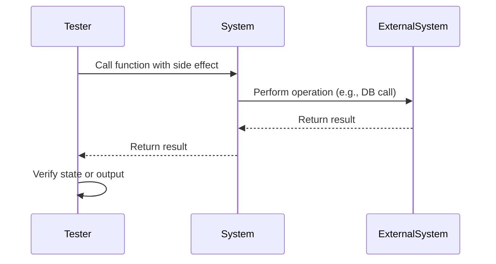

## 18.5 Approaches to Testing Side Effects and State

As experienced Java developers transitioning to Clojure, you may already be familiar with the challenges of testing side effects and state changes in imperative programming. In functional programming, and particularly in Clojure, these challenges are approached differently due to the emphasis on immutability and pure functions. However, side effects and state changes are inevitable in real-world applications, such as when interacting with databases, file systems, or external APIs. This section will guide you through effective strategies for testing these aspects in Clojure.

### Challenges of Testing Side Effects

Testing side effects involves ensuring that functions interacting with external systems or changing application state behave as expected. These functions can introduce complexities in testing due to their non-deterministic nature and dependency on external factors.

#### Mocking External Systems

Mocking is a technique used to simulate the behavior of external systems, allowing you to isolate the code under test. In Clojure, you can use libraries like `clojure.test.mock` to create mock objects for databases, file systems, or network calls.

**Example: Mocking a Database Call**

Let's consider a function that retrieves user data from a database:

```clojure
(defn fetch-user [db user-id]
  ;; Simulate a database call
  (get db user-id))
```

To test this function without an actual database, we can mock the database:

```clojure
(ns myapp.test
  (:require [clojure.test :refer :all]
            [clojure.test.mock :as mock]))

(deftest test-fetch-user
  (let [mock-db (mock/mock {:1 {:name "Alice" :age 30}
                            :2 {:name "Bob" :age 25}})]
    (is (= {:name "Alice" :age 30} (fetch-user mock-db :1)))
    (is (= {:name "Bob" :age 25} (fetch-user mock-db :2)))))
```

In this example, `mock/mock` creates a mock database, allowing us to test `fetch-user` without a real database connection.

#### State Verification

State verification involves checking that the state of the application changes as expected after certain operations. In Clojure, this often involves inspecting atoms, refs, or agents.

**Example: Verifying State Changes with Atoms**

Consider a simple counter implemented using an atom:

```clojure
(def counter (atom 0))

(defn increment-counter []
  (swap! counter inc))
```

To test this function, we can verify the state of the atom before and after the operation:

```clojure
(deftest test-increment-counter
  (reset! counter 0)
  (increment-counter)
  (is (= 1 @counter))
  (increment-counter)
  (is (= 2 @counter)))
```

Here, `reset!` is used to set the atom to a known state before each test, ensuring that tests are independent and repeatable.

#### Time-Based Testing

Functions that depend on time can be challenging to test due to their reliance on the system clock. Clojure provides libraries such as `clj-time` and `java-time` to manipulate time for testing purposes.

**Example: Testing Time-Dependent Functions**

Suppose we have a function that returns the current date:

```clojure
(ns myapp.time
  (:require [java-time :as jt]))

(defn current-date []
  (jt/local-date))
```

To test this function, we can use `with-redefs` to mock the time:

```clojure
(deftest test-current-date
  (with-redefs [jt/local-date (fn [] (jt/local-date 2024 11 25))]
    (is (= (jt/local-date 2024 11 25) (current-date)))))
```

In this example, `with-redefs` temporarily redefines `jt/local-date` to return a fixed date, allowing us to test `current-date` deterministically.

#### Use of Fixtures

Fixtures in `clojure.test` are used to set up and tear down test environments. They are particularly useful for managing state and resources that need to be initialized before tests and cleaned up afterward.

**Example: Using Fixtures**

Let's say we have a set of tests that require a temporary directory:

```clojure
(ns myapp.test
  (:require [clojure.test :refer :all]
            [clojure.java.io :as io]))

(defn with-temp-dir [f]
  (let [dir (io/file "temp-dir")]
    (io/make-parents dir)
    (f)
    (io/delete-file dir true)))

(use-fixtures :each with-temp-dir)

(deftest test-file-creation
  (let [file (io/file "temp-dir/test.txt")]
    (spit file "Hello, World!")
    (is (.exists file))))
```

In this example, `with-temp-dir` is a fixture that creates a temporary directory before each test and deletes it afterward, ensuring a clean environment for each test.

### Visual Aids

To better understand the flow of testing side effects and state, let's visualize the process using a sequence diagram:



**Diagram Description:** This sequence diagram illustrates the interaction between the tester, the system under test, and an external system. The tester calls a function, which interacts with an external system, and then verifies the result or state.

### References and Links

For further reading on testing in Clojure, consider the following resources:

- [Official Clojure Documentation on Testing](https://clojure.org/guides/testing)
- [ClojureDocs: clojure.test](https://clojuredocs.org/clojure.test)
- [Mocking in Clojure with clojure.test.mock](https://github.com/clojure/tools.mock)

### Knowledge Check

To reinforce your understanding of testing side effects and state in Clojure, try the following exercises:

1. Modify the `fetch-user` function to handle a missing user gracefully and update the test accordingly.
2. Implement a function that logs messages to a file and write tests to verify the log contents.
3. Create a time-based function that returns the number of days until a given date and test it using time manipulation techniques.

### Encouraging Tone

Testing side effects and state in Clojure may seem daunting at first, but with the right tools and techniques, it becomes manageable and even enjoyable. By leveraging Clojure's functional programming paradigms, you can write tests that are both robust and maintainable. Now that we've explored these approaches, let's apply them to ensure the reliability of your Clojure applications.

### Best Practices for Tags

- "Clojure"
- "Functional Programming"
- "Testing"
- "Side Effects"
- "State Management"
- "Mocking"
- "Time-Based Testing"
- "Fixtures"

## Quiz: Mastering Testing Side Effects and State in Clojure



### What is the primary challenge of testing side effects in functional programming?

- [x] Non-deterministic behavior due to external dependencies
- [ ] Lack of pure functions
- [ ] Difficulty in writing test cases
- [ ] Limited testing frameworks

> **Explanation:** The primary challenge is the non-deterministic behavior introduced by dependencies on external systems, which can affect the predictability of tests.

### Which Clojure library is commonly used for mocking external systems?

- [ ] clojure.test
- [x] clojure.test.mock
- [ ] clojure.core.async
- [ ] clojure.spec

> **Explanation:** `clojure.test.mock` is a library used to create mock objects for testing purposes, allowing isolation of the code under test.

### How can you verify state changes in Clojure?

- [x] By inspecting atoms, refs, or agents after operations
- [ ] By using mutable variables
- [ ] By relying on side effects
- [ ] By using global variables

> **Explanation:** In Clojure, state changes can be verified by inspecting the values of atoms, refs, or agents after operations have been performed.

### What technique can be used to test time-dependent functions in Clojure?

- [ ] Using global variables
- [x] Using with-redefs to mock time functions
- [ ] Using mutable state
- [ ] Using random number generators

> **Explanation:** `with-redefs` allows temporary redefinition of functions, making it possible to mock time-dependent functions for testing.

### What is the purpose of fixtures in clojure.test?

- [ ] To create global variables
- [x] To set up and tear down test environments
- [ ] To generate random data
- [ ] To execute tests in parallel

> **Explanation:** Fixtures are used to set up and tear down test environments, ensuring that tests run in a controlled and isolated manner.

### Which function is used to reset an atom to a known state before testing?

- [ ] swap!
- [ ] deref
- [ ] inc
- [x] reset!

> **Explanation:** `reset!` is used to set an atom to a specific value, ensuring a known state before running tests.

### What is a common use case for using `with-redefs` in testing?

- [x] Mocking functions for deterministic testing
- [ ] Creating global variables
- [ ] Generating random data
- [ ] Executing tests in parallel

> **Explanation:** `with-redefs` is commonly used to mock functions, allowing tests to run deterministically by controlling external dependencies.

### How can you ensure that tests are independent and repeatable?

- [x] By resetting state before each test
- [ ] By using global variables
- [ ] By relying on side effects
- [ ] By executing tests in parallel

> **Explanation:** Resetting state before each test ensures that tests do not depend on each other and can be repeated reliably.

### What is the role of `spit` in the file creation test example?

- [x] To write data to a file
- [ ] To read data from a file
- [ ] To delete a file
- [ ] To create a directory

> **Explanation:** `spit` is used to write data to a file, as demonstrated in the file creation test example.

### True or False: In Clojure, side effects can be completely avoided in all real-world applications.

- [ ] True
- [x] False

> **Explanation:** While functional programming aims to minimize side effects, they cannot be completely avoided in real-world applications that interact with external systems.


