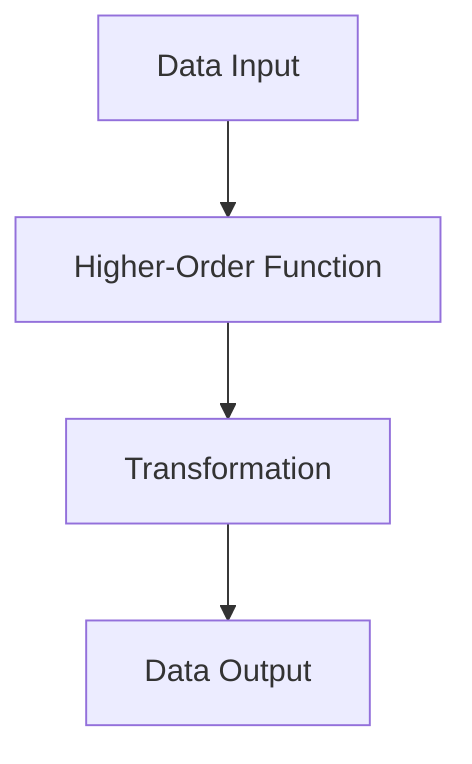

## 19.1 Identifying Imperative Code Patterns

As experienced Java developers transitioning to Clojure, understanding and identifying imperative code patterns is crucial for embracing functional programming. This section will guide you through recognizing these patterns, understanding their impact on functional paradigms, and evaluating code for refactoring.

### Signs of Imperative Code

Imperative programming is characterized by a sequence of commands for the computer to perform. It often involves mutable state, explicit loops, and conditional statements that modify state. Let's delve into these characteristics:

#### Mutable Variables

In imperative programming, variables are often mutable, meaning their values can change over time. This can lead to side effects, making code harder to reason about and debug.

**Java Example:**

```java
int sum = 0;
for (int i = 0; i < numbers.length; i++) {
    sum += numbers[i];
}
```

In this example, `sum` is a mutable variable that changes with each iteration.

**Clojure Equivalent:**

```clojure
(def numbers [1 2 3 4 5])
(reduce + numbers)
```

In Clojure, we use `reduce` to accumulate the sum without mutating any variables, embracing immutability.

#### Explicit Loops

Imperative code often uses loops to iterate over data structures. These loops can be error-prone and difficult to parallelize.

**Java Example:**

```java
for (int i = 0; i < list.size(); i++) {
    System.out.println(list.get(i));
}
```

**Clojure Equivalent:**

```clojure
(doseq [item list]
  (println item))
```

Clojure's `doseq` provides a more declarative way to iterate over collections, although it's still not purely functional. For functional iteration, consider using `map` or `reduce`.

#### Conditional Statements Modifying State

Imperative code often uses conditional statements to modify state, which can lead to complex and tangled logic.

**Java Example:**

```java
if (condition) {
    state = newState;
}
```

**Clojure Equivalent:**

```clojure
(if condition
  (assoc state :key new-value)
  state)
```

In Clojure, we use `assoc` to create a new state with the updated value, maintaining immutability.

### Impact on Functional Programming

Imperative code can hinder the benefits of functional programming, such as:

- **Predictability**: Mutable state and side effects make it difficult to predict program behavior.
- **Concurrency**: Mutable state complicates concurrent programming, leading to race conditions and bugs.
- **Testability**: Functions with side effects are harder to test in isolation.
- **Readability**: Imperative code can be verbose and difficult to read, especially as complexity grows.

By refactoring imperative code to functional style, we can enhance predictability, concurrency, testability, and readability.

### Code Analysis Tools

Several tools and linters can help identify imperative constructs in your codebase:

- **Eastwood**: A Clojure linter that can identify common issues, including imperative constructs.
- **Kibit**: A static analysis tool that suggests idiomatic Clojure code improvements.
- **Cursive**: An IntelliJ plugin for Clojure that provides code analysis and refactoring support.

These tools can help you identify areas of your code that could benefit from refactoring to a more functional style.

### Evaluating Code for Refactoring

When evaluating code for refactoring, consider the following criteria:

- **Complexity**: Complex code with nested loops and conditionals is a prime candidate for refactoring.
- **Statefulness**: Code that relies heavily on mutable state should be refactored to use immutable data structures.
- **Side Effects**: Functions with side effects should be isolated or refactored to pure functions.
- **Reusability**: Code that can be abstracted into higher-order functions or reusable components should be refactored.

By focusing on these criteria, you can identify the parts of your codebase that will benefit most from refactoring to a functional style.

### Try It Yourself

Experiment with refactoring the following Java code to Clojure:

**Java Code:**

```java
List<Integer> numbers = Arrays.asList(1, 2, 3, 4, 5);
int sum = 0;
for (int number : numbers) {
    sum += number;
}
System.out.println(sum);
```

**Clojure Refactoring:**

```clojure
(def numbers [1 2 3 4 5])
(println (reduce + numbers))
```

Try modifying the Clojure code to calculate the product of the numbers instead of the sum.

### Visual Aids

Below is a diagram illustrating the flow of data through a higher-order function in Clojure:



**Diagram Description:** This diagram shows how data flows through a higher-order function, transforming the input into the output.

### Knowledge Check

- **What are the key characteristics of imperative code?**
- **How does imperative code impact functional programming?**
- **What tools can help identify imperative constructs in code?**
- **What criteria should be used to evaluate code for refactoring?**

### Summary

In this section, we've explored how to identify imperative code patterns and their impact on functional programming. By using code analysis tools and evaluating code for refactoring, we can transition to a functional style that enhances scalability and efficiency.

Now that we've identified imperative code patterns, let's move on to refactoring loops into recursions in the next section.

## Quiz: Identifying Imperative Code Patterns in Clojure



### What is a common characteristic of imperative code?

- [x] Mutable variables
- [ ] Immutable data structures
- [ ] Pure functions
- [ ] Higher-order functions

> **Explanation:** Imperative code often involves mutable variables that can change state.

### How does imperative code affect concurrency?

- [x] It complicates concurrency
- [ ] It simplifies concurrency
- [ ] It has no effect on concurrency
- [ ] It enhances concurrency

> **Explanation:** Mutable state in imperative code can lead to race conditions and concurrency issues.

### Which tool is used for Clojure code analysis?

- [x] Eastwood
- [ ] Maven
- [ ] Gradle
- [ ] JUnit

> **Explanation:** Eastwood is a Clojure linter that helps identify issues in code.

### What is a benefit of refactoring to functional style?

- [x] Improved testability
- [ ] Increased complexity
- [ ] More side effects
- [ ] Less predictability

> **Explanation:** Functional style improves testability by using pure functions without side effects.

### Which of the following is a sign of imperative code?

- [x] Explicit loops
- [ ] Function composition
- [ ] Lazy evaluation
- [ ] Immutability

> **Explanation:** Explicit loops are a common feature of imperative programming.

### What is the purpose of `reduce` in Clojure?

- [x] To accumulate values
- [ ] To create loops
- [ ] To modify state
- [ ] To handle exceptions

> **Explanation:** `reduce` is used to accumulate values in a collection.

### Which of the following is NOT a characteristic of functional programming?

- [x] Mutable state
- [ ] Immutability
- [ ] Pure functions
- [ ] Higher-order functions

> **Explanation:** Functional programming emphasizes immutability and pure functions, avoiding mutable state.

### What is a key benefit of using immutable data structures?

- [x] Easier reasoning about code
- [ ] Increased complexity
- [ ] More side effects
- [ ] Less predictability

> **Explanation:** Immutable data structures make it easier to reason about code and avoid side effects.

### How can you identify parts of code that need refactoring?

- [x] By evaluating complexity and statefulness
- [ ] By increasing side effects
- [ ] By adding more loops
- [ ] By reducing immutability

> **Explanation:** Evaluating complexity and statefulness helps identify code that can benefit from refactoring.

### True or False: Functional programming makes code less readable.

- [ ] True
- [x] False

> **Explanation:** Functional programming often makes code more readable by using declarative constructs and avoiding side effects.


