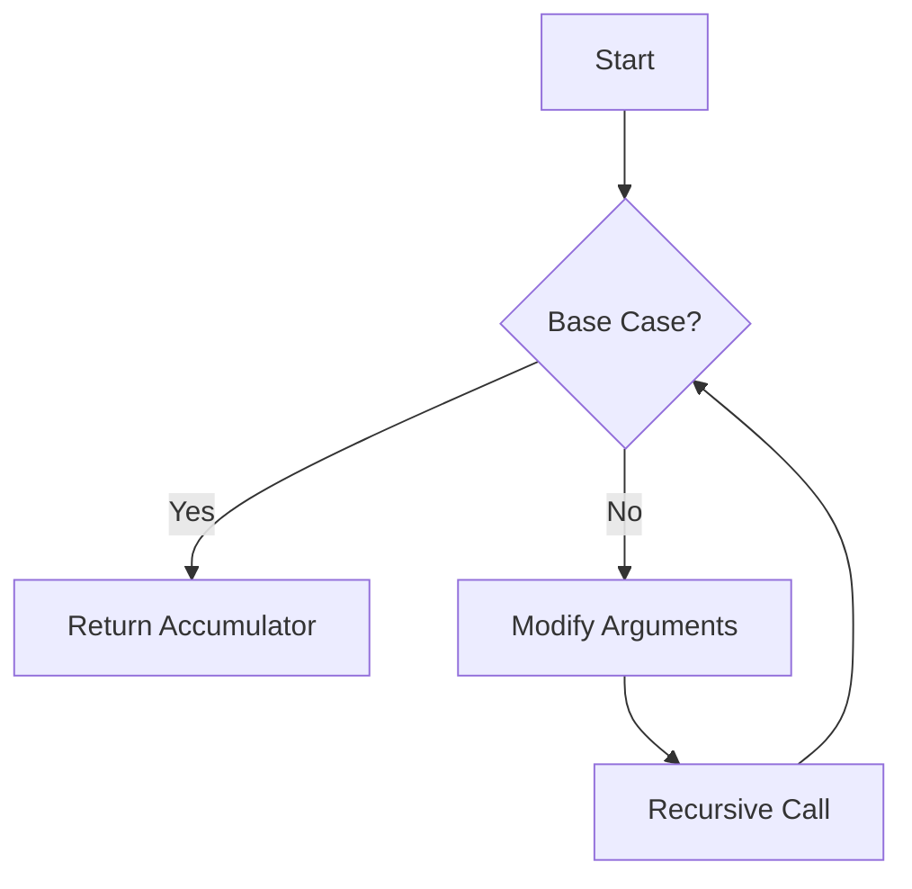

## 19.2 Refactoring Loops into Recursions

As experienced Java developers, you're likely accustomed to using loops such as `for` and `while` to iterate over collections and perform repetitive tasks. In Clojure, a functional programming language, recursion and higher-order functions replace these traditional looping constructs. This transformation not only aligns with functional programming paradigms but also leverages Clojure's strengths in handling immutable data and concurrency.

### From Loops to Recursion

#### Understanding the Transition

In Java, loops are a fundamental construct for iteration. Consider a simple `for` loop that sums an array of integers:

```java
int[] numbers = {1, 2, 3, 4, 5};
int sum = 0;
for (int i = 0; i < numbers.length; i++) {
    sum += numbers[i];
}
System.out.println(sum); // Outputs: 15
```

In Clojure, we achieve the same result using recursion or higher-order functions, eliminating the need for explicit loop constructs and mutable state.

#### Recursive Approach

Recursion in Clojure involves defining a function that calls itself with modified arguments until a base condition is met. Here's how we can refactor the above Java loop into a recursive Clojure function:

```clojure
(defn sum-recursive [numbers]
  (letfn [(sum-helper [nums acc]
            (if (empty? nums)
              acc
              (recur (rest nums) (+ acc (first nums)))))]
    (sum-helper numbers 0)))

(println (sum-recursive [1 2 3 4 5])) ; Outputs: 15
```

**Explanation:**
- **Base Case**: The recursion stops when the list is empty.
- **Recursive Step**: The function calls itself with the rest of the list and the accumulated sum.

### Using `reduce` and `fold`

Clojure provides powerful higher-order functions like `reduce` that abstract away the recursion, making the code more concise and expressive.

#### Using `reduce`

The `reduce` function processes each element of a collection, accumulating a result. Here's how we can use `reduce` to sum the numbers:

```clojure
(defn sum-reduce [numbers]
  (reduce + 0 numbers))

(println (sum-reduce [1 2 3 4 5])) ; Outputs: 15
```

**Explanation:**
- **Initial Value**: `0` is the starting value for the accumulation.
- **Function**: `+` is applied to each element and the accumulated result.

#### Eliminating Index Variables

In Java, loops often rely on index variables to access elements. In Clojure, sequence abstractions like `map`, `filter`, and `reduce` eliminate the need for explicit indexing, leading to cleaner code.

Consider a Java loop that filters even numbers:

```java
List<Integer> numbers = Arrays.asList(1, 2, 3, 4, 5);
List<Integer> evens = new ArrayList<>();
for (int number : numbers) {
    if (number % 2 == 0) {
        evens.add(number);
    }
}
System.out.println(evens); // Outputs: [2, 4]
```

In Clojure, we use `filter`:

```clojure
(defn filter-evens [numbers]
  (filter even? numbers))

(println (filter-evens [1 2 3 4 5])) ; Outputs: (2 4)
```

**Explanation:**
- **Predicate Function**: `even?` checks if a number is even.
- **Sequence Abstraction**: `filter` processes each element without explicit indexing.

### Practical Examples

#### Example 1: Factorial Calculation

Let's refactor a Java loop for calculating factorial into a recursive Clojure function.

**Java Loop:**

```java
int factorial(int n) {
    int result = 1;
    for (int i = 1; i <= n; i++) {
        result *= i;
    }
    return result;
}
```

**Clojure Recursion:**

```clojure
(defn factorial [n]
  (letfn [(fact-helper [n acc]
            (if (zero? n)
              acc
              (recur (dec n) (* acc n))))]
    (fact-helper n 1)))

(println (factorial 5)) ; Outputs: 120
```

**Explanation:**
- **Base Case**: When `n` is zero, return the accumulated result.
- **Recursive Step**: Multiply the accumulator by `n` and decrement `n`.

#### Example 2: Fibonacci Sequence

Refactor a Java loop for generating Fibonacci numbers into a recursive Clojure function.

**Java Loop:**

```java
int fibonacci(int n) {
    if (n <= 1) return n;
    int prev = 0, curr = 1;
    for (int i = 2; i <= n; i++) {
        int next = prev + curr;
        prev = curr;
        curr = next;
    }
    return curr;
}
```

**Clojure Recursion:**

```clojure
(defn fibonacci [n]
  (letfn [(fib-helper [a b count]
            (if (zero? count)
              a
              (recur b (+ a b) (dec count))))]
    (fib-helper 0 1 n)))

(println (fibonacci 5)) ; Outputs: 5
```

**Explanation:**
- **Base Case**: When `count` is zero, return the first number.
- **Recursive Step**: Calculate the next Fibonacci number and decrement the count.

### Visual Aids

#### Flowchart: Recursive Function Execution



**Caption**: This flowchart illustrates the execution flow of a recursive function, highlighting the base case and recursive step.

### Try It Yourself

Experiment with the provided examples by modifying the base cases or recursive steps. For instance, try changing the initial values or conditions in the `factorial` and `fibonacci` functions to see how the output changes.

### References and Links

- [Official Clojure Documentation](https://clojure.org/reference/documentation)
- [ClojureDocs](https://clojuredocs.org/)
- [Functional Programming in Clojure](https://www.braveclojure.com/)

### Knowledge Check

#### Quiz: Mastering Recursion in Clojure



### What is the primary advantage of using recursion over loops in Clojure?

- [x] Recursion aligns with functional programming paradigms and avoids mutable state.
- [ ] Recursion is faster than loops in all cases.
- [ ] Recursion is easier to write than loops.
- [ ] Recursion uses less memory than loops.

> **Explanation:** Recursion aligns with functional programming paradigms by avoiding mutable state and embracing immutability.

### Which Clojure function is used to accumulate results over a collection?

- [x] `reduce`
- [ ] `map`
- [ ] `filter`
- [ ] `for`

> **Explanation:** `reduce` is used to accumulate results over a collection by applying a function to each element.

### How does Clojure's `filter` function differ from a traditional loop with an index?

- [x] `filter` abstracts away the need for explicit indexing and focuses on the predicate.
- [ ] `filter` is slower than a loop with an index.
- [ ] `filter` requires mutable state.
- [ ] `filter` can only be used with numbers.

> **Explanation:** `filter` abstracts away explicit indexing by applying a predicate function to each element.

### What is the base case in a recursive function?

- [x] The condition that stops the recursion.
- [ ] The initial call to the function.
- [ ] The recursive step that modifies arguments.
- [ ] The final result of the recursion.

> **Explanation:** The base case is the condition that stops the recursion, preventing infinite loops.

### In Clojure, which function is used to apply a function to each element of a collection?

- [x] `map`
- [ ] `reduce`
- [ ] `filter`
- [ ] `for`

> **Explanation:** `map` applies a function to each element of a collection, transforming it.

### What is the purpose of the `recur` keyword in Clojure?

- [x] To perform a tail-recursive call within a function.
- [ ] To define a new function.
- [ ] To create a loop.
- [ ] To terminate a function.

> **Explanation:** `recur` is used for tail-recursive calls, allowing efficient recursion without growing the stack.

### How can you eliminate index variables in Clojure?

- [x] By using sequence abstractions like `map`, `filter`, and `reduce`.
- [ ] By using mutable state.
- [ ] By using explicit loops.
- [ ] By using Java interop.

> **Explanation:** Sequence abstractions like `map`, `filter`, and `reduce` eliminate the need for index variables.

### What is a common pitfall when using recursion?

- [x] Not defining a base case, leading to infinite recursion.
- [ ] Using too many arguments in the function.
- [ ] Using mutable state.
- [ ] Using too few recursive calls.

> **Explanation:** Not defining a base case can lead to infinite recursion, causing stack overflow errors.

### Which of the following is a higher-order function in Clojure?

- [x] `reduce`
- [ ] `println`
- [ ] `def`
- [ ] `let`

> **Explanation:** `reduce` is a higher-order function that takes a function as an argument and applies it to a collection.

### True or False: Recursion in Clojure is always more efficient than loops in Java.

- [ ] True
- [x] False

> **Explanation:** While recursion aligns with functional paradigms, it is not always more efficient than loops in Java, especially if not optimized with tail recursion.



### Summary

In this section, we've explored how to refactor traditional Java loops into recursive functions in Clojure. By leveraging recursion and higher-order functions like `reduce`, we can write cleaner, more expressive code that aligns with functional programming principles. Remember to define clear base cases and utilize Clojure's sequence abstractions to eliminate the need for index variables. As you continue your journey in mastering Clojure, practice refactoring loops into recursion to deepen your understanding and enhance your functional programming skills.
