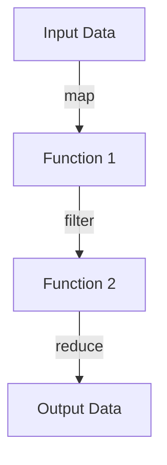

## 19.3 Eliminating Mutable State Variables

In the world of functional programming, immutability is a cornerstone principle that offers numerous advantages, particularly in terms of concurrency and code reliability. For Java developers transitioning to Clojure, understanding how to eliminate mutable state variables is crucial for mastering functional programming. In this section, we will explore the benefits of immutability, discuss strategies for refactoring code to eliminate mutable state, and provide guidance on avoiding global state. We will also present case studies with before-and-after code comparisons to illustrate these concepts in action.

### Immutability Advantages

Immutability refers to the concept of data that cannot be changed once created. This contrasts with mutable data, which can be modified after its creation. Let's delve into the advantages of immutability:

- **Concurrency**: Immutability simplifies concurrent programming by eliminating the need for locks or other synchronization mechanisms. Since immutable data cannot be changed, it can be safely shared across threads without the risk of race conditions.

- **Code Reliability**: Immutable data structures lead to more predictable and reliable code. Functions that operate on immutable data are easier to reason about, test, and debug, as they do not have side effects that alter the state of the program.

- **Simplified State Management**: With immutability, state changes are explicit and controlled. This makes it easier to track and manage state transitions, leading to cleaner and more maintainable code.

- **Functional Design Patterns**: Immutability aligns with functional programming design patterns, such as pure functions and higher-order functions, which further enhance code modularity and reusability.

#### Java vs. Clojure: A Comparison

In Java, mutable state is often managed using variables, objects, and collections that can be modified. Consider the following Java example:

```java
// Java: Mutable state example
public class Counter {
    private int count = 0;

    public void increment() {
        count++;
    }

    public int getCount() {
        return count;
    }
}
```

In this example, the `count` variable is mutable, and its state can change over time. In contrast, Clojure encourages immutability:

```clojure
;; Clojure: Immutable state example
(defn increment [count]
  (inc count))

;; Usage
(let [initial-count 0
      new-count (increment initial-count)]
  new-count) ;; Returns 1
```

Here, the `increment` function returns a new value instead of modifying the existing state, demonstrating immutability.

### Refactoring Strategies

To eliminate mutable state variables, we can employ several refactoring strategies. These strategies involve using immutable data structures, passing state through function parameters, and leveraging Clojure's functional programming features.

#### Using Immutable Data Structures

Clojure provides a rich set of immutable data structures, including lists, vectors, maps, and sets. These structures are designed to be efficient and easy to use in a functional programming context.

- **Vectors**: Use vectors for ordered collections of elements. They provide fast access and update operations.

- **Maps**: Use maps for key-value associations. They are ideal for representing structured data.

- **Sets**: Use sets for collections of unique elements. They support efficient membership testing.

- **Lists**: Use lists for sequential processing, particularly when working with recursive algorithms.

#### Passing State Through Function Parameters

One of the key principles of functional programming is to pass state explicitly through function parameters rather than relying on mutable variables. This approach makes state changes explicit and traceable.

Consider the following Java example with mutable state:

```java
// Java: Mutable state example
public class Calculator {
    private int result = 0;

    public void add(int value) {
        result += value;
    }

    public int getResult() {
        return result;
    }
}
```

We can refactor this to a functional style in Clojure:

```clojure
;; Clojure: Passing state through parameters
(defn add [result value]
  (+ result value))

;; Usage
(let [initial-result 0
      new-result (add initial-result 5)]
  new-result) ;; Returns 5
```

In this Clojure example, the `add` function takes the current state (`result`) and the value to add as parameters, returning a new result without modifying any existing state.

#### Leveraging Clojure's Functional Features

Clojure's functional features, such as higher-order functions and closures, can be used to manage state effectively without resorting to mutable variables.

- **Higher-Order Functions**: Use functions like `map`, `reduce`, and `filter` to process collections without modifying them.

- **Closures**: Use closures to encapsulate state within a function, allowing for controlled access and modification.

### Avoiding Global State

Global state refers to variables or data that are accessible from anywhere in the program. In functional programming, global state is discouraged because it can lead to unpredictable behavior and make code harder to test and maintain.

#### Eliminating Global Variables

To eliminate global variables, we can use local bindings and closures to encapsulate state. Consider the following Java example with global state:

```java
// Java: Global state example
public class GlobalCounter {
    public static int count = 0;

    public static void increment() {
        count++;
    }
}
```

We can refactor this to a functional style in Clojure:

```clojure
;; Clojure: Eliminating global state
(defn create-counter []
  (let [count (atom 0)]
    {:increment (fn [] (swap! count inc))
     :get-count (fn [] @count)}))

;; Usage
(let [counter (create-counter)]
  ((:increment counter))
  ((:get-count counter))) ;; Returns 1
```

In this Clojure example, we use an `atom` to encapsulate the state within a closure, providing controlled access through functions.

#### Minimizing Singletons

Singletons are a common pattern in object-oriented programming for managing global state. In functional programming, we can minimize the use of singletons by passing state explicitly and using closures.

### Case Studies: Before-and-After Code Comparisons

Let's explore some case studies to see how eliminating mutable state can improve code quality and reliability.

#### Case Study 1: Refactoring a Mutable Counter

**Before (Java)**:

```java
// Java: Mutable counter example
public class MutableCounter {
    private int count = 0;

    public void increment() {
        count++;
    }

    public int getCount() {
        return count;
    }
}
```

**After (Clojure)**:

```clojure
;; Clojure: Immutable counter example
(defn create-counter []
  (let [count (atom 0)]
    {:increment (fn [] (swap! count inc))
     :get-count (fn [] @count)}))

;; Usage
(let [counter (create-counter)]
  ((:increment counter))
  ((:get-count counter))) ;; Returns 1
```

In this refactoring, we replaced the mutable state with an `atom`, encapsulating the state within a closure for controlled access.

#### Case Study 2: Refactoring a Mutable Shopping Cart

**Before (Java)**:

```java
// Java: Mutable shopping cart example
public class ShoppingCart {
    private List<String> items = new ArrayList<>();

    public void addItem(String item) {
        items.add(item);
    }

    public List<String> getItems() {
        return items;
    }
}
```

**After (Clojure)**:

```clojure
;; Clojure: Immutable shopping cart example
(defn create-cart []
  (let [items (atom [])]
    {:add-item (fn [item] (swap! items conj item))
     :get-items (fn [] @items)}))

;; Usage
(let [cart (create-cart)]
  ((:add-item cart) "Apple")
  ((:get-items cart))) ;; Returns ["Apple"]
```

In this refactoring, we replaced the mutable list with an `atom`, encapsulating the state within a closure for controlled access.

### Visual Aids

To further illustrate these concepts, let's use a diagram to show the flow of data through a higher-order function in Clojure.



**Diagram Description**: This diagram represents the flow of data through a series of higher-order functions (`map`, `filter`, `reduce`) in Clojure. Each function processes the data without modifying the original input, demonstrating immutability.

### References and Links

For further reading on immutability and functional programming in Clojure, consider the following resources:

- [Official Clojure Documentation](https://clojure.org/reference/documentation)
- [ClojureDocs](https://clojuredocs.org/)
- [GitHub: Clojure Examples](https://github.com/clojure-examples)

### Knowledge Check

Let's reinforce our learning with some questions and exercises.

1. **What are the advantages of immutability in functional programming?**
   - Concurrency, code reliability, simplified state management.

2. **How can we eliminate mutable state variables in Clojure?**
   - Use immutable data structures, pass state through function parameters, leverage functional features.

3. **What is the impact of global state on code reliability?**
   - Global state can lead to unpredictable behavior and make code harder to test and maintain.

4. **Exercise**: Refactor a mutable Java class to a functional Clojure equivalent using the strategies discussed.

### Encouraging Tone

Now that we've explored how to eliminate mutable state variables in Clojure, let's apply these concepts to manage state effectively in your applications. Remember, the journey to mastering functional programming is a rewarding one, and each step you take brings you closer to writing more reliable and scalable code.

### Best Practices for Tags

- "Clojure"
- "Functional Programming"
- "Immutability"
- "Concurrency"
- "State Management"
- "Java Interoperability"
- "Refactoring"
- "Code Reliability"

---

## Quiz: Mastering Immutability in Clojure



### What is a key advantage of immutability in functional programming?

- [x] Simplifies concurrent programming
- [ ] Increases code complexity
- [ ] Requires more memory
- [ ] Slows down execution

> **Explanation:** Immutability simplifies concurrent programming by eliminating the need for locks or synchronization mechanisms.

### How can we eliminate mutable state variables in Clojure?

- [x] Use immutable data structures
- [x] Pass state through function parameters
- [ ] Use global variables
- [ ] Rely on mutable collections

> **Explanation:** Using immutable data structures and passing state through function parameters are effective strategies for eliminating mutable state.

### What is the impact of global state on code reliability?

- [x] Leads to unpredictable behavior
- [ ] Enhances code readability
- [ ] Simplifies debugging
- [ ] Improves performance

> **Explanation:** Global state can lead to unpredictable behavior and make code harder to test and maintain.

### Which Clojure feature helps manage state without mutable variables?

- [x] Atoms
- [ ] Global variables
- [ ] Mutable lists
- [ ] Static fields

> **Explanation:** Atoms in Clojure provide a way to manage state without mutable variables, allowing controlled access and modification.

### What is a benefit of using higher-order functions in Clojure?

- [x] They allow processing collections without modifying them
- [ ] They increase code complexity
- [ ] They require more memory
- [ ] They slow down execution

> **Explanation:** Higher-order functions like `map`, `reduce`, and `filter` allow processing collections without modifying them, aligning with immutability principles.

### How does immutability enhance code reliability?

- [x] By making functions easier to reason about
- [ ] By increasing code complexity
- [ ] By requiring more memory
- [ ] By slowing down execution

> **Explanation:** Immutability makes functions easier to reason about, test, and debug, enhancing code reliability.

### What is a common pattern in object-oriented programming for managing global state?

- [x] Singletons
- [ ] Atoms
- [ ] Closures
- [ ] Higher-order functions

> **Explanation:** Singletons are a common pattern in object-oriented programming for managing global state, but they can lead to issues in functional programming.

### What is the role of closures in managing state in Clojure?

- [x] Encapsulate state within a function
- [ ] Increase code complexity
- [ ] Require more memory
- [ ] Slow down execution

> **Explanation:** Closures encapsulate state within a function, allowing for controlled access and modification, which aligns with functional programming principles.

### How can we minimize the use of singletons in functional programming?

- [x] By passing state explicitly
- [ ] By using global variables
- [ ] By relying on mutable collections
- [ ] By using static fields

> **Explanation:** Passing state explicitly and using closures can minimize the use of singletons in functional programming.

### True or False: Immutability requires more memory than mutability.

- [ ] True
- [x] False

> **Explanation:** While immutability may seem to require more memory, Clojure's persistent data structures use structural sharing to minimize memory usage.


