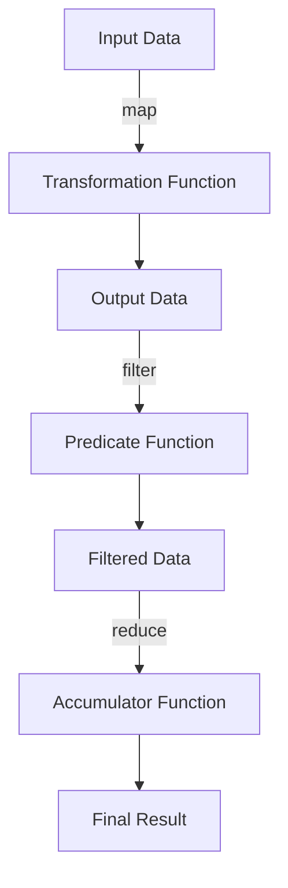

## 19.4 Simplifying Code with Higher-Order Functions

Higher-order functions (HOFs) are a cornerstone of functional programming, allowing developers to write more concise, expressive, and maintainable code. For Java developers transitioning to Clojure, understanding and leveraging HOFs can significantly simplify codebases by reducing boilerplate, enhancing code reuse, and promoting a declarative style of programming. In this section, we'll explore how higher-order functions can transform your approach to coding in Clojure, focusing on replacing repetitive code structures, composing functions for clarity, leveraging Clojure's core libraries, and creating custom higher-order functions.

### Replacing Boilerplate Code

In traditional Java programming, you often encounter repetitive code patterns, especially when dealing with collections or implementing common algorithms. Higher-order functions in Clojure provide a powerful way to abstract these patterns, reducing boilerplate and improving code readability.

#### Java Example: Iterating Over a List

Consider a typical Java scenario where you need to iterate over a list and apply a transformation:

```java
List<Integer> numbers = Arrays.asList(1, 2, 3, 4, 5);
List<Integer> squaredNumbers = new ArrayList<>();

for (Integer number : numbers) {
    squaredNumbers.add(number * number);
}
```

This code involves explicit iteration and manual accumulation of results, which can become cumbersome as the logic grows more complex.

#### Clojure Example: Using `map`

In Clojure, the `map` function abstracts the iteration and transformation process:

```clojure
(def numbers [1 2 3 4 5])
(def squared-numbers (map #(* % %) numbers))
```

Here, `map` takes a function and a collection, applying the function to each element and returning a new collection. This approach eliminates the need for explicit loops and mutable state, resulting in cleaner and more concise code.

#### Key Benefits

- **Reduction of Boilerplate**: By using higher-order functions like `map`, you eliminate repetitive code patterns.
- **Improved Readability**: The intent of the code is clearer, focusing on the transformation rather than the mechanics of iteration.
- **Enhanced Maintainability**: Changes to the transformation logic require minimal code modifications.

### Function Composition

Function composition is a powerful technique in functional programming that allows you to build complex operations by combining simpler functions. This leads to code that is both modular and easy to understand.

#### Java Example: Chaining Methods

In Java, you might chain methods to achieve a sequence of operations:

```java
String result = "hello"
    .trim()
    .toUpperCase()
    .substring(0, 3);
```

While method chaining is possible, it can become unwieldy with more complex operations.

#### Clojure Example: Using `comp`

Clojure's `comp` function allows you to compose functions elegantly:

```clojure
(defn process-string [s]
  ((comp (partial subs 0 3) clojure.string/upper-case clojure.string/trim) s))

(process-string "  hello  ") ; => "HEL"
```

In this example, `comp` creates a new function by composing `trim`, `upper-case`, and `subs`. The composed function is then applied to the input string.

#### Key Benefits

- **Modularity**: Functions are small and focused, each handling a specific task.
- **Reusability**: Composed functions can be reused across different parts of the application.
- **Clarity**: The flow of data through the composed functions is clear and logical.

### Leveraging Core Libraries

Clojure's rich standard library provides a plethora of higher-order functions that can simplify many common programming tasks. By leveraging these libraries, you can avoid reinventing the wheel and focus on solving domain-specific problems.

#### Common Higher-Order Functions

- **`map`**: Transforms each element of a collection.
- **`filter`**: Selects elements of a collection that satisfy a predicate.
- **`reduce`**: Accumulates a result by applying a function to elements of a collection.

#### Example: Filtering and Reducing

Suppose you want to find the sum of even numbers in a list:

```clojure
(def numbers [1 2 3 4 5 6 7 8 9 10])
(def sum-of-evens (reduce + (filter even? numbers)))
```

Here, `filter` selects the even numbers, and `reduce` sums them up. This concise expression replaces what would be a more verbose loop in Java.

#### Key Benefits

- **Efficiency**: Clojure's core functions are optimized for performance.
- **Expressiveness**: Code is more expressive, focusing on the "what" rather than the "how."
- **Consistency**: Using standard library functions ensures consistent behavior across your codebase.

### Custom Higher-Order Functions

While Clojure's standard library is extensive, there are times when you need to create custom higher-order functions to encapsulate domain-specific logic or patterns.

#### Example: Creating a Custom HOF

Suppose you frequently need to apply a discount to a list of prices, but the discount logic varies. You can create a higher-order function to handle this:

```clojure
(defn apply-discount [discount-fn prices]
  (map discount-fn prices))

(defn ten-percent-discount [price]
  (* price 0.9))

(def prices [100 200 300])
(def discounted-prices (apply-discount ten-percent-discount prices))
```

In this example, `apply-discount` is a higher-order function that takes a discount function and a list of prices, applying the discount to each price.

#### Key Benefits

- **Flexibility**: Custom HOFs allow you to encapsulate and reuse complex logic.
- **Abstraction**: They abstract away the details of the operation, focusing on the high-level process.
- **Domain-Specific**: Tailor HOFs to fit specific business logic or application needs.

### Visualizing Higher-Order Functions

To better understand the flow of data through higher-order functions, let's visualize the process using a diagram.



**Diagram Description**: This flowchart illustrates how data is transformed through a series of higher-order functions (`map`, `filter`, `reduce`). Each step applies a specific function, resulting in a final processed output.

### Try It Yourself

Experiment with the following code snippets to deepen your understanding of higher-order functions in Clojure:

1. **Modify the Transformation**: Change the transformation function in the `map` example to cube the numbers instead of squaring them.

2. **Create a New Composition**: Use `comp` to create a function that trims, converts to lowercase, and appends "world" to a string.

3. **Implement a Custom HOF**: Write a higher-order function that applies a tax rate to a list of prices, allowing the tax rate to be passed as a function.

### Knowledge Check

Reflect on the following questions to reinforce your understanding:

- How do higher-order functions reduce boilerplate code?
- What are the benefits of function composition in Clojure?
- How can you leverage Clojure's core libraries to simplify code?
- What is the advantage of creating custom higher-order functions?

### Summary

Higher-order functions are a powerful tool in Clojure, enabling you to write cleaner, more maintainable code. By replacing boilerplate code, composing functions, leveraging core libraries, and creating custom HOFs, you can simplify complex logic and focus on solving real-world problems. As you continue to explore Clojure, remember to embrace the functional programming mindset, leveraging the language's strengths to build scalable and efficient applications.

## Quiz: Mastering Higher-Order Functions in Clojure



### How do higher-order functions help in reducing boilerplate code?

- [x] By abstracting repetitive patterns into reusable functions
- [ ] By increasing the complexity of code
- [ ] By making code less readable
- [ ] By requiring more lines of code

> **Explanation:** Higher-order functions abstract repetitive patterns, allowing for reusable and concise code.

### What is the primary benefit of function composition in Clojure?

- [x] It allows combining simple functions to create complex operations
- [ ] It makes code harder to understand
- [ ] It increases the number of functions needed
- [ ] It reduces the need for functions

> **Explanation:** Function composition enables the creation of complex operations by combining simpler functions, enhancing modularity and clarity.

### Which Clojure function is used to transform each element of a collection?

- [x] `map`
- [ ] `filter`
- [ ] `reduce`
- [ ] `apply`

> **Explanation:** The `map` function is used to apply a transformation to each element of a collection.

### What is the role of `reduce` in Clojure?

- [x] To accumulate a result by applying a function to elements of a collection
- [ ] To filter elements based on a predicate
- [ ] To transform each element of a collection
- [ ] To compose functions

> **Explanation:** `reduce` accumulates a result by applying a function to elements of a collection.

### How can custom higher-order functions benefit your code?

- [x] By encapsulating and reusing complex logic
- [ ] By making code less flexible
- [x] By abstracting away operation details
- [ ] By increasing code verbosity

> **Explanation:** Custom higher-order functions encapsulate complex logic, making code more flexible and abstracting operation details.

### What does the `comp` function do in Clojure?

- [x] Composes multiple functions into a single function
- [ ] Filters elements of a collection
- [ ] Reduces a collection to a single value
- [ ] Maps a function over a collection

> **Explanation:** `comp` creates a new function by composing multiple functions into a single operation.

### Why is leveraging Clojure's core libraries beneficial?

- [x] They provide optimized and expressive functions for common tasks
- [ ] They require more code to implement
- [x] They ensure consistent behavior across codebases
- [ ] They make code less readable

> **Explanation:** Clojure's core libraries offer optimized, expressive functions that ensure consistent behavior and reduce the need for custom implementations.

### What is a key characteristic of higher-order functions?

- [x] They can take functions as arguments or return functions
- [ ] They cannot take functions as arguments
- [ ] They are only used for mathematical operations
- [ ] They are specific to Clojure

> **Explanation:** Higher-order functions can take functions as arguments or return functions, making them versatile in functional programming.

### Which of the following is NOT a higher-order function in Clojure?

- [ ] `map`
- [ ] `filter`
- [ ] `reduce`
- [x] `println`

> **Explanation:** `println` is not a higher-order function; it is used for printing output.

### True or False: Higher-order functions can only be used with collections.

- [ ] True
- [x] False

> **Explanation:** Higher-order functions can be used in various contexts, not just with collections, as they operate on functions themselves.



By mastering higher-order functions, you can unlock the full potential of functional programming in Clojure, creating code that is both elegant and efficient. Keep experimenting with these concepts to deepen your understanding and enhance your coding skills.
