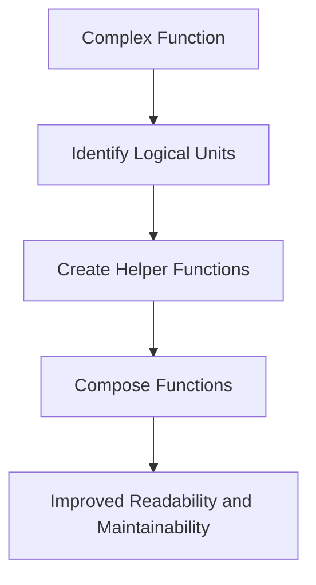

## 19.5 Enhancing Readability and Maintainability

As experienced Java developers transitioning to Clojure, you already understand the importance of writing code that is not only functional but also easy to read and maintain. In this section, we will explore strategies to enhance the readability and maintainability of your Clojure code. We'll focus on expressive function names, consistent code formatting, breaking down complex functions, and avoiding deep nesting. By adopting these practices, you can ensure that your Clojure applications are both robust and easy to manage over time.

### Expressive Function Names

One of the simplest yet most effective ways to enhance code readability is by using expressive function names. In Clojure, as in Java, function names should clearly convey the purpose and behavior of the function. This practice helps other developers (and your future self) understand the code without needing to delve into the implementation details.

#### Guidelines for Naming Functions

1. **Use Descriptive Names**: Choose names that describe what the function does. For example, instead of naming a function `calc`, use `calculate-total-price`.

2. **Avoid Abbreviations**: While abbreviations might save a few keystrokes, they can obscure the function's purpose. Use full words unless the abbreviation is widely understood.

3. **Reflect the Function's Action**: Use verbs for functions that perform actions. For example, `fetch-user-data` indicates that the function retrieves data.

4. **Consistency with Naming Conventions**: Follow Clojure's naming conventions, such as using hyphens to separate words in function names (e.g., `get-user-info`).

#### Code Example: Expressive Function Names

Here is a simple example illustrating the use of expressive function names in Clojure:

```clojure
;; Clojure function with expressive name
(defn calculate-total-price
  "Calculates the total price of items in a cart, including tax."
  [items tax-rate]
  (let [subtotal (reduce + (map :price items))]
    (* subtotal (+ 1 tax-rate))))

;; Java equivalent for comparison
public double calculateTotalPrice(List<Item> items, double taxRate) {
    double subtotal = items.stream().mapToDouble(Item::getPrice).sum();
    return subtotal * (1 + taxRate);
}
```

In both Clojure and Java, the function name `calculate-total-price` or `calculateTotalPrice` clearly indicates its purpose, making the code easier to understand.

### Code Formatting

Consistent code formatting is crucial for readability. It helps developers quickly grasp the structure and flow of the code. In Clojure, tools like `cljfmt` can automate the formatting process, ensuring that your code adheres to a consistent style.

#### Key Formatting Practices

1. **Indentation**: Use consistent indentation to highlight the structure of your code. In Clojure, the standard is two spaces per indentation level.

2. **Line Length**: Keep lines to a reasonable length (typically 80-100 characters) to avoid horizontal scrolling and improve readability.

3. **Whitespace**: Use whitespace to separate logical sections of code, making it easier to read.

4. **Parentheses Alignment**: Align parentheses to visually indicate the start and end of expressions.

#### Code Example: Consistent Formatting

Here's an example of well-formatted Clojure code:

```clojure
;; Well-formatted Clojure code
(defn process-orders
  "Processes a list of orders and returns the total revenue."
  [orders]
  (let [valid-orders (filter valid-order? orders)
        revenues (map calculate-revenue valid-orders)]
    (reduce + revenues)))
```

### Breaking Down Complex Functions

Complex functions can be difficult to understand and maintain. By breaking them down into smaller, composable units, you can improve both readability and maintainability. This approach aligns with the functional programming paradigm, where functions are often small and focused on a single task.

#### Strategies for Decomposition

1. **Identify Logical Units**: Break down functions into logical units or steps. Each unit should perform a distinct part of the overall task.

2. **Use Helper Functions**: Create helper functions for repetitive or complex operations. This not only simplifies the main function but also promotes code reuse.

3. **Compose Functions**: Use function composition to build complex behavior from simpler functions. This can make your code more modular and easier to test.

#### Code Example: Breaking Down Functions

Consider a function that processes customer orders. We can break it down into smaller functions:

```clojure
;; Main function
(defn process-orders
  "Processes a list of orders and returns the total revenue."
  [orders]
  (->> orders
       (filter valid-order?)
       (map calculate-revenue)
       (reduce +)))

;; Helper function to validate orders
(defn valid-order?
  "Checks if an order is valid."
  [order]
  (and (:id order) (:amount order)))

;; Helper function to calculate revenue
(defn calculate-revenue
  "Calculates revenue for a single order."
  [order]
  (* (:amount order) (:price order)))
```

By decomposing the `process-orders` function, we make each part of the process clear and manageable.

### Avoiding Deep Nesting

Deeply nested code can be challenging to read and understand. In Clojure, you can use techniques like threading macros to flatten nested expressions, improving readability.

#### Techniques to Reduce Nesting

1. **Threading Macros**: Use `->` and `->>` macros to thread data through a series of transformations, reducing nesting.

2. **Let Bindings**: Use `let` bindings to break down complex expressions into simpler parts.

3. **Early Returns**: Use conditional expressions to handle special cases early, reducing the need for nested conditionals.

#### Code Example: Reducing Nesting

Here's an example of using threading macros to reduce nesting:

```clojure
;; Without threading macros
(defn process-data
  "Processes data and returns the result."
  [data]
  (reduce + (map (fn [x] (* x 2)) (filter even? data))))

;; With threading macros
(defn process-data
  "Processes data and returns the result."
  [data]
  (->> data
       (filter even?)
       (map #(* % 2))
       (reduce +)))
```

The threaded version is easier to read and understand, as it clearly shows the sequence of transformations applied to the data.

### Visual Aids

To further illustrate these concepts, let's use a flowchart to visualize the process of breaking down complex functions into smaller units.



**Caption**: Flowchart illustrating the process of breaking down complex functions into smaller, manageable units.

### References and Links

For further reading on Clojure best practices and code formatting, consider the following resources:

- [Official Clojure Documentation](https://clojure.org/)
- [Clojure Style Guide](https://github.com/bbatsov/clojure-style-guide)
- [ClojureDocs](https://clojuredocs.org/)

### Knowledge Check

Let's test your understanding of the concepts covered in this section with a few questions and exercises.

1. **What is the benefit of using expressive function names?**

2. **How can consistent code formatting improve readability?**

3. **Try It Yourself**: Refactor a complex Java method into smaller, composable Clojure functions.

4. **Exercise**: Use threading macros to refactor a deeply nested Clojure function.

### Encouraging Tone

Now that we've explored strategies to enhance the readability and maintainability of your Clojure code, let's apply these concepts to your projects. By adopting these best practices, you'll create code that is not only functional but also a pleasure to read and maintain.

### Quiz: Enhancing Readability and Maintainability in Clojure



### What is the primary benefit of using expressive function names in Clojure?

- [x] They make the code easier to understand.
- [ ] They reduce the number of lines of code.
- [ ] They improve the performance of the code.
- [ ] They allow for more complex logic.

> **Explanation:** Expressive function names clearly convey the purpose of the function, making the code easier to understand.

### Which tool can be used to ensure consistent code formatting in Clojure?

- [x] cljfmt
- [ ] Eclipse
- [ ] IntelliJ IDEA
- [ ] NetBeans

> **Explanation:** `cljfmt` is a tool specifically designed for formatting Clojure code consistently.

### How can threading macros help reduce code nesting?

- [x] By threading data through a series of transformations.
- [ ] By increasing the number of lines of code.
- [ ] By adding more conditional statements.
- [ ] By removing all function calls.

> **Explanation:** Threading macros like `->` and `->>` help reduce nesting by threading data through a series of transformations, making the code more linear and readable.

### What is a common practice to break down complex functions?

- [x] Decompose them into smaller, composable units.
- [ ] Combine them into a single large function.
- [ ] Use more nested loops.
- [ ] Avoid using helper functions.

> **Explanation:** Breaking down complex functions into smaller, composable units makes them easier to understand and maintain.

### Which of the following is a benefit of using helper functions?

- [x] They promote code reuse.
- [ ] They increase the complexity of the code.
- [x] They simplify the main function.
- [ ] They make the code harder to test.

> **Explanation:** Helper functions promote code reuse and simplify the main function by handling specific tasks.

### What is the recommended indentation level for Clojure code?

- [x] Two spaces per indentation level.
- [ ] Four spaces per indentation level.
- [ ] One tab per indentation level.
- [ ] Eight spaces per indentation level.

> **Explanation:** The standard indentation level for Clojure code is two spaces per indentation level.

### How can early returns help reduce code nesting?

- [x] By handling special cases early.
- [ ] By adding more conditional statements.
- [x] By reducing the need for nested conditionals.
- [ ] By increasing the number of lines of code.

> **Explanation:** Early returns handle special cases early, reducing the need for nested conditionals and improving readability.

### What is the purpose of using `let` bindings in Clojure?

- [x] To break down complex expressions into simpler parts.
- [ ] To increase the complexity of the code.
- [ ] To remove all function calls.
- [ ] To add more nested loops.

> **Explanation:** `Let` bindings are used to break down complex expressions into simpler parts, making the code easier to read and understand.

### Which of the following is a key practice for improving code readability?

- [x] Consistent code formatting.
- [ ] Using as many abbreviations as possible.
- [ ] Writing long, complex functions.
- [ ] Avoiding the use of comments.

> **Explanation:** Consistent code formatting is a key practice for improving code readability.

### True or False: Deeply nested code is easier to read and understand.

- [ ] True
- [x] False

> **Explanation:** Deeply nested code is generally harder to read and understand. Reducing nesting improves readability.



By following these guidelines, you'll be well on your way to writing Clojure code that is both readable and maintainable, making your development process smoother and more efficient.
