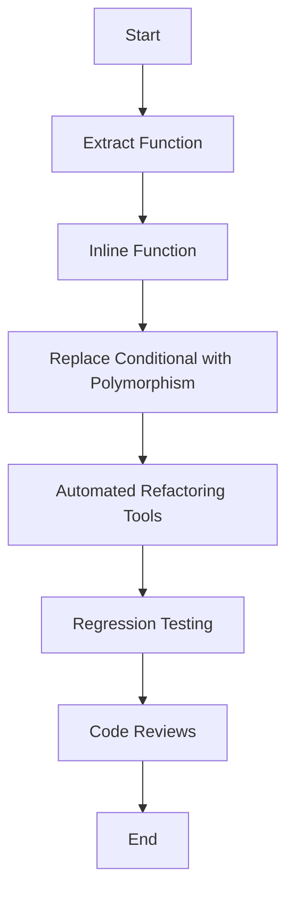

## 19.6 Techniques for Code Transformation

Transitioning from Java to Clojure involves more than just learning a new syntax; it requires a shift in thinking from imperative to functional programming paradigms. In this section, we will explore various techniques for transforming code, focusing on refactoring patterns, automated tools, and best practices to ensure a smooth transition and maintain code quality.

### Refactoring Patterns

Refactoring is a critical process in software development that involves restructuring existing code without changing its external behavior. This is especially important when transitioning from Java to Clojure, as it helps in adopting functional programming principles effectively.

#### Extract Function

**Intent:** Simplify complex code by breaking it into smaller, reusable functions.

In Java, you might have a method that performs multiple tasks:

```java
public void processOrder(Order order) {
    validateOrder(order);
    calculateTotal(order);
    applyDiscount(order);
    saveOrder(order);
}
```

In Clojure, you can extract these tasks into separate functions:

```clojure
(defn process-order [order]
  (-> order
      validate-order
      calculate-total
      apply-discount
      save-order))
```

**Key Points:**
- **Improves readability** by making each function's purpose clear.
- **Encourages reuse** of functions across different parts of the application.
- **Facilitates testing** by allowing individual functions to be tested in isolation.

#### Inline Function

**Intent:** Simplify code by removing unnecessary function calls.

In Java, you might have a simple method that could be inlined:

```java
public int add(int a, int b) {
    return a + b;
}

public int calculateSum(int x, int y) {
    return add(x, y);
}
```

In Clojure, you can inline the function directly:

```clojure
(defn calculate-sum [x y]
  (+ x y))
```

**Key Points:**
- **Reduces overhead** by eliminating unnecessary function calls.
- **Simplifies code** by keeping logic straightforward and direct.

#### Replace Conditional with Polymorphism

**Intent:** Use polymorphism to handle conditional logic more elegantly.

In Java, you might use a switch statement:

```java
public double calculateDiscount(Order order) {
    switch (order.getType()) {
        case "REGULAR":
            return order.getTotal() * 0.05;
        case "PREMIUM":
            return order.getTotal() * 0.10;
        default:
            return 0;
    }
}
```

In Clojure, you can use multimethods to achieve polymorphism:

```clojure
(defmulti calculate-discount :type)

(defmethod calculate-discount "REGULAR" [order]
  (* (:total order) 0.05))

(defmethod calculate-discount "PREMIUM" [order]
  (* (:total order) 0.10))

(defmethod calculate-discount :default [_]
  0)
```

**Key Points:**
- **Enhances flexibility** by allowing new types to be added without modifying existing code.
- **Improves maintainability** by separating logic for different types.

### Automated Refactoring Tools

Automated tools can significantly ease the process of refactoring, especially when dealing with large codebases. Many Integrated Development Environments (IDEs) offer features to assist in code transformation.

#### IDE Features

- **Code Navigation:** Quickly locate functions and variables.
- **Refactoring Shortcuts:** Use built-in shortcuts to extract methods, rename variables, and more.
- **Syntax Highlighting:** Identify syntax errors and warnings easily.

**Example:** IntelliJ IDEA offers powerful refactoring tools that can be customized for Clojure development through plugins like Cursive.

### Regression Testing

Refactoring should not alter the external behavior of the code. Therefore, it's crucial to run regression tests after each refactoring step to ensure that the code remains correct.

#### Importance of Testing

- **Detects unintended changes** in functionality.
- **Ensures reliability** of the application after modifications.
- **Facilitates continuous integration** by automating test execution.

**Best Practices:**
- **Write comprehensive tests** before starting the refactoring process.
- **Use test-driven development (TDD)** to guide refactoring efforts.
- **Automate tests** using tools like `clojure.test` or `midje`.

### Code Reviews

Code reviews are an essential part of the refactoring process. They provide an opportunity for peer feedback and knowledge sharing.

#### Benefits of Code Reviews

- **Catch potential issues** early in the development process.
- **Promote best practices** and coding standards.
- **Encourage collaboration** and learning among team members.

**Tips for Effective Code Reviews:**
- **Focus on logic and design** rather than style.
- **Provide constructive feedback** with specific suggestions.
- **Encourage discussion** to explore different approaches.

### Visual Aids

To better understand the transformation process, let's visualize the flow of data through a simple refactoring example using a flowchart.



**Diagram Description:** This flowchart illustrates the sequential steps involved in transforming Java code to Clojure, emphasizing the importance of each technique in the refactoring process.

### References and Links

- [Official Clojure Documentation](https://clojure.org/reference)
- [ClojureDocs](https://clojuredocs.org/)
- [Cursive Plugin for IntelliJ IDEA](https://cursive-ide.com/)
- [Refactoring: Improving the Design of Existing Code](https://martinfowler.com/books/refactoring.html) by Martin Fowler

### Knowledge Check

To reinforce your understanding of code transformation techniques, consider the following questions:

1. What are the benefits of extracting functions during refactoring?
2. How can polymorphism replace conditional logic in Clojure?
3. Why is regression testing important after refactoring?
4. What role do code reviews play in the refactoring process?

### Exercises

1. **Refactor a Java Method:** Take a complex Java method and refactor it into smaller functions in Clojure.
2. **Implement Polymorphism:** Replace a switch statement in Java with multimethods in Clojure.
3. **Automate Tests:** Set up a test suite in Clojure and automate its execution using a CI/CD pipeline.

### Encouraging Tone

Now that we've explored various techniques for transforming Java code into Clojure, let's apply these concepts to refactor your existing projects. Remember, refactoring is an iterative process that not only improves code quality but also enhances your understanding of functional programming principles.

### Conclusion

Transforming code from Java to Clojure involves adopting new paradigms and practices. By leveraging refactoring patterns, automated tools, and best practices, you can ensure a smooth transition and maintain high-quality code. Embrace the functional programming mindset and continue to explore the vast possibilities that Clojure offers.

## Quiz: Mastering Code Transformation Techniques



### What is the primary goal of refactoring?

- [x] To improve code structure without changing its behavior
- [ ] To add new features to the code
- [ ] To increase the code's execution speed
- [ ] To change the programming language of the code

> **Explanation:** Refactoring aims to improve the internal structure of the code while preserving its external behavior.

### Which refactoring pattern involves breaking down complex code into smaller functions?

- [x] Extract Function
- [ ] Inline Function
- [ ] Replace Conditional with Polymorphism
- [ ] Code Review

> **Explanation:** Extract Function is a refactoring pattern used to simplify complex code by dividing it into smaller, more manageable functions.

### How does polymorphism help in refactoring?

- [x] By replacing conditional logic with more flexible code structures
- [ ] By increasing the execution speed of the code
- [ ] By reducing the number of lines of code
- [ ] By making the code more readable

> **Explanation:** Polymorphism allows for more flexible and maintainable code by replacing conditional logic with method dispatch based on object types.

### What is the role of automated refactoring tools?

- [x] To assist in code transformation and ensure consistency
- [ ] To automatically write new code
- [ ] To replace the need for code reviews
- [ ] To execute regression tests

> **Explanation:** Automated refactoring tools help developers transform code efficiently and maintain consistency across the codebase.

### Why is regression testing crucial after refactoring?

- [x] To ensure the code's functionality remains unchanged
- [ ] To improve the code's performance
- [ ] To reduce the code's complexity
- [ ] To document the changes made

> **Explanation:** Regression testing verifies that the refactoring process has not altered the code's intended functionality.

### What is a key benefit of code reviews during refactoring?

- [x] They help identify potential issues and promote best practices
- [ ] They eliminate the need for automated testing
- [ ] They speed up the refactoring process
- [ ] They reduce the amount of code to be refactored

> **Explanation:** Code reviews provide an opportunity for peer feedback, helping to catch issues early and promote coding standards.

### Which tool is commonly used for Clojure development in IntelliJ IDEA?

- [x] Cursive Plugin
- [ ] Eclipse
- [ ] Visual Studio Code
- [ ] NetBeans

> **Explanation:** The Cursive Plugin is a popular tool for Clojure development in IntelliJ IDEA, offering powerful refactoring features.

### What is the purpose of inline function refactoring?

- [x] To simplify code by removing unnecessary function calls
- [ ] To add new functionality to the code
- [ ] To improve code readability
- [ ] To increase code execution speed

> **Explanation:** Inline function refactoring simplifies code by eliminating unnecessary function calls, making the logic more direct.

### How can multimethods be used in Clojure?

- [x] To implement polymorphism and replace conditional logic
- [ ] To execute asynchronous tasks
- [ ] To manage state changes
- [ ] To handle exceptions

> **Explanation:** Multimethods in Clojure allow for polymorphic behavior by dispatching methods based on the type of the argument, replacing conditional logic.

### True or False: Refactoring should change the external behavior of the code.

- [ ] True
- [x] False

> **Explanation:** Refactoring should not change the external behavior of the code; it should only improve its internal structure.



By mastering these techniques, you can effectively transform your Java code into idiomatic Clojure, embracing the full potential of functional programming. Keep experimenting and refining your skills to become proficient in this powerful paradigm.
