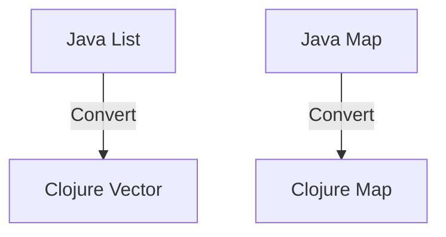
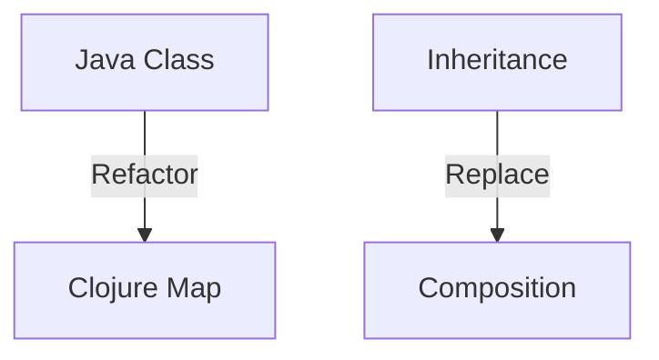

## 19.7 Refactoring Java Code to Clojure

Transitioning from Java to Clojure involves more than just learning a new syntax; it requires a shift in mindset from object-oriented programming (OOP) to functional programming (FP). In this section, we will explore how to refactor Java code to Clojure, focusing on interfacing with Java, gradual replacement strategies, data structure conversion, and refactoring object-oriented constructs. This guide is designed for experienced Java developers looking to leverage the power of Clojure's functional paradigm.

### Interfacing with Java

When transitioning from Java to Clojure, it's often necessary to interface with existing Java code. Clojure provides seamless interoperability with Java, allowing you to call Java methods and use Java libraries directly within Clojure code. This capability is crucial during the transition phase, as it enables you to incrementally refactor your codebase.

#### Calling Java Methods from Clojure

Clojure's syntax for calling Java methods is straightforward. You can use the dot operator (`.`) to call methods on Java objects. Here's an example:

```clojure
;; Create a new Java String object
(def java-string (new String "Hello, Java!"))

;; Call the length method on the Java String object
(def string-length (.length java-string))

;; Print the length of the string
(println "Length of the string:" string-length)
```

In this example, we create a Java `String` object and call its `length` method using the dot operator. This approach allows you to leverage existing Java libraries and methods while gradually transitioning to Clojure.

#### Accessing Java Static Methods and Fields

To access static methods and fields, you can use the slash operator (`/`). Here's how you can call a static method:

```clojure
;; Call the static method Math/sqrt from the Java Math class
(def square-root (Math/sqrt 16))

;; Print the result
(println "Square root of 16:" square-root)
```

This example demonstrates calling the `sqrt` static method from the Java `Math` class. Similarly, you can access static fields using the same syntax.

#### Creating Java Objects

Creating Java objects in Clojure is simple. You can use the `new` keyword or the constructor function syntax. Here's an example:

```clojure
;; Create a new instance of the Java ArrayList class
(def java-list (new java.util.ArrayList))

;; Add elements to the list
(.add java-list "Clojure")
(.add java-list "Java")

;; Print the list
(println "Java List:" java-list)
```

In this example, we create a new instance of the Java `ArrayList` class and add elements to it using the `add` method.

### Gradual Replacement Strategies

Refactoring a large Java codebase to Clojure can be daunting. A gradual replacement strategy allows you to incrementally rewrite Java modules in Clojure, reducing risk and ensuring a smooth transition.

#### Wrapping Java Classes with Clojure Functions

One effective strategy is to wrap Java classes with Clojure functions. This approach allows you to create a functional interface for existing Java code, making it easier to refactor over time. Here's an example:

```clojure
;; Define a Clojure function that wraps a Java method
(defn get-string-length [s]
  (.length s))

;; Use the function to get the length of a string
(def length (get-string-length "Hello, Clojure!"))

;; Print the length
(println "Length of the string:" length)
```

By wrapping Java methods in Clojure functions, you can create a more functional interface that aligns with Clojure's design principles.

#### Incremental Module Rewriting

Another strategy is to rewrite Java modules incrementally. Start by identifying modules that can be easily refactored to Clojure, and gradually replace them. This approach allows you to test and validate each module individually, ensuring that the transition does not disrupt the entire codebase.

### Data Structure Conversion

Converting Java data structures to Clojure equivalents is a crucial step in the refactoring process. Clojure provides a rich set of immutable data structures that offer significant advantages over Java's mutable collections.

#### Converting Java Lists to Clojure Vectors

Java's `List` interface is commonly used for ordered collections. In Clojure, vectors are the closest equivalent, providing efficient access and immutability. Here's how you can convert a Java list to a Clojure vector:

```clojure
;; Convert a Java ArrayList to a Clojure vector
(def java-list (java.util.ArrayList. ["Clojure" "Java" "Scala"]))
(def clojure-vector (vec java-list))

;; Print the Clojure vector
(println "Clojure Vector:" clojure-vector)
```

In this example, we use the `vec` function to convert a Java `ArrayList` to a Clojure vector.

#### Converting Java Maps to Clojure Maps

Java's `Map` interface is another common data structure. Clojure maps provide similar functionality with added benefits of immutability and persistent data structures. Here's an example of converting a Java map to a Clojure map:

```clojure
;; Create a Java HashMap
(def java-map (java.util.HashMap.))
(.put java-map "language" "Clojure")
(.put java-map "paradigm" "Functional")

;; Convert the Java map to a Clojure map
(def clojure-map (into {} java-map))

;; Print the Clojure map
(println "Clojure Map:" clojure-map)
```

We use the `into` function to convert a Java `HashMap` to a Clojure map, preserving the key-value pairs.

### Refactoring Object-Oriented Constructs

Refactoring object-oriented constructs to functional paradigms is a key aspect of transitioning to Clojure. This process involves rethinking how you model data and behavior in your applications.

#### Mapping Classes to Data Structures

In Java, classes are used to encapsulate data and behavior. In Clojure, you can represent data using maps and leverage functions to define behavior. Here's an example of refactoring a Java class to a Clojure map and functions:

**Java Class Example:**

```java
public class Person {
    private String name;
    private int age;

    public Person(String name, int age) {
        this.name = name;
        this.age = age;
    }

    public String getName() {
        return name;
    }

    public int getAge() {
        return age;
    }
}
```

**Clojure Equivalent:**

```clojure
;; Define a Clojure map to represent a person
(def person {:name "Alice" :age 30})

;; Define functions to access the person's data
(defn get-name [p] (:name p))
(defn get-age [p] (:age p))

;; Use the functions to access the data
(println "Name:" (get-name person))
(println "Age:" (get-age person))
```

In this example, we use a Clojure map to represent a person and define functions to access the data. This approach aligns with Clojure's functional paradigm and promotes immutability.

#### Replacing Inheritance with Composition

Inheritance is a common pattern in OOP for code reuse. In Clojure, you can achieve similar functionality using composition. Here's an example:

**Java Inheritance Example:**

```java
public class Animal {
    public void speak() {
        System.out.println("Animal sound");
    }
}

public class Dog extends Animal {
    @Override
    public void speak() {
        System.out.println("Woof");
    }
}
```

**Clojure Composition Equivalent:**

```clojure
;; Define a function for animal sound
(defn animal-sound [] (println "Animal sound"))

;; Define a function for dog sound
(defn dog-sound [] (println "Woof"))

;; Compose functions to create behavior
(defn speak [sound-fn]
  (sound-fn))

;; Use the composed function
(speak animal-sound)
(speak dog-sound)
```

In this example, we use functions to define behavior and compose them to achieve the desired functionality. This approach promotes code reuse and flexibility.

### Visual Aids

To enhance understanding, let's incorporate a few diagrams to illustrate the concepts discussed.

#### Diagram: Java to Clojure Data Structure Conversion



*Diagram 1: Conversion of Java data structures to Clojure equivalents.*

#### Diagram: Refactoring OOP to Functional Paradigms



*Diagram 2: Refactoring object-oriented constructs to functional paradigms in Clojure.*

### References and Links

- [Official Clojure Documentation](https://clojure.org/)
- [ClojureDocs](https://clojuredocs.org/)
- [Clojure Interoperability with Java](https://clojure.org/reference/java_interop)

### Knowledge Check

Let's reinforce what we've learned with a few questions and exercises.

1. **What is the primary advantage of using Clojure's immutable data structures over Java's mutable collections?**

2. **How can you call a static method from a Java class in Clojure? Provide an example.**

3. **Refactor the following Java class to a Clojure map and functions:**

   ```java
   public class Car {
       private String model;
       private int year;

       public Car(String model, int year) {
           this.model = model;
           this.year = year;
       }

       public String getModel() {
           return model;
       }

       public int getYear() {
           return year;
       }
   }
   ```

4. **Explain how you would replace inheritance with composition in a Clojure application.**

### Encouraging Tone

Now that we've explored how to refactor Java code to Clojure, let's apply these concepts to your projects. Remember, transitioning to a functional paradigm is a journey, and each step you take brings you closer to mastering Clojure's powerful features. Keep experimenting and learning, and soon you'll be building scalable, efficient applications with ease.

### Best Practices for Tags

- "Clojure"
- "Java"
- "Functional Programming"
- "Interoperability"
- "Data Structures"
- "Refactoring"
- "Object-Oriented Programming"
- "Code Transformation"

## Quiz: Test Your Knowledge on Refactoring Java Code to Clojure



### What is the primary advantage of using Clojure's immutable data structures over Java's mutable collections?

- [x] Immutability ensures thread safety and reduces side effects.
- [ ] They are faster than Java's mutable collections.
- [ ] They use less memory.
- [ ] They are easier to serialize.

> **Explanation:** Immutability in Clojure ensures that data structures cannot be modified after creation, which enhances thread safety and reduces side effects in functional programming.

### How can you call a static method from a Java class in Clojure?

- [x] Use the slash operator (e.g., `Math/sqrt`).
- [ ] Use the dot operator (e.g., `.Math.sqrt`).
- [ ] Use the `new` keyword.
- [ ] Use the `invoke` function.

> **Explanation:** In Clojure, you can call a static method from a Java class using the slash operator, such as `Math/sqrt`.

### Which Clojure function can be used to convert a Java `ArrayList` to a Clojure vector?

- [x] `vec`
- [ ] `list`
- [ ] `array`
- [ ] `map`

> **Explanation:** The `vec` function in Clojure is used to convert a Java `ArrayList` to a Clojure vector.

### What is the Clojure equivalent of Java's `HashMap`?

- [x] Clojure map
- [ ] Clojure vector
- [ ] Clojure list
- [ ] Clojure set

> **Explanation:** A Clojure map is the equivalent of Java's `HashMap`, providing key-value pair storage with immutability.

### How can you achieve code reuse in Clojure without using inheritance?

- [x] By using composition of functions.
- [ ] By using inheritance.
- [ ] By using interfaces.
- [ ] By using abstract classes.

> **Explanation:** In Clojure, code reuse is achieved through the composition of functions, which allows for flexible and reusable code without relying on inheritance.

### What is the purpose of wrapping Java classes with Clojure functions during refactoring?

- [x] To create a functional interface for existing Java code.
- [ ] To improve performance.
- [ ] To reduce memory usage.
- [ ] To simplify syntax.

> **Explanation:** Wrapping Java classes with Clojure functions creates a functional interface, aligning with Clojure's design principles and facilitating gradual refactoring.

### Which of the following is a strategy for incrementally rewriting Java modules in Clojure?

- [x] Incremental module rewriting
- [ ] Complete codebase overhaul
- [ ] Parallel development
- [ ] Code duplication

> **Explanation:** Incremental module rewriting involves gradually replacing Java modules with Clojure code, allowing for testing and validation of each module individually.

### What is a key benefit of using Clojure's immutable data structures?

- [x] They enhance thread safety.
- [ ] They are mutable.
- [ ] They require more memory.
- [ ] They are slower to access.

> **Explanation:** Clojure's immutable data structures enhance thread safety by ensuring that data cannot be modified after creation, reducing the risk of side effects.

### How can you represent a Java class in Clojure?

- [x] By using a Clojure map and functions.
- [ ] By using a Clojure vector.
- [ ] By using a Clojure list.
- [ ] By using a Clojure set.

> **Explanation:** In Clojure, a Java class can be represented using a Clojure map for data and functions for behavior, aligning with functional programming principles.

### True or False: Clojure allows direct interoperability with Java, enabling the use of Java libraries and methods.

- [x] True
- [ ] False

> **Explanation:** True. Clojure provides seamless interoperability with Java, allowing developers to use Java libraries and methods directly within Clojure code.


