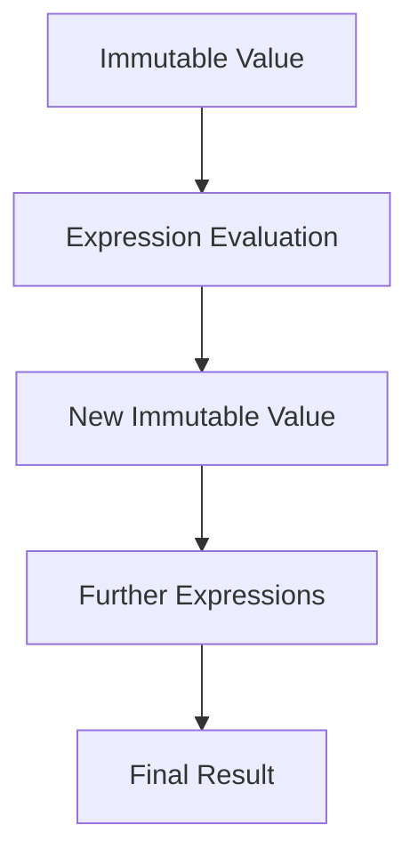

## 2.1 Values and Expressions

In this section, we will delve into the foundational concepts of values and expressions in Clojure, a language that embraces functional programming paradigms. Understanding these concepts is crucial for building efficient and scalable applications. As experienced Java developers, you will find familiar concepts reimagined in Clojure's functional context, offering new ways to approach problem-solving.

### Immutable Values

**Immutable Values**: In Clojure, all values are immutable by default. This means once a value is created, it cannot be changed. Immutability is a cornerstone of functional programming and offers several advantages, such as simplifying reasoning about code and enhancing concurrency safety.

#### Why Immutability Matters

In Java, you might be accustomed to mutable objects, where the state can change over time. This can lead to complex state management, especially in concurrent applications. Clojure's immutability eliminates these issues by ensuring that data cannot be altered once created.

**Example in Java: Mutable Object**

```java
// Java example with mutable state
class Counter {
    private int count = 0;

    public void increment() {
        count++;
    }

    public int getCount() {
        return count;
    }
}
```

**Example in Clojure: Immutable Value**

```clojure
;; Clojure example with immutable value
(def counter 0)

;; Incrementing returns a new value
(def new-counter (inc counter))
```

In the Clojure example, the `counter` remains unchanged, and `new-counter` holds the incremented value. This immutability ensures that functions are pure and free from side effects.

### Expressions over Statements

**Expressions over Statements**: Clojure code is composed of expressions that return values, unlike Java, which often uses statements that perform actions. This expression-oriented approach leads to more concise and predictable code.

#### Expressions in Clojure

In Clojure, everything is an expression, including control structures like `if`, `when`, and `let`. This means that every piece of code evaluates to a value.

**Example of Expressions in Clojure**

```clojure
;; Simple arithmetic expression
(+ 1 2 3) ;=> 6

;; Conditional expression
(if true
  "Yes"
  "No") ;=> "Yes"

;; Let expression for local bindings
(let [x 10
      y 20]
  (+ x y)) ;=> 30
```

Each of these examples evaluates to a value, which can be used in further expressions. This is a shift from Java, where statements like `if` do not inherently return values.

### Evaluating Expressions

**Evaluating Expressions**: Clojure's Read-Eval-Print Loop (REPL) is an interactive environment where you can evaluate expressions and see immediate results. This encourages experimentation and rapid prototyping.

#### Using the REPL

The REPL is a powerful tool for learning and developing in Clojure. It allows you to test expressions, inspect results, and refine your code iteratively.

**Example of Evaluating Expressions in the REPL**

```clojure
;; Start the REPL and evaluate expressions
user=> (+ 1 2 3)
6

user=> (def x 10)
#'user/x

user=> (* x 2)
20
```

The REPL provides immediate feedback, making it easier to understand how expressions are evaluated and how values are computed.

### Understanding Truthiness

**Understanding Truthiness**: In Clojure, logical values are treated with a concept known as truthiness. This includes `true`, `false`, and `nil`, which are handled differently than in Java.

#### Truthiness in Clojure

In Clojure, `false` and `nil` are considered falsey, while everything else is truthy. This is simpler than Java's boolean logic, where only `true` and `false` are used.

**Example of Truthiness in Clojure**

```clojure
;; Truthy and falsey values
(if "non-empty string"
  "Truthy"
  "Falsey") ;=> "Truthy"

(if nil
  "Truthy"
  "Falsey") ;=> "Falsey"

(if false
  "Truthy"
  "Falsey") ;=> "Falsey"
```

This truthiness simplifies conditional expressions and makes the code more expressive.

### Try It Yourself

Now that we've explored the basics of values and expressions in Clojure, try experimenting with the following:

- Modify the arithmetic expressions to include more operations and see how the REPL evaluates them.
- Create a nested `let` expression and observe how local bindings are managed.
- Test different data types in conditional expressions to understand truthiness better.

### Visual Aids

To further illustrate these concepts, let's use a diagram to show the flow of data through expressions and how immutability is maintained.



**Diagram Description**: This flowchart represents how an immutable value is used in expression evaluation, leading to new immutable values and further expressions, ultimately resulting in a final result.

### References and Links

- [Official Clojure Documentation](https://clojure.org/reference/documentation)
- [ClojureDocs](https://clojuredocs.org/)
- [Clojure REPL Guide](https://clojure.org/guides/repl)

### Knowledge Check

Let's reinforce what we've learned with some questions and exercises:

1. What are the benefits of immutability in Clojure?
2. How do expressions differ from statements in Clojure?
3. Experiment with the REPL by creating a complex expression and evaluating it.
4. Test various data types in conditional expressions to see how truthiness is applied.

### Summary

In this section, we've covered the fundamental concepts of values and expressions in Clojure. We've seen how immutability simplifies state management, how expressions provide a more concise way to write code, and how truthiness affects logical evaluations. By understanding these core concepts, you're well on your way to mastering functional programming in Clojure.

Now that we've explored how immutable data structures work in Clojure, let's apply these concepts to manage state effectively in your applications.

## Quiz: Test Your Understanding of Clojure Values and Expressions



### What is a key advantage of immutability in Clojure?

- [x] Simplifies reasoning about code
- [ ] Allows for mutable state
- [ ] Increases complexity
- [ ] Reduces performance

> **Explanation:** Immutability simplifies reasoning about code by ensuring that data cannot be altered once created, which enhances concurrency safety.

### How does Clojure treat logical values?

- [x] `false` and `nil` are falsey, everything else is truthy
- [ ] Only `true` and `false` are used
- [ ] `nil` is always truthy
- [ ] All values are falsey

> **Explanation:** In Clojure, `false` and `nil` are considered falsey, while everything else is truthy, simplifying conditional expressions.

### What is the REPL used for in Clojure?

- [x] Interactive evaluation of expressions
- [ ] Compiling Java code
- [ ] Managing databases
- [ ] Designing user interfaces

> **Explanation:** The REPL is used for interactive evaluation of expressions, allowing for rapid prototyping and experimentation.

### Which of the following is an expression in Clojure?

- [x] `(if true "Yes" "No")`
- [ ] `int x = 10;`
- [ ] `System.out.println("Hello");`
- [ ] `for (int i = 0; i < 10; i++) {}`

> **Explanation:** `(if true "Yes" "No")` is an expression in Clojure that evaluates to a value, unlike Java statements.

### What does the `let` expression do in Clojure?

- [x] Creates local bindings
- [ ] Declares a global variable
- [ ] Executes a loop
- [ ] Defines a function

> **Explanation:** The `let` expression creates local bindings for variables within its scope, allowing for organized and concise code.

### In Clojure, what is the result of evaluating `(if nil "Truthy" "Falsey")`?

- [ ] "Truthy"
- [x] "Falsey"
- [ ] `nil`
- [ ] An error

> **Explanation:** Since `nil` is falsey in Clojure, the expression evaluates to "Falsey".

### What is the purpose of immutability in functional programming?

- [x] To prevent changes to data
- [ ] To allow for mutable state
- [ ] To increase complexity
- [ ] To reduce performance

> **Explanation:** Immutability prevents changes to data, which simplifies reasoning about code and enhances concurrency safety.

### How does Clojure's expression-oriented approach differ from Java's statement-based approach?

- [x] Every piece of code evaluates to a value
- [ ] Statements perform actions without returning values
- [ ] Expressions are only used for arithmetic
- [ ] Java does not support expressions

> **Explanation:** In Clojure, every piece of code evaluates to a value, unlike Java's statement-based approach where actions are performed without returning values.

### What is the result of evaluating `(+ 1 2 3)` in the REPL?

- [x] 6
- [ ] 5
- [ ] 7
- [ ] An error

> **Explanation:** The expression `(+ 1 2 3)` evaluates to 6, as it sums the numbers 1, 2, and 3.

### True or False: In Clojure, `false` is considered truthy.

- [ ] True
- [x] False

> **Explanation:** In Clojure, `false` is considered falsey, along with `nil`.


