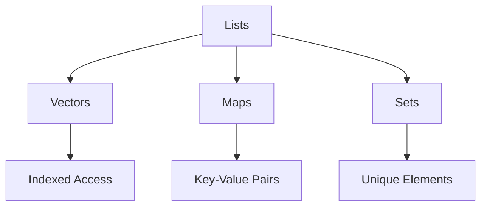

## 2.2 Data Types and Structures in Clojure

Clojure, a modern Lisp dialect, offers a rich set of data types and structures that are both powerful and flexible. As experienced Java developers, you'll find some familiar concepts, but Clojure's approach to data is fundamentally different due to its functional nature and emphasis on immutability. In this section, we'll explore Clojure's scalar types, collection types, and how to work with nested data structures. We'll also cover accessing and updating collections using Clojure's idiomatic functions.

### Scalar Types

Clojure provides several scalar types that are similar to Java's primitive types but with some unique characteristics. Let's dive into the primary scalar types in Clojure: numbers, strings, keywords, and symbols.

#### Numbers

Clojure supports a variety of numeric types, including integers, floating-point numbers, and ratios. Unlike Java, Clojure's numbers are immutable and automatically promote to larger types when necessary.

```clojure
;; Integer
(def my-int 42)

;; Floating-point
(def my-float 3.14)

;; Ratio
(def my-ratio 22/7)

;; BigInt
(def my-bigint 12345678901234567890N)

;; Arithmetic operations
(+ my-int my-float) ; => 45.14
(* my-ratio 2)      ; => 44/7
```

In Clojure, you don't need to worry about integer overflow as you do in Java, thanks to automatic type promotion.

#### Strings

Strings in Clojure are immutable sequences of characters, similar to Java's `String` class. You can use standard string operations such as concatenation and substring extraction.

```clojure
(def my-string "Hello, Clojure!")

;; String concatenation
(str my-string " How are you?") ; => "Hello, Clojure! How are you?"

;; Substring
(subs my-string 7 14) ; => "Clojure"
```

#### Keywords

Keywords are unique to Clojure and are often used as identifiers or keys in maps. They are immutable and interned, meaning they are stored in a way that makes them efficient for comparison.

```clojure
(def my-keyword :name)

;; Using keywords as map keys
(def person {:name "Alice" :age 30})

;; Accessing map values
(get person :name) ; => "Alice"
```

#### Symbols

Symbols are used to refer to variables or functions. They are similar to Java's identifiers but are more flexible due to Clojure's dynamic nature.

```clojure
(def my-symbol 'x)

;; Using symbols to refer to variables
(def x 10)
(eval my-symbol) ; => 10
```

### Collection Types

Clojure's collection types are one of its most powerful features, providing immutable and persistent data structures. Let's explore the primary collection types: lists, vectors, maps, and sets.

#### Lists

Lists in Clojure are linked lists, optimized for sequential access. They are similar to Java's `LinkedList` but immutable.

```clojure
(def my-list '(1 2 3 4 5))

;; Accessing elements
(first my-list) ; => 1
(rest my-list)  ; => (2 3 4 5)

;; Adding elements
(cons 0 my-list) ; => (0 1 2 3 4 5)
```

#### Vectors

Vectors are indexed collections, similar to Java's `ArrayList`, but immutable. They provide efficient random access and are often used when order matters.

```clojure
(def my-vector [1 2 3 4 5])

;; Accessing elements
(nth my-vector 2) ; => 3

;; Adding elements
(conj my-vector 6) ; => [1 2 3 4 5 6]
```

#### Maps

Maps are key-value pairs, similar to Java's `HashMap`, but immutable. They are often used for associative data.

```clojure
(def my-map {:name "Alice" :age 30})

;; Accessing values
(get my-map :name) ; => "Alice"

;; Adding or updating entries
(assoc my-map :city "New York") ; => {:name "Alice", :age 30, :city "New York"}
```

#### Sets

Sets are collections of unique values, similar to Java's `HashSet`, but immutable. They are useful for membership tests.

```clojure
(def my-set #{1 2 3 4 5})

;; Checking membership
(contains? my-set 3) ; => true

;; Adding elements
(conj my-set 6) ; => #{1 2 3 4 5 6}
```

### Nested Data Structures

Clojure's collections can be nested, allowing you to create complex data structures. This is particularly useful for representing hierarchical data.

```clojure
(def nested-map {:person {:name "Alice" :address {:city "New York" :zip 10001}}})

;; Accessing nested values
(get-in nested-map [:person :address :city]) ; => "New York"

;; Updating nested values
(assoc-in nested-map [:person :address :city] "Los Angeles")
; => {:person {:name "Alice", :address {:city "Los Angeles", :zip 10001}}}
```

### Accessing and Updating Collections

Clojure provides a rich set of functions for accessing and updating collections. Let's explore some of the most commonly used functions.

#### Accessing Collections

- **`get`**: Retrieve a value from a map or vector.
- **`first`**: Get the first element of a list or vector.
- **`rest`**: Get all but the first element of a list or vector.
- **`nth`**: Access an element by index in a vector.

```clojure
(def my-map {:name "Alice" :age 30})
(get my-map :name) ; => "Alice"

(def my-vector [1 2 3 4 5])
(nth my-vector 2) ; => 3
```

#### Updating Collections

- **`assoc`**: Add or update a key-value pair in a map.
- **`conj`**: Add an element to a collection.
- **`dissoc`**: Remove a key-value pair from a map.

```clojure
(def my-map {:name "Alice" :age 30})
(assoc my-map :city "New York") ; => {:name "Alice", :age 30, :city "New York"}

(def my-set #{1 2 3})
(conj my-set 4) ; => #{1 2 3 4}

(dissoc my-map :age) ; => {:name "Alice"}
```

### Visual Aids

To better understand the relationships and operations on Clojure's data structures, let's use some diagrams.

#### Collection Types Diagram



*Diagram 1: Overview of Clojure's Collection Types*

### References and Links

For further reading on Clojure's data types and structures, consider the following resources:

- [Official Clojure Documentation](https://clojure.org/reference/data_structures)
- [ClojureDocs](https://clojuredocs.org/)
- [Clojure Programming on GitHub](https://github.com/clojure/clojure)

### Knowledge Check

To reinforce your understanding of Clojure's data types and structures, consider the following questions:

1. What are the primary scalar types in Clojure, and how do they differ from Java's primitive types?
2. How does Clojure handle numeric overflow differently than Java?
3. What are keywords in Clojure, and how are they typically used?
4. Compare and contrast lists and vectors in Clojure.
5. How can you access and update nested data structures in Clojure?

### Exercises

1. Create a nested map representing a book with keys for title, author, and a nested map for publisher details. Access and update the publisher's city.
2. Write a function that takes a vector of numbers and returns a set of unique numbers.
3. Experiment with adding and removing elements from a map using `assoc` and `dissoc`.

### Summary

In this section, we've explored the rich variety of data types and structures available in Clojure. From scalar types like numbers and strings to complex nested data structures, Clojure provides powerful tools for managing data in a functional way. By understanding these concepts, you can leverage Clojure's strengths to build scalable and efficient applications.

Now that we've explored how immutable data structures work in Clojure, let's apply these concepts to manage state effectively in your applications.

## Quiz: Mastering Clojure Data Types and Structures



### What is a key characteristic of Clojure's numbers?

- [x] They are immutable and automatically promote to larger types.
- [ ] They are mutable and fixed in size.
- [ ] They require explicit type casting.
- [ ] They are only available as integers.

> **Explanation:** Clojure's numbers are immutable and automatically promote to larger types when necessary, unlike Java's primitive types.

### How are strings in Clojure similar to Java's `String` class?

- [x] They are immutable sequences of characters.
- [ ] They are mutable and can be changed in place.
- [ ] They support operator overloading.
- [ ] They are stored as arrays of characters.

> **Explanation:** Strings in Clojure, like Java's `String` class, are immutable sequences of characters.

### What is a common use for keywords in Clojure?

- [x] As identifiers or keys in maps.
- [ ] As mutable variables.
- [ ] As function names.
- [ ] As loop counters.

> **Explanation:** Keywords in Clojure are often used as identifiers or keys in maps due to their immutability and efficiency.

### How do lists in Clojure differ from Java's `LinkedList`?

- [x] Lists in Clojure are immutable.
- [ ] Lists in Clojure are mutable.
- [ ] Lists in Clojure support random access.
- [ ] Lists in Clojure are not linked lists.

> **Explanation:** Lists in Clojure are immutable, unlike Java's `LinkedList`, which is mutable.

### Which function is used to add an element to a vector in Clojure?

- [x] `conj`
- [ ] `add`
- [ ] `append`
- [ ] `insert`

> **Explanation:** The `conj` function is used to add an element to a vector in Clojure.

### What is the purpose of the `get-in` function?

- [x] To access nested values in a map.
- [ ] To add elements to a list.
- [ ] To remove elements from a set.
- [ ] To concatenate strings.

> **Explanation:** The `get-in` function is used to access nested values in a map by providing a sequence of keys.

### How can you remove a key-value pair from a map in Clojure?

- [x] Using the `dissoc` function.
- [ ] Using the `remove` function.
- [ ] Using the `delete` function.
- [ ] Using the `unset` function.

> **Explanation:** The `dissoc` function is used to remove a key-value pair from a map in Clojure.

### What is a unique feature of sets in Clojure?

- [x] They contain only unique values.
- [ ] They allow duplicate values.
- [ ] They are ordered collections.
- [ ] They are mutable.

> **Explanation:** Sets in Clojure contain only unique values, making them useful for membership tests.

### Which Clojure data structure is best for associative data?

- [x] Maps
- [ ] Lists
- [ ] Vectors
- [ ] Sets

> **Explanation:** Maps are best for associative data, as they store key-value pairs.

### True or False: Clojure's data structures are designed to be mutable.

- [ ] True
- [x] False

> **Explanation:** Clojure's data structures are designed to be immutable, which is a core principle of functional programming.


