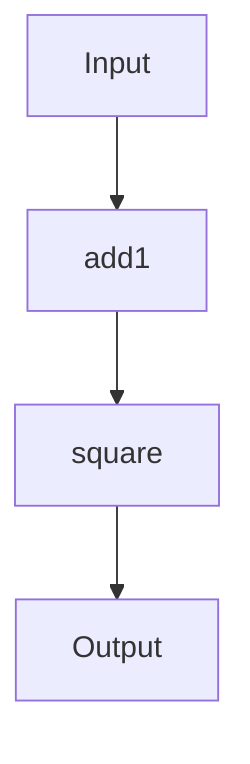

## 2.3 Functions as First-Class Citizens

In the realm of functional programming, the concept of functions as first-class citizens is foundational. This principle allows functions to be treated like any other data type, enabling them to be passed as arguments, returned from other functions, and assigned to variables. This flexibility is a key differentiator from traditional imperative programming paradigms, such as Java, where functions are not first-class entities. In this section, we will explore how Clojure embraces this concept, empowering developers to write more modular, reusable, and expressive code.

### Defining Functions in Clojure

In Clojure, functions are defined using the `defn` macro. This is akin to defining methods in Java, but with a more concise syntax and greater flexibility. Let's start by defining a simple function in Clojure:

```clojure
(defn greet
  "A function that greets a person by name."
  [name]
  (str "Hello, " name "!"))
```

- **Explanation**: The `defn` macro is used to define a function named `greet`. It takes a single parameter `name` and returns a greeting string. The docstring `"A function that greets a person by name."` provides documentation for the function.

#### Java Comparison

In Java, a similar function might look like this:

```java
public String greet(String name) {
    return "Hello, " + name + "!";
}
```

- **Comparison**: Notice how Clojure's syntax is more concise, and the function is defined without specifying a return type, thanks to Clojure's dynamic typing.

### Anonymous Functions

Anonymous functions, also known as lambda expressions, are functions defined without a name. In Clojure, they can be created using the `fn` special form or the shorthand `#()` syntax.

#### Using `fn`

```clojure
(fn [x] (* x x))
```

- **Explanation**: This defines an anonymous function that squares its input. It can be used immediately or passed to other functions.

#### Using `#()`

```clojure
#(* % %)
```

- **Explanation**: The `#()` syntax is a shorthand for defining anonymous functions. `%` represents the first argument, `%1`, `%2`, etc., can be used for subsequent arguments.

#### Java Comparison

In Java 8 and later, lambda expressions provide similar functionality:

```java
x -> x * x
```

- **Comparison**: Java's lambda expressions are similar in purpose but are more limited in syntax compared to Clojure's flexible anonymous functions.

### Passing Functions as Arguments

One of the powerful aspects of treating functions as first-class citizens is the ability to pass them as arguments to other functions. This is a common practice in functional programming, enabling higher-order functions.

#### Example: Using `map`

```clojure
(map #(* % 2) [1 2 3 4])
```

- **Explanation**: The `map` function takes a function and a collection, applying the function to each element of the collection. Here, `#(* % 2)` doubles each number in the list `[1 2 3 4]`.

#### Java Comparison

In Java, you might use streams to achieve similar functionality:

```java
List<Integer> numbers = Arrays.asList(1, 2, 3, 4);
numbers.stream().map(x -> x * 2).collect(Collectors.toList());
```

- **Comparison**: While Java streams provide similar capabilities, Clojure's approach is more direct and concise.

### Returning Functions

Clojure allows functions to return other functions, a concept that is less common in Java but central to functional programming. This enables the creation of higher-order functions and supports patterns like currying and partial application.

#### Example: Returning a Function

```clojure
(defn multiplier
  "Returns a function that multiplies its input by n."
  [n]
  (fn [x] (* n x)))

(def double (multiplier 2))
(double 5) ; => 10
```

- **Explanation**: The `multiplier` function returns a new function that multiplies its input by `n`. The `double` function is created by calling `multiplier` with `2`, and it can be used to double numbers.

#### Java Comparison

In Java, achieving similar functionality requires more boilerplate, often involving interfaces or classes:

```java
interface Multiplier {
    int apply(int x);
}

public Multiplier multiplier(int n) {
    return (x) -> n * x;
}

Multiplier double = multiplier(2);
double.apply(5); // => 10
```

- **Comparison**: Clojure's ability to return functions directly is more straightforward and less verbose than Java's approach.

### Higher-Order Programming

By leveraging functions as first-class citizens, Clojure enables higher-order programming, where functions can be composed, transformed, and manipulated like any other data type.

#### Function Composition

Clojure provides the `comp` function to compose multiple functions into a single function:

```clojure
(defn add1 [x] (+ x 1))
(defn square [x] (* x x))

(def add1-and-square (comp square add1))
(add1-and-square 2) ; => 9
```

- **Explanation**: The `comp` function creates a new function that applies `add1` and then `square`. This demonstrates how functions can be combined to create new functionality.

### Visualizing Function Flow

To better understand how functions flow through higher-order functions, let's visualize the process using a diagram.



- **Diagram Explanation**: This flowchart illustrates how an input is first processed by the `add1` function and then by the `square` function, resulting in the final output.

### Try It Yourself

Now that we've explored the basics of functions as first-class citizens in Clojure, try modifying the examples above:

- **Experiment with `map`**: Use `map` with different anonymous functions to transform a list of numbers.
- **Create a new higher-order function**: Write a function that takes two functions as arguments and returns a new function that applies them in sequence.

### Knowledge Check

Before moving on, let's reinforce what we've learned:

- **What are the benefits of treating functions as first-class citizens?**
- **How do anonymous functions differ from named functions?**
- **Why is function composition useful in functional programming?**

### Summary

In this section, we've delved into the concept of functions as first-class citizens in Clojure. We've seen how this principle allows for more flexible and expressive code, enabling higher-order programming and function composition. By understanding and applying these concepts, you can harness the full power of functional programming in Clojure.

### Further Reading

For more information on functions in Clojure, consider exploring the following resources:

- [Official Clojure Documentation on Functions](https://clojure.org/reference/functions)
- [ClojureDocs: Functions](https://clojuredocs.org/quickref#functions)
- [Functional Programming in Clojure](https://www.braveclojure.com/)

## Quiz: Mastering Functions as First-Class Citizens in Clojure



### What is a first-class citizen in programming?

- [x] An entity that can be passed as an argument, returned from a function, and assigned to a variable.
- [ ] A function that is defined with a name.
- [ ] A variable that holds a constant value.
- [ ] A class that implements an interface.

> **Explanation:** In programming, a first-class citizen is an entity that can be passed as an argument, returned from a function, and assigned to a variable.

### How do you define a function in Clojure?

- [x] Using the `defn` macro.
- [ ] Using the `def` keyword.
- [ ] Using the `fn` keyword.
- [ ] Using the `lambda` keyword.

> **Explanation:** Functions in Clojure are defined using the `defn` macro, which allows you to specify the function name, parameters, and body.

### What is the purpose of anonymous functions in Clojure?

- [x] To define functions without a name for short-term use.
- [ ] To create functions that can only be used once.
- [ ] To define functions that are globally accessible.
- [ ] To define functions that cannot be passed as arguments.

> **Explanation:** Anonymous functions in Clojure are used to define functions without a name, typically for short-term use or as arguments to higher-order functions.

### How can you pass a function as an argument in Clojure?

- [x] By using it directly in a function call, such as with `map`.
- [ ] By wrapping it in a list.
- [ ] By converting it to a string.
- [ ] By using the `pass` keyword.

> **Explanation:** In Clojure, functions can be passed as arguments directly in function calls, such as with the `map` function.

### What is a higher-order function?

- [x] A function that takes other functions as arguments or returns a function.
- [ ] A function that operates on numbers.
- [ ] A function that is defined at the top of a file.
- [ ] A function that is called multiple times.

> **Explanation:** A higher-order function is one that takes other functions as arguments or returns a function, enabling more abstract and flexible code.

### How do you create a function that returns another function in Clojure?

- [x] By defining a function that returns an `fn` expression.
- [ ] By using the `return` keyword.
- [ ] By defining a function with multiple return types.
- [ ] By using the `yield` keyword.

> **Explanation:** In Clojure, you can create a function that returns another function by defining a function that returns an `fn` expression.

### What is function composition in Clojure?

- [x] Combining multiple functions into a single function using `comp`.
- [ ] Defining multiple functions in a single file.
- [ ] Creating a function that calls other functions.
- [ ] Using functions to manipulate data structures.

> **Explanation:** Function composition in Clojure involves combining multiple functions into a single function using the `comp` function.

### What does the `#()` syntax represent in Clojure?

- [x] A shorthand for defining anonymous functions.
- [ ] A way to define a named function.
- [ ] A method for creating lists.
- [ ] A syntax for defining macros.

> **Explanation:** The `#()` syntax in Clojure is a shorthand for defining anonymous functions, where `%` represents the argument.

### How can you create a function that multiplies its input by a given number in Clojure?

- [x] By defining a function that returns an `fn` that multiplies its input.
- [ ] By using the `multiply` keyword.
- [ ] By defining a function with a fixed multiplier.
- [ ] By using the `times` keyword.

> **Explanation:** You can create a function that multiplies its input by a given number in Clojure by defining a function that returns an `fn` that performs the multiplication.

### True or False: In Clojure, functions can be assigned to variables.

- [x] True
- [ ] False

> **Explanation:** In Clojure, functions are first-class citizens, meaning they can be assigned to variables, passed as arguments, and returned from other functions.



By mastering the concept of functions as first-class citizens, you are well on your way to leveraging the full power of functional programming in Clojure. Keep experimenting and exploring to deepen your understanding and enhance your skills.
