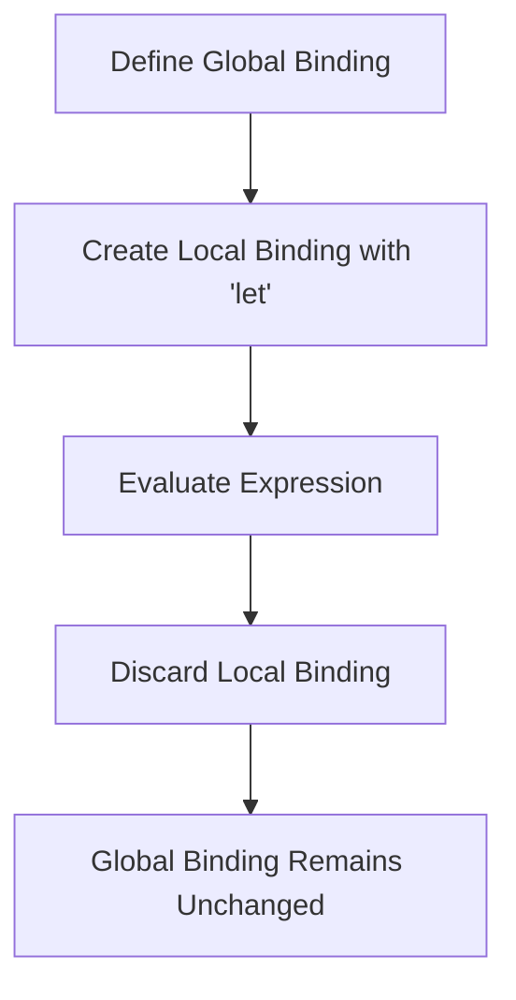

## 2.4 Immutable Variables and Bindings

In this section, we delve into the concept of immutability in Clojure, focusing on immutable variables and bindings. As experienced Java developers, you are familiar with mutable variables and the potential pitfalls they introduce, such as unintended side effects and concurrency issues. Clojure, as a functional programming language, emphasizes immutability, which can lead to safer and more predictable code. Let's explore how Clojure handles variables and bindings, and how you can leverage these concepts to build robust applications.

### Defining Constants with `def`

In Clojure, the `def` keyword is used to bind a name to a value, effectively creating a constant. Unlike Java, where variables can be reassigned, Clojure's `def` creates an immutable binding. This means once a value is assigned to a name, it cannot be changed.

#### Example: Defining Constants

```clojure
(def pi 3.14159) ; Define a constant named 'pi'
(def greeting "Hello, World!") ; Define a constant named 'greeting'
```

In the above example, `pi` and `greeting` are constants. Attempting to reassign a new value to these names will not change their original values. This immutability is a cornerstone of functional programming, promoting safer and more predictable code.

#### Comparison with Java

In Java, you might define a constant using the `final` keyword:

```java
final double PI = 3.14159;
final String GREETING = "Hello, World!";
```

While both Java and Clojure support constants, Clojure's approach is more pervasive, as all variables are immutable by default, not just those explicitly marked as `final`.

### Local Bindings with `let`

Clojure provides the `let` construct for creating local bindings within a specific scope. This is akin to defining variables within a method in Java, but with the added benefit of immutability.

#### Example: Using `let` for Local Bindings

```clojure
(let [x 10
      y 20]
  (+ x y)) ; Returns 30
```

In this example, `x` and `y` are local bindings that exist only within the scope of the `let` expression. Once the expression is evaluated, these bindings are discarded, ensuring no side effects or unintended state changes.

#### Comparison with Java

In Java, you might use local variables within a method:

```java
public int add(int a, int b) {
    int x = a;
    int y = b;
    return x + y;
}
```

While both Java and Clojure support local variables, Clojure's `let` bindings are immutable, preventing accidental modifications and promoting functional purity.

### Immutability in Practice

Immutability is a fundamental concept in Clojure, ensuring that once a value is assigned to a variable, it cannot be changed. This has several advantages:

- **Thread Safety**: Immutable variables eliminate race conditions and make concurrent programming safer.
- **Predictability**: Code becomes more predictable, as variables do not change unexpectedly.
- **Ease of Reasoning**: With immutability, you can reason about code without worrying about hidden state changes.

#### Example: Immutability in Action

Consider a scenario where you need to update a list of numbers:

```clojure
(def numbers [1 2 3 4 5])

(def updated-numbers (conj numbers 6)) ; Add 6 to the list

; 'numbers' remains unchanged, while 'updated-numbers' is a new list
```

In this example, `numbers` remains unchanged, while `updated-numbers` is a new list with the added element. This demonstrates how immutability allows you to create new data structures without altering existing ones.

#### Comparison with Java

In Java, you might use a mutable list:

```java
List<Integer> numbers = new ArrayList<>(Arrays.asList(1, 2, 3, 4, 5));
numbers.add(6); // Modifies the original list
```

In contrast to Clojure, Java's mutable lists can be modified in place, leading to potential side effects and concurrency issues.

### Variable Shadowing

Clojure allows local bindings to shadow global ones, meaning a local binding with the same name as a global one will take precedence within its scope. This can be useful for temporary calculations but should be used with caution to avoid confusion.

#### Example: Variable Shadowing

```clojure
(def x 100) ; Global binding

(let [x 10] ; Local binding shadows the global one
  (println x)) ; Prints 10

(println x) ; Prints 100, global binding remains unchanged
```

In this example, the local binding `x` within the `let` expression shadows the global binding. Once the `let` expression is evaluated, the global binding is restored.

#### Implications of Variable Shadowing

While variable shadowing can be useful, it can also lead to confusion if not used carefully. It's important to ensure that shadowed variables are clearly documented and used in a way that enhances code readability.

### Visualizing Immutability and Bindings

To better understand how immutability and bindings work in Clojure, let's visualize the process using a flowchart.



**Figure 1**: Flowchart illustrating the process of creating local bindings with `let` and the immutability of global bindings.

### Try It Yourself

To reinforce your understanding of immutable variables and bindings in Clojure, try modifying the following code examples:

1. Define a global constant and attempt to reassign it. Observe the behavior.
2. Create a `let` expression with local bindings and modify the expression to include additional calculations.
3. Experiment with variable shadowing by creating nested `let` expressions.

### References and Further Reading

- [Clojure Documentation on `def`](https://clojure.org/reference/special_forms#def)
- [Clojure Documentation on `let`](https://clojure.org/reference/special_forms#let)
- [ClojureDocs: Immutability](https://clojuredocs.org/quickref#Immutability)

### Knowledge Check

To ensure you've grasped the concepts of immutable variables and bindings in Clojure, let's test your understanding with a quiz.

## Quiz: Mastering Immutable Variables and Bindings in Clojure



### What is the primary purpose of using `def` in Clojure?

- [x] To create an immutable binding for a name
- [ ] To define a mutable variable
- [ ] To declare a function
- [ ] To import a library

> **Explanation:** The `def` keyword in Clojure is used to create an immutable binding, meaning the value assigned to a name cannot be changed.

### How does `let` differ from `def` in Clojure?

- [x] `let` creates local bindings, while `def` creates global bindings
- [ ] `let` creates mutable bindings, while `def` creates immutable bindings
- [ ] `let` is used for defining functions, while `def` is for variables
- [ ] `let` is a keyword for importing libraries

> **Explanation:** The `let` construct is used to create local bindings within a specific scope, whereas `def` creates global bindings.

### What happens if you try to reassign a value to a `def` binding in Clojure?

- [x] The original value remains unchanged
- [ ] The new value replaces the original
- [ ] An error is thrown
- [ ] The program crashes

> **Explanation:** In Clojure, `def` creates an immutable binding, so attempting to reassign a value does not change the original.

### What is the advantage of immutability in Clojure?

- [x] It promotes thread safety and predictability
- [ ] It allows for faster execution
- [ ] It simplifies syntax
- [ ] It supports dynamic typing

> **Explanation:** Immutability in Clojure promotes thread safety and predictability by ensuring that variables do not change unexpectedly.

### How does variable shadowing work in Clojure?

- [x] Local bindings can temporarily override global ones within their scope
- [ ] Global bindings permanently override local ones
- [ ] Local bindings cannot have the same name as global ones
- [ ] Shadowing is not allowed in Clojure

> **Explanation:** In Clojure, local bindings created with `let` can temporarily shadow global bindings within their scope.

### What is a potential pitfall of variable shadowing?

- [x] It can lead to confusion if not documented properly
- [ ] It causes performance issues
- [ ] It makes code execution slower
- [ ] It prevents code compilation

> **Explanation:** Variable shadowing can lead to confusion if not used carefully, as it may not be immediately clear which binding is being referenced.

### Why is immutability considered a cornerstone of functional programming?

- [x] It ensures that data structures remain unchanged, leading to safer code
- [ ] It allows for dynamic typing
- [ ] It simplifies function definitions
- [ ] It supports object-oriented principles

> **Explanation:** Immutability ensures that data structures remain unchanged, which is a key principle of functional programming, leading to safer and more predictable code.

### In what scenario might you use `let` in Clojure?

- [x] When you need temporary variables for calculations
- [ ] When you want to define a global constant
- [ ] When you need to import a library
- [ ] When you want to declare a class

> **Explanation:** The `let` construct is used for creating temporary local bindings for calculations or within a specific scope.

### How does immutability affect concurrency in Clojure?

- [x] It eliminates race conditions by ensuring data cannot be changed
- [ ] It slows down concurrent execution
- [ ] It requires additional synchronization mechanisms
- [ ] It complicates thread management

> **Explanation:** Immutability eliminates race conditions by ensuring that data cannot be changed, making concurrent programming safer.

### True or False: In Clojure, all variables are mutable by default.

- [ ] True
- [x] False

> **Explanation:** False. In Clojure, all variables are immutable by default, promoting functional programming principles.



Now that we've explored how immutable variables and bindings work in Clojure, let's apply these concepts to manage state effectively in your applications. By embracing immutability, you can write safer, more predictable code that is easier to reason about and maintain.

---
