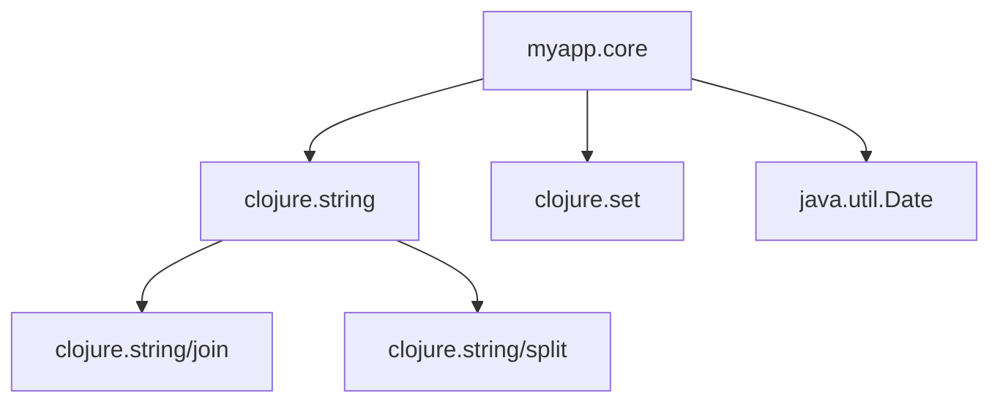

## 2.5 Organizing Code with Namespaces

As experienced Java developers, you're likely familiar with organizing code using packages. In Clojure, namespaces serve a similar purpose, providing a way to group related functions and data structures, manage dependencies, and avoid naming conflicts. In this section, we'll explore how to create and manage namespaces in Clojure, drawing parallels with Java packages to facilitate your transition.

### Creating Namespaces

In Clojure, a namespace is defined using the `ns` macro. This macro not only declares the namespace but also allows you to manage dependencies by requiring other namespaces or Java classes. Here's a basic example of how to define a namespace:

```clojure
(ns myapp.core
  (:require [clojure.string :as str]))
```

In this example, `myapp.core` is the namespace being defined. The `:require` directive is used to include the `clojure.string` namespace, which is aliased as `str` for convenience. This is akin to importing classes in Java.

#### Key Points:

- **Namespace Naming**: Use a hierarchical naming convention similar to Java packages (e.g., `com.example.project.module`).
- **File Structure**: The file path should match the namespace, with slashes replaced by dots (e.g., `src/com/example/project/module.clj`).

### Referencing Other Namespaces

Clojure provides several ways to reference code from other namespaces, each with its own use case and syntax.

#### Using `require`

The `require` function is the most common way to include other namespaces. It allows you to specify aliases and selectively include symbols.

```clojure
(ns myapp.core
  (:require [clojure.set :as set]
            [clojure.string :refer [join split]]))
```

- **Alias**: The `:as` keyword creates an alias for the namespace, making it easier to reference.
- **Refer**: The `:refer` keyword allows you to include specific symbols, reducing the need for fully qualified names.

#### Using `use`

The `use` function is similar to `require` but automatically refers all symbols from the namespace. It's less commonly used due to potential naming conflicts.

```clojure
(ns myapp.core
  (:use clojure.set))
```

#### Using `import`

The `import` function is used to include Java classes. This is particularly useful when leveraging Java libraries within Clojure code.

```clojure
(ns myapp.core
  (:import [java.util Date]))
```

### Aliasing Namespaces

Aliasing is a powerful feature in Clojure that allows you to create concise and readable code. By using aliases, you can avoid repetitive and verbose namespace references.

```clojure
(ns myapp.core
  (:require [clojure.string :as str]))

(defn process-text [text]
  (str/join ", " (str/split text #"\s+")))
```

In this example, the `clojure.string` namespace is aliased as `str`, allowing us to use `str/join` and `str/split` instead of the full namespace path.

### Namespace Best Practices

To effectively organize your Clojure code and avoid common pitfalls, consider the following best practices:

1. **Consistent Naming Conventions**: Use a consistent naming scheme for namespaces that reflects the structure and purpose of your application.

2. **Avoiding Conflicts**: Use aliases and selective `:refer` to prevent naming conflicts, especially in larger projects.

3. **Logical Grouping**: Group related functions and data structures within the same namespace to enhance readability and maintainability.

4. **Minimal `use`**: Prefer `require` over `use` to avoid unintended symbol clashes.

5. **Documentation**: Document namespaces and their purpose to aid in understanding and collaboration.

6. **Testing**: Organize test namespaces to mirror the structure of your application code, facilitating easier navigation and testing.

### Code Examples and Comparisons

Let's compare how namespaces in Clojure relate to Java packages with a practical example.

#### Java Example

```java
package com.example.utils;

public class StringUtils {
    public static String join(String delimiter, String[] elements) {
        return String.join(delimiter, elements);
    }
}
```

#### Clojure Equivalent

```clojure
(ns com.example.utils)

(defn join [delimiter elements]
  (clojure.string/join delimiter elements))
```

In both examples, we define a utility function for joining strings. In Java, this is done within a package, while in Clojure, it's within a namespace. The Clojure version is more concise, leveraging the power of functional programming and built-in functions.

### Visual Aids

To further illustrate the concept of namespaces, let's use a diagram to show how namespaces relate to file structure and dependencies.



**Diagram Description**: This diagram shows the `myapp.core` namespace and its dependencies on `clojure.string`, `clojure.set`, and `java.util.Date`. It highlights how specific functions like `join` and `split` are used within the namespace.

### References and Links

For further reading and a deeper dive into Clojure namespaces, consider the following resources:

- [Official Clojure Documentation on Namespaces](https://clojure.org/reference/namespaces)
- [ClojureDocs Namespace Examples](https://clojuredocs.org/clojure.core/ns)
- [GitHub Repository with Clojure Namespace Examples](https://github.com/clojure-examples/namespaces)

### Knowledge Check

To reinforce your understanding of Clojure namespaces, consider the following questions and exercises:

1. **What is the primary purpose of a namespace in Clojure?**
2. **How does the `require` function differ from `use`?**
3. **Create a namespace that includes a Java class and a Clojure library.**
4. **Refactor a Java package structure into Clojure namespaces.**

### Encouraging Tone

Now that we've explored how to organize code with namespaces in Clojure, let's apply these concepts to structure your projects effectively. By leveraging namespaces, you can create modular, maintainable, and scalable applications. Keep experimenting with different namespace structures and see how they impact your code organization.

### Best Practices for Tags

- "Clojure"
- "Functional Programming"
- "Namespaces"
- "Code Organization"
- "Java Interoperability"
- "Software Architecture"
- "Best Practices"
- "Code Management"

---

## Quiz: Mastering Clojure Namespaces



### What is the primary purpose of a namespace in Clojure?

- [x] To group related functions and data structures
- [ ] To manage memory allocation
- [ ] To compile code faster
- [ ] To handle exceptions

> **Explanation:** Namespaces in Clojure are used to group related functions and data structures, similar to packages in Java.

### Which function is preferred for including specific symbols from another namespace?

- [ ] use
- [x] require
- [ ] import
- [ ] include

> **Explanation:** The `require` function is preferred as it allows selective inclusion of symbols, reducing the risk of naming conflicts.

### How do you alias a namespace in Clojure?

- [ ] (:alias [namespace :as alias])
- [x] (:require [namespace :as alias])
- [ ] (:import [namespace :as alias])
- [ ] (:use [namespace :as alias])

> **Explanation:** The `:require` directive with `:as` is used to alias a namespace in Clojure.

### What is a potential downside of using the `use` function?

- [x] It can lead to naming conflicts
- [ ] It is slower than `require`
- [ ] It does not support Java classes
- [ ] It requires more memory

> **Explanation:** The `use` function can lead to naming conflicts as it refers all symbols from a namespace.

### Which directive is used to include Java classes in a Clojure namespace?

- [ ] require
- [ ] use
- [x] import
- [ ] include

> **Explanation:** The `import` directive is used to include Java classes in a Clojure namespace.

### What is a best practice when organizing Clojure namespaces?

- [x] Use consistent naming conventions
- [ ] Avoid using aliases
- [ ] Always use `use` instead of `require`
- [ ] Include all symbols from every namespace

> **Explanation:** Consistent naming conventions help in maintaining a clear and organized codebase.

### How does the file structure relate to namespaces in Clojure?

- [x] The file path should match the namespace with slashes replaced by dots
- [ ] The file path can be arbitrary
- [ ] The file path should be in uppercase
- [ ] The file path should include the author's name

> **Explanation:** In Clojure, the file path should match the namespace, with slashes replaced by dots.

### What is the benefit of using aliases in Clojure?

- [x] It makes code more concise and readable
- [ ] It speeds up code execution
- [ ] It reduces memory usage
- [ ] It prevents all naming conflicts

> **Explanation:** Aliases make code more concise and readable by reducing the need for fully qualified names.

### True or False: The `require` function can be used to include Java classes.

- [ ] True
- [x] False

> **Explanation:** The `require` function is used for Clojure namespaces, while `import` is used for Java classes.

### What is the role of the `ns` macro in Clojure?

- [x] To define a namespace and manage dependencies
- [ ] To compile code
- [ ] To execute functions
- [ ] To allocate memory

> **Explanation:** The `ns` macro is used to define a namespace and manage dependencies in Clojure.


