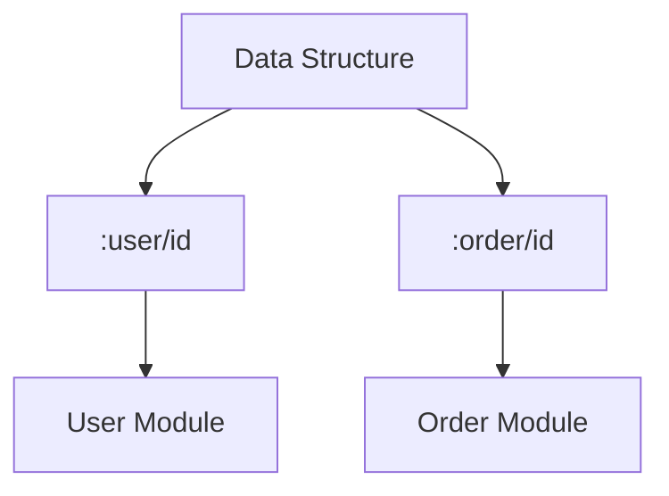

## 2.6 Understanding Namespaced Keywords

In this section, we delve into the concept of namespaced keywords in Clojure, a powerful feature that aids in organizing and managing data effectively. As experienced Java developers, you are likely familiar with the importance of namespaces in preventing naming conflicts and ensuring code modularity. Clojure extends this concept to keywords, providing a robust mechanism for data management and interoperability.

### Purpose of Namespaced Keywords

Namespaced keywords in Clojure serve two primary purposes:

1. **Contextual Clarity**: They provide context to data, making it clear where a piece of data belongs or what it represents.
2. **Collision Prevention**: They prevent naming collisions, especially in large systems where different modules or libraries might use similar identifiers.

Consider a scenario where two different modules in a system use the keyword `:id`. Without namespacing, it would be challenging to determine which module a particular `:id` belongs to. Namespaced keywords solve this by allowing you to define keywords like `:user/id` and `:order/id`, clearly indicating their context.

### Defining Namespaced Keywords

Defining namespaced keywords in Clojure is straightforward. A namespaced keyword is simply a keyword prefixed with a namespace, separated by a slash (`/`). Here's how you can define and use them:

```clojure
;; Defining namespaced keywords
(def user-id :user/id)
(def order-id :order/id)

;; Using namespaced keywords in a map
(def user {:user/id 101 :user/name "Alice"})
(def order {:order/id 202 :order/amount 150.0})

;; Accessing values using namespaced keywords
(println (:user/id user))   ;; Output: 101
(println (:order/id order)) ;; Output: 202
```

In the example above, `:user/id` and `:order/id` are namespaced keywords that help differentiate between user and order identifiers.

#### Try It Yourself

Experiment with creating your own namespaced keywords. Try defining a map with multiple namespaced keywords and access the values using these keywords.

### Keyword Namespaces vs. Code Namespaces

It's important to distinguish between keyword namespaces and code namespaces in Clojure:

- **Keyword Namespaces**: These are used within data structures to provide context and prevent collisions. They are purely for organizational purposes within data and do not affect code execution or scope.
  
- **Code Namespaces**: These are used to organize code into logical units, similar to packages in Java. They help manage scope and dependencies within your codebase.

#### Example: Code Namespace

```clojure
(ns myapp.core)

(defn greet [name]
  (str "Hello, " name "!"))

;; Using the function
(greet "Alice") ;; Output: "Hello, Alice!"
```

In this example, `myapp.core` is a code namespace that organizes the `greet` function. It has no direct relation to keyword namespaces, which are used within data.

### Interoperability

Namespaced keywords play a crucial role in data exchange between systems, especially in microservices architectures or when integrating with external APIs. They provide a consistent way to identify data fields across different systems, reducing the risk of conflicts and misunderstandings.

#### Example: Data Exchange

Consider a scenario where a Clojure service communicates with a Java service. The Clojure service sends data using namespaced keywords:

```clojure
(def user-data {:user/id 101 :user/name "Alice"})

;; Convert to JSON for transmission
(require '[cheshire.core :as json])
(def json-data (json/generate-string user-data))
```

On the Java side, you can parse this JSON and handle the namespaced keys appropriately, ensuring that the data remains consistent and unambiguous.

### Visual Aids

To better understand the flow and organization of namespaced keywords, consider the following diagram illustrating how they prevent collisions and provide context:



**Diagram Description**: This diagram shows a data structure containing two namespaced keywords, `:user/id` and `:order/id`, each linked to their respective modules, demonstrating how namespaced keywords provide context and prevent collisions.

### References and Links

For further reading on namespaced keywords and their applications, consider the following resources:

- [Official Clojure Documentation on Keywords](https://clojure.org/reference/data_structures#Keywords)
- [ClojureDocs: Keywords](https://clojuredocs.org/clojure.core/keyword)
- [Cheshire JSON Library](https://github.com/dakrone/cheshire)

### Knowledge Check

To reinforce your understanding of namespaced keywords, consider the following questions:

- What are the primary purposes of namespaced keywords in Clojure?
- How do namespaced keywords differ from code namespaces?
- Why are namespaced keywords important for interoperability?

### Exercises

1. **Create a Map**: Define a map with at least three namespaced keywords and access their values.
2. **Data Exchange Simulation**: Simulate data exchange between a Clojure service and a Java service using namespaced keywords.

### Summary

Namespaced keywords are a powerful feature in Clojure that enhance data clarity and prevent naming collisions. By providing context to data, they facilitate seamless data exchange between systems and help maintain organized and modular codebases. As you continue to explore Clojure, leveraging namespaced keywords will be instrumental in building scalable and maintainable applications.

---

## Quiz: Mastering Namespaced Keywords in Clojure



### What is the primary purpose of namespaced keywords in Clojure?

- [x] To provide context and prevent naming collisions
- [ ] To improve performance
- [ ] To replace code namespaces
- [ ] To simplify syntax

> **Explanation:** Namespaced keywords provide context to data and prevent naming collisions, especially in large systems.

### How do namespaced keywords differ from code namespaces?

- [x] Namespaced keywords are used within data structures, while code namespaces organize code
- [ ] Namespaced keywords are faster
- [ ] Code namespaces are only for functions
- [ ] Namespaced keywords are deprecated

> **Explanation:** Namespaced keywords are used for organizing data, whereas code namespaces manage code scope and dependencies.

### Which of the following is a valid namespaced keyword in Clojure?

- [x] `:user/id`
- [ ] `user/id`
- [ ] `:user.id`
- [ ] `user:id`

> **Explanation:** `:user/id` is the correct syntax for a namespaced keyword in Clojure.

### Why are namespaced keywords important for interoperability?

- [x] They provide a consistent way to identify data fields across systems
- [ ] They increase data size
- [ ] They are required for JSON conversion
- [ ] They simplify code syntax

> **Explanation:** Namespaced keywords ensure consistent identification of data fields, reducing conflicts in data exchange.

### Can namespaced keywords be used in JSON data exchange?

- [x] Yes
- [ ] No

> **Explanation:** Namespaced keywords can be converted to JSON strings for data exchange between systems.

### What is the correct way to define a namespaced keyword?

- [x] `:namespace/keyword`
- [ ] `namespace/keyword`
- [ ] `:namespace.keyword`
- [ ] `namespace:keyword`

> **Explanation:** The correct syntax for defining a namespaced keyword is `:namespace/keyword`.

### Which library is commonly used for JSON conversion in Clojure?

- [x] Cheshire
- [ ] Jackson
- [ ] Gson
- [ ] Fastjson

> **Explanation:** Cheshire is a popular library for JSON conversion in Clojure.

### What is the benefit of using namespaced keywords in large systems?

- [x] They prevent naming collisions
- [ ] They reduce code size
- [ ] They improve execution speed
- [ ] They simplify syntax

> **Explanation:** Namespaced keywords help prevent naming collisions in large systems with multiple modules.

### How do namespaced keywords enhance data clarity?

- [x] By providing context to data fields
- [ ] By shortening data field names
- [ ] By increasing data field length
- [ ] By simplifying data structures

> **Explanation:** Namespaced keywords provide context, making it clear what each data field represents.

### True or False: Namespaced keywords can replace code namespaces.

- [ ] True
- [x] False

> **Explanation:** Namespaced keywords and code namespaces serve different purposes and cannot replace each other.


