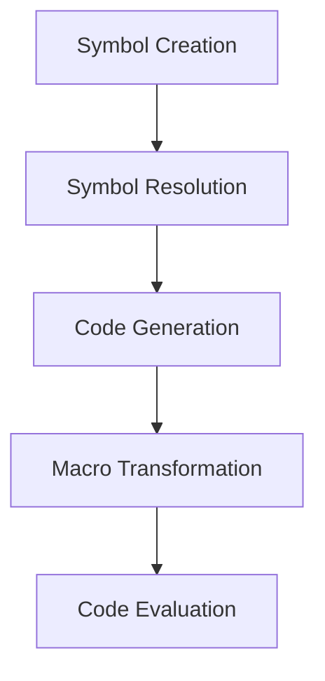

## 2.7 Symbolic Programming in Clojure

Symbolic programming is a powerful paradigm that allows developers to treat code as data, enabling dynamic code generation and transformation. In Clojure, symbols play a crucial role in this paradigm, serving as the building blocks for variables, functions, and macros. This section will delve into the concept of symbols, how to manipulate them, and their significance in code generation and macro creation.

### Symbols in Depth

In Clojure, a symbol is a fundamental data type used to refer to variables and functions. Unlike Java, where variables are directly associated with memory locations, Clojure uses symbols as references to values stored in namespaces. This distinction is essential for understanding how Clojure handles code as data.

#### Defining Symbols

Symbols in Clojure are typically defined using the `def` or `defn` macros. Here's a simple example:

```clojure
(def my-var 42)
(defn my-func [x] (* x x))
```

In this example, `my-var` and `my-func` are symbols that refer to a value and a function, respectively. Symbols are resolved at runtime, allowing for dynamic behavior that is not possible in statically-typed languages like Java.

#### Symbol Resolution

Symbol resolution in Clojure involves looking up the value associated with a symbol in the current namespace. This process is akin to variable lookup in Java, but with more flexibility due to Clojure's dynamic nature.

```clojure
(println my-var) ; Outputs: 42
(println (my-func 5)) ; Outputs: 25
```

### Manipulating Symbols

Clojure provides several functions for creating and manipulating symbols programmatically. This capability is a cornerstone of symbolic programming, enabling developers to generate and transform code dynamically.

#### Creating Symbols

You can create symbols using the `symbol` function:

```clojure
(def sym (symbol "dynamic-var"))
```

This creates a symbol named `dynamic-var`, which can be used to refer to variables or functions dynamically.

#### Using Symbols Programmatically

Symbols can be used to dynamically refer to variables and functions, allowing for flexible and reusable code. Here's an example of using symbols to dynamically call a function:

```clojure
(defn dynamic-call [func-name arg]
  ((resolve (symbol func-name)) arg))

(defn square [x] (* x x))

(println (dynamic-call "square" 4)) ; Outputs: 16
```

In this example, `dynamic-call` takes a function name as a string, converts it to a symbol, resolves it to the actual function, and then calls it with the provided argument.

### Code Generation

Symbolic programming in Clojure enables code generation, where code can be written to produce other code. This is a powerful feature that allows for metaprogramming, where programs can manipulate their own structure.

#### Generating Code with Symbols

By using symbols, you can construct and evaluate code dynamically. Here's an example of generating a simple arithmetic expression:

```clojure
(defn generate-expression [a b]
  (list '+ a b))

(def expr (generate-expression 3 4))

(eval expr) ; Outputs: 7
```

In this example, `generate-expression` constructs a list representing the expression `(+ 3 4)`, which is then evaluated using `eval`.

#### Practical Applications

Code generation can be used in various scenarios, such as creating domain-specific languages (DSLs), automating repetitive tasks, and optimizing performance by generating specialized code at runtime.

### Macro Foundations

Understanding symbols is crucial for grasping Clojure's macro system, which allows developers to extend the language by writing code that writes code. Macros operate on the symbolic representation of code, transforming it before it is evaluated.

#### Symbols as Code Representations

In Clojure, code is represented as data structures, primarily lists, where the first element is typically a symbol representing a function or macro. This representation allows macros to manipulate code at a high level.

```clojure
(defmacro my-macro [x]
  `(println "The value is:" ~x))

(my-macro 10) ; Outputs: The value is: 10
```

In this example, `my-macro` uses symbols to construct a new expression that includes the provided argument.

#### Preparing for Macros

To effectively use macros, it's essential to understand how symbols and lists represent code in Clojure. This understanding allows you to create powerful abstractions and transformations that enhance the expressiveness of your programs.

### Visual Aids

To better understand symbolic programming, let's visualize the flow of data through a simple symbolic expression:



**Diagram Description:** This flowchart illustrates the process of symbolic programming in Clojure, from symbol creation and resolution to code generation, macro transformation, and evaluation.

### References and Links

- [Official Clojure Documentation](https://clojure.org/reference/symbols)
- [ClojureDocs: Symbols](https://clojuredocs.org/clojure.core/symbol)
- [GitHub: Clojure Examples](https://github.com/clojure/clojure)

### Knowledge Check

To reinforce your understanding of symbolic programming in Clojure, consider the following questions:

1. What is the role of symbols in Clojure, and how do they differ from variables in Java?
2. How can you create and manipulate symbols programmatically in Clojure?
3. What are some practical applications of code generation using symbols?
4. How do symbols facilitate macro creation and transformation in Clojure?

### Exercises

1. **Dynamic Function Call:** Write a function that takes a function name and arguments as input, dynamically resolves the function, and calls it with the provided arguments.
2. **Code Generation:** Create a function that generates and evaluates a simple mathematical expression using symbols.
3. **Macro Exploration:** Write a simple macro that uses symbols to transform an expression before evaluation.

### Summary

In this section, we've explored the concept of symbolic programming in Clojure, focusing on the role of symbols, their manipulation, and their significance in code generation and macro creation. By understanding these concepts, you can harness the full power of Clojure's symbolic programming capabilities to write more expressive and flexible code.

Now that we've delved into symbolic programming, let's continue our journey into the world of Clojure by exploring immutability and state management in the next chapter.

## Quiz: Mastering Symbolic Programming in Clojure



### What is a symbol in Clojure?

- [x] A reference to a variable or function
- [ ] A data type for storing numbers
- [ ] A keyword for defining functions
- [ ] A type of collection

> **Explanation:** In Clojure, a symbol is a reference to a variable or function, allowing for dynamic resolution and manipulation.

### How do you create a symbol in Clojure?

- [x] Using the `symbol` function
- [ ] Using the `def` keyword
- [ ] Using the `let` binding
- [ ] Using the `fn` function

> **Explanation:** The `symbol` function is used to create symbols programmatically in Clojure.

### What is the purpose of code generation in symbolic programming?

- [x] To create code that writes other code
- [ ] To optimize memory usage
- [ ] To compile code faster
- [ ] To improve error handling

> **Explanation:** Code generation in symbolic programming allows for the creation of code that writes other code, enabling dynamic and flexible programming.

### How do symbols facilitate macro creation in Clojure?

- [x] By representing code as data structures
- [ ] By optimizing function calls
- [ ] By storing large datasets
- [ ] By improving concurrency

> **Explanation:** Symbols represent code as data structures, allowing macros to manipulate and transform code before evaluation.

### What is a practical application of symbolic programming?

- [x] Creating domain-specific languages
- [ ] Storing large amounts of data
- [ ] Improving network performance
- [ ] Enhancing user interfaces

> **Explanation:** Symbolic programming is often used to create domain-specific languages, enabling specialized and efficient code generation.

### Which function is used to evaluate a symbolic expression in Clojure?

- [x] `eval`
- [ ] `apply`
- [ ] `reduce`
- [ ] `map`

> **Explanation:** The `eval` function is used to evaluate symbolic expressions in Clojure, executing the code they represent.

### What is the output of the following code: `(eval (list '+ 1 2))`?

- [x] 3
- [ ] 12
- [ ] 1+2
- [ ] An error

> **Explanation:** The code constructs a symbolic expression representing the addition of 1 and 2, which evaluates to 3.

### How do you dynamically resolve a function using a symbol in Clojure?

- [x] Using the `resolve` function
- [ ] Using the `defn` keyword
- [ ] Using the `let` binding
- [ ] Using the `fn` function

> **Explanation:** The `resolve` function is used to dynamically resolve a function or variable from a symbol in Clojure.

### What is a key benefit of symbolic programming in Clojure?

- [x] Flexibility in code manipulation
- [ ] Faster compilation times
- [ ] Improved memory management
- [ ] Enhanced security

> **Explanation:** Symbolic programming provides flexibility in code manipulation, allowing for dynamic and expressive programming.

### True or False: Symbols in Clojure are resolved at compile time.

- [ ] True
- [x] False

> **Explanation:** Symbols in Clojure are resolved at runtime, allowing for dynamic behavior and flexibility.


