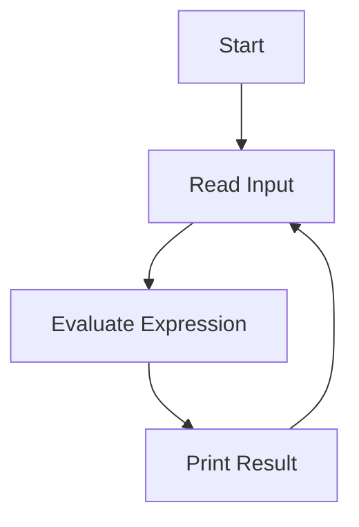

## 2.8 The REPL: Interactive Development

The Read-Eval-Print Loop (REPL) is a cornerstone of Clojure development, providing an interactive environment that allows developers to write, test, and debug code in real-time. This section will guide you through the essentials of using the REPL effectively, drawing parallels to Java development where applicable, and offering practical tips for maximizing your productivity.

### What is REPL?

The REPL stands for Read-Eval-Print Loop, a simple yet powerful interactive programming environment. It reads user input, evaluates it, prints the result, and loops back to read more input. This cycle allows developers to experiment with code snippets, test functions, and debug applications in a dynamic and iterative manner.

#### Importance of REPL in Clojure Development

In Clojure, the REPL is not just a tool; it's an integral part of the development process. It enables:

- **Rapid Prototyping**: Quickly test ideas and see immediate results.
- **Interactive Debugging**: Evaluate expressions and inspect variables on the fly.
- **Incremental Development**: Build applications piece by piece, testing each part as you go.
- **Learning and Exploration**: Experiment with new libraries and language features without the overhead of setting up a full project.

### Starting the REPL

Getting started with the REPL is straightforward. You can launch it from the command line or integrate it into your favorite development environment.

#### Launching the REPL from the Command Line

To start the REPL from the command line, ensure you have Clojure installed. Then, open your terminal and run:

```bash
clj
```

This command starts the Clojure REPL, where you can begin typing Clojure expressions.

#### Starting the REPL in Editors

Many popular editors and IDEs support Clojure REPL integration, including:

- **Emacs with CIDER**: A powerful combination for Clojure development. Start the REPL with `M-x cider-jack-in`.
- **IntelliJ IDEA with Cursive**: Offers seamless REPL integration. Use the "Run REPL" option in the Cursive plugin.
- **VS Code with Calva**: Provides a user-friendly REPL experience. Start the REPL with the "Start REPL" command in the Calva extension.

### Interactive Coding

The REPL allows you to write and test code snippets interactively. Let's explore some common tasks you can perform in the REPL.

#### Evaluating Expressions

You can evaluate any Clojure expression directly in the REPL. For example:

```clojure
(+ 1 2 3)
;; => 6
```

This simple arithmetic operation demonstrates how the REPL reads the expression, evaluates it, and prints the result.

#### Defining Functions

Define functions on the fly and test them immediately:

```clojure
(defn greet [name]
  (str "Hello, " name "!"))

(greet "Clojure")
;; => "Hello, Clojure!"
```

This example shows how you can define a function and call it without leaving the REPL.

#### Testing Code Snippets

The REPL is ideal for testing small code snippets and exploring language features:

```clojure
(map inc [1 2 3 4])
;; => (2 3 4 5)
```

Here, we use the `map` function to increment each element in a list, showcasing the power of functional programming in Clojure.

### REPL Workflows

To make the most of the REPL, it's essential to adopt effective workflows. Here are some tips to enhance your REPL experience.

#### Navigating History

The REPL keeps a history of your commands, allowing you to navigate through previous inputs using the up and down arrow keys. This feature is particularly useful for re-evaluating or modifying past expressions.

#### Multitasking with the REPL

You can run multiple REPL sessions simultaneously, each connected to different parts of your application. This setup is beneficial for working on complex projects where you need to test different modules concurrently.

#### Using REPL for Debugging

The REPL is a powerful debugging tool. You can inspect variables, evaluate expressions in the context of your application, and even redefine functions without restarting your program.

### Code Examples: Clojure vs. Java

To illustrate the differences between Clojure and Java, let's compare how each language handles interactive development.

#### Java Example

In Java, testing a simple function requires setting up a class and a main method:

```java
public class HelloWorld {
    public static void main(String[] args) {
        System.out.println(greet("Java"));
    }

    public static String greet(String name) {
        return "Hello, " + name + "!";
    }
}
```

This process involves compiling and running the entire program, which can be cumbersome for quick tests.

#### Clojure Example

In Clojure, you can achieve the same result interactively in the REPL:

```clojure
(defn greet [name]
  (str "Hello, " name "!"))

(greet "Clojure")
;; => "Hello, Clojure!"
```

This example highlights the simplicity and immediacy of using the REPL for development.

### Visual Aids

To better understand the REPL's workflow, consider the following flowchart illustrating the Read-Eval-Print Loop process:



**Figure 1**: The REPL process flowchart.

### References and Links

For further reading and resources, consider the following links:

- [Official Clojure Documentation](https://clojure.org/reference/repl_and_main)
- [ClojureDocs](https://clojuredocs.org/)
- [CIDER for Emacs](https://cider.mx/)
- [Cursive for IntelliJ IDEA](https://cursive-ide.com/)
- [Calva for VS Code](https://calva.io/)

### Knowledge Check

To reinforce your understanding of the REPL, consider the following questions:

- What are the key benefits of using the REPL in Clojure development?
- How does the REPL enhance the debugging process?
- Compare the workflow of testing a function in Java versus Clojure.

### Practice Problems

1. Define a function in the REPL that calculates the factorial of a number. Test it with different inputs.
2. Use the REPL to explore the `reduce` function in Clojure. Try reducing a list of numbers with different operations.
3. Experiment with defining and redefining functions in the REPL. Observe how changes take effect immediately.

### Encouraging Tone

Now that we've explored the REPL's capabilities, you're well-equipped to leverage this powerful tool in your Clojure development journey. Embrace the interactive nature of the REPL to experiment, learn, and build robust applications efficiently.

---

## Quiz: Mastering the REPL in Clojure



### What does REPL stand for in Clojure?

- [x] Read-Eval-Print Loop
- [ ] Run-Evaluate-Print Loop
- [ ] Read-Execute-Print Loop
- [ ] Run-Execute-Print Loop

> **Explanation:** REPL stands for Read-Eval-Print Loop, which is a fundamental part of interactive programming in Clojure.

### How can you start the Clojure REPL from the command line?

- [x] By running the `clj` command
- [ ] By running the `java` command
- [ ] By running the `repl` command
- [ ] By running the `clojure` command

> **Explanation:** You can start the Clojure REPL from the command line by executing the `clj` command.

### Which editor supports Clojure REPL integration with CIDER?

- [x] Emacs
- [ ] IntelliJ IDEA
- [ ] VS Code
- [ ] Sublime Text

> **Explanation:** Emacs supports Clojure REPL integration through the CIDER plugin.

### What is a key advantage of using the REPL for development?

- [x] Rapid prototyping and testing
- [ ] Compiling large projects
- [ ] Managing dependencies
- [ ] Writing documentation

> **Explanation:** The REPL allows for rapid prototyping and testing, making it a valuable tool for interactive development.

### Which of the following is a benefit of using the REPL for debugging?

- [x] Inspecting variables on the fly
- [ ] Compiling code faster
- [ ] Managing project files
- [ ] Writing unit tests

> **Explanation:** The REPL allows developers to inspect variables and evaluate expressions interactively, aiding in the debugging process.

### How does the REPL improve the learning process for new Clojure developers?

- [x] By allowing experimentation with code snippets
- [ ] By providing detailed error logs
- [ ] By offering a graphical interface
- [ ] By automating code generation

> **Explanation:** The REPL enables new developers to experiment with code snippets, facilitating a hands-on learning experience.

### What is the primary function of the `defn` keyword in Clojure?

- [x] To define a new function
- [ ] To declare a variable
- [ ] To import a library
- [ ] To start a loop

> **Explanation:** The `defn` keyword is used to define a new function in Clojure.

### Which command allows you to navigate through previous inputs in the REPL?

- [x] Up and down arrow keys
- [ ] Left and right arrow keys
- [ ] Ctrl + C
- [ ] Alt + Tab

> **Explanation:** You can navigate through previous inputs in the REPL using the up and down arrow keys.

### What is the purpose of the `str` function in the provided Clojure example?

- [x] To concatenate strings
- [ ] To convert numbers to strings
- [ ] To split strings
- [ ] To format strings

> **Explanation:** The `str` function is used to concatenate strings in Clojure.

### True or False: The REPL can be used to redefine functions without restarting the application.

- [x] True
- [ ] False

> **Explanation:** True. The REPL allows you to redefine functions on the fly without needing to restart the application.



---

By mastering the REPL, you unlock a new level of productivity and creativity in your Clojure development. Keep experimenting and exploring to fully harness the power of this interactive tool.
