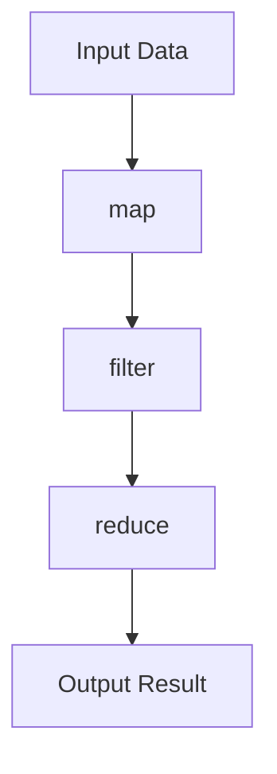

## 20.1 Writing Clean and Readable Functional Code in Clojure

Writing clean and readable code is a cornerstone of effective software development, particularly in functional programming languages like Clojure. As experienced Java developers transitioning to Clojure, you will find that embracing functional paradigms can lead to more maintainable and scalable applications. In this section, we will explore key principles and practices for writing clean and readable functional code in Clojure, focusing on simplicity, avoiding side effects, and leveraging destructuring.

### Simplicity Matters

In the realm of functional programming, simplicity is not just a preference but a necessity. Clojure, with its minimalist syntax and powerful abstractions, encourages developers to craft solutions that are as simple as possible but no simpler. This principle, often attributed to Albert Einstein, is crucial in reducing complexity and enhancing code readability.

#### Embrace Simplicity

- **Favor Declarative Over Imperative**: In Clojure, aim to express what you want to achieve rather than how to achieve it. This declarative style is more aligned with functional programming and often results in simpler, more readable code.
  
- **Use Built-in Functions**: Clojure provides a rich set of built-in functions that abstract common operations. Leveraging these functions can simplify your code and reduce the need for custom implementations.

- **Avoid Over-Engineering**: Resist the temptation to add unnecessary abstractions or features. Focus on solving the problem at hand with the simplest possible solution.

#### Code Example: Simplicity in Action

Let's compare a simple task in Java and Clojure to illustrate the principle of simplicity.

**Java Example:**

```java
import java.util.List;
import java.util.stream.Collectors;

public class Example {
    public static List<Integer> filterEvenNumbers(List<Integer> numbers) {
        return numbers.stream()
                      .filter(n -> n % 2 == 0)
                      .collect(Collectors.toList());
    }
}
```

**Clojure Example:**

```clojure
(defn filter-even-numbers [numbers]
  (filter even? numbers))
```

In the Clojure example, the use of the `filter` function with the `even?` predicate results in a concise and readable solution. The simplicity of Clojure's syntax allows us to express the intent directly without boilerplate code.

### Avoid Side Effects

One of the hallmarks of functional programming is the emphasis on pure functions—functions that do not produce side effects. By avoiding side effects, you can create more predictable and testable code.

#### Understanding Side Effects

A side effect occurs when a function modifies some state outside its scope or interacts with the outside world (e.g., modifying a global variable, writing to a file, or printing to the console). In functional programming, side effects are minimized or isolated to specific parts of the codebase.

#### Writing Pure Functions

- **Ensure Determinism**: A pure function should always produce the same output given the same input, without relying on or modifying external state.

- **Isolate Side Effects**: When side effects are necessary (e.g., I/O operations), isolate them in specific functions or modules. This separation allows the rest of your code to remain pure and easier to reason about.

#### Code Example: Pure vs. Impure Functions

Consider the following examples to understand the difference between pure and impure functions.

**Impure Function Example:**

```clojure
(defn impure-add [x y]
  (println "Adding numbers")
  (+ x y))
```

**Pure Function Example:**

```clojure
(defn pure-add [x y]
  (+ x y))
```

In the impure function, the `println` statement introduces a side effect by printing to the console. The pure function, on the other hand, simply returns the sum of `x` and `y`, making it easier to test and reason about.

### Use of Destructuring

Destructuring is a powerful feature in Clojure that enhances code readability by allowing you to extract values from complex data structures in a concise manner. This feature is particularly useful when dealing with nested maps, vectors, or lists.

#### Benefits of Destructuring

- **Improves Readability**: By clearly specifying the structure of the data you are working with, destructuring makes your code more readable and self-documenting.

- **Reduces Boilerplate**: Destructuring eliminates the need for repetitive code to access elements within data structures.

#### Code Example: Destructuring in Action

Let's explore how destructuring can simplify code that deals with nested data structures.

**Without Destructuring:**

```clojure
(defn process-user [user]
  (let [name (:name user)
        age (:age user)
        address (:address user)]
    (println "Name:" name "Age:" age "Address:" address)))
```

**With Destructuring:**

```clojure
(defn process-user [{:keys [name age address]}]
  (println "Name:" name "Age:" age "Address:" address))
```

In the destructured version, we use the `:keys` keyword to extract `name`, `age`, and `address` directly from the `user` map, resulting in cleaner and more concise code.

### Consistent Style

Adopting a consistent coding style across your team or project is essential for maintaining readability and reducing cognitive load. Consistency in naming conventions, indentation, and code organization helps developers quickly understand and navigate the codebase.

#### Establishing a Coding Style

- **Naming Conventions**: Use meaningful names for functions and variables. Follow Clojure's convention of using kebab-case for function names and snake_case for variables.

- **Indentation and Formatting**: Adhere to a consistent indentation style. Clojure code is typically indented with two spaces per level.

- **Code Organization**: Group related functions and data structures together. Use namespaces to organize code logically.

#### Code Example: Consistent Style

```clojure
(ns my-app.core)

(defn calculate-total [prices]
  (reduce + prices))

(defn display-total [total]
  (println "Total:" total))

(defn main []
  (let [prices [10 20 30]
        total (calculate-total prices)]
    (display-total total)))
```

In this example, we follow consistent naming conventions and indentation, making the code easy to read and understand.

### Visual Aids

To further illustrate the concepts discussed, let's use a flowchart to demonstrate the flow of data through a series of higher-order functions.



**Flowchart Description**: This flowchart represents a typical data transformation pipeline in Clojure, where input data is processed through a series of higher-order functions (`map`, `filter`, `reduce`) to produce an output result.

### References and Links

For further reading and exploration of Clojure and functional programming concepts, consider the following resources:

- [Official Clojure Documentation](https://clojure.org/)
- [ClojureDocs](https://clojuredocs.org/)
- [GitHub - Clojure](https://github.com/clojure/clojure)

### Knowledge Check

Let's reinforce your understanding with a few questions and exercises:

1. **What is a pure function, and why is it important in functional programming?**

2. **Rewrite the following impure function to make it pure:**

   ```clojure
   (defn impure-function [x]
     (println "Processing" x)
     (* x 2))
   ```

3. **Experiment with destructuring by modifying the `process-user` function to handle additional fields such as `email` and `phone`.**

### Encouraging Tone

Now that we've explored the principles of writing clean and readable functional code in Clojure, let's apply these concepts to enhance the quality and maintainability of your applications. Remember, simplicity and consistency are your allies in crafting elegant solutions.

### Formatting and Structure

Organize your code with clear headings and subheadings, and use bullet points or numbered lists to break down complex information. Highlight important terms or concepts using bold or italic text sparingly to draw attention to key points.

### Writing Style

Use first-person plural (we, let's) to create a collaborative feel, and avoid gender-specific pronouns. Maintain a professional and instructional language suitable for expert developers.

### Best Practices for Tags

Use specific and relevant tags to reflect the article's content, such as "Clojure", "Functional Programming", "Code Readability", and "Immutability".

---

## Quiz: Mastering Clean and Readable Functional Code in Clojure



### What is a key benefit of writing pure functions in Clojure?

- [x] They are easier to test and reason about.
- [ ] They allow for more complex code structures.
- [ ] They require more boilerplate code.
- [ ] They are less efficient than impure functions.

> **Explanation:** Pure functions are easier to test and reason about because they do not rely on or modify external state, making them predictable and consistent.

### Which of the following is an example of a side effect in a function?

- [ ] Returning a value.
- [x] Modifying a global variable.
- [ ] Accepting parameters.
- [ ] Using local variables.

> **Explanation:** Modifying a global variable is a side effect because it changes state outside the function's scope, affecting other parts of the program.

### How does destructuring improve code readability?

- [x] By allowing concise extraction of values from complex data structures.
- [ ] By increasing the number of lines in the code.
- [ ] By making the code more abstract.
- [ ] By requiring additional libraries.

> **Explanation:** Destructuring allows for concise extraction of values from complex data structures, reducing boilerplate and improving readability.

### What is the recommended naming convention for function names in Clojure?

- [ ] camelCase
- [x] kebab-case
- [ ] PascalCase
- [ ] snake_case

> **Explanation:** Clojure conventionally uses kebab-case for function names, enhancing readability and consistency.

### Which Clojure function is used to apply a function to each element of a collection?

- [x] `map`
- [ ] `filter`
- [ ] `reduce`
- [ ] `apply`

> **Explanation:** The `map` function applies a given function to each element of a collection, returning a new collection of results.

### What is the purpose of the `reduce` function in Clojure?

- [x] To accumulate a result by applying a function to elements of a collection.
- [ ] To filter elements from a collection.
- [ ] To transform each element of a collection.
- [ ] To sort a collection.

> **Explanation:** The `reduce` function accumulates a result by applying a function to elements of a collection, often used for summing or combining values.

### Which of the following is a characteristic of a well-designed functional codebase?

- [x] Consistent coding style and conventions.
- [ ] Frequent use of global variables.
- [ ] Complex and nested control structures.
- [ ] Extensive use of mutable state.

> **Explanation:** A well-designed functional codebase features a consistent coding style and conventions, enhancing readability and maintainability.

### What is a common pitfall to avoid when writing functional code?

- [ ] Using pure functions.
- [x] Introducing unnecessary side effects.
- [ ] Leveraging higher-order functions.
- [ ] Using immutable data structures.

> **Explanation:** Introducing unnecessary side effects is a common pitfall, as it can lead to unpredictable behavior and harder-to-test code.

### Which of the following best describes the `filter` function in Clojure?

- [x] It returns a new collection containing only elements that satisfy a predicate.
- [ ] It transforms each element of a collection.
- [ ] It accumulates a result from a collection.
- [ ] It applies a function to each element of a collection.

> **Explanation:** The `filter` function returns a new collection containing only elements that satisfy a given predicate, effectively filtering the original collection.

### True or False: Destructuring in Clojure can only be used with maps.

- [ ] True
- [x] False

> **Explanation:** False. Destructuring in Clojure can be used with various data structures, including maps, vectors, and lists, to extract values concisely.


