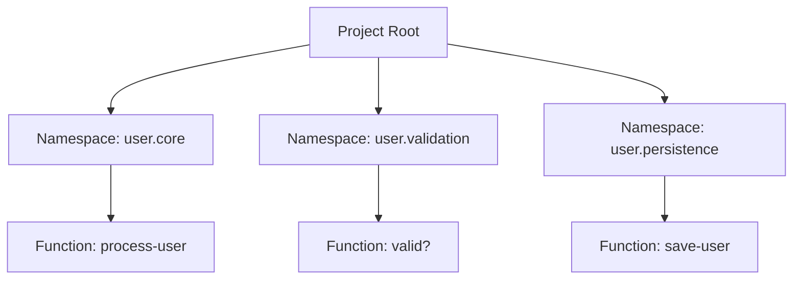

## 20.2 Organizing Functional Projects Effectively

As experienced Java developers transitioning to Clojure, understanding how to organize your projects effectively is crucial for building scalable and maintainable applications. In this section, we will explore key principles and practices that will help you structure your Clojure projects efficiently. We will cover modular design, separation of concerns, namespace organization, and dependency management. By the end of this guide, you will be equipped with the knowledge to create well-organized Clojure applications that leverage the power of functional programming.

### Modular Design

Modular design is a cornerstone of effective project organization. It involves breaking down your code into smaller, reusable modules or libraries. This approach not only enhances code readability and maintainability but also promotes code reuse across different projects.

#### Benefits of Modular Design

- **Reusability**: Modules can be reused across different projects, reducing duplication and effort.
- **Maintainability**: Smaller, focused modules are easier to understand, test, and maintain.
- **Scalability**: Modular design supports scaling by allowing independent development and deployment of modules.

#### Implementing Modular Design in Clojure

In Clojure, modular design can be achieved by organizing your code into separate namespaces and libraries. Let's explore how to implement this in practice.

##### Creating a Clojure Library

To create a Clojure library, you can use the `lein new` command to generate a new project:

```bash
lein new lib my-library
```

This command creates a new library project with a predefined structure. You can then add your code to the `src` directory, organizing it into namespaces.

##### Example: Modular Design in Clojure

Consider a simple application that processes user data. We can break it down into modules such as `user.core`, `user.validation`, and `user.persistence`.

```clojure
;; src/user/core.clj
(ns user.core
  (:require [user.validation :as validation]
            [user.persistence :as persistence]))

(defn process-user [user-data]
  (when (validation/valid? user-data)
    (persistence/save-user user-data)))
```

```clojure
;; src/user/validation.clj
(ns user.validation)

(defn valid? [user-data]
  ;; Validate user data
  true)
```

```clojure
;; src/user/persistence.clj
(ns user.persistence)

(defn save-user [user-data]
  ;; Save user data to the database
  (println "User saved:" user-data))
```

In this example, each module has a specific responsibility, making the codebase easier to manage and extend.

#### Try It Yourself

Experiment with modular design by creating a new Clojure project and organizing your code into separate namespaces. Try adding a new module for logging or error handling.

### Separation of Concerns

Separation of concerns is a design principle that advocates for separating different aspects of a program, such as business logic, data access, and user interface. This separation enhances code clarity and reduces coupling between components.

#### Applying Separation of Concerns in Clojure

In Clojure, separation of concerns can be achieved by organizing your code into distinct namespaces and using protocols or multimethods to define interfaces between components.

##### Example: Separation of Concerns

Let's extend our user processing example by separating the business logic from the infrastructure code.

```clojure
;; src/user/business.clj
(ns user.business
  (:require [user.validation :as validation]
            [user.persistence :as persistence]))

(defn process-user [user-data]
  (when (validation/valid? user-data)
    (persistence/save-user user-data)))
```

```clojure
;; src/user/infrastructure.clj
(ns user.infrastructure)

(defn connect-to-db []
  ;; Connect to the database
  (println "Connected to database"))
```

In this example, the `user.business` namespace focuses on business logic, while `user.infrastructure` handles infrastructure-related tasks.

#### Benefits of Separation of Concerns

- **Improved Readability**: Code is easier to read and understand when concerns are separated.
- **Enhanced Testability**: Isolated components can be tested independently.
- **Reduced Coupling**: Changes in one component have minimal impact on others.

#### Try It Yourself

Refactor an existing Clojure project to separate business logic from infrastructure code. Consider using protocols to define interfaces between components.

### Namespace Organization

Namespaces in Clojure are a powerful tool for organizing code. They allow you to group related functions and data structures, making your codebase more manageable.

#### Best Practices for Namespace Organization

- **Logical Grouping**: Organize namespaces based on functionality or domain.
- **Consistent Naming**: Use consistent naming conventions for namespaces.
- **Avoid Long Names**: Keep namespace names concise and descriptive.

##### Example: Namespace Organization

Let's revisit our user processing example and organize the namespaces logically.

```clojure
;; src/user/core.clj
(ns user.core
  (:require [user.validation :as validation]
            [user.persistence :as persistence]))

(defn process-user [user-data]
  (when (validation/valid? user-data)
    (persistence/save-user user-data)))
```

```clojure
;; src/user/validation.clj
(ns user.validation)

(defn valid? [user-data]
  ;; Validate user data
  true)
```

```clojure
;; src/user/persistence.clj
(ns user.persistence)

(defn save-user [user-data]
  ;; Save user data to the database
  (println "User saved:" user-data))
```

In this example, each namespace is named based on its functionality, making it easy to locate and understand the code.

#### Try It Yourself

Review your current Clojure projects and reorganize the namespaces for better clarity and maintainability. Consider using aliases for commonly used namespaces.

### Dependency Management

Effective dependency management is crucial for maintaining a stable and reliable codebase. In Clojure, tools like Leiningen and deps.edn are commonly used for managing dependencies.

#### Using Leiningen for Dependency Management

Leiningen is a popular build tool for Clojure that simplifies dependency management. You can specify dependencies in the `project.clj` file.

```clojure
(defproject my-project "0.1.0-SNAPSHOT"
  :dependencies [[org.clojure/clojure "1.10.3"]
                 [cheshire "5.10.0"]])
```

#### Using deps.edn for Dependency Management

The `deps.edn` file is an alternative to `project.clj` that provides a more flexible way to manage dependencies.

```clojure
{:deps {org.clojure/clojure {:mvn/version "1.10.3"}
        cheshire {:mvn/version "5.10.0"}}}
```

#### Avoiding Version Conflicts

To avoid version conflicts, it's important to:

- **Use Specific Versions**: Specify exact versions of dependencies.
- **Check for Conflicts**: Use tools like `lein deps :tree` to check for dependency conflicts.
- **Update Regularly**: Keep dependencies up to date to benefit from bug fixes and improvements.

#### Try It Yourself

Set up a new Clojure project using Leiningen or deps.edn and experiment with adding and managing dependencies. Check for conflicts and resolve them.

### Visual Aids

To enhance your understanding of these concepts, let's use a Mermaid.js diagram to illustrate the organization of a Clojure project.



**Diagram Description:** This diagram illustrates the organization of a Clojure project with three namespaces: `user.core`, `user.validation`, and `user.persistence`. Each namespace contains specific functions related to its responsibility.

### Knowledge Check

To reinforce your understanding, let's pose some questions and challenges.

- **Question:** What are the benefits of modular design in Clojure?
- **Challenge:** Refactor an existing Java project to a modular Clojure project, organizing code into namespaces.

### Summary

In this section, we've explored how to organize functional projects effectively in Clojure. By leveraging modular design, separation of concerns, and efficient namespace organization, you can create scalable and maintainable applications. Effective dependency management ensures a stable codebase, allowing you to focus on building great software.

Now that we've covered these best practices, let's move on to the next section, where we'll explore documentation strategies for functional code.

## Quiz: Mastering Project Organization in Clojure



### What is a key benefit of modular design in Clojure?

- [x] Reusability of code across projects
- [ ] Increased code complexity
- [ ] Reduced code readability
- [ ] Dependency conflicts

> **Explanation:** Modular design promotes reusability by allowing code to be reused across different projects, reducing duplication and effort.

### How can separation of concerns improve code maintainability?

- [x] By isolating different aspects of a program
- [ ] By increasing code coupling
- [ ] By mixing business logic with infrastructure code
- [ ] By using global variables

> **Explanation:** Separation of concerns isolates different aspects of a program, such as business logic and infrastructure code, improving readability and maintainability.

### What is a best practice for namespace organization in Clojure?

- [x] Logical grouping based on functionality
- [ ] Using long and complex names
- [ ] Mixing unrelated functions in a single namespace
- [ ] Avoiding the use of namespaces

> **Explanation:** Logical grouping based on functionality helps organize code into manageable units, making it easier to locate and understand.

### Which tool is commonly used for dependency management in Clojure?

- [x] Leiningen
- [ ] Maven
- [ ] Gradle
- [ ] Ant

> **Explanation:** Leiningen is a popular build tool for Clojure that simplifies dependency management and project setup.

### How can you avoid version conflicts in Clojure projects?

- [x] Use specific versions of dependencies
- [ ] Use the latest version of all dependencies
- [ ] Ignore dependency conflicts
- [ ] Use global variables

> **Explanation:** Specifying exact versions of dependencies helps avoid conflicts and ensures compatibility.

### What is the purpose of the `deps.edn` file in Clojure?

- [x] To manage dependencies flexibly
- [ ] To compile Java code
- [ ] To define global variables
- [ ] To store user data

> **Explanation:** The `deps.edn` file provides a flexible way to manage dependencies in Clojure projects.

### What is a benefit of using protocols in Clojure?

- [x] Defining interfaces between components
- [ ] Increasing code complexity
- [ ] Mixing unrelated functions
- [ ] Avoiding the use of namespaces

> **Explanation:** Protocols define interfaces between components, promoting separation of concerns and modular design.

### How can you check for dependency conflicts in a Clojure project?

- [x] Use `lein deps :tree`
- [ ] Use global variables
- [ ] Ignore dependency versions
- [ ] Use the latest version of all dependencies

> **Explanation:** The `lein deps :tree` command helps identify dependency conflicts in a Clojure project.

### What is the role of the `project.clj` file in Leiningen?

- [x] To specify project dependencies and settings
- [ ] To compile Java code
- [ ] To store user data
- [ ] To define global variables

> **Explanation:** The `project.clj` file specifies project dependencies and settings in a Leiningen-managed Clojure project.

### True or False: Modular design increases code complexity.

- [ ] True
- [x] False

> **Explanation:** Modular design reduces code complexity by breaking down code into smaller, manageable modules, enhancing readability and maintainability.


