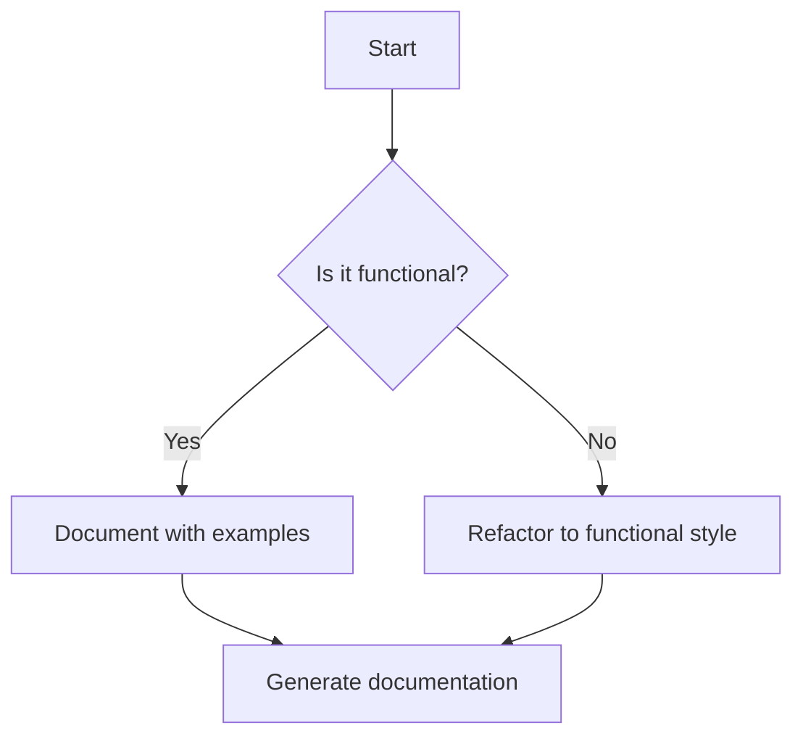

## 20.3 Documentation Strategies for Functional Code

In the realm of functional programming, particularly when working with Clojure, effective documentation is crucial for maintaining clarity and facilitating collaboration. As experienced Java developers transition to Clojure, understanding how to document functional code effectively becomes essential. This section delves into strategies for creating clear, comprehensive documentation, focusing on self-documenting code, the use of annotations, example-driven documentation, and automatic documentation generation.

### Self-Documenting Code

Self-documenting code is a concept that emphasizes writing code that is inherently understandable without requiring extensive external documentation. This approach is particularly beneficial in functional programming, where the emphasis is on pure functions and immutability.

#### Key Principles of Self-Documenting Code

1. **Descriptive Naming**: Use meaningful names for functions, variables, and data structures. In Clojure, this means leveraging its expressive syntax to create names that convey intent.

   ```clojure
   ;; Clojure Example
   (defn calculate-total-price
     "Calculates the total price including tax."
     [price tax-rate]
     (+ price (* price tax-rate)))
   ```

   ```java
   // Java Example
   public double calculateTotalPrice(double price, double taxRate) {
       return price + (price * taxRate);
   }
   ```

2. **Function Decomposition**: Break down complex functions into smaller, more manageable pieces. This not only enhances readability but also aligns with the functional programming paradigm of composing simple functions.

3. **Avoiding Side Effects**: Write pure functions that do not alter state or rely on external variables. This makes the code easier to understand and predict.

4. **Consistent Formatting**: Maintain a consistent style throughout the codebase. This includes indentation, spacing, and line length, which can be enforced using tools like `cljfmt` for Clojure.

#### Benefits of Self-Documenting Code

- **Reduced Need for Comments**: When code is clear and concise, the need for additional comments diminishes.
- **Easier Maintenance**: Code that is easy to read is also easier to maintain and refactor.
- **Improved Collaboration**: Team members can quickly understand and contribute to the codebase.

### Use of Annotations

Annotations in Clojure can serve as a powerful tool for enhancing code documentation. They provide metadata that can be used by both developers and tools to understand and process code more effectively.

#### Adding Metadata with Annotations

Clojure supports metadata, which can be attached to various constructs such as functions, variables, and collections. This metadata can include information about the purpose, usage, and constraints of the code.

```clojure
(def ^:private ^{:doc "Calculates the factorial of a number."} factorial
  (fn [n]
    (reduce * (range 1 (inc n)))))
```

In this example, metadata is used to document the purpose of the `factorial` function. The `^:private` annotation indicates that the function is intended for internal use only.

#### Benefits of Annotations

- **Enhanced Tooling**: Tools can leverage annotations to provide insights and warnings, such as identifying deprecated functions or suggesting optimizations.
- **Improved Code Navigation**: Annotations can help developers quickly locate relevant information about code constructs.
- **Facilitated Code Analysis**: Annotations can be used to generate reports and documentation automatically.

### Example-Driven Documentation

Example-driven documentation involves providing concrete examples of how to use functions and data structures. This approach is particularly effective in functional programming, where the behavior of functions is often best understood through examples.

#### Including Usage Examples

1. **Inline Examples**: Include examples directly within the code comments or documentation strings.

   ```clojure
   (defn add-numbers
     "Adds two numbers together.
     Example:
     (add-numbers 3 5) ;=> 8"
     [a b]
     (+ a b))
   ```

2. **Separate Example Files**: Maintain a separate file or section in the documentation dedicated to examples. This can be particularly useful for complex functions or libraries.

3. **Interactive Examples**: Use tools like the Clojure REPL to provide interactive examples that users can experiment with.

#### Benefits of Example-Driven Documentation

- **Clarifies Function Behavior**: Examples provide a clear illustration of how functions are intended to be used.
- **Facilitates Learning**: New developers can quickly grasp the functionality of code through examples.
- **Encourages Experimentation**: Examples can inspire developers to explore and modify code to suit their needs.

### Automatic Documentation Generation

Automatic documentation generation tools can significantly streamline the process of creating and maintaining documentation. These tools extract information from code comments and annotations to produce comprehensive documentation.

#### Tools for Automatic Documentation Generation

1. **Codox**: A popular tool for generating API documentation from Clojure source code. Codox parses docstrings and metadata to create HTML documentation.

   - **Installation**: Add Codox to your `project.clj` dependencies.
   - **Usage**: Run Codox to generate documentation from your codebase.

2. **Marginalia**: A tool that generates literate programming-style documentation from Clojure source files. It combines code and comments to produce a cohesive narrative.

   - **Installation**: Include Marginalia in your project dependencies.
   - **Usage**: Use Marginalia to generate documentation that integrates code and commentary.

3. **Leiningen Plugins**: Utilize Leiningen plugins to automate documentation generation as part of your build process.

#### Benefits of Automatic Documentation Generation

- **Consistency**: Automatically generated documentation ensures consistency across the codebase.
- **Efficiency**: Reduces the manual effort required to create and update documentation.
- **Up-to-Date Information**: Documentation is always in sync with the code, reducing the risk of outdated information.

### Visual Aids

Incorporating visual aids such as diagrams, tables, and charts can enhance the understanding of complex concepts in functional programming. These aids can be particularly useful for illustrating data flow, function composition, and concurrency models.

#### Using Mermaid.js for Diagrams

Mermaid.js is a powerful tool for creating diagrams in Markdown, compatible with Hugo rendering. It supports various diagram types, including flowcharts, sequence diagrams, and class diagrams.



**Diagram Description**: This flowchart illustrates the process of documenting functional code, starting with assessing whether the code is functional and proceeding to documentation and refactoring as needed.

### References and Links

Providing links to reputable external resources can supplement explanations and offer deeper insights into topics. Here are some valuable resources for further reading:

- [Official Clojure Documentation](https://clojure.org/documentation)
- [ClojureDocs](https://clojuredocs.org/)
- [Clojure GitHub Repository](https://github.com/clojure/clojure)

### Knowledge Check

To reinforce learning, pose questions or small challenges within the text. For example:

- **Question**: How can annotations enhance the documentation of a Clojure function?
- **Challenge**: Refactor a Java method to a Clojure function and document it using self-documenting code principles.

### Encouraging Tone

Maintaining an encouraging and supportive tone throughout the content is crucial. Encourage readers to apply what they've learned and explore new concepts. For example:

"Now that we've explored how to document functional code effectively, let's apply these strategies to enhance the clarity and maintainability of your Clojure projects."

### Best Practices for Tags

Use specific and relevant tags to reflect the article's content. For this section, consider tags such as "Clojure", "Functional Programming", "Documentation", "Self-Documenting Code", "Annotations", "Example-Driven Documentation", "Automatic Documentation", and "Java Interoperability".

---

## Quiz: Mastering Documentation Strategies for Functional Code



### What is a key principle of self-documenting code?

- [x] Descriptive Naming
- [ ] Extensive Comments
- [ ] Complex Logic
- [ ] Obfuscation

> **Explanation:** Descriptive naming helps make code self-explanatory, reducing the need for extensive comments.


### How can annotations enhance Clojure code?

- [x] By providing metadata
- [ ] By increasing execution speed
- [ ] By reducing code size
- [ ] By adding side effects

> **Explanation:** Annotations provide metadata that can be used for documentation and tooling.


### What is the benefit of example-driven documentation?

- [x] Clarifies function behavior
- [ ] Increases code complexity
- [ ] Obfuscates code logic
- [ ] Reduces code readability

> **Explanation:** Example-driven documentation clarifies how functions are intended to be used.


### Which tool is used for automatic documentation generation in Clojure?

- [x] Codox
- [ ] Javadoc
- [ ] Doxygen
- [ ] Swagger

> **Explanation:** Codox is a tool for generating API documentation from Clojure source code.


### What is the purpose of using Mermaid.js in documentation?

- [x] To create diagrams
- [ ] To write code
- [ ] To compile Clojure
- [ ] To manage dependencies

> **Explanation:** Mermaid.js is used to create diagrams in Markdown, enhancing documentation.


### What is a benefit of self-documenting code?

- [x] Easier Maintenance
- [ ] Increased Complexity
- [ ] More Comments
- [ ] Longer Code

> **Explanation:** Self-documenting code is easier to maintain and understand.


### How does automatic documentation generation benefit developers?

- [x] Ensures consistency
- [ ] Increases manual effort
- [ ] Requires extensive comments
- [ ] Obfuscates code

> **Explanation:** Automatic documentation generation ensures consistency and reduces manual effort.


### What is a key feature of example-driven documentation?

- [x] Provides usage examples
- [ ] Increases code size
- [ ] Reduces readability
- [ ] Obfuscates logic

> **Explanation:** Example-driven documentation provides usage examples to clarify function behavior.


### Which of the following is a tool for generating literate programming-style documentation in Clojure?

- [x] Marginalia
- [ ] Javadoc
- [ ] Doxygen
- [ ] Swagger

> **Explanation:** Marginalia generates literate programming-style documentation from Clojure source files.


### True or False: Annotations can be used to generate reports and documentation automatically.

- [x] True
- [ ] False

> **Explanation:** Annotations can be used to generate reports and documentation automatically, enhancing code analysis.



By implementing these documentation strategies, you can enhance the clarity, maintainability, and collaboration potential of your Clojure projects. Embrace these practices to create a robust and well-documented codebase that stands the test of time.
