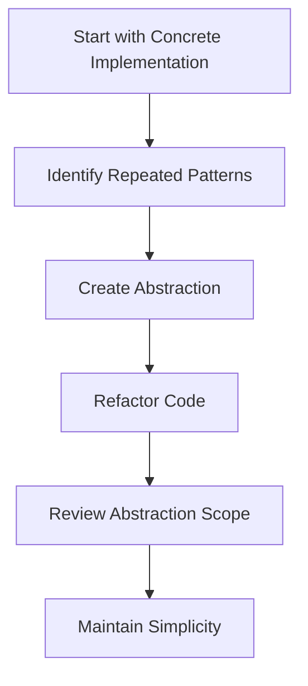
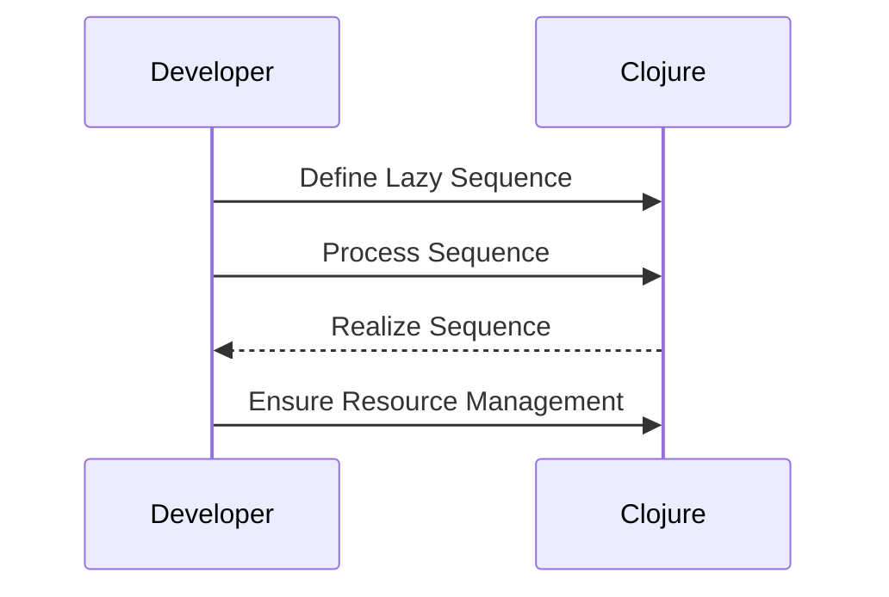

## 20.4 Common Pitfalls and How to Avoid Them

As experienced Java developers transitioning to Clojure, it's essential to be aware of common pitfalls that can arise when adopting functional programming paradigms. In this section, we will explore these pitfalls and provide strategies to avoid them, ensuring you build efficient, scalable applications.

### Over-Abstracting

**Explain the Pitfall:** Over-abstraction occurs when developers create abstractions that are too general or unnecessary, leading to complex and hard-to-maintain code. While abstraction is a powerful tool in programming, it can become a hindrance if not used judiciously.

**Java vs. Clojure:** In Java, abstraction often involves creating interfaces and abstract classes. In Clojure, abstraction can manifest through higher-order functions, macros, and protocols. While these tools are powerful, they should be used with care.

**Avoiding Over-Abstracting:**

- **Keep it Simple:** Start with concrete implementations and abstract only when necessary. Ensure that abstractions solve a real problem and simplify the codebase.
- **Use Descriptive Names:** Ensure that abstractions are well-named to convey their purpose clearly.
- **Limit the Scope:** Avoid creating abstractions that try to solve every possible problem. Focus on specific use cases.
- **Refactor Incrementally:** As your understanding of the problem domain grows, refactor your code to introduce abstractions gradually.

**Clojure Example:**

```clojure
;; Avoid over-abstraction by starting with a simple function
(defn calculate-discount [price discount-rate]
  (* price (- 1 discount-rate)))

;; Abstract only when necessary
(defn apply-discount [price discount-fn]
  (discount-fn price))

;; Use a specific discount function
(defn seasonal-discount [price]
  (calculate-discount price 0.10))

;; Usage
(apply-discount 100 seasonal-discount) ; => 90.0
```

**Try It Yourself:** Modify the `apply-discount` function to accept a list of discount functions and apply them sequentially. Consider the trade-offs of this abstraction.

### Ignoring Lazy Evaluation Traps

**Explain the Pitfall:** Lazy evaluation is a powerful feature in Clojure that allows for efficient data processing. However, it can lead to unintended retention of resources, such as open files or database connections, if not handled properly.

**Java vs. Clojure:** Java developers are accustomed to eager evaluation, where expressions are evaluated as soon as they are encountered. In Clojure, lazy sequences are evaluated only when needed, which can lead to subtle bugs if not managed correctly.

**Avoiding Lazy Evaluation Traps:**

- **Realize Sequences Early:** Use functions like `doall` or `dorun` to force the realization of lazy sequences when side effects are involved.
- **Be Mindful of Resource Management:** Ensure that resources are properly managed and released, even when using lazy sequences.
- **Test for Laziness:** Write tests to ensure that lazy sequences behave as expected, especially in edge cases.

**Clojure Example:**

```clojure
;; Lazy sequence example
(defn read-lines [filename]
  (with-open [rdr (clojure.java.io/reader filename)]
    (line-seq rdr)))

;; Potential trap: forgetting to realize the sequence
(defn process-file [filename]
  (let [lines (read-lines filename)]
    (map println lines))) ; This may not print anything if not realized

;; Correct approach: realize the sequence
(defn process-file-correctly [filename]
  (let [lines (doall (read-lines filename))]
    (map println lines))) ; Forces realization
```

**Try It Yourself:** Experiment with lazy sequences by creating a sequence of numbers and applying transformations. Use `doall` to realize the sequence and observe the difference in behavior.

### Inefficient Data Processing

**Explain the Pitfall:** Choosing the wrong data structures or algorithms can lead to inefficient data processing, impacting the performance and scalability of your application.

**Java vs. Clojure:** Java developers often rely on mutable data structures and imperative loops. In Clojure, immutable data structures and functional transformations are preferred, which require a different mindset.

**Avoiding Inefficient Data Processing:**

- **Choose the Right Data Structures:** Understand the performance characteristics of Clojure's persistent data structures, such as vectors, maps, and sets.
- **Leverage Built-in Functions:** Use Clojure's rich set of built-in functions for data manipulation, such as `map`, `filter`, and `reduce`.
- **Optimize with Transducers:** Use transducers for efficient data processing pipelines that avoid intermediate collections.

**Clojure Example:**

```clojure
;; Inefficient approach: using intermediate collections
(defn process-data [data]
  (->> data
       (map inc)
       (filter even?)
       (reduce +)))

;; Efficient approach: using transducers
(defn process-data-efficiently [data]
  (transduce (comp (map inc) (filter even?)) + data))

;; Usage
(process-data [1 2 3 4 5]) ; => 12
(process-data-efficiently [1 2 3 4 5]) ; => 12
```

**Try It Yourself:** Implement a data processing pipeline using transducers and compare its performance with a traditional approach using intermediate collections.

### Not Embracing the Functional Paradigm

**Explain the Pitfall:** Mixing functional and imperative paradigms can lead to code that is difficult to understand and maintain. Embracing the functional paradigm fully can lead to cleaner, more predictable code.

**Java vs. Clojure:** Java developers may be tempted to use mutable state and imperative loops in Clojure. However, Clojure encourages immutability and functional transformations.

**Avoiding the Pitfall:**

- **Adopt Immutability:** Use immutable data structures and avoid mutable state.
- **Favor Pure Functions:** Write functions that have no side effects and depend only on their inputs.
- **Use Higher-Order Functions:** Leverage higher-order functions to create reusable and composable code.

**Clojure Example:**

```clojure
;; Imperative approach: using mutable state
(defn sum-imperative [numbers]
  (let [sum (atom 0)]
    (doseq [n numbers]
      (swap! sum + n))
    @sum))

;; Functional approach: using reduce
(defn sum-functional [numbers]
  (reduce + numbers))

;; Usage
(sum-imperative [1 2 3 4 5]) ; => 15
(sum-functional [1 2 3 4 5]) ; => 15
```

**Try It Yourself:** Refactor an imperative Java loop into a functional Clojure solution using `reduce` or other higher-order functions.

### Visual Aids

To enhance understanding, let's incorporate some visual aids using Mermaid.js diagrams.

#### Over-Abstracting Flowchart



**Caption:** This flowchart illustrates the process of creating abstractions in a controlled manner, ensuring they are necessary and beneficial.

#### Lazy Evaluation Sequence Diagram



**Caption:** This sequence diagram shows the interaction between a developer and Clojure when working with lazy sequences, emphasizing the importance of realizing sequences and managing resources.

### References and Links

- [Official Clojure Documentation](https://clojure.org/reference)
- [ClojureDocs](https://clojuredocs.org/)
- [GitHub - Clojure](https://github.com/clojure/clojure)

### Knowledge Check

- **What is over-abstraction, and how can it be avoided?**
- **How does lazy evaluation differ from eager evaluation, and what are the potential pitfalls?**
- **Why is it important to choose the right data structures in Clojure?**
- **What are the benefits of fully embracing the functional paradigm in Clojure?**

### Exercises

1. **Refactor a Java Loop:** Take a simple Java loop and refactor it into a functional Clojure solution using `reduce`.
2. **Experiment with Lazy Sequences:** Create a lazy sequence in Clojure and explore its behavior by realizing it at different points in your code.
3. **Optimize a Data Processing Pipeline:** Implement a data processing pipeline using transducers and compare its performance with a traditional approach.

### Summary

In this section, we've explored common pitfalls in functional programming with Clojure and provided strategies to avoid them. By understanding and addressing these pitfalls, you can build efficient, scalable applications that fully leverage the power of Clojure's functional paradigm.

## Quiz: Avoiding Common Pitfalls in Functional Programming with Clojure



### What is a common pitfall when creating abstractions in Clojure?

- [x] Over-abstraction
- [ ] Under-abstraction
- [ ] No abstraction
- [ ] Incorrect abstraction

> **Explanation:** Over-abstraction occurs when developers create abstractions that are too general or unnecessary, leading to complex and hard-to-maintain code.

### How can you avoid lazy evaluation traps in Clojure?

- [x] Realize sequences early
- [ ] Use mutable data structures
- [ ] Avoid using sequences
- [ ] Use imperative loops

> **Explanation:** Realizing sequences early with functions like `doall` or `dorun` ensures that resources are properly managed and released.

### What is the benefit of using transducers in Clojure?

- [x] Efficient data processing
- [ ] Increased code complexity
- [ ] Reduced readability
- [ ] Slower performance

> **Explanation:** Transducers provide efficient data processing pipelines by avoiding intermediate collections, leading to better performance.

### Why is it important to embrace the functional paradigm in Clojure?

- [x] To create cleaner, more predictable code
- [ ] To use mutable state
- [ ] To mix paradigms
- [ ] To avoid using functions

> **Explanation:** Embracing the functional paradigm leads to cleaner, more predictable code by avoiding mutable state and side effects.

### Which function can be used to force the realization of a lazy sequence?

- [x] `doall`
- [ ] `map`
- [ ] `filter`
- [ ] `reduce`

> **Explanation:** `doall` forces the realization of a lazy sequence, ensuring that all elements are evaluated.

### What is a key characteristic of Clojure's data structures?

- [x] Immutability
- [ ] Mutability
- [ ] Complexity
- [ ] Simplicity

> **Explanation:** Clojure's data structures are immutable, meaning they cannot be changed after creation, which is a key aspect of functional programming.

### How can you refactor an imperative loop into a functional solution in Clojure?

- [x] Use `reduce`
- [ ] Use `for` loop
- [ ] Use `while` loop
- [ ] Use `if` statement

> **Explanation:** `reduce` is a higher-order function that can be used to refactor imperative loops into functional solutions.

### What is a potential issue with mixing functional and imperative paradigms?

- [x] Difficult to understand and maintain code
- [ ] Improved performance
- [ ] Increased readability
- [ ] Simplified logic

> **Explanation:** Mixing paradigms can lead to code that is difficult to understand and maintain, as it combines different programming styles.

### Which of the following is a higher-order function in Clojure?

- [x] `map`
- [ ] `println`
- [ ] `def`
- [ ] `let`

> **Explanation:** `map` is a higher-order function that takes a function and a collection as arguments and applies the function to each element of the collection.

### True or False: Clojure encourages the use of mutable state.

- [ ] True
- [x] False

> **Explanation:** False. Clojure encourages the use of immutable data structures and functional transformations, avoiding mutable state.


