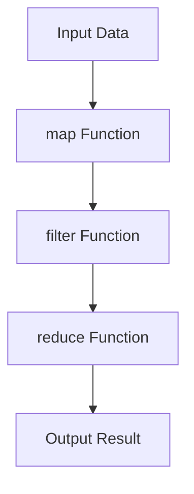
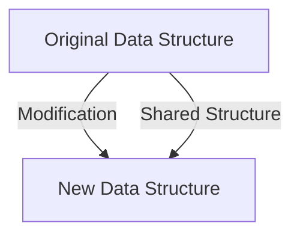
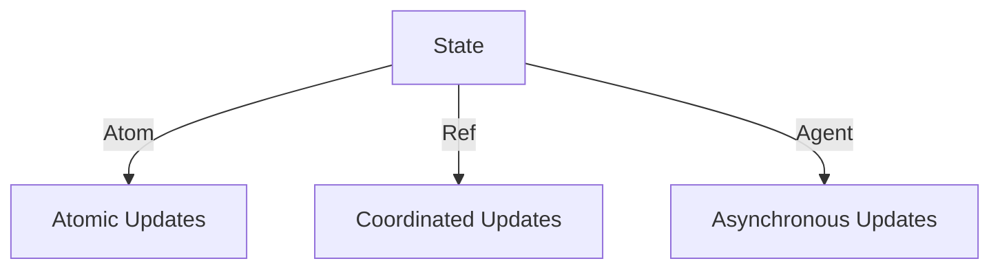

## 20.6 Environmental Awareness in Functional Applications

In today's world, where environmental sustainability is becoming increasingly important, software developers have a unique opportunity to contribute positively by writing environmentally conscious code. As experienced Java developers transitioning to Clojure, you can leverage functional programming paradigms to create applications that are not only efficient but also environmentally friendly. In this section, we will explore how to optimize resource usage, choose green hosting options, measure the environmental impact of your applications, and promote sustainable practices throughout the software development lifecycle.

### Optimizing Resource Usage

#### Efficient Code for Reduced Energy Consumption

Writing efficient code is a fundamental aspect of reducing energy consumption in software applications. In functional programming, and particularly in Clojure, you can achieve this through several key practices:

1. **Immutability and Persistent Data Structures**: Clojure's immutable data structures are designed to minimize memory usage and enhance performance. By avoiding mutable state, you reduce the overhead associated with state changes, leading to more predictable and efficient code execution.

   ```clojure
   ;; Example of using a persistent vector in Clojure
   (def numbers [1 2 3 4 5])

   ;; Adding an element to the vector
   (def updated-numbers (conj numbers 6))

   ;; Original vector remains unchanged
   (println numbers) ; Output: [1 2 3 4 5]
   (println updated-numbers) ; Output: [1 2 3 4 5 6]
   ```

2. **Lazy Evaluation**: Clojure's lazy sequences allow you to process data only when needed, reducing unnecessary computations and memory usage. This is particularly useful when dealing with large datasets or streams of data.

   ```clojure
   ;; Example of lazy evaluation with a sequence
   (def lazy-seq (map inc (range 1000000)))

   ;; Only the first 10 elements are realized
   (println (take 10 lazy-seq)) ; Output: (1 2 3 4 5 6 7 8 9 10)
   ```

3. **Concurrency and Parallelism**: Utilize Clojure's concurrency primitives, such as atoms, refs, and agents, to efficiently manage state and perform parallel computations. This can lead to better CPU utilization and reduced execution time.

   ```clojure
   ;; Example of using an agent for asynchronous computation
   (def counter (agent 0))

   ;; Increment the counter asynchronously
   (send counter inc)

   ;; Wait for the agent to complete
   (await counter)

   (println @counter) ; Output: 1
   ```

4. **Algorithmic Efficiency**: Choose algorithms that are efficient in terms of time and space complexity. Functional programming encourages the use of higher-order functions and recursion, which can lead to more concise and efficient algorithms.

   ```clojure
   ;; Example of using reduce for efficient summation
   (defn sum [numbers]
     (reduce + numbers))

   (println (sum [1 2 3 4 5])) ; Output: 15
   ```

#### Green Hosting Options

Choosing a hosting provider that prioritizes renewable energy sources is a crucial step in reducing the carbon footprint of your applications. Here are some options to consider:

- **Google Cloud Platform (GCP)**: GCP is committed to operating on 100% renewable energy and offers a range of tools to help you monitor and optimize your application's energy usage.

- **Amazon Web Services (AWS) Green Energy Initiatives**: AWS has a long-term commitment to achieving 100% renewable energy usage and provides resources to help you build sustainable applications.

- **Microsoft Azure**: Azure is working towards becoming carbon negative by 2030 and offers various sustainability tools and services.

- **DigitalOcean**: Known for its simplicity and developer-friendly approach, DigitalOcean is also committed to sustainability and offers green hosting options.

When selecting a hosting provider, consider their energy policies, data center locations, and the availability of tools for monitoring and optimizing energy usage.

#### Measuring Impact

To effectively reduce the environmental impact of your applications, it's essential to measure and monitor their energy consumption and carbon footprint. Here are some tools and techniques to help you achieve this:

1. **Carbon Footprint Calculators**: Use tools like the Green Software Foundation's Carbon Aware SDK to estimate the carbon emissions of your applications based on their energy usage.

2. **Performance Monitoring Tools**: Leverage tools like New Relic, Datadog, or Prometheus to monitor your application's performance and resource usage. These tools can help you identify areas where optimizations can lead to reduced energy consumption.

3. **Energy Profiling**: Conduct energy profiling of your applications to understand their power consumption patterns. Tools like Intel's Power Gadget or AMD's uProf can provide insights into CPU and GPU energy usage.

4. **Code Analysis Tools**: Use static and dynamic code analysis tools to identify inefficient code patterns that may lead to increased energy consumption. Tools like SonarQube or CodeClimate can help you maintain efficient and sustainable codebases.

#### Promotion of Sustainable Practices

Promoting sustainable practices in software development involves considering the environmental impact at every stage of the development lifecycle. Here are some strategies to achieve this:

1. **Sustainable Design Principles**: Incorporate sustainable design principles into your application architecture. This includes designing for scalability, modularity, and reusability, which can lead to more efficient resource usage.

2. **Continuous Integration and Deployment (CI/CD)**: Implement CI/CD pipelines that are optimized for energy efficiency. This includes minimizing build times, reducing unnecessary test executions, and using energy-efficient infrastructure.

3. **Code Reviews and Pair Programming**: Encourage code reviews and pair programming to identify and address inefficient code patterns early in the development process. This collaborative approach can lead to more sustainable codebases.

4. **Education and Awareness**: Foster a culture of environmental awareness within your development team. Provide training and resources on sustainable software development practices and encourage team members to consider the environmental impact of their work.

5. **Community Engagement**: Engage with the broader software development community to share knowledge and best practices on sustainable development. Participate in forums, conferences, and open-source projects that focus on environmental sustainability.

### Visual Aids

To enhance your understanding of these concepts, let's explore some visual aids that illustrate the flow of data through higher-order functions, the benefits of immutability, and concurrency models in Clojure.

#### Data Flow Through Higher-Order Functions



*Caption: This diagram illustrates the flow of data through a series of higher-order functions in Clojure, demonstrating how data is transformed and processed efficiently.*

#### Immutability and Persistent Data Structures



*Caption: This diagram shows how Clojure's persistent data structures share structure between the original and modified versions, reducing memory usage and enhancing performance.*

#### Concurrency Models in Clojure



*Caption: This diagram depicts the different concurrency models in Clojure, highlighting how atoms, refs, and agents manage state changes efficiently.*

### References and Links

For further reading and exploration of the topics covered in this section, consider the following resources:

- [Official Clojure Documentation](https://clojure.org/)
- [Green Software Foundation](https://greensoftware.foundation/)
- [Intel Power Gadget](https://software.intel.com/content/www/us/en/develop/articles/intel-power-gadget.html)
- [AWS Sustainability](https://aws.amazon.com/sustainability/)
- [Google Cloud Sustainability](https://cloud.google.com/sustainability)

### Knowledge Check

To reinforce your understanding of the concepts covered in this section, consider the following questions and exercises:

- **Question**: How does lazy evaluation contribute to reduced energy consumption in Clojure applications?
- **Exercise**: Implement a Clojure function that processes a large dataset using lazy sequences and measure its memory usage compared to a non-lazy implementation.
- **Question**: What are the benefits of using persistent data structures in terms of environmental impact?
- **Exercise**: Choose a hosting provider that prioritizes renewable energy and deploy a simple Clojure application. Monitor its energy usage and carbon footprint.

### Encouraging Tone

Now that we've explored how to optimize resource usage and promote sustainable practices in functional applications, let's apply these concepts to create environmentally conscious software. By leveraging Clojure's functional programming paradigms, you can build applications that are not only efficient but also contribute positively to the environment.

### Quiz

## Environmental Awareness in Functional Applications Quiz



### How does immutability in Clojure contribute to environmental sustainability?

- [x] Reduces memory usage by sharing structure
- [ ] Increases CPU usage
- [ ] Requires more storage space
- [ ] Slows down application performance

> **Explanation:** Immutability in Clojure reduces memory usage by sharing structure between original and modified data, leading to more efficient resource usage.


### Which of the following is a benefit of lazy evaluation in Clojure?

- [x] Reduces unnecessary computations
- [ ] Increases memory usage
- [ ] Requires more CPU cycles
- [ ] Slows down data processing

> **Explanation:** Lazy evaluation reduces unnecessary computations by processing data only when needed, leading to more efficient resource usage.


### What is a key advantage of using higher-order functions in Clojure?

- [x] Enhances code reusability and efficiency
- [ ] Increases code complexity
- [ ] Requires more memory
- [ ] Slows down execution

> **Explanation:** Higher-order functions enhance code reusability and efficiency by allowing functions to be passed as arguments, leading to more concise and efficient code.


### Which hosting provider is known for its commitment to renewable energy?

- [x] Google Cloud Platform
- [ ] Traditional Data Centers
- [ ] Local Servers
- [ ] Personal Computers

> **Explanation:** Google Cloud Platform is committed to operating on 100% renewable energy, making it a sustainable choice for hosting applications.


### What tool can be used to estimate the carbon footprint of an application?

- [x] Carbon Aware SDK
- [ ] Java Development Kit
- [ ] Clojure Compiler
- [ ] Text Editor

> **Explanation:** The Carbon Aware SDK is a tool that can be used to estimate the carbon emissions of applications based on their energy usage.


### How can code reviews contribute to sustainable software development?

- [x] Identify inefficient code patterns early
- [ ] Increase development time
- [ ] Reduce code quality
- [ ] Slow down deployment

> **Explanation:** Code reviews help identify inefficient code patterns early in the development process, leading to more sustainable and efficient codebases.


### What is a benefit of using concurrency primitives in Clojure?

- [x] Efficiently manage state and perform parallel computations
- [ ] Increase memory usage
- [ ] Slow down application performance
- [ ] Require more CPU cycles

> **Explanation:** Concurrency primitives in Clojure, such as atoms, refs, and agents, efficiently manage state and perform parallel computations, leading to better CPU utilization and reduced execution time.


### Which of the following is a sustainable design principle?

- [x] Designing for scalability and reusability
- [ ] Increasing code complexity
- [ ] Using mutable state
- [ ] Ignoring environmental impact

> **Explanation:** Designing for scalability and reusability is a sustainable design principle that leads to more efficient resource usage and reduced environmental impact.


### What is the role of CI/CD in sustainable software development?

- [x] Optimize energy efficiency in build and deployment processes
- [ ] Increase build times
- [ ] Reduce code quality
- [ ] Slow down deployment

> **Explanation:** CI/CD pipelines optimized for energy efficiency minimize build times and reduce unnecessary test executions, contributing to sustainable software development.


### True or False: Engaging with the software development community can help promote sustainable practices.

- [x] True
- [ ] False

> **Explanation:** Engaging with the software development community can help share knowledge and best practices on sustainable development, promoting environmental awareness.



By integrating these practices into your development workflow, you can contribute to a more sustainable future while building efficient and scalable applications with Clojure.
