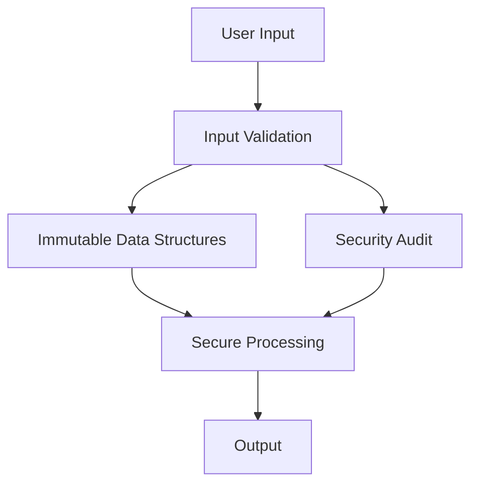

## 20.7 Writing Secure Functional Code

In this section, we will explore how to write secure functional code in Clojure, focusing on leveraging immutability, adopting secure defaults, validating inputs, and conducting regular security audits. As experienced Java developers transitioning to Clojure, you'll find that many of the security principles you are familiar with in Java apply here, but Clojure's functional nature offers unique advantages and challenges.

### Immutable Data for Security

**Immutability** is a cornerstone of functional programming and provides inherent security benefits. In Clojure, data structures are immutable by default, meaning once they are created, they cannot be altered. This immutability can prevent a range of security vulnerabilities, such as unintended data modification and race conditions.

#### Benefits of Immutability

1. **Prevention of Unintended Modifications**: Since data cannot be changed after creation, it eliminates the risk of accidental or malicious modifications.
   
2. **Thread Safety**: Immutable data structures are inherently thread-safe, reducing the risk of concurrency-related vulnerabilities.

3. **Predictability**: Immutable data ensures that functions behave predictably, as they cannot alter the state of the data they process.

#### Clojure vs. Java: Immutability

In Java, immutability is often achieved by using final classes and fields, or by creating defensive copies of objects. In contrast, Clojure's data structures are immutable by default, simplifying the process and reducing boilerplate code.

**Java Example:**

```java
public final class ImmutableUser {
    private final String name;
    private final int age;

    public ImmutableUser(String name, int age) {
        this.name = name;
        this.age = age;
    }

    public String getName() {
        return name;
    }

    public int getAge() {
        return age;
    }
}
```

**Clojure Example:**

```clojure
(def user {:name "Alice" :age 30})

;; Accessing data
(:name user) ;; => "Alice"
(:age user)  ;; => 30
```

In Clojure, the `user` map is immutable, and any "modification" results in a new map, leaving the original unchanged.

#### Try It Yourself

Experiment with Clojure's immutability by creating a map and attempting to modify it. Observe how Clojure handles these operations and how it ensures data integrity.

### Secure Defaults

Adopting **secure defaults** is crucial in application configurations to minimize vulnerabilities. Secure defaults mean configuring your application to be secure out of the box, without requiring additional user intervention.

#### Key Principles

1. **Least Privilege**: Configure your application to operate with the minimum permissions necessary.
   
2. **Fail-Safe Defaults**: Ensure that the default state of your application is secure, even in the event of a failure.

3. **Minimal Exposure**: Limit the exposure of sensitive information and services by default.

#### Implementing Secure Defaults in Clojure

In Clojure, you can leverage libraries and configurations to enforce secure defaults. For example, when setting up a web server, ensure that it only listens on necessary ports and uses secure protocols.

**Example:**

```clojure
(require '[ring.adapter.jetty :refer [run-jetty]])

(defn handler [request]
  {:status 200
   :headers {"Content-Type" "text/plain"}
   :body "Hello, Secure World!"})

(run-jetty handler {:port 8443 :ssl? true :ssl-port 8443})
```

In this example, the server is configured to use SSL by default, ensuring encrypted communication.

### Input Validation

**Input validation** is a critical security practice to prevent injection attacks and ensure data integrity. In Clojure, you can use libraries like `clojure.spec` to rigorously validate inputs.

#### Importance of Input Validation

1. **Prevent Injection Attacks**: Validate inputs to prevent SQL injection, command injection, and other similar attacks.
   
2. **Ensure Data Integrity**: Validate that inputs conform to expected formats and constraints.

3. **Enhance Application Stability**: Prevent invalid data from causing unexpected behavior or crashes.

#### Using `clojure.spec` for Validation

`clojure.spec` provides a powerful way to define and validate data structures. You can specify the shape and constraints of your data, and `clojure.spec` will ensure that inputs conform to these specifications.

**Example:**

```clojure
(require '[clojure.spec.alpha :as s])

(s/def ::name string?)
(s/def ::age (s/and int? #(>= % 0)))

(defn validate-user [user]
  (if (s/valid? ::user user)
    (println "Valid user!")
    (println "Invalid user!")))

(validate-user {:name "Alice" :age 30}) ;; Valid user!
(validate-user {:name "Alice" :age -1}) ;; Invalid user!
```

In this example, we define specifications for a user's name and age, ensuring that the age is a non-negative integer.

#### Try It Yourself

Create your own specifications using `clojure.spec` and validate different data structures. Experiment with different constraints and observe how `clojure.spec` enforces them.

### Regular Security Audits

Conducting **regular security audits** is essential to identify and mitigate potential vulnerabilities in your codebase. These audits should include code reviews, dependency checks, and security assessments.

#### Steps for Effective Security Audits

1. **Code Reviews**: Regularly review code for security vulnerabilities and adherence to best practices.
   
2. **Dependency Checks**: Monitor and update dependencies to address known vulnerabilities.

3. **Security Assessments**: Conduct thorough assessments to identify potential security risks.

#### Tools and Practices

- **Static Analysis Tools**: Use tools like `clj-kondo` to analyze your Clojure code for potential issues.
- **Dependency Management**: Use tools like `lein-nvd` to check for vulnerabilities in your dependencies.
- **Continuous Integration**: Integrate security checks into your CI/CD pipeline to ensure ongoing security compliance.

#### Try It Yourself

Set up a CI/CD pipeline with security checks for your Clojure project. Use tools like `clj-kondo` and `lein-nvd` to automate security audits and ensure your code remains secure.

### Visual Aids

To enhance your understanding of these concepts, let's visualize the flow of data through a secure Clojure application using a flowchart.



**Diagram Description**: This flowchart illustrates how user input is validated before being processed using immutable data structures. Regular security audits ensure that the processing remains secure, leading to a safe output.

### References and Links

- [Official Clojure Documentation](https://clojure.org/)
- [ClojureDocs](https://clojuredocs.org/)
- [clojure.spec Guide](https://clojure.org/guides/spec)
- [Ring Library for Web Development](https://github.com/ring-clojure/ring)

### Knowledge Check

Let's reinforce what we've learned with a few questions and exercises.

1. **What are the benefits of using immutable data structures in Clojure?**
2. **How can secure defaults enhance the security of your application?**
3. **Why is input validation crucial in preventing security vulnerabilities?**
4. **What tools can you use to conduct regular security audits in Clojure?**

### Exercises

1. **Create a secure Clojure web server** that validates user inputs and uses SSL by default.
2. **Define a `clojure.spec` specification** for a complex data structure and validate it against various inputs.
3. **Set up a CI/CD pipeline** with automated security checks for a Clojure project.

### Encouraging Tone

Now that we've explored how to write secure functional code in Clojure, let's apply these principles to build robust and safe applications. Remember, security is an ongoing process, and by leveraging Clojure's functional features, you can create applications that are both secure and efficient.

### Best Practices for Tags

- "Clojure"
- "Functional Programming"
- "Security"
- "Immutability"
- "Input Validation"
- "Secure Defaults"
- "Code Audits"
- "Java Interoperability"

---

## Secure Functional Programming Quiz: Test Your Knowledge



### What is a key benefit of using immutable data structures in Clojure?

- [x] They prevent unintended data modifications.
- [ ] They allow for faster data processing.
- [ ] They require less memory.
- [ ] They simplify syntax.

> **Explanation:** Immutable data structures prevent unintended modifications, enhancing security and predictability.

### How do secure defaults contribute to application security?

- [x] They ensure the application is secure out of the box.
- [ ] They increase application performance.
- [ ] They simplify user interfaces.
- [ ] They reduce code complexity.

> **Explanation:** Secure defaults ensure that applications are configured securely by default, minimizing vulnerabilities.

### Why is input validation important in Clojure applications?

- [x] It prevents injection attacks.
- [ ] It speeds up data processing.
- [ ] It reduces memory usage.
- [ ] It simplifies code.

> **Explanation:** Input validation is crucial for preventing injection attacks and ensuring data integrity.

### Which tool can be used for static analysis of Clojure code?

- [x] clj-kondo
- [ ] Leiningen
- [ ] Ring
- [ ] Compojure

> **Explanation:** `clj-kondo` is a static analysis tool for Clojure that helps identify potential issues in code.

### What is the purpose of regular security audits?

- [x] To identify and mitigate potential vulnerabilities.
- [ ] To improve application performance.
- [ ] To simplify code structure.
- [ ] To enhance user experience.

> **Explanation:** Regular security audits help identify and address potential vulnerabilities in the codebase.

### How can `clojure.spec` be used in Clojure applications?

- [x] For input validation.
- [ ] For database interactions.
- [ ] For web development.
- [ ] For UI design.

> **Explanation:** `clojure.spec` is used for defining and validating data structures in Clojure.

### What is a benefit of using SSL in web applications?

- [x] It encrypts communication.
- [ ] It speeds up data transfer.
- [ ] It reduces server load.
- [ ] It simplifies code.

> **Explanation:** SSL encrypts communication, enhancing the security of web applications.

### Which principle is part of secure defaults?

- [x] Least Privilege
- [ ] Maximum Exposure
- [ ] Simplified Interfaces
- [ ] Enhanced Performance

> **Explanation:** Least Privilege ensures that applications operate with the minimum permissions necessary.

### What is the role of `lein-nvd` in Clojure projects?

- [x] To check for vulnerabilities in dependencies.
- [ ] To manage project dependencies.
- [ ] To build and deploy applications.
- [ ] To create web servers.

> **Explanation:** `lein-nvd` checks for known vulnerabilities in project dependencies.

### True or False: Immutable data structures in Clojure can be modified after creation.

- [ ] True
- [x] False

> **Explanation:** Immutable data structures in Clojure cannot be modified after creation, ensuring data integrity.


