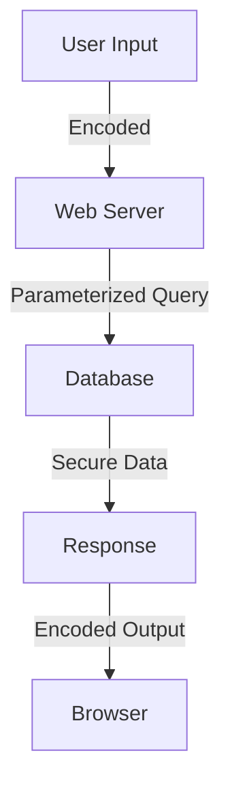

## 20.8 Avoiding Common Security Pitfalls in Clojure

As experienced Java developers transitioning to Clojure, it's crucial to understand how to secure your applications against common security threats. While Clojure's functional nature provides some inherent security benefits, such as immutability and reduced side effects, there are still several pitfalls to be aware of. In this section, we'll explore how to avoid common security issues like Cross-Site Scripting (XSS), Injection Flaws, and more. We'll also discuss best practices for authentication, authorization, and dependency management.

### Cross-Site Scripting (XSS)

Cross-Site Scripting (XSS) is a prevalent security vulnerability in web applications, where attackers inject malicious scripts into content from otherwise trusted websites. These scripts can steal cookies, session tokens, or other sensitive information.

#### Preventing XSS Attacks

To prevent XSS attacks in Clojure web applications, it's essential to properly encode output before rendering it in the browser. This ensures that any potentially harmful scripts are treated as plain text rather than executable code.

**Example: Encoding Output in Clojure**

```clojure
(ns myapp.core
  (:require [ring.util.response :as response]
            [hiccup.core :as hiccup]))

(defn safe-html-response [user-input]
  (response/response
    (hiccup/html
      [:html
       [:head
        [:title "Safe Page"]]
       [:body
        [:h1 "Welcome"]
        [:p (hiccup.util/escape-html user-input)]]])))
```

In this example, we use the `hiccup.util/escape-html` function to encode user input, preventing any embedded scripts from executing.

**Java Comparison**

In Java, you might use libraries like OWASP's Java Encoder to achieve similar results:

```java
import org.owasp.encoder.Encode;

public class SafeHtmlResponse {
    public String encodeUserInput(String userInput) {
        return "<p>" + Encode.forHtml(userInput) + "</p>";
    }
}
```

#### Try It Yourself

Experiment with the Clojure code by removing the `escape-html` function and observing how the application behaves with potentially malicious input. This exercise will help you understand the importance of encoding.

### Injection Flaws

Injection flaws, such as SQL injection, occur when untrusted data is sent to an interpreter as part of a command or query. This can lead to unauthorized data access or manipulation.

#### Preventing Injection Attacks

To prevent injection attacks in Clojure, use parameterized queries and avoid string concatenation for building queries or executing code.

**Example: Parameterized Queries with Clojure**

```clojure
(ns myapp.db
  (:require [clojure.java.jdbc :as jdbc]))

(def db-spec {:subprotocol "postgresql"
              :subname "//localhost:5432/mydb"
              :user "user"
              :password "pass"})

(defn get-user-by-id [user-id]
  (jdbc/query db-spec
              ["SELECT * FROM users WHERE id = ?" user-id]))
```

By using parameterized queries, we ensure that user input is treated as data, not executable code.

**Java Comparison**

In Java, you might use `PreparedStatement` to achieve the same:

```java
import java.sql.Connection;
import java.sql.PreparedStatement;
import java.sql.ResultSet;

public class UserDao {
    public User getUserById(Connection connection, int userId) throws SQLException {
        String query = "SELECT * FROM users WHERE id = ?";
        try (PreparedStatement stmt = connection.prepareStatement(query)) {
            stmt.setInt(1, userId);
            try (ResultSet rs = stmt.executeQuery()) {
                if (rs.next()) {
                    return new User(rs.getInt("id"), rs.getString("name"));
                }
            }
        }
        return null;
    }
}
```

#### Try It Yourself

Modify the Clojure example to use string concatenation for the query and observe the potential for injection attacks. This exercise will reinforce the importance of parameterized queries.

### Authentication and Authorization

Authentication and authorization are critical components of application security. Authentication verifies the identity of a user, while authorization determines what actions they can perform.

#### Best Practices for Secure Authentication

1. **Use Strong Password Hashing**: Use libraries like `buddy` for password hashing in Clojure.

   ```clojure
   (ns myapp.auth
     (:require [buddy.hashers :as hashers]))

   (defn hash-password [password]
     (hashers/derive password))

   (defn verify-password [password hash]
     (hashers/check password hash))
   ```

2. **Implement Multi-Factor Authentication (MFA)**: Add an extra layer of security by requiring additional verification methods.

3. **Secure Session Management**: Use secure cookies and ensure session tokens are properly managed.

#### Best Practices for Authorization

1. **Role-Based Access Control (RBAC)**: Implement RBAC to manage user permissions effectively.

2. **Least Privilege Principle**: Grant users the minimum permissions necessary to perform their tasks.

3. **Regularly Review Access Controls**: Periodically audit and update access controls to ensure they remain appropriate.

**Java Comparison**

In Java, you might use frameworks like Spring Security to handle authentication and authorization:

```java
import org.springframework.security.crypto.bcrypt.BCryptPasswordEncoder;

public class SecurityService {
    private BCryptPasswordEncoder passwordEncoder = new BCryptPasswordEncoder();

    public String hashPassword(String password) {
        return passwordEncoder.encode(password);
    }

    public boolean verifyPassword(String password, String hash) {
        return passwordEncoder.matches(password, hash);
    }
}
```

### Dependency Management

Dependencies can introduce vulnerabilities if not properly managed. It's crucial to keep them up to date to mitigate known security issues.

#### Best Practices for Dependency Management

1. **Regularly Update Dependencies**: Use tools like `lein-ancient` to check for outdated dependencies in Clojure.

   ```clojure
   ;; Add to project.clj
   :plugins [[lein-ancient "0.6.15"]]
   ```

2. **Audit Dependencies for Vulnerabilities**: Use tools like `OWASP Dependency-Check` to scan for known vulnerabilities.

3. **Minimize Dependency Usage**: Only include necessary dependencies to reduce the attack surface.

**Java Comparison**

In Java, tools like Maven's `versions-maven-plugin` can help manage dependencies:

```xml
<plugin>
    <groupId>org.codehaus.mojo</groupId>
    <artifactId>versions-maven-plugin</artifactId>
    <version>2.7</version>
</plugin>
```

### Visual Aids

#### Diagram: Data Flow in a Secure Clojure Web Application



*Caption: This diagram illustrates the flow of data in a secure Clojure web application, highlighting the importance of encoding and parameterized queries.*

### Knowledge Check

- **What is the primary purpose of encoding user input in web applications?**
- **Why are parameterized queries preferred over string concatenation for database queries?**
- **What are the benefits of using strong password hashing techniques?**

### Exercises

1. **Implement a Secure Login System**: Use the `buddy` library to create a secure login system in Clojure. Ensure that passwords are hashed and sessions are managed securely.

2. **Audit Your Dependencies**: Use `lein-ancient` and `OWASP Dependency-Check` to audit the dependencies in a Clojure project. Identify and update any outdated or vulnerable dependencies.

### Summary

In this section, we've explored how to avoid common security pitfalls in Clojure applications. By understanding and implementing best practices for preventing XSS attacks, injection flaws, and managing authentication and authorization, you can significantly enhance the security of your applications. Additionally, maintaining up-to-date dependencies is crucial for mitigating known vulnerabilities. As you continue to build scalable applications with Clojure, keep these security considerations in mind to protect your users and data.

## Quiz: Test Your Knowledge on Clojure Security



### What is the primary method to prevent XSS attacks in Clojure?

- [x] Encoding output before rendering
- [ ] Using string concatenation
- [ ] Disabling JavaScript in the browser
- [ ] Using plain text for all responses

> **Explanation:** Encoding output ensures that any potentially harmful scripts are treated as plain text, preventing execution.

### Why are parameterized queries important in preventing SQL injection?

- [x] They treat user input as data, not executable code
- [ ] They allow for faster query execution
- [ ] They simplify query syntax
- [ ] They automatically sanitize input

> **Explanation:** Parameterized queries ensure that user input is treated as data, preventing it from being executed as code.

### Which library is recommended for password hashing in Clojure?

- [x] Buddy
- [ ] Ring
- [ ] Hiccup
- [ ] Compojure

> **Explanation:** The `buddy` library provides robust password hashing functions, making it suitable for secure authentication.

### What is a key benefit of using Role-Based Access Control (RBAC)?

- [x] It manages user permissions effectively
- [ ] It speeds up application performance
- [ ] It reduces code complexity
- [ ] It eliminates the need for authentication

> **Explanation:** RBAC helps manage user permissions by assigning roles, ensuring users have appropriate access levels.

### How can you check for outdated dependencies in a Clojure project?

- [x] Use `lein-ancient`
- [ ] Use `lein-ring`
- [ ] Use `hiccup`
- [ ] Use `compojure`

> **Explanation:** `lein-ancient` is a tool that checks for outdated dependencies in Clojure projects.

### What is the least privilege principle?

- [x] Granting users the minimum permissions necessary
- [ ] Allowing all users full access
- [ ] Disabling all permissions by default
- [ ] Granting permissions based on user requests

> **Explanation:** The least privilege principle involves granting users only the permissions they need to perform their tasks.

### Which tool can be used to audit dependencies for vulnerabilities?

- [x] OWASP Dependency-Check
- [ ] Leiningen
- [ ] Hiccup
- [ ] Ring

> **Explanation:** OWASP Dependency-Check is a tool that scans for known vulnerabilities in project dependencies.

### What is a common security risk when using string concatenation for queries?

- [x] SQL Injection
- [ ] Faster execution
- [ ] Improved readability
- [ ] Automatic input validation

> **Explanation:** String concatenation can lead to SQL injection by allowing untrusted input to be executed as code.

### What is the purpose of multi-factor authentication (MFA)?

- [x] To add an extra layer of security
- [ ] To simplify the login process
- [ ] To eliminate the need for passwords
- [ ] To allow anonymous access

> **Explanation:** MFA adds an additional verification step, enhancing security beyond just passwords.

### True or False: Keeping dependencies up to date is unnecessary for security.

- [ ] True
- [x] False

> **Explanation:** Keeping dependencies up to date is crucial for mitigating known vulnerabilities and ensuring security.


