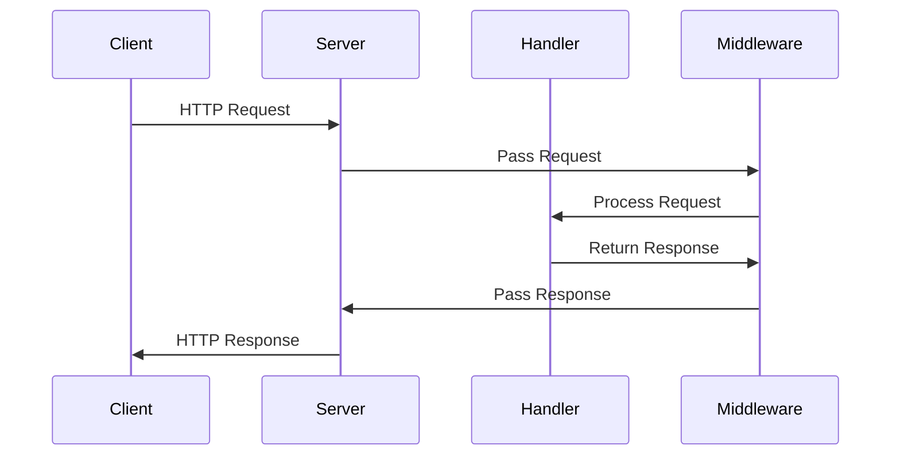

## 21.1 Building a Web Application the Functional Way

Building web applications using functional programming principles can lead to more robust, maintainable, and scalable systems. In this section, we will explore how to leverage Clojure's functional programming capabilities to build a web application. We will cover the selection of frameworks, the role of handler functions, the use of middleware, and effective state management. Finally, we will walk through a practical example to solidify these concepts.

### Functional Web Architecture

Functional programming emphasizes the use of pure functions and immutable data structures. When applied to web development, these principles can help create applications that are easier to reason about and test. Let's delve into the core principles of functional web architecture:

- **Pure Functions**: Functions that always produce the same output for the same input and have no side effects.
- **Immutable Data**: Data that cannot be changed once created, ensuring consistency and thread safety.
- **Function Composition**: Building complex functionality by composing simple functions.

### Selecting Frameworks

Clojure offers several frameworks that align with functional programming paradigms. Two of the most popular are [Ring](https://github.com/ring-clojure/ring) and [Compojure](https://github.com/weavejester/compojure).

#### Ring

Ring is a Clojure web application library inspired by Python's WSGI and Ruby's Rack. It provides a simple abstraction for handling HTTP requests and responses.

- **Request and Response Maps**: Ring uses maps to represent HTTP requests and responses, making it easy to manipulate data.
- **Middleware**: Functions that wrap handler functions to add additional behavior, such as logging or authentication.

#### Compojure

Compojure is a routing library that builds on top of Ring. It provides a concise syntax for defining routes and handling requests.

- **Routing DSL**: Compojure offers a domain-specific language (DSL) for defining routes, making it easy to map URLs to handler functions.
- **Integration with Ring**: Compojure routes are Ring handler functions, allowing seamless integration with Ring middleware.

### Handler Functions

Handler functions are the core of a Ring application. They take a request map as input and return a response map. Let's look at a simple example:

```clojure
(ns myapp.core
  (:require [ring.adapter.jetty :refer [run-jetty]]
            [ring.util.response :refer [response]]))

(defn handler [request]
  ;; Create a response map with a status, headers, and body
  (response "Hello, World!"))

;; Start a Jetty server with the handler function
(run-jetty handler {:port 3000})
```

In this example, the `handler` function takes an HTTP request and returns a response with the body "Hello, World!". The `run-jetty` function starts a Jetty server using this handler.

#### Java Comparison

In Java, handling HTTP requests typically involves servlets or frameworks like Spring MVC. Here's a simple Java servlet example:

```java
import javax.servlet.*;
import javax.servlet.http.*;
import java.io.*;

public class HelloWorldServlet extends HttpServlet {
    protected void doGet(HttpServletRequest request, HttpServletResponse response)
            throws ServletException, IOException {
        response.setContentType("text/plain");
        PrintWriter out = response.getWriter();
        out.println("Hello, World!");
    }
}
```

While both examples achieve the same result, the Clojure version is more concise and leverages immutable data structures.

### Middleware and Composition

Middleware in Ring is a powerful concept that allows you to compose functionality around handler functions. Middleware functions take a handler function as an argument and return a new handler function.

#### Example Middleware

Let's create a simple middleware function that logs requests:

```clojure
(defn wrap-logging [handler]
  (fn [request]
    (println "Request received:" request)
    (handler request)))
```

You can apply this middleware to a handler function using function composition:

```clojure
(def app
  (-> handler
      wrap-logging))
```

This example demonstrates how middleware can be used to add cross-cutting concerns, such as logging, without modifying the core handler logic.

#### Java Comparison

In Java, similar functionality might be achieved using filters or interceptors, which can be more complex and less flexible than Clojure's middleware approach.

### State Management

Managing state in a functional web application requires careful consideration. Clojure provides several constructs for handling state, such as atoms, refs, and agents. However, for web applications, it's often best to minimize shared state and pass state through function arguments.

#### Atoms for State Management

Atoms are a simple way to manage state in Clojure. They provide a way to manage mutable state in a controlled manner.

```clojure
(def app-state (atom {}))

(defn update-state [key value]
  (swap! app-state assoc key value))
```

In this example, `app-state` is an atom that holds a map. The `update-state` function updates the state by associating a new key-value pair.

### Practical Example: Building a Simple Web Application

Let's build a simple web application using Ring and Compojure. We'll create a basic API that allows users to add and retrieve messages.

#### Step 1: Set Up the Project

First, create a new Clojure project using Leiningen:

```bash
lein new app message-board
```

Navigate to the project directory and add dependencies for Ring and Compojure in `project.clj`:

```clojure
(defproject message-board "0.1.0-SNAPSHOT"
  :dependencies [[org.clojure/clojure "1.10.3"]
                 [ring/ring-core "1.9.0"]
                 [ring/ring-jetty-adapter "1.9.0"]
                 [compojure "1.6.2"]])
```

#### Step 2: Define Routes

Create a new namespace for your routes and define a simple API:

```clojure
(ns message-board.routes
  (:require [compojure.core :refer :all]
            [ring.util.response :refer [response]]))

(def messages (atom []))

(defroutes app-routes
  (GET "/messages" [] (response @messages))
  (POST "/messages" [message]
    (swap! messages conj message)
    (response "Message added")))
```

In this example, we define two routes: one for retrieving messages and another for adding messages. The messages are stored in an atom, allowing us to manage state functionally.

#### Step 3: Create the Application

Create a new namespace for your application and set up the server:

```clojure
(ns message-board.core
  (:require [ring.adapter.jetty :refer [run-jetty]]
            [message-board.routes :refer [app-routes]]))

(defn -main []
  (run-jetty app-routes {:port 3000}))
```

#### Step 4: Run the Application

Start the application using Leiningen:

```bash
lein run
```

You can now send HTTP requests to the application to add and retrieve messages.

### Visual Aids

To better understand the flow of data in our application, let's look at a sequence diagram illustrating the request handling process:



**Diagram Description**: This sequence diagram shows how an HTTP request is processed by the server, passed through middleware, handled by the handler function, and then returned to the client.

### Knowledge Check

- **What are the benefits of using pure functions in web development?**
- **How does middleware enhance the functionality of a web application?**
- **What are the advantages of using immutable data structures in a web application?**

### Exercises

1. **Modify the Application**: Add a new route to delete a message by index. Ensure that the state is updated correctly.
2. **Implement Middleware**: Create middleware that checks for a specific header in the request and returns an error response if it's missing.
3. **Enhance State Management**: Refactor the application to use a more complex data structure for messages, such as a map with metadata.

### Summary

In this section, we've explored how to build a web application using functional programming principles with Clojure. By leveraging frameworks like Ring and Compojure, we can create applications that are concise, maintainable, and scalable. We've also seen how to manage state functionally and use middleware to compose functionality.

### References and Links

- [Ring Documentation](https://github.com/ring-clojure/ring)
- [Compojure Documentation](https://github.com/weavejester/compojure)
- [Clojure Official Documentation](https://clojure.org/reference/documentation)

## Quiz: Mastering Functional Web Development with Clojure



### What is a key benefit of using pure functions in web applications?

- [x] They are easier to test and debug.
- [ ] They require more memory.
- [ ] They are faster than impure functions.
- [ ] They can modify global state.

> **Explanation:** Pure functions are easier to test and debug because they have no side effects and always produce the same output for the same input.

### Which Clojure library provides a DSL for routing in web applications?

- [ ] Ring
- [x] Compojure
- [ ] Luminus
- [ ] Pedestal

> **Explanation:** Compojure provides a domain-specific language (DSL) for defining routes in Clojure web applications.

### How does middleware in Ring work?

- [x] It wraps handler functions to add additional behavior.
- [ ] It modifies the core language syntax.
- [ ] It compiles Clojure code to Java bytecode.
- [ ] It manages database connections.

> **Explanation:** Middleware in Ring wraps handler functions to add additional behavior, such as logging or authentication.

### What is the purpose of an atom in Clojure?

- [x] To manage mutable state in a controlled manner.
- [ ] To create immutable data structures.
- [ ] To handle HTTP requests.
- [ ] To define routes in a web application.

> **Explanation:** Atoms in Clojure are used to manage mutable state in a controlled manner, allowing for safe updates.

### Which function is used to start a Jetty server in a Ring application?

- [ ] start-server
- [x] run-jetty
- [ ] init-server
- [ ] launch-jetty

> **Explanation:** The `run-jetty` function is used to start a Jetty server in a Ring application.

### What is a common use case for middleware in web applications?

- [x] Logging requests and responses.
- [ ] Compiling Clojure code.
- [ ] Managing database transactions.
- [ ] Defining data structures.

> **Explanation:** Middleware is commonly used for logging requests and responses, among other cross-cutting concerns.

### How can you ensure thread safety in a Clojure web application?

- [x] By using immutable data structures.
- [ ] By using global variables.
- [ ] By avoiding function composition.
- [ ] By using mutable data structures.

> **Explanation:** Immutable data structures ensure thread safety because they cannot be modified once created.

### What is the role of a handler function in a Ring application?

- [x] To process HTTP requests and return responses.
- [ ] To manage database connections.
- [ ] To compile Clojure code.
- [ ] To define application routes.

> **Explanation:** Handler functions in Ring applications process HTTP requests and return responses.

### What is the advantage of using a DSL for routing in web applications?

- [x] It simplifies the definition of routes.
- [ ] It increases the complexity of the application.
- [ ] It requires more memory.
- [ ] It compiles routes to machine code.

> **Explanation:** A DSL for routing simplifies the definition of routes, making the code more readable and maintainable.

### True or False: Middleware can modify the request and response maps in a Ring application.

- [x] True
- [ ] False

> **Explanation:** Middleware can modify the request and response maps, allowing for flexible and dynamic behavior in a Ring application.


