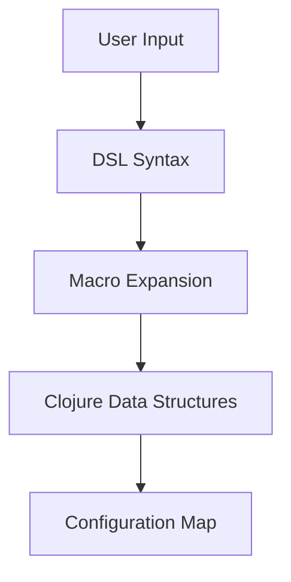

## 21.3 Implementing a Domain-Specific Language in Clojure

In this section, we delve into the fascinating world of Domain-Specific Languages (DSLs) and explore how Clojure's unique features make it an excellent choice for implementing them. By the end of this guide, you'll understand what DSLs are, how to leverage Clojure's macro system to create them, and best practices for designing effective DSLs.

### Understanding DSLs

**Domain-Specific Languages (DSLs)** are specialized mini-languages tailored to a specific problem domain. Unlike general-purpose programming languages, DSLs are designed to express solutions in a way that is natural and intuitive for the domain they target. This can lead to increased productivity, improved code readability, and easier maintenance.

#### Why Use DSLs?

- **Simplification**: DSLs abstract complex logic into simpler, more readable constructs.
- **Expressiveness**: They allow domain experts to express solutions in terms that are familiar to them.
- **Maintainability**: DSLs can make code easier to maintain by reducing boilerplate and clarifying intent.

### Macros for DSLs

Clojure's macro system is a powerful tool for creating internal DSLs. Macros allow you to manipulate code as data, enabling you to extend the language with new syntactic constructs that are tailored to your domain.

#### How Macros Work

In Clojure, macros are functions that take code as input and return transformed code as output. This allows you to create new language constructs that are evaluated at compile time, providing a way to extend the language's syntax.

```clojure
(defmacro when-not [test & body]
  `(if (not ~test)
     (do ~@body)))
```

In this example, the `when-not` macro provides a more readable way to express conditional logic when a test fails.

#### Creating Internal DSLs

By using macros, you can create internal DSLs that seamlessly integrate with Clojure's syntax. This allows you to build powerful abstractions without sacrificing the benefits of a general-purpose language.

### Design Principles

When designing a DSL, it's important to adhere to certain principles to ensure that it is effective and easy to use.

#### Syntactic Clarity

Your DSL should be easy to read and understand. This means using clear, concise syntax that reflects the domain's terminology.

#### Ease of Use

A good DSL should be intuitive for its intended users. This often involves providing sensible defaults and minimizing the amount of boilerplate code required.

#### Integration with Existing Code

Ensure that your DSL can be easily integrated with existing Clojure code. This often involves providing hooks or extension points that allow users to customize the DSL's behavior.

### Building a DSL

Let's walk through the process of building a simple DSL in Clojure. We'll create a DSL for defining configuration settings in a more readable way.

#### Step 1: Define the Domain

First, we need to define the domain we are targeting. In this case, we're building a DSL for configuration settings, so our domain includes concepts like keys, values, and sections.

#### Step 2: Design the Syntax

Next, we design the syntax of our DSL. We'll use a simple, declarative syntax that allows users to define configuration settings in a natural way.

```clojure
(config
  (section "database"
    (key "host" "localhost")
    (key "port" 5432))
  (section "server"
    (key "port" 8080)))
```

#### Step 3: Implement the DSL

Now, we implement the DSL using Clojure's macro system. We'll define macros for `config`, `section`, and `key` that transform the DSL syntax into Clojure data structures.

```clojure
(defmacro config [& sections]
  `(hash-map ~@(apply concat sections)))

(defmacro section [name & keys]
  `(~name ~(apply hash-map keys)))

(defmacro key [k v]
  `[~k ~v])
```

#### Step 4: Test the DSL

Finally, we test our DSL to ensure it works as expected. We can use the REPL to interactively test our DSL and make adjustments as needed.

```clojure
(def my-config
  (config
    (section "database"
      (key "host" "localhost")
      (key "port" 5432))
    (section "server"
      (key "port" 8080))))

;; Accessing configuration values
(get-in my-config ["database" "host"]) ;; => "localhost"
```

### Examples and Use Cases

DSLs can be used in a variety of contexts to improve productivity and code maintainability. Here are a few real-world examples:

- **Testing Frameworks**: DSLs can simplify the process of writing tests by providing a more expressive syntax for defining test cases and assertions.
- **Build Scripts**: DSLs can make build scripts more readable and maintainable by abstracting complex build logic into simpler constructs.
- **Configuration Languages**: DSLs can provide a more user-friendly way to define configuration settings, as demonstrated in our example.

### Visual Aids

To better understand how DSLs work, let's visualize the flow of data through our configuration DSL using a flowchart.



**Figure 1**: This flowchart illustrates how user input in the form of DSL syntax is transformed into a Clojure data structure through macro expansion.

### References and Links

For further reading on DSLs and Clojure macros, consider the following resources:

- [Official Clojure Documentation](https://clojure.org/reference/macros)
- [ClojureDocs](https://clojuredocs.org/)
- [GitHub: Clojure DSL Examples](https://github.com/clojure-examples/dsl)

### Knowledge Check

Before we conclude, let's reinforce what we've learned with a few questions:

- What are the key benefits of using a DSL?
- How do Clojure macros enable the creation of DSLs?
- What are some best practices for designing a DSL?

### Exercises

1. **Modify the DSL**: Extend the configuration DSL to support default values for keys.
2. **Create a New DSL**: Design and implement a simple DSL for defining RESTful API endpoints.

### Summary

In this section, we've explored how to implement a Domain-Specific Language in Clojure, leveraging the power of macros to create expressive, domain-specific syntax. By following best practices in DSL design, you can create powerful abstractions that simplify complex problem domains and improve code maintainability.

Now that we've covered the essentials of DSLs in Clojure, let's move on to the next topic in our guide.

## Quiz: Mastering DSLs in Clojure



### What is a Domain-Specific Language (DSL)?

- [x] A specialized mini-language tailored to a specific problem domain.
- [ ] A general-purpose programming language.
- [ ] A type of database query language.
- [ ] A markup language for web development.

> **Explanation:** A DSL is a specialized mini-language designed to express solutions in a way that is natural for a specific problem domain.

### How do Clojure macros help in creating DSLs?

- [x] By allowing code to be manipulated as data.
- [ ] By providing built-in functions for DSL creation.
- [ ] By offering a graphical interface for DSL design.
- [ ] By compiling DSLs into machine code.

> **Explanation:** Clojure macros enable the creation of DSLs by allowing code to be manipulated as data, enabling new syntactic constructs.

### What is an important design principle for DSLs?

- [x] Syntactic clarity.
- [ ] Complexity.
- [ ] Obfuscation.
- [ ] Redundancy.

> **Explanation:** Syntactic clarity is crucial for DSLs to ensure they are easy to read and understand.

### Which of the following is a use case for DSLs?

- [x] Testing frameworks.
- [ ] Operating system development.
- [ ] Hardware design.
- [ ] Network protocols.

> **Explanation:** DSLs can simplify the process of writing tests by providing a more expressive syntax for defining test cases.

### What is the role of the `config` macro in the example DSL?

- [x] To transform DSL syntax into a Clojure data structure.
- [ ] To compile the DSL into machine code.
- [ ] To provide a user interface for the DSL.
- [ ] To execute the DSL directly.

> **Explanation:** The `config` macro transforms DSL syntax into a Clojure data structure, enabling the DSL's functionality.

### What is a benefit of using DSLs?

- [x] Increased productivity.
- [ ] Increased complexity.
- [ ] Reduced readability.
- [ ] Reduced maintainability.

> **Explanation:** DSLs can increase productivity by abstracting complex logic into simpler, more readable constructs.

### What is the purpose of the `key` macro in the example DSL?

- [x] To define key-value pairs in the configuration.
- [ ] To execute the configuration.
- [ ] To compile the configuration.
- [ ] To provide a graphical interface for the configuration.

> **Explanation:** The `key` macro defines key-value pairs in the configuration, contributing to the DSL's functionality.

### What is a common pitfall to avoid when designing a DSL?

- [x] Making the DSL too complex.
- [ ] Making the DSL too simple.
- [ ] Using too few macros.
- [ ] Using too many built-in functions.

> **Explanation:** A common pitfall is making the DSL too complex, which can reduce its readability and ease of use.

### How can DSLs improve code maintainability?

- [x] By reducing boilerplate and clarifying intent.
- [ ] By increasing the amount of code.
- [ ] By obfuscating logic.
- [ ] By introducing more dependencies.

> **Explanation:** DSLs improve maintainability by reducing boilerplate and clarifying the intent of the code.

### True or False: DSLs are only useful for small projects.

- [ ] True
- [x] False

> **Explanation:** DSLs can be useful for projects of any size, as they simplify complex logic and improve code readability.



By understanding and implementing DSLs in Clojure, you can harness the power of functional programming to create expressive, domain-specific solutions that enhance productivity and maintainability.
