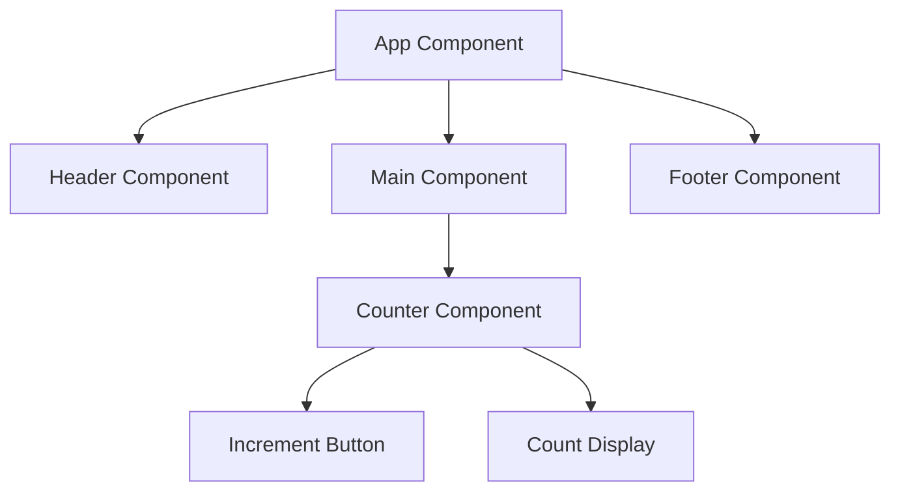

## 21.4 Developing Functional GUI Applications

In this section, we will delve into the world of functional GUI applications using ClojureScript and Reagent. We'll explore how functional reactive programming (FRP) principles can be applied to GUI development, enabling us to build scalable and maintainable user interfaces. We'll also discuss state management using re-frame and demonstrate how to compose complex UIs from simple components. Finally, we'll guide you through developing a practical example of a functional GUI application.

### Functional UI Concepts

Functional reactive programming (FRP) is a paradigm that combines functional programming with reactive programming. It allows us to model dynamic systems in a declarative manner, making it easier to reason about and manage state changes over time. In the context of GUI development, FRP enables us to create user interfaces that are responsive and maintainable.

#### Key Principles of FRP in GUI Development

1. **Declarative UI**: Describe what the UI should look like, not how to achieve it. This is similar to how HTML describes the structure of a webpage.
2. **Immutability**: Use immutable data structures to represent the state of the UI, ensuring that changes are predictable and easy to track.
3. **Pure Functions**: Build UI components as pure functions that take state as input and return a representation of the UI.
4. **Reactive Updates**: Automatically update the UI in response to changes in state, without manual intervention.

### ClojureScript and Reagent

ClojureScript is a variant of Clojure that compiles to JavaScript, allowing us to leverage the power of Clojure in web development. Reagent is a ClojureScript library that provides a simple and efficient way to build React-based user interfaces using Clojure's functional programming capabilities.

#### Getting Started with ClojureScript

To begin developing with ClojureScript, you'll need to set up your development environment. Here's a quick guide:

1. **Install Leiningen**: Leiningen is a build automation tool for Clojure that simplifies project setup and dependency management.
2. **Create a New Project**: Use Leiningen to create a new ClojureScript project.
   ```bash
   lein new reagent my-app
   ```
3. **Add Dependencies**: Ensure your `project.clj` file includes dependencies for Reagent and any other libraries you plan to use.
4. **Start the REPL**: Launch a REPL session to interactively develop and test your code.
   ```bash
   lein figwheel
   ```

#### Building UIs with Reagent

Reagent provides a simple API for building React components using ClojureScript. Here's a basic example of a Reagent component:

```clojure
(ns my-app.core
  (:require [reagent.core :as r]))

(defn hello-world []
  [:div
   [:h1 "Hello, World!"]])

(defn mount-root []
  (r/render [hello-world]
            (.getElementById js/document "app")))

(defn init []
  (mount-root))
```

In this example, `hello-world` is a Reagent component defined as a pure function that returns a vector representing the UI. The `mount-root` function renders the component into the DOM.

### State Management with re-frame

Managing state in a functional way is crucial for building scalable applications. re-frame is a ClojureScript library that provides a framework for managing application state using a unidirectional data flow architecture.

#### Core Concepts of re-frame

1. **Events**: Represent actions that change the application state.
2. **Subscriptions**: Provide a way to access the current state in a reactive manner.
3. **Effects**: Describe side effects that occur as a result of handling events.
4. **Coeffects**: Provide context to event handlers, such as the current state or external data.

#### Setting Up re-frame

To use re-frame in your project, add it as a dependency in your `project.clj` file. Then, define your application's events, subscriptions, and handlers.

```clojure
(ns my-app.events
  (:require [re-frame.core :as rf]))

(rf/reg-event-db
 :initialize
 (fn [_ _]
   {:count 0}))

(rf/reg-event-db
 :increment
 (fn [db _]
   (update db :count inc)))
```

In this example, we define two events: `:initialize` to set the initial state and `:increment` to update the state.

#### Using Subscriptions

Subscriptions allow components to reactively access the application state. Here's how to define and use a subscription:

```clojure
(ns my-app.subs
  (:require [re-frame.core :as rf]))

(rf/reg-sub
 :count
 (fn [db _]
   (:count db)))

(defn counter []
  (let [count (rf/subscribe [:count])]
    (fn []
      [:div
       [:p "Count: " @count]
       [:button {:on-click #(rf/dispatch [:increment])} "Increment"]])))
```

In this example, the `counter` component subscribes to the `:count` subscription and updates the UI whenever the state changes.

### Component Composition

Building complex UIs from simple components is a key aspect of functional programming. In Reagent, components are just functions, making it easy to compose them into larger structures.

#### Composing Components

Here's an example of composing components in Reagent:

```clojure
(defn header []
  [:header
   [:h1 "My App"]])

(defn footer []
  [:footer
   [:p "© 2024 My Company"]])

(defn main []
  [:main
   [counter]])

(defn app []
  [:div
   [header]
   [main]
   [footer]])
```

In this example, the `app` component is composed of `header`, `main`, and `footer` components, each responsible for a different part of the UI.

### Practical Example: Building a Real-Time Dashboard

Let's build a simple real-time dashboard application using the concepts we've covered. This application will display live data updates and allow users to interact with the UI.

#### Setting Up the Project

1. **Create a New Project**: Use Leiningen to create a new ClojureScript project.
   ```bash
   lein new reagent dashboard
   ```
2. **Add Dependencies**: Include Reagent and re-frame in your `project.clj` file.

#### Defining the Application State

Define the initial state and events for your application:

```clojure
(ns dashboard.events
  (:require [re-frame.core :as rf]))

(rf/reg-event-db
 :initialize
 (fn [_ _]
   {:data []}))

(rf/reg-event-db
 :update-data
 (fn [db [_ new-data]]
   (assoc db :data new-data)))
```

#### Creating Subscriptions

Define subscriptions to access the application state:

```clojure
(ns dashboard.subs
  (:require [re-frame.core :as rf]))

(rf/reg-sub
 :data
 (fn [db _]
   (:data db)))
```

#### Building the UI

Create components to display the data and interact with the application:

```clojure
(ns dashboard.views
  (:require [re-frame.core :as rf]))

(defn data-view []
  (let [data (rf/subscribe [:data])]
    (fn []
      [:div
       [:h2 "Real-Time Data"]
       [:ul
        (for [item @data]
          ^{:key item} [:li item])]])))

(defn app []
  [:div
   [data-view]])
```

#### Integrating Real-Time Updates

Simulate real-time data updates by dispatching events at regular intervals:

```clojure
(defn simulate-data-updates []
  (js/setInterval
   #(rf/dispatch [:update-data (generate-random-data)])
   1000))

(defn init []
  (rf/dispatch-sync [:initialize])
  (simulate-data-updates)
  (r/render [app]
            (.getElementById js/document "app")))
```

In this example, `simulate-data-updates` generates random data and updates the application state every second.

### Try It Yourself

Experiment with the code examples by modifying the components, events, and subscriptions. Try adding new features, such as user input or additional data visualizations, to enhance the dashboard application.

### Visual Aids

To better understand the flow of data and component composition in our application, let's visualize it using a Mermaid.js diagram:



**Diagram Description**: This diagram illustrates the composition of components in our application. The `App Component` is composed of `Header`, `Main`, and `Footer` components. The `Main Component` includes the `Counter Component`, which contains the `Increment Button` and `Count Display`.

### References and Links

- [ClojureScript Official Documentation](https://clojurescript.org/)
- [Reagent Project](https://reagent-project.github.io/)
- [re-frame GitHub Repository](https://github.com/day8/re-frame)
- [ClojureDocs](https://clojuredocs.org/)

### Knowledge Check

Before we conclude, let's reinforce our learning with a few questions and exercises:

1. **What are the key principles of functional reactive programming in GUI development?**
2. **How does Reagent enable building UIs with ClojureScript?**
3. **Explain the role of events and subscriptions in re-frame.**
4. **Modify the dashboard application to include user input for filtering data.**
5. **Experiment with different component compositions to create a new layout.**

### Summary

In this section, we've explored the principles of functional reactive programming and how they apply to GUI development using ClojureScript and Reagent. We've learned how to manage state with re-frame and compose complex UIs from simple components. By building a real-time dashboard application, we've seen these concepts in action. Now that you have a solid foundation, you can continue to experiment and build more sophisticated functional GUI applications.

## Quiz: Mastering Functional GUI Development with ClojureScript



### What is the primary benefit of using functional reactive programming (FRP) in GUI development?

- [x] Declarative UI and reactive updates
- [ ] Faster rendering times
- [ ] Easier integration with databases
- [ ] Simplified CSS styling

> **Explanation:** FRP allows for declarative UI design and reactive updates, making it easier to manage dynamic interfaces.

### Which library is used in ClojureScript to build React-based user interfaces?

- [x] Reagent
- [ ] Redux
- [ ] Angular
- [ ] Vue.js

> **Explanation:** Reagent is a ClojureScript library for building React-based UIs using functional programming principles.

### How does re-frame manage application state?

- [x] Through events, subscriptions, effects, and coeffects
- [ ] By directly modifying the DOM
- [ ] Using global variables
- [ ] Through CSS classes

> **Explanation:** re-frame uses a unidirectional data flow architecture with events, subscriptions, effects, and coeffects to manage state.

### What is the purpose of the `rf/subscribe` function in re-frame?

- [x] To access the current state reactively
- [ ] To dispatch events
- [ ] To render components
- [ ] To define new events

> **Explanation:** `rf/subscribe` is used to access the current state in a reactive manner, allowing components to update automatically when the state changes.

### In the provided dashboard example, what does the `simulate-data-updates` function do?

- [x] Generates random data and updates the state every second
- [ ] Renders the initial UI
- [ ] Handles user input
- [ ] Styles the components

> **Explanation:** `simulate-data-updates` generates random data and dispatches events to update the application state every second.

### What is the role of pure functions in Reagent components?

- [x] To ensure components are predictable and easy to test
- [ ] To handle side effects
- [ ] To manage CSS styling
- [ ] To interact with databases

> **Explanation:** Pure functions ensure that components are predictable and easy to test, as they always produce the same output for the same input.

### How can you modify the dashboard application to include user input for filtering data?

- [x] Add a new component with an input field and dispatch events to update the state
- [ ] Use CSS to style the input field
- [ ] Modify the `project.clj` file
- [ ] Change the HTML structure

> **Explanation:** Adding a new component with an input field and dispatching events to update the state allows for user input to filter data.

### What is the advantage of using immutable data structures in GUI development?

- [x] Predictable state changes and easier debugging
- [ ] Faster rendering times
- [ ] Simplified CSS styling
- [ ] Easier integration with databases

> **Explanation:** Immutable data structures ensure predictable state changes and make debugging easier, as the state cannot be modified unexpectedly.

### Which of the following is a key concept in re-frame's architecture?

- [x] Unidirectional data flow
- [ ] Bidirectional data binding
- [ ] Global state management
- [ ] Direct DOM manipulation

> **Explanation:** re-frame uses a unidirectional data flow architecture, where data flows in one direction, making state management more predictable.

### True or False: Reagent components are defined as classes.

- [ ] True
- [x] False

> **Explanation:** Reagent components are defined as functions, not classes, which aligns with Clojure's functional programming paradigm.


