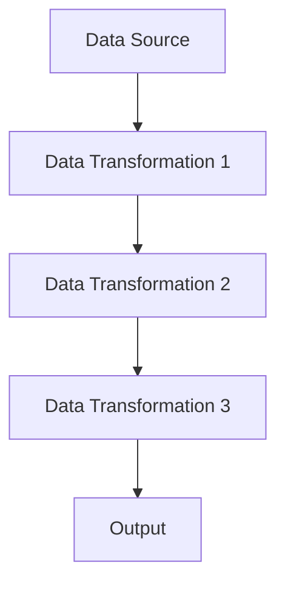
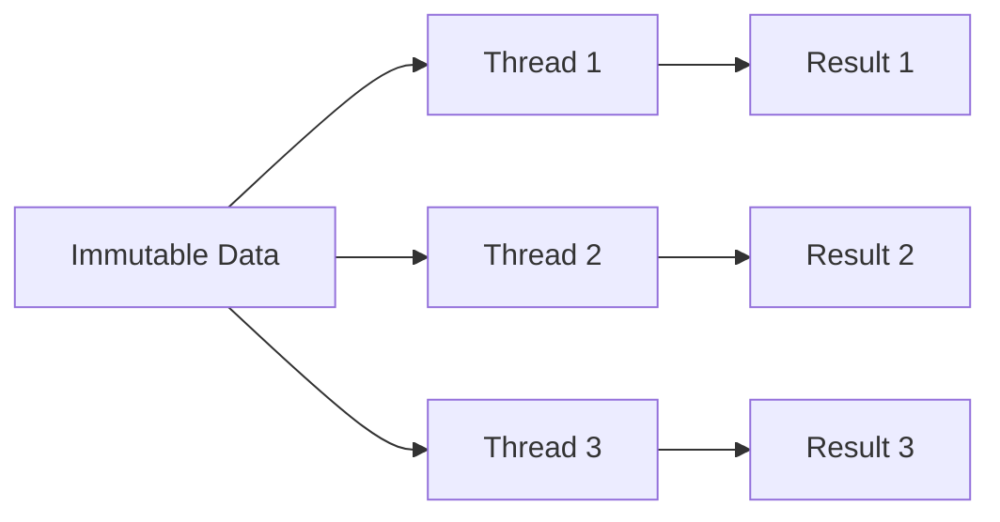

## 21.5 Real-World Examples of Functional Design

In this section, we delve into real-world applications of functional programming using Clojure. By examining case studies, we will explore how functional paradigms have been successfully implemented to solve complex problems, enhance performance, and improve team collaboration. These examples will provide insights into the practical benefits of adopting functional design in software development.

### Case Study 1: Building a Scalable Web Application

#### Challenges and Solutions

When developing a web application, scalability and maintainability are paramount. A team faced challenges with a traditional Java-based monolithic architecture, which led to difficulties in scaling and maintaining the codebase. Transitioning to Clojure, they leveraged functional programming principles to address these issues.

- **Immutability**: By using immutable data structures, the team eliminated side effects, making the code more predictable and easier to debug. This approach also facilitated concurrent processing, as immutable data can be safely shared across threads without synchronization.

- **Higher-Order Functions**: The team utilized higher-order functions to create reusable components. Functions like `map`, `filter`, and `reduce` allowed them to process collections efficiently, leading to cleaner and more concise code.

- **Concurrency**: Clojure's concurrency primitives, such as atoms and refs, were employed to manage state changes safely. This enabled the application to handle multiple requests simultaneously without compromising data integrity.

#### Performance Considerations

To optimize performance, the team adopted several strategies:

- **Lazy Evaluation**: By leveraging lazy sequences, they deferred computation until necessary, reducing memory usage and improving response times.

- **Transducers**: Transducers were used to compose data transformation pipelines, minimizing intermediate data structures and enhancing performance.

- **Profiling Tools**: The team utilized profiling tools to identify bottlenecks and optimize critical sections of the code.

#### Team Practices

Adopting functional programming required a shift in mindset for the team. They embraced pair programming and code reviews to facilitate knowledge sharing and ensure adherence to functional principles. Regular workshops and training sessions helped team members become proficient in Clojure.

#### Outcomes

The transition to Clojure resulted in a more scalable and maintainable application. The team reported improved code quality, reduced bugs, and faster development cycles. The application's performance improved significantly, handling increased traffic with ease.

### Case Study 2: Real-Time Data Processing Pipeline

#### Challenges and Solutions

A company needed to process large volumes of data in real-time for analytics and decision-making. The existing Java-based solution struggled with latency and scalability. By adopting Clojure, they implemented a functional data processing pipeline.

- **Functional Composition**: The team used function composition to build complex data transformations. This modular approach allowed them to easily extend and modify the pipeline as requirements evolved.

- **Concurrency and Parallelism**: Clojure's `core.async` library was employed to handle concurrent data streams. This enabled the system to process data in parallel, significantly reducing latency.

- **Error Handling**: Functional error handling techniques, such as using `Either` and `Maybe` monads, were adopted to manage exceptions gracefully without disrupting the data flow.

#### Performance Considerations

To ensure low latency and high throughput, the team focused on:

- **Efficient Data Structures**: Persistent data structures were used to handle large datasets efficiently without copying data unnecessarily.

- **Asynchronous Processing**: By decoupling data ingestion and processing, the team achieved better resource utilization and responsiveness.

- **Caching and Memoization**: Frequently accessed data was cached, and computationally expensive functions were memoized to avoid redundant calculations.

#### Team Practices

The team adopted a functional-first approach, encouraging developers to think in terms of data transformations and pure functions. Code reviews emphasized immutability and referential transparency, fostering a culture of clean and maintainable code.

#### Outcomes

The new data processing pipeline achieved remarkable improvements in performance and scalability. The system handled increased data volumes with minimal latency, providing real-time insights to stakeholders. The modular design facilitated rapid adaptation to changing business needs.

### Case Study 3: Domain-Specific Language for Financial Modeling

#### Challenges and Solutions

A financial services company required a flexible and expressive language for modeling complex financial instruments. The existing Java-based solution was cumbersome and difficult to extend. By developing a domain-specific language (DSL) in Clojure, they overcame these challenges.

- **Macros and Metaprogramming**: Clojure's macro system was leveraged to create a DSL that allowed domain experts to express financial models succinctly. This abstraction reduced boilerplate code and improved readability.

- **Symbolic Programming**: The team used symbolic programming techniques to represent financial equations and transformations, enabling dynamic evaluation and optimization.

- **Interoperability**: Clojure's seamless interoperability with Java allowed the team to integrate existing Java libraries and tools, preserving previous investments.

#### Performance Considerations

To ensure the DSL performed efficiently, the team focused on:

- **Optimized Compilation**: The DSL was designed to compile into efficient Clojure code, minimizing runtime overhead.

- **Parallel Execution**: Financial models were executed in parallel using Clojure's concurrency primitives, reducing computation time.

- **Profiling and Optimization**: Regular profiling sessions helped identify performance bottlenecks, leading to targeted optimizations.

#### Team Practices

The team collaborated closely with domain experts to design the DSL, ensuring it met business requirements. Regular feedback loops and iterative development cycles allowed for continuous refinement and improvement.

#### Outcomes

The DSL empowered domain experts to model financial instruments with ease, reducing the time to market for new products. The expressive syntax and powerful abstractions led to more accurate and maintainable models, enhancing the company's competitive edge.

### Visual Aids

To better understand the flow of data and the application of functional design principles, let's explore some diagrams.

#### Data Flow in a Functional Pipeline

*Caption: This diagram illustrates the flow of data through a functional pipeline, where each transformation is a pure function.*

#### Immutability and Concurrency Model

*Caption: This diagram demonstrates how immutable data can be shared across multiple threads without synchronization, ensuring thread safety.*

### References and Links

- [Official Clojure Documentation](https://clojure.org/)
- [ClojureDocs](https://clojuredocs.org/)
- [core.async GitHub Repository](https://github.com/clojure/core.async)
- [Transducers in Clojure](https://clojure.org/reference/transducers)

### Knowledge Check

To reinforce your understanding of functional design in Clojure, consider the following questions:

1. How does immutability contribute to concurrency in Clojure?
2. What are the benefits of using higher-order functions in functional programming?
3. How can lazy evaluation improve performance in a Clojure application?
4. What role do macros play in creating domain-specific languages?
5. How can functional programming principles enhance team collaboration?

### Exercises

1. **Implement a Data Transformation Pipeline**: Create a simple data processing pipeline using Clojure's `map`, `filter`, and `reduce` functions. Experiment with adding new transformations and observe how the pipeline adapts.

2. **Explore Concurrency with core.async**: Build a small application that processes data concurrently using `core.async` channels. Experiment with different concurrency patterns and observe their impact on performance.

3. **Design a Simple DSL**: Use Clojure's macro system to create a basic DSL for a specific domain, such as task automation or configuration management. Focus on creating expressive and concise syntax.

### Summary

In this section, we've explored real-world examples of functional design in Clojure, highlighting the challenges, solutions, and outcomes achieved by adopting functional programming principles. By leveraging immutability, higher-order functions, and concurrency primitives, teams have built scalable and maintainable applications that deliver significant business value. As you continue your journey with Clojure, consider how these principles can be applied to your own projects to achieve similar success.

## Quiz: Test Your Knowledge on Functional Design in Clojure



### How does immutability contribute to concurrency in Clojure?

- [x] It allows data to be shared across threads without synchronization.
- [ ] It increases the complexity of managing state.
- [ ] It requires additional memory for each thread.
- [ ] It limits the ability to perform concurrent operations.

> **Explanation:** Immutability ensures that data cannot be changed, allowing it to be safely shared across threads without the need for synchronization.

### What is a key benefit of using higher-order functions in functional programming?

- [x] They enable code reuse and abstraction.
- [ ] They increase the complexity of the code.
- [ ] They require more memory to execute.
- [ ] They limit the ability to perform side effects.

> **Explanation:** Higher-order functions allow functions to be passed as arguments or returned as results, enabling code reuse and abstraction.

### How can lazy evaluation improve performance in a Clojure application?

- [x] By deferring computation until necessary, reducing memory usage.
- [ ] By executing all computations immediately.
- [ ] By increasing the time complexity of algorithms.
- [ ] By requiring more memory for intermediate results.

> **Explanation:** Lazy evaluation defers computation until the result is needed, reducing memory usage and improving performance.

### What role do macros play in creating domain-specific languages?

- [x] They allow the creation of new syntactic constructs.
- [ ] They increase the runtime performance of the language.
- [ ] They limit the expressiveness of the language.
- [ ] They require additional libraries to implement.

> **Explanation:** Macros enable the creation of new syntactic constructs, allowing developers to define domain-specific languages.

### How can functional programming principles enhance team collaboration?

- [x] By promoting code readability and maintainability.
- [ ] By increasing the complexity of the codebase.
- [ ] By requiring more extensive documentation.
- [ ] By limiting the ability to perform concurrent operations.

> **Explanation:** Functional programming principles promote code readability and maintainability, enhancing team collaboration.

### What is a common use case for using transducers in Clojure?

- [x] To compose data transformation pipelines without intermediate collections.
- [ ] To increase the memory usage of an application.
- [ ] To limit the expressiveness of the language.
- [ ] To require additional libraries for implementation.

> **Explanation:** Transducers allow the composition of data transformation pipelines without creating intermediate collections, improving performance.

### How does Clojure's `core.async` library facilitate concurrency?

- [x] By providing channels for asynchronous communication between threads.
- [ ] By increasing the complexity of managing state.
- [ ] By requiring additional memory for each thread.
- [ ] By limiting the ability to perform concurrent operations.

> **Explanation:** `core.async` provides channels for asynchronous communication between threads, facilitating concurrency.

### What is a benefit of using persistent data structures in Clojure?

- [x] They allow efficient data manipulation without copying data.
- [ ] They increase the memory usage of an application.
- [ ] They limit the ability to perform concurrent operations.
- [ ] They require additional libraries for implementation.

> **Explanation:** Persistent data structures allow efficient data manipulation without copying data, improving performance.

### How can memoization improve the performance of a Clojure application?

- [x] By caching the results of expensive function calls.
- [ ] By increasing the time complexity of algorithms.
- [ ] By requiring more memory for intermediate results.
- [ ] By limiting the ability to perform concurrent operations.

> **Explanation:** Memoization caches the results of expensive function calls, avoiding redundant calculations and improving performance.

### True or False: Clojure's interoperability with Java allows for seamless integration of existing Java libraries.

- [x] True
- [ ] False

> **Explanation:** Clojure's interoperability with Java allows developers to seamlessly integrate existing Java libraries, preserving previous investments.


