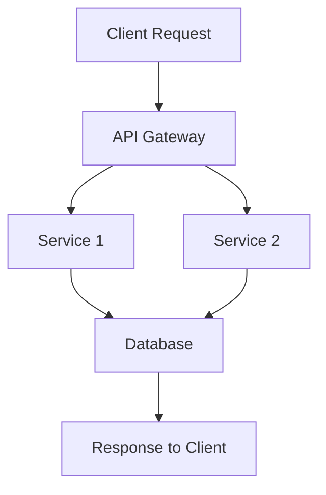
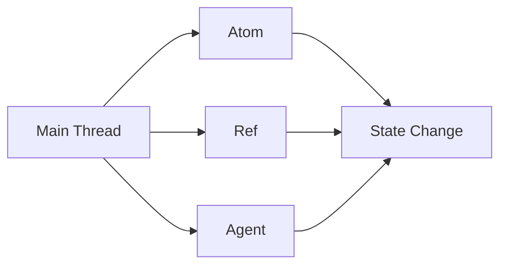

## 21.6 Architecting Large-Scale Functional Applications

As experienced Java developers, you are already familiar with the challenges of building scalable applications. Transitioning to Clojure, a functional programming language, offers unique advantages in architecting large-scale systems. In this section, we will delve into the principles and practices essential for designing scalable functional applications using Clojure.

### Scalable Architecture Principles

#### Modularity and Separation of Concerns

In large-scale applications, modularity and separation of concerns are vital for maintainability and scalability. Clojure's emphasis on immutability and pure functions naturally supports these principles.

- **Modularity**: Clojure encourages breaking down applications into smaller, reusable components. Each module should have a single responsibility, making it easier to test and maintain.

- **Separation of Concerns**: By separating data processing, state management, and side effects, Clojure allows developers to focus on one aspect of the application at a time. This separation is achieved through the use of namespaces, protocols, and multimethods.

**Example in Clojure**:
```clojure
(ns myapp.core
  (:require [myapp.db :as db]
            [myapp.api :as api]))

(defn process-data [data]
  ;; Pure function for data processing
  (map #(assoc % :processed true) data))

(defn handle-request [request]
  ;; Separate concerns: data retrieval, processing, and response
  (let [data (db/fetch-data request)
        processed-data (process-data data)]
    (api/send-response processed-data)))
```

**Comparison with Java**:
In Java, achieving modularity often involves using interfaces and abstract classes. Clojure's use of namespaces and protocols provides a more flexible and dynamic approach.

### Microservices and Services

#### Functional Programming and Microservices

Functional programming aligns well with microservices architectures due to its focus on statelessness and immutability. Each microservice can be a self-contained unit with its own state, reducing dependencies between services.

- **Stateless Services**: Clojure's pure functions make it easier to design stateless services, which are crucial for scalability and fault tolerance.

- **Service-Oriented Design**: By leveraging Clojure's capabilities, you can design services that are easy to deploy, scale, and maintain.

**Example in Clojure**:
```clojure
(ns myapp.service
  (:require [ring.adapter.jetty :refer [run-jetty]]
            [compojure.core :refer [defroutes GET]]
            [compojure.route :as route]))

(defroutes app-routes
  (GET "/status" [] "Service is running")
  (route/not-found "Not Found"))

(defn start-service []
  (run-jetty app-routes {:port 8080}))
```

**Comparison with Java**:
Java microservices often rely on frameworks like Spring Boot. Clojure's lightweight libraries, such as Ring and Compojure, offer a simpler alternative with less boilerplate code.

### Data Flow Management

#### Event-Driven Architectures and Message Queues

Managing data flow in large-scale applications requires efficient communication between components. Event-driven architectures and message queues are effective strategies for decoupling components and ensuring reliable data flow.

- **Event-Driven Architectures**: Clojure's functional nature makes it well-suited for event-driven systems, where events trigger data processing.

- **Message Queues**: Use message queues to handle asynchronous communication between services, improving scalability and fault tolerance.

**Example in Clojure**:
```clojure
(ns myapp.events
  (:require [clojure.core.async :as async]))

(defn process-event [event]
  ;; Process event data
  (println "Processing event:" event))

(defn start-event-loop []
  (let [event-chan (async/chan)]
    (async/go-loop []
      (when-let [event (async/<! event-chan)]
        (process-event event)
        (recur)))))
```

**Comparison with Java**:
Java developers often use frameworks like Kafka or RabbitMQ for message queuing. Clojure's `core.async` library provides a powerful alternative for managing asynchronous data flow.

### Concurrency and Parallelism

#### Handling High Concurrency and Parallel Processing

Concurrency and parallelism are critical for large-scale applications. Clojure offers several tools and techniques to manage concurrency effectively.

- **Concurrency Primitives**: Clojure provides atoms, refs, and agents for managing state changes in a concurrent environment.

- **Parallel Processing**: Use Clojure's parallel processing capabilities to distribute workloads across multiple cores, improving performance.

**Example in Clojure**:
```clojure
(ns myapp.concurrency
  (:require [clojure.core.async :as async]))

(defn parallel-task [data]
  ;; Perform parallel processing
  (println "Processing data:" data))

(defn start-parallel-processing [data-seq]
  (let [tasks (map #(async/thread (parallel-task %)) data-seq)]
    (doseq [task tasks]
      (async/<!! task))))
```

**Comparison with Java**:
Java's concurrency model often involves using threads and executors. Clojure's concurrency primitives offer a more declarative approach, reducing the complexity of managing threads.

### Monitoring and Observability

#### Importance of Monitoring, Logging, and Tracing

Monitoring and observability are essential for maintaining large-scale systems. They provide insights into system performance and help identify issues before they impact users.

- **Monitoring**: Use tools like Prometheus and Grafana to monitor system metrics and visualize performance data.

- **Logging**: Implement structured logging to capture detailed information about system behavior.

- **Tracing**: Use distributed tracing to track requests across services, identifying bottlenecks and improving performance.

**Example in Clojure**:
```clojure
(ns myapp.logging
  (:require [clojure.tools.logging :as log]))

(defn log-event [event]
  ;; Log event data
  (log/info "Event received:" event))

(defn monitor-system []
  ;; Monitor system metrics
  (log/info "Monitoring system performance"))
```

**Comparison with Java**:
Java developers often use tools like Log4j and SLF4J for logging. Clojure's `tools.logging` library provides similar functionality with a functional twist.

### Visual Aids

To better understand the flow of data and control in a large-scale functional application, let's visualize some of these concepts using diagrams.

#### Data Flow in a Microservices Architecture



*Caption*: This diagram illustrates a typical data flow in a microservices architecture, where an API Gateway routes requests to different services, which then interact with a shared database.

#### Concurrency Model in Clojure



*Caption*: This diagram shows how Clojure's concurrency primitives (atoms, refs, agents) manage state changes in a concurrent environment.

### References and Links

- [Official Clojure Documentation](https://clojure.org/)
- [ClojureDocs](https://clojuredocs.org/)
- [Clojure GitHub Repository](https://github.com/clojure/clojure)
- [Ring GitHub Repository](https://github.com/ring-clojure/ring)
- [Compojure GitHub Repository](https://github.com/weavejester/compojure)

### Knowledge Check

Let's reinforce what we've learned with some questions and exercises.

1. **What are the key benefits of using Clojure for microservices architectures?**
2. **How does Clojure's `core.async` library facilitate asynchronous data flow?**
3. **Explain the role of concurrency primitives in managing state changes.**
4. **Describe how monitoring and observability contribute to system reliability.**

### Exercises

1. **Modify the provided Clojure code examples** to include additional functionality, such as error handling or logging.
2. **Implement a simple microservice** using Clojure that processes incoming requests and returns a JSON response.
3. **Create a data flow diagram** for a hypothetical application using the concepts discussed.

### Summary

In this section, we've explored the architectural principles and practices essential for building large-scale functional applications with Clojure. By leveraging Clojure's strengths in modularity, concurrency, and data flow management, you can design systems that are scalable, maintainable, and resilient. As you continue to explore Clojure, remember to apply these principles to your projects, and don't hesitate to experiment with the code examples provided.

## Quiz: Architecting Large-Scale Functional Applications



### What is a key benefit of using Clojure for microservices architectures?

- [x] Statelessness and immutability
- [ ] Complex class hierarchies
- [ ] Heavy use of inheritance
- [ ] Tight coupling between components

> **Explanation:** Clojure's emphasis on statelessness and immutability aligns well with microservices architectures, promoting scalability and fault tolerance.


### How does Clojure's `core.async` library facilitate asynchronous data flow?

- [x] By providing channels for communication
- [ ] By using traditional threading models
- [ ] By enforcing synchronous processing
- [ ] By relying on external libraries

> **Explanation:** `core.async` provides channels that allow for asynchronous communication between components, enabling efficient data flow.


### What is the role of concurrency primitives in Clojure?

- [x] Managing state changes in a concurrent environment
- [ ] Enforcing sequential execution
- [ ] Complicating state management
- [ ] Reducing performance

> **Explanation:** Concurrency primitives like atoms, refs, and agents help manage state changes safely in a concurrent environment.


### Why is monitoring important in large-scale systems?

- [x] It provides insights into system performance
- [ ] It complicates system architecture
- [ ] It reduces system reliability
- [ ] It is only necessary for small systems

> **Explanation:** Monitoring provides valuable insights into system performance, helping identify issues before they impact users.


### Which tool is commonly used for monitoring system metrics in Clojure applications?

- [x] Prometheus
- [ ] Log4j
- [ ] Kafka
- [ ] RabbitMQ

> **Explanation:** Prometheus is a popular tool for monitoring system metrics and visualizing performance data.


### What is a common use of message queues in large-scale applications?

- [x] Handling asynchronous communication
- [ ] Enforcing synchronous processing
- [ ] Increasing system complexity
- [ ] Reducing data flow

> **Explanation:** Message queues handle asynchronous communication between services, improving scalability and fault tolerance.


### How can structured logging benefit a Clojure application?

- [x] By capturing detailed information about system behavior
- [ ] By reducing system performance
- [ ] By complicating code
- [ ] By enforcing immutability

> **Explanation:** Structured logging captures detailed information about system behavior, aiding in debugging and monitoring.


### What is a key advantage of using pure functions in Clojure?

- [x] They are easier to test and maintain
- [ ] They rely on mutable state
- [ ] They complicate code structure
- [ ] They enforce tight coupling

> **Explanation:** Pure functions are easier to test and maintain because they do not rely on mutable state or side effects.


### How does Clojure's approach to modularity differ from Java's?

- [x] It uses namespaces and protocols
- [ ] It relies heavily on inheritance
- [ ] It requires complex class hierarchies
- [ ] It enforces tight coupling

> **Explanation:** Clojure uses namespaces and protocols for modularity, offering a more flexible and dynamic approach than Java's class-based system.


### True or False: Clojure's concurrency model is based on traditional threading.

- [ ] True
- [x] False

> **Explanation:** Clojure's concurrency model uses primitives like atoms, refs, and agents, offering a more declarative approach than traditional threading.



By understanding these concepts and applying them to your projects, you'll be well-equipped to architect large-scale functional applications with Clojure. Keep experimenting and learning, and you'll continue to grow as a developer in this exciting field.
