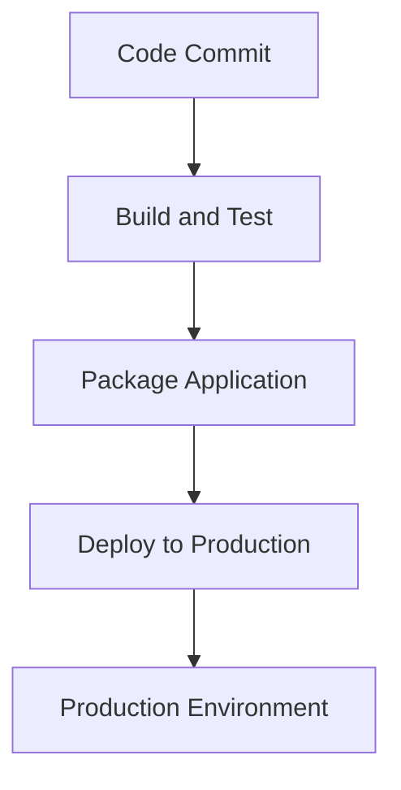

## 21.8 Automating Deployment with Clojure Tools

In the fast-paced world of software development, automating deployment processes is not just a luxury but a necessity. Automation ensures consistency, reduces human error, and accelerates the delivery of software to production environments. For developers transitioning from Java to Clojure, understanding how to leverage Clojure's ecosystem for deployment automation can significantly enhance productivity and reliability.

### Importance of Automation

Automating deployment processes is critical for several reasons:

- **Consistency**: Automated deployments ensure that the same process is followed every time, reducing the risk of human error.
- **Speed**: Automation speeds up the deployment process, allowing for more frequent releases and faster feedback loops.
- **Reliability**: Automated processes are less prone to errors compared to manual deployments, leading to more stable production environments.
- **Scalability**: As applications grow, manual deployment becomes impractical. Automation scales with your application, handling complex deployments effortlessly.

### Build Tools: Leiningen and Clojure CLI

Clojure offers powerful tools for managing dependencies, building projects, and automating tasks. Two primary tools in the Clojure ecosystem are Leiningen and the Clojure CLI with `deps.edn`.

#### Leiningen

[Leiningen](https://leiningen.org/) is a popular build automation tool for Clojure. It simplifies project management, dependency resolution, and task automation.

**Key Features of Leiningen:**

- **Dependency Management**: Define dependencies in a `project.clj` file, and Leiningen handles the rest.
- **Task Automation**: Automate common tasks like testing, building, and deploying with custom tasks.
- **Plugin Ecosystem**: Extend functionality with a wide range of plugins.

**Example `project.clj`:**

```clojure
(defproject my-clojure-app "0.1.0-SNAPSHOT"
  :description "A sample Clojure application"
  :dependencies [[org.clojure/clojure "1.10.3"]]
  :main ^:skip-aot my-clojure-app.core
  :target-path "target/%s"
  :profiles {:uberjar {:aot :all}})
```

#### Clojure CLI and `deps.edn`

The Clojure CLI tools provide a lightweight alternative to Leiningen, focusing on simplicity and flexibility.

**Key Features of Clojure CLI:**

- **Dependency Management**: Use `deps.edn` to specify dependencies and aliases.
- **Script Execution**: Run Clojure scripts directly from the command line.
- **Tooling Integration**: Easily integrate with other tools and libraries.

**Example `deps.edn`:**

```clojure
{:deps {org.clojure/clojure {:mvn/version "1.10.3"}}
 :aliases {:run {:main-opts ["-m" "my-clojure-app.core"]}}}
```

### Deployment Scripts with Tools.build

Writing deployment scripts in Clojure can be achieved using libraries like [Tools.build](https://clojure.org/guides/tools_build). This library provides a programmatic way to define build processes, making it easy to automate complex deployment tasks.

**Example Deployment Script:**

```clojure
(ns build
  (:require [clojure.tools.build.api :as b]))

(defn clean [_]
  (b/delete {:path "target"}))

(defn uberjar [_]
  (b/uber {:class-dir "classes"
           :uber-file "target/my-clojure-app.jar"
           :basis (b/create-basis {:project "deps.edn"})
           :main 'my-clojure-app.core}))

(defn deploy [_]
  (clean nil)
  (uberjar nil)
  ;; Add deployment logic here, e.g., uploading to a server
  (println "Deployment complete."))
```

### Continuous Deployment with Jenkins and GitHub Actions

Continuous deployment (CD) is the practice of automatically deploying every change that passes all stages of your production pipeline. This ensures that your software is always in a deployable state.

#### Setting Up Jenkins

[Jenkins](https://www.jenkins.io/) is a widely used open-source automation server that supports building, deploying, and automating any project.

**Jenkins Pipeline Example:**

```groovy
pipeline {
    agent any

    stages {
        stage('Build') {
            steps {
                script {
                    sh 'lein uberjar'
                }
            }
        }
        stage('Test') {
            steps {
                script {
                    sh 'lein test'
                }
            }
        }
        stage('Deploy') {
            steps {
                script {
                    sh 'scp target/my-clojure-app.jar user@server:/path/to/deploy'
                }
            }
        }
    }
}
```

#### Using GitHub Actions

[GitHub Actions](https://github.com/features/actions) provides a powerful platform for automating workflows directly from your GitHub repository.

**GitHub Actions Workflow Example:**

```yaml
name: Clojure CI

on:
  push:
    branches: [ main ]

jobs:
  build:
    runs-on: ubuntu-latest

    steps:
    - uses: actions/checkout@v2

    - name: Set up Clojure
      uses: DeLaGuardo/setup-clojure@v1
      with:
        cli: 'tools-deps'

    - name: Build with deps.edn
      run: clojure -T:build uberjar

    - name: Test
      run: clojure -M:test

    - name: Deploy
      run: scp target/my-clojure-app.jar user@server:/path/to/deploy
```

### Example Pipeline: From Code Commit to Production Deployment

Let's walk through an example pipeline that takes code from commit to production deployment using GitHub Actions.

1. **Code Commit**: A developer pushes code changes to the main branch of the repository.
2. **Build and Test**: GitHub Actions triggers a workflow that builds the project and runs tests.
3. **Package**: The application is packaged into an uberjar.
4. **Deploy**: The packaged application is deployed to a production server.

**Pipeline Diagram:**



### Knowledge Check

- **What are the benefits of automating deployment processes?**
- **How does Leiningen differ from the Clojure CLI tools?**
- **What is the purpose of a `deps.edn` file?**
- **How can Tools.build be used to automate deployment tasks?**
- **What are the key stages in a Jenkins pipeline?**

### Exercises

1. **Create a Deployment Script**: Write a deployment script using Tools.build that cleans, builds, and deploys your application.
2. **Set Up a Jenkins Pipeline**: Configure a Jenkins pipeline for a Clojure project that builds, tests, and deploys the application.
3. **Implement a GitHub Actions Workflow**: Create a GitHub Actions workflow that automates the build and deployment of a Clojure application.

### Conclusion

Automating deployment with Clojure tools not only streamlines your workflow but also enhances the reliability and consistency of your software delivery process. By leveraging tools like Leiningen, Clojure CLI, and continuous deployment platforms like Jenkins and GitHub Actions, you can ensure that your applications are always ready for production.

Now that we've explored how to automate deployment with Clojure tools, let's apply these concepts to build robust and scalable applications.

## Quiz: Mastering Deployment Automation with Clojure Tools



### What is one of the main benefits of automating deployment processes?

- [x] Consistency
- [ ] Increased manual intervention
- [ ] Slower release cycles
- [ ] More complex deployment scripts

> **Explanation:** Automating deployment processes ensures consistency by following the same process every time, reducing the risk of human error.

### Which tool is known for its plugin ecosystem and task automation in Clojure?

- [x] Leiningen
- [ ] Maven
- [ ] Gradle
- [ ] Ant

> **Explanation:** Leiningen is known for its plugin ecosystem and task automation capabilities, making it a popular choice for Clojure developers.

### What file is used by the Clojure CLI to specify dependencies?

- [x] `deps.edn`
- [ ] `pom.xml`
- [ ] `build.gradle`
- [ ] `project.clj`

> **Explanation:** The `deps.edn` file is used by the Clojure CLI to specify dependencies and aliases.

### Which library can be used to write deployment scripts in Clojure?

- [x] Tools.build
- [ ] Ring
- [ ] Compojure
- [ ] Luminus

> **Explanation:** Tools.build is a library that provides a programmatic way to define build processes and automate deployment tasks in Clojure.

### What is the purpose of the `uberjar` task in a deployment script?

- [x] To package the application into a single executable JAR file
- [ ] To delete temporary files
- [ ] To run unit tests
- [ ] To deploy the application to a server

> **Explanation:** The `uberjar` task packages the application into a single executable JAR file, which is often used for deployment.

### Which continuous deployment platform is integrated directly with GitHub repositories?

- [x] GitHub Actions
- [ ] Jenkins
- [ ] Travis CI
- [ ] CircleCI

> **Explanation:** GitHub Actions is integrated directly with GitHub repositories, providing a powerful platform for automating workflows.

### What is the first stage in a typical Jenkins pipeline?

- [x] Build
- [ ] Test
- [ ] Deploy
- [ ] Monitor

> **Explanation:** The first stage in a typical Jenkins pipeline is the Build stage, where the application is compiled and packaged.

### How does Tools.build enhance deployment automation in Clojure?

- [x] By providing a programmatic way to define build processes
- [ ] By offering a graphical user interface
- [ ] By integrating with Java EE
- [ ] By replacing the need for a version control system

> **Explanation:** Tools.build enhances deployment automation by providing a programmatic way to define build processes, making it easier to automate complex tasks.

### What is the role of the `clean` function in a deployment script?

- [x] To delete temporary files and prepare the environment for a fresh build
- [ ] To compile the application
- [ ] To deploy the application
- [ ] To run integration tests

> **Explanation:** The `clean` function deletes temporary files and prepares the environment for a fresh build, ensuring a clean slate for the deployment process.

### True or False: Automating deployment processes can lead to more frequent releases and faster feedback loops.

- [x] True
- [ ] False

> **Explanation:** True. Automating deployment processes can lead to more frequent releases and faster feedback loops, as it speeds up the deployment process and reduces manual intervention.


