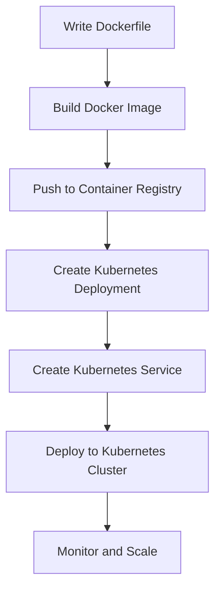

## 21.9 Containerization with Docker and Kubernetes

As experienced Java developers transitioning to Clojure, you are likely familiar with the challenges of deploying applications across different environments. Containerization offers a solution by providing consistent environments and simplifying deployments. In this section, we will explore how to containerize Clojure applications using Docker and manage them at scale with Kubernetes.

### Benefits of Containerization

Containerization encapsulates an application and its dependencies into a single, lightweight unit called a container. This approach offers several benefits:

- **Consistency Across Environments**: Containers ensure that applications run the same way regardless of where they are deployed, eliminating the "it works on my machine" problem.
- **Simplified Deployment**: Containers can be easily moved between development, testing, and production environments, streamlining the deployment process.
- **Scalability**: Containers can be quickly scaled up or down to meet demand, making them ideal for cloud-native applications.
- **Isolation**: Containers provide a level of isolation between applications, reducing the risk of conflicts and improving security.

### Docker Basics

Docker is a platform that enables developers to build, ship, and run applications in containers. Let's explore how to containerize a Clojure application using Docker.

#### Installing Docker

First, ensure Docker is installed on your system. You can download Docker from the [official website](https://www.docker.com/products/docker-desktop).

#### Containerizing a Clojure Application

To containerize a Clojure application, you need to create a Dockerfile, which is a script containing instructions on how to build the Docker image.

**Example Dockerfile for a Clojure Application**

```dockerfile
# Use the official Clojure image as the base
FROM clojure:openjdk-11-lein

# Set the working directory
WORKDIR /app

# Copy the project files into the container
COPY . .

# Install dependencies and build the application
RUN lein deps && lein uberjar

# Expose the application port
EXPOSE 3000

# Run the application
CMD ["java", "-jar", "target/myapp-standalone.jar"]
```

**Key Points:**

- **Base Image**: We use the official Clojure image, which includes OpenJDK and Leiningen, a build tool for Clojure.
- **Working Directory**: The `WORKDIR` command sets the working directory inside the container.
- **Copying Files**: The `COPY` command copies the application files into the container.
- **Building the Application**: The `RUN` command installs dependencies and builds the application using Leiningen.
- **Exposing Ports**: The `EXPOSE` command specifies the port the application will listen on.
- **Running the Application**: The `CMD` command defines the command to run the application.

#### Building and Running the Docker Image

To build the Docker image, navigate to the directory containing the Dockerfile and run:

```bash
docker build -t my-clojure-app .
```

To run the Docker container, use:

```bash
docker run -p 3000:3000 my-clojure-app
```

This command maps port 3000 on your host to port 3000 in the container, allowing you to access the application at `http://localhost:3000`.

### Writing Dockerfiles: Best Practices

When writing Dockerfiles for Clojure applications, consider the following best practices:

- **Use Official Base Images**: Start with official images to ensure compatibility and security.
- **Minimize Layers**: Combine commands to reduce the number of layers in the image, improving build times and performance.
- **Leverage Caching**: Order commands to maximize caching, placing less frequently changed commands first.
- **Security**: Avoid running applications as the root user inside containers. Use a non-root user for enhanced security.
- **Environment Variables**: Use environment variables to configure applications, making them more flexible and portable.

### Orchestrating with Kubernetes

Kubernetes is an open-source platform for automating the deployment, scaling, and management of containerized applications. It provides a robust framework for running distributed systems resiliently.

#### Kubernetes Architecture Overview

Kubernetes consists of several components:

- **Master Node**: Manages the cluster and coordinates activities such as scheduling and scaling.
- **Worker Nodes**: Run the containerized applications.
- **Pods**: The smallest deployable units in Kubernetes, which can contain one or more containers.
- **Services**: Define a logical set of Pods and a policy to access them.
- **Deployments**: Manage the deployment and scaling of Pods.

#### Deploying a Clojure Application on Kubernetes

To deploy a Clojure application on Kubernetes, you need to define a Deployment and a Service.

**Example Kubernetes Deployment**

```yaml
apiVersion: apps/v1
kind: Deployment
metadata:
  name: clojure-app
spec:
  replicas: 3
  selector:
    matchLabels:
      app: clojure-app
  template:
    metadata:
      labels:
        app: clojure-app
    spec:
      containers:
      - name: clojure-app
        image: my-clojure-app
        ports:
        - containerPort: 3000
```

**Example Kubernetes Service**

```yaml
apiVersion: v1
kind: Service
metadata:
  name: clojure-app-service
spec:
  type: LoadBalancer
  selector:
    app: clojure-app
  ports:
  - protocol: TCP
    port: 80
    targetPort: 3000
```

**Key Points:**

- **Deployment**: Defines the desired state for the application, including the number of replicas and the container image.
- **Service**: Exposes the application to external traffic, using a LoadBalancer to distribute requests.

#### Scaling and Managing Containers

Kubernetes makes it easy to scale applications by adjusting the number of replicas in a Deployment. For example, to scale the Clojure application to five replicas, use:

```bash
kubectl scale deployment clojure-app --replicas=5
```

Kubernetes also provides features for rolling updates, self-healing, and resource management, ensuring your applications run smoothly and efficiently.

### Deployment Examples

Let's walk through deploying a Clojure application on Kubernetes, including configuration of services, deployments, and scaling.

1. **Create a Docker Image**: Build and push the Docker image to a container registry (e.g., Docker Hub).

2. **Define Kubernetes Resources**: Create YAML files for the Deployment and Service.

3. **Deploy to Kubernetes**: Use `kubectl` to apply the configurations:

   ```bash
   kubectl apply -f deployment.yaml
   kubectl apply -f service.yaml
   ```

4. **Monitor and Scale**: Use Kubernetes commands to monitor the application and adjust resources as needed.

### Visualizing the Deployment Process

Below is a diagram illustrating the flow of deploying a Clojure application using Docker and Kubernetes:



**Diagram Description**: This flowchart outlines the steps to containerize and deploy a Clojure application using Docker and Kubernetes, from writing a Dockerfile to monitoring and scaling the application in a Kubernetes cluster.

### References and Links

- [Docker Official Documentation](https://docs.docker.com/)
- [Kubernetes Official Documentation](https://kubernetes.io/docs/home/)
- [Clojure Docker Image on Docker Hub](https://hub.docker.com/_/clojure)
- [Leiningen Build Tool](https://leiningen.org/)

### Knowledge Check

To reinforce your understanding of containerization with Docker and Kubernetes, try answering the following questions and challenges.

## Quiz: Mastering Containerization with Docker and Kubernetes



### What is the primary benefit of containerization?

- [x] Consistency across environments
- [ ] Increased memory usage
- [ ] Slower deployment times
- [ ] Reduced application isolation

> **Explanation:** Containerization ensures that applications run consistently across different environments, eliminating discrepancies.

### Which command is used to build a Docker image?

- [x] docker build
- [ ] docker run
- [ ] docker create
- [ ] docker start

> **Explanation:** The `docker build` command is used to create a Docker image from a Dockerfile.

### What is a Kubernetes Pod?

- [x] The smallest deployable unit in Kubernetes
- [ ] A single container
- [ ] A Kubernetes node
- [ ] A type of service

> **Explanation:** A Pod is the smallest deployable unit in Kubernetes, which can contain one or more containers.

### How do you expose a port in a Dockerfile?

- [x] EXPOSE
- [ ] PORT
- [ ] OPEN
- [ ] LISTEN

> **Explanation:** The `EXPOSE` command is used in a Dockerfile to specify the ports on which a container listens for connections.

### What is the role of a Kubernetes Service?

- [x] To expose Pods to external traffic
- [ ] To manage container images
- [ ] To build Docker images
- [ ] To create Pods

> **Explanation:** A Kubernetes Service exposes Pods to external traffic and provides load balancing.

### Which command scales a Kubernetes Deployment?

- [x] kubectl scale
- [ ] kubectl create
- [ ] kubectl expose
- [ ] kubectl delete

> **Explanation:** The `kubectl scale` command is used to adjust the number of replicas in a Kubernetes Deployment.

### What is the purpose of a Dockerfile?

- [x] To define how to build a Docker image
- [ ] To run a Docker container
- [ ] To manage Kubernetes resources
- [ ] To create a Kubernetes Pod

> **Explanation:** A Dockerfile contains instructions on how to build a Docker image.

### Which Kubernetes component manages the cluster?

- [x] Master Node
- [ ] Worker Node
- [ ] Pod
- [ ] Service

> **Explanation:** The Master Node manages the Kubernetes cluster and coordinates activities.

### What is the benefit of using a LoadBalancer in Kubernetes?

- [x] Distributes traffic across multiple Pods
- [ ] Increases memory usage
- [ ] Slows down deployment
- [ ] Reduces application isolation

> **Explanation:** A LoadBalancer distributes incoming traffic across multiple Pods, ensuring efficient resource utilization.

### True or False: Containers provide a level of isolation between applications.

- [x] True
- [ ] False

> **Explanation:** Containers provide isolation, reducing the risk of conflicts and improving security.



By mastering containerization with Docker and Kubernetes, you can ensure your Clojure applications are consistently deployed and easily managed at scale. Now, let's apply these concepts to build scalable, resilient applications in your development projects.
