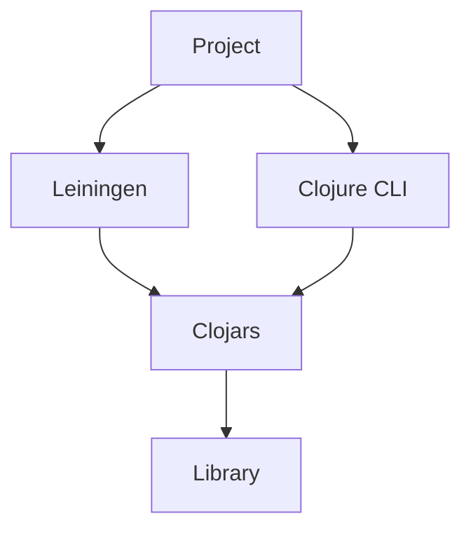
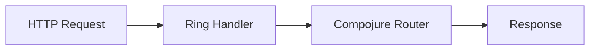

## 22.1 Overview of Essential Clojure Libraries

Clojure, a dynamic, functional programming language, boasts a rich ecosystem of libraries that empower developers to build scalable and efficient applications. In this section, we'll explore the landscape of Clojure libraries, how to find and manage them, and highlight some essential libraries across various domains. This guide is particularly tailored for experienced Java developers transitioning to Clojure, leveraging your existing knowledge to ease the learning curve.

### Library Landscape

Clojure's library ecosystem is vast and diverse, providing tools and utilities for a wide range of applications, from web development to data processing and beyond. The community-driven nature of Clojure ensures that libraries are constantly evolving, with new contributions enriching the ecosystem.

#### Finding Libraries

To discover libraries in the Clojure ecosystem, two primary platforms stand out:

- **[Clojars](https://clojars.org/):** Clojars is a community-driven repository for Clojure libraries, akin to Maven Central in the Java world. It hosts a plethora of libraries, making it a go-to resource for Clojure developers.

- **[Stasis](https://stasis.clojureverse.org/):** Stasis is a curated list of Clojure libraries, tools, and resources. It provides a structured overview of available libraries, categorized by domain, which can be particularly helpful for newcomers looking to explore the ecosystem.

Both platforms offer search functionalities, allowing you to find libraries based on keywords, categories, or specific needs.

#### Dependency Management

Managing dependencies in Clojure is streamlined through tools like **Leiningen** and the **Clojure CLI tools**. These tools facilitate the inclusion of libraries in your projects, ensuring that dependencies are resolved and managed efficiently.

- **Leiningen:** A build automation tool for Clojure, similar to Maven for Java. Leiningen uses a `project.clj` file to specify dependencies, plugins, and other project configurations.

  ```clojure
  ;; Example project.clj
  (defproject my-clojure-app "0.1.0-SNAPSHOT"
    :dependencies [[org.clojure/clojure "1.10.3"]
                   [ring/ring-core "1.9.0"]])
  ```

- **Clojure CLI tools:** These tools use a `deps.edn` file for dependency management, offering a more flexible and modern approach compared to Leiningen.

  ```clojure
  ;; Example deps.edn
  {:deps {org.clojure/clojure {:mvn/version "1.10.3"}
          ring/ring-core {:mvn/version "1.9.0"}}}
  ```

Both tools integrate seamlessly with Clojars, allowing you to easily add and update dependencies.

#### Community and Support

When selecting libraries, it's crucial to consider community support and activity. Libraries with active communities are more likely to receive updates, bug fixes, and new features. Engaging with the community through forums, GitHub issues, and mailing lists can provide valuable insights and support.

### Highlighted Libraries

Let's delve into some essential Clojure libraries across different domains, providing you with a solid foundation to build upon.

#### Web Development

- **Ring:** A foundational library for building web applications in Clojure. It provides a simple and flexible way to handle HTTP requests and responses, similar to Java's Servlet API.

  ```clojure
  ;; Basic Ring handler example
  (defn handler [request]
    {:status 200
     :headers {"Content-Type" "text/plain"}
     :body "Hello, World!"})
  ```

- **Compojure:** A routing library built on top of Ring, offering concise and expressive syntax for defining routes.

  ```clojure
  ;; Compojure routing example
  (use 'compojure.core)
  (defroutes app-routes
    (GET "/" [] "Welcome to Compojure!")
    (GET "/hello/:name" [name] (str "Hello, " name "!")))
  ```

- **Luminus:** A framework that combines several libraries, including Ring and Compojure, to provide a comprehensive solution for web development.

#### Data Processing

- **core.async:** A library for asynchronous programming, providing channels and processes for managing concurrency, akin to Java's CompletableFuture and ExecutorService.

  ```clojure
  ;; core.async example
  (require '[clojure.core.async :refer [go chan >! <!]])
  (let [c (chan)]
    (go (>! c "Hello, async world!"))
    (println (<! c)))
  ```

- **Clojure.spec:** A library for data validation and specification, offering a powerful way to define and enforce data structures.

  ```clojure
  ;; Clojure.spec example
  (require '[clojure.spec.alpha :as s])
  (s/def ::name string?)
  (s/valid? ::name "Alice") ;; => true
  ```

#### Testing

- **clojure.test:** The built-in testing framework for Clojure, providing a simple and effective way to write unit tests.

  ```clojure
  ;; clojure.test example
  (require '[clojure.test :refer :all])
  (deftest test-addition
    (is (= 4 (+ 2 2))))
  ```

- **test.check:** A library for property-based testing, allowing you to define properties that your code should satisfy and automatically generating test cases.

  ```clojure
  ;; test.check example
  (require '[clojure.test.check :as tc]
           '[clojure.test.check.generators :as gen]
           '[clojure.test.check.properties :as prop])

  (def prop-addition
    (prop/for-all [a gen/int
                   b gen/int]
      (= (+ a b) (+ b a))))

  (tc/quick-check 100 prop-addition)
  ```

### Visual Aids

To better understand the flow of data and the structure of Clojure libraries, let's explore some visual aids.

#### Dependency Management Flow



*Diagram 1: Dependency management flow in Clojure using Leiningen and Clojure CLI tools.*

#### Web Development with Ring and Compojure



*Diagram 2: Flow of an HTTP request through Ring and Compojure.*

### References and Links

- [Clojure Official Documentation](https://clojure.org/)
- [ClojureDocs](https://clojuredocs.org/)
- [Clojars](https://clojars.org/)
- [Stasis](https://stasis.clojureverse.org/)

### Knowledge Check

To reinforce your understanding, consider these questions:

1. What are the primary platforms for discovering Clojure libraries?
2. How does dependency management in Clojure compare to Java?
3. Why is community support important when choosing a library?
4. How does Ring handle HTTP requests in Clojure?
5. What is the purpose of core.async in Clojure?

### Encouraging Tone

As we explore the rich ecosystem of Clojure libraries, remember that each library you integrate into your project is a step towards building more robust and scalable applications. Embrace the community, experiment with different libraries, and enjoy the journey of mastering Clojure.

### Best Practices for Tags

- "Clojure"
- "Functional Programming"
- "Libraries"
- "Dependency Management"
- "Web Development"
- "Data Processing"
- "Testing"
- "Java Interoperability"

---

## Quiz: Mastering Clojure Libraries



### What is Clojars?

- [x] A community-driven repository for Clojure libraries.
- [ ] A build tool for Clojure projects.
- [ ] A testing framework for Clojure.
- [ ] A web development library for Clojure.

> **Explanation:** Clojars is a community-driven repository where Clojure libraries are hosted, similar to Maven Central for Java.

### Which tool uses `project.clj` for dependency management?

- [x] Leiningen
- [ ] Clojure CLI tools
- [ ] Maven
- [ ] Gradle

> **Explanation:** Leiningen uses `project.clj` to manage dependencies, similar to how Maven uses `pom.xml`.

### What is the primary purpose of core.async?

- [x] To provide asynchronous programming capabilities in Clojure.
- [ ] To handle HTTP requests in web applications.
- [ ] To manage database connections.
- [ ] To perform unit testing.

> **Explanation:** core.async is used for asynchronous programming, providing channels and processes to manage concurrency.

### Which library is built on top of Ring for routing?

- [x] Compojure
- [ ] Luminus
- [ ] core.async
- [ ] clojure.test

> **Explanation:** Compojure is a routing library built on top of Ring, providing a concise syntax for defining routes.

### What is the role of Clojure.spec?

- [x] Data validation and specification.
- [ ] Web development.
- [ ] Asynchronous programming.
- [ ] Dependency management.

> **Explanation:** Clojure.spec is used for data validation and specification, allowing developers to define and enforce data structures.

### Which library is used for property-based testing in Clojure?

- [x] test.check
- [ ] clojure.test
- [ ] core.async
- [ ] Ring

> **Explanation:** test.check is a library for property-based testing, automatically generating test cases based on defined properties.

### What is the function of Ring in Clojure?

- [x] Handling HTTP requests and responses.
- [ ] Managing dependencies.
- [ ] Performing asynchronous tasks.
- [ ] Validating data.

> **Explanation:** Ring is used for handling HTTP requests and responses, forming the foundation for web applications in Clojure.

### Which tool uses `deps.edn` for dependency management?

- [x] Clojure CLI tools
- [ ] Leiningen
- [ ] Maven
- [ ] Gradle

> **Explanation:** Clojure CLI tools use `deps.edn` for managing dependencies, offering a modern approach compared to Leiningen.

### Why is community support important for libraries?

- [x] It ensures libraries receive updates and bug fixes.
- [ ] It guarantees the library will be free.
- [ ] It provides automatic integration with IDEs.
- [ ] It allows for faster compilation times.

> **Explanation:** Community support is crucial as it ensures libraries are actively maintained, receiving updates and bug fixes.

### True or False: Stasis is a build tool for Clojure.

- [ ] True
- [x] False

> **Explanation:** Stasis is not a build tool; it is a curated list of Clojure libraries, tools, and resources.


