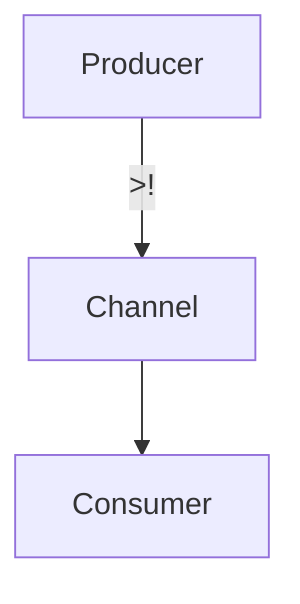

## 22.2 Data Processing with `core.async` and `manifold`

In today's world of software development, handling concurrent data processing tasks efficiently is crucial for building scalable applications. Asynchronous programming is a powerful paradigm that allows developers to manage multiple operations simultaneously without blocking the main execution thread. In this section, we will explore two prominent Clojure libraries, `core.async` and `manifold`, which provide robust tools for managing asynchronous workflows.

### Asynchronous Programming

Asynchronous programming is essential for applications that require high concurrency, such as web servers, real-time data processing systems, and interactive user interfaces. By allowing tasks to run independently, asynchronous programming helps in optimizing resource utilization and improving application responsiveness.

#### Why Asynchronous Programming?

- **Non-blocking Operations**: Asynchronous programming enables non-blocking operations, allowing other tasks to proceed while waiting for I/O operations to complete.
- **Concurrency**: It allows multiple tasks to run concurrently, improving throughput and performance.
- **Resource Efficiency**: By not tying up threads waiting for operations to complete, asynchronous programming makes better use of system resources.

### `core.async`

`core.async` is a Clojure library that brings the power of asynchronous programming to Clojure applications. It provides constructs such as channels and go blocks to facilitate communication and coordination between concurrent tasks.

#### Key Concepts in `core.async`

- **Channels**: Channels are the primary means of communication between different parts of a program. They can be thought of as queues that allow data to be passed between threads.
- **Go Blocks**: Go blocks are lightweight threads that allow you to write asynchronous code in a synchronous style. They use channels to communicate with other go blocks or threads.

#### Using `core.async`

Let's explore how to use `core.async` with a simple example:

```clojure
(require '[clojure.core.async :refer [chan go >! <!]])

;; Create a channel
(def my-channel (chan))

;; Producer: sends data to the channel
(go
  (doseq [i (range 5)]
    (>! my-channel i)
    (println "Sent:" i)))

;; Consumer: receives data from the channel
(go
  (loop []
    (when-let [value (<! my-channel)]
      (println "Received:" value)
      (recur))))
```

In this example, we create a channel `my-channel` and use two go blocks: one to send data to the channel and another to receive data from it. The `>!` operator is used to put data onto the channel, while `<!` is used to take data from the channel.

#### Advantages of `core.async`

- **Simplicity**: Provides a simple model for asynchronous programming using channels and go blocks.
- **Flexibility**: Allows for complex coordination patterns between concurrent tasks.

### `manifold`

`manifold` is another Clojure library that provides abstractions for asynchronous programming. It offers deferreds and streams to manage asynchronous data flow, making it easier to work with asynchronous operations.

#### Key Concepts in `manifold`

- **Deferreds**: Deferreds are similar to Java's `CompletableFuture` or JavaScript's `Promise`. They represent a value that will be available at some point in the future.
- **Streams**: Streams are similar to channels in `core.async`, but they provide additional functionality for transforming and combining data flows.

#### Using `manifold`

Here's a basic example of using `manifold`:

```clojure
(require '[manifold.deferred :as d]
         '[manifold.stream :as s])

;; Create a deferred
(def my-deferred (d/deferred))

;; Add a callback to the deferred
(d/chain my-deferred
  (fn [result]
    (println "Deferred result:" result)))

;; Deliver a value to the deferred
(d/success! my-deferred 42)

;; Create a stream
(def my-stream (s/stream))

;; Add a callback to the stream
(s/consume println my-stream)

;; Put values onto the stream
(s/put! my-stream "Hello")
(s/put! my-stream "World")
```

In this example, we create a deferred `my-deferred` and a stream `my-stream`. We use `d/chain` to add a callback to the deferred and `s/consume` to add a callback to the stream. The `d/success!` function delivers a value to the deferred, while `s/put!` puts values onto the stream.

#### Advantages of `manifold`

- **Rich API**: Provides a rich set of functions for working with asynchronous data flows.
- **Integration**: Easily integrates with other Clojure libraries and Java code.

### Comparative Analysis

Both `core.async` and `manifold` offer powerful tools for asynchronous programming in Clojure, but they have different strengths and use cases.

#### `core.async` vs. `manifold`

| Feature          | `core.async`                          | `manifold`                           |
|------------------|---------------------------------------|--------------------------------------|
| **Abstractions** | Channels and go blocks                | Deferreds and streams                |
| **Ease of Use**  | Simple model, but requires more setup | Rich API, easier integration         |
| **Performance**  | Lightweight, efficient                | Slightly more overhead               |
| **Integration**  | Clojure-centric                       | Better integration with Java         |

### Use Cases and Examples

#### Data Processing with `core.async`

Let's consider a scenario where we need to process a stream of data asynchronously. We can use `core.async` to manage the data flow:

```clojure
(require '[clojure.core.async :refer [chan go >! <! close!]])

(defn process-data [data]
  (println "Processing" data))

(defn async-data-processor [data-seq]
  (let [c (chan)]
    (go
      (doseq [data data-seq]
        (>! c data))
      (close! c))
    (go
      (loop []
        (when-let [data (<! c)]
          (process-data data)
          (recur))))))

(async-data-processor [1 2 3 4 5])
```

In this example, we create a channel `c` and use a go block to send data from `data-seq` to the channel. Another go block receives data from the channel and processes it using the `process-data` function.

#### Data Processing with `manifold`

Now, let's see how we can achieve the same task using `manifold`:

```clojure
(require '[manifold.stream :as s])

(defn process-data [data]
  (println "Processing" data))

(defn manifold-data-processor [data-seq]
  (let [stream (s/stream)]
    (s/consume process-data stream)
    (doseq [data data-seq]
      (s/put! stream data))))

(manifold-data-processor [1 2 3 4 5])
```

Here, we create a stream `stream` and use `s/consume` to process data as it is put onto the stream. The `s/put!` function is used to put data onto the stream.

### Try It Yourself

To deepen your understanding, try modifying the examples above:

- **Experiment with different data sequences**: Change the data sequences and observe how the processing changes.
- **Add error handling**: Implement error handling in both `core.async` and `manifold` examples.
- **Combine both libraries**: Use `core.async` for some parts of the workflow and `manifold` for others to see how they can complement each other.

### Visual Aids

To better understand the flow of data in asynchronous programming, consider the following diagram illustrating the data flow in `core.async`:



This diagram shows a producer sending data to a channel, which is then consumed by a consumer.

### References and Links

- [core.async GitHub Repository](https://github.com/clojure/core.async)
- [Manifold GitHub Repository](https://github.com/ztellman/manifold)
- [Official Clojure Documentation](https://clojure.org/reference/documentation)

### Knowledge Check

- What are the main abstractions provided by `core.async` and `manifold`?
- How do channels in `core.async` differ from streams in `manifold`?
- What are some common use cases for asynchronous programming in Clojure?

### Exercises

1. Implement a data processing pipeline using `core.async` that filters and transforms data before processing it.
2. Create a similar pipeline using `manifold` and compare the implementation with the `core.async` version.
3. Explore how to handle errors in asynchronous workflows using both libraries.

### Summary

In this section, we've explored the power of asynchronous programming in Clojure using `core.async` and `manifold`. Both libraries provide unique tools for managing concurrent workflows, each with its own strengths and use cases. By understanding these tools, you can build efficient, scalable applications that handle data processing tasks with ease.

Now that we've covered the basics of asynchronous programming in Clojure, let's move on to explore other functional libraries and the broader Clojure ecosystem.

## Quiz on Asynchronous Data Processing with `core.async` and `manifold`



### What is the primary purpose of asynchronous programming?

- [x] To allow tasks to run independently without blocking the main execution thread.
- [ ] To execute tasks sequentially.
- [ ] To simplify code readability.
- [ ] To reduce memory usage.

> **Explanation:** Asynchronous programming allows tasks to run independently, optimizing resource utilization and improving application responsiveness.

### Which of the following is a key feature of `core.async`?

- [x] Channels
- [ ] Deferreds
- [ ] Promises
- [ ] Futures

> **Explanation:** `core.async` uses channels as the primary means of communication between concurrent tasks.

### What is a deferred in `manifold`?

- [x] A value that will be available at some point in the future.
- [ ] A synchronous function call.
- [ ] A blocking operation.
- [ ] A type of channel.

> **Explanation:** Deferreds in `manifold` are similar to Java's `CompletableFuture` or JavaScript's `Promise`, representing a value that will be available in the future.

### How do you put data onto a channel in `core.async`?

- [x] Using the `>!` operator.
- [ ] Using the `<!` operator.
- [ ] Using the `put!` function.
- [ ] Using the `send` function.

> **Explanation:** The `>!` operator is used to put data onto a channel in `core.async`.

### Which library provides a richer API for working with asynchronous data flows?

- [ ] `core.async`
- [x] `manifold`
- [ ] Both provide the same API
- [ ] Neither provide an API

> **Explanation:** `manifold` provides a richer set of functions for working with asynchronous data flows compared to `core.async`.

### What is the main difference between channels in `core.async` and streams in `manifold`?

- [x] Streams provide additional functionality for transforming and combining data flows.
- [ ] Channels are more efficient than streams.
- [ ] Streams are only used for synchronous operations.
- [ ] Channels can only be used with Java.

> **Explanation:** Streams in `manifold` offer additional functionality for transforming and combining data flows, unlike channels in `core.async`.

### Which of the following is a common use case for asynchronous programming?

- [x] Real-time data processing systems
- [ ] Static website generation
- [ ] Simple command-line applications
- [ ] Single-threaded applications

> **Explanation:** Asynchronous programming is commonly used in real-time data processing systems to handle high concurrency.

### How do you deliver a value to a deferred in `manifold`?

- [x] Using the `d/success!` function.
- [ ] Using the `>!` operator.
- [ ] Using the `<!` operator.
- [ ] Using the `send` function.

> **Explanation:** The `d/success!` function is used to deliver a value to a deferred in `manifold`.

### Which library is better integrated with Java?

- [ ] `core.async`
- [x] `manifold`
- [ ] Both have the same level of integration
- [ ] Neither integrate with Java

> **Explanation:** `manifold` is better integrated with Java, making it easier to use in Java-centric environments.

### True or False: `core.async` and `manifold` can be used together in a single application.

- [x] True
- [ ] False

> **Explanation:** Both `core.async` and `manifold` can be used together in a single application to leverage their respective strengths.


