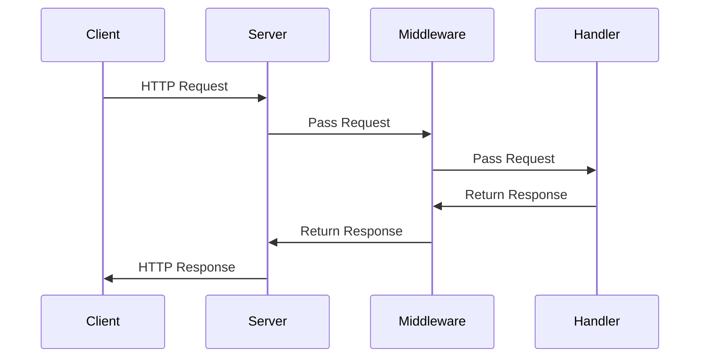

## 22.3 Web Development with `Ring` and `Compojure`

In this section, we delve into the world of web development using Clojure, focusing on two essential libraries: `Ring` and `Compojure`. These libraries provide the foundational tools for building robust, scalable web applications in Clojure. As experienced Java developers, you will find parallels with Java's servlet-based web frameworks, but with the added benefits of Clojure's functional programming paradigm.

### Understanding `Ring`

`Ring` is a Clojure library that provides a simple and flexible abstraction for web applications. It is inspired by Ruby's Rack and serves as the foundation for many Clojure web frameworks. At its core, `Ring` defines a protocol for HTTP request and response handling, allowing developers to build web applications by composing functions.

#### The `Ring` Abstraction

In `Ring`, a web application is essentially a function that takes a request map and returns a response map. This functional approach aligns with Clojure's emphasis on immutability and pure functions. Here's a basic example of a `Ring` handler:

```clojure
(defn handler [request]
  {:status 200
   :headers {"Content-Type" "text/plain"}
   :body "Hello, World!"})
```

In this example, the `handler` function takes a `request` map and returns a `response` map with a status code, headers, and body. This simplicity allows for easy testing and composition of web applications.

#### Middleware Concept

Middleware in `Ring` is a powerful concept that allows you to wrap handlers with additional functionality. Middleware functions take a handler as an argument and return a new handler. This is similar to Java's servlet filters but with a more functional approach.

For example, you can create middleware to log requests:

```clojure
(defn wrap-logger [handler]
  (fn [request]
    (println "Request received:" request)
    (handler request)))
```

You can then apply this middleware to your handler:

```clojure
(def app
  (wrap-logger handler))
```

This pattern allows you to compose multiple middleware functions, adding features like session handling, authentication, and more.

### Routing with `Compojure`

`Compojure` is a routing library for Clojure that builds on top of `Ring`. It provides a concise and expressive syntax for defining routes and handling HTTP requests. If you are familiar with Java's Spring MVC or JAX-RS, you'll appreciate `Compojure`'s ability to define routes in a declarative manner.

#### Defining Routes

With `Compojure`, you define routes using the `defroutes` macro. Here's an example:

```clojure
(ns myapp.core
  (:require [compojure.core :refer :all]
            [ring.adapter.jetty :refer [run-jetty]]))

(defroutes app-routes
  (GET "/" [] "Welcome to my app!")
  (GET "/hello/:name" [name] (str "Hello, " name "!")))

(def app
  (wrap-logger app-routes))

(run-jetty app {:port 3000})
```

In this example, we define two routes: one for the root path `/` and another for `/hello/:name`, which captures a path parameter. The `GET` macro is used to specify the HTTP method and path.

#### Handling HTTP Requests

`Compojure` makes it easy to handle different HTTP methods and extract parameters from requests. You can use destructuring to access query parameters, path parameters, and more.

```clojure
(GET "/search" [query]
  (str "Searching for: " query))
```

This route extracts the `query` parameter from the request and uses it in the response.

### Templates and Templating

While `Ring` and `Compojure` handle routing and request processing, you often need to generate dynamic HTML content. Templating engines like `Selmer` provide a way to render HTML templates with data.

#### Integrating `Selmer`

`Selmer` is a templating engine for Clojure inspired by Django's template language. It allows you to define HTML templates with placeholders for dynamic content.

First, add `Selmer` to your project dependencies:

```clojure
:dependencies [[selmer "1.12.31"]]
```

Then, create an HTML template file, `templates/hello.html`:

```html
<!DOCTYPE html>
<html>
<head>
    <title>Hello</title>
</head>
<body>
    <h1>Hello, {{name}}!</h1>
</body>
</html>
```

You can render this template in your handler:

```clojure
(ns myapp.core
  (:require [compojure.core :refer :all]
            [ring.adapter.jetty :refer [run-jetty]]
            [selmer.parser :as parser]))

(defroutes app-routes
  (GET "/hello/:name" [name]
    (parser/render-file "templates/hello.html" {:name name})))

(def app
  (wrap-logger app-routes))

(run-jetty app {:port 3000})
```

In this example, the `parser/render-file` function is used to render the `hello.html` template with the `name` parameter.

### Sample Web Application

Let's build a simple web application using `Ring`, `Compojure`, and `Selmer`. This application will have a homepage, a greeting page, and a form to submit data.

#### Step 1: Set Up the Project

Create a new Clojure project using Leiningen:

```bash
lein new app myapp
```

Add the necessary dependencies to your `project.clj` file:

```clojure
:dependencies [[org.clojure/clojure "1.10.3"]
               [ring/ring-core "1.9.0"]
               [ring/ring-jetty-adapter "1.9.0"]
               [compojure "1.6.2"]
               [selmer "1.12.31"]]
```

#### Step 2: Define Routes

Edit the `src/myapp/core.clj` file to define your routes:

```clojure
(ns myapp.core
  (:require [compojure.core :refer :all]
            [ring.adapter.jetty :refer [run-jetty]]
            [selmer.parser :as parser]))

(defroutes app-routes
  (GET "/" [] (parser/render-file "templates/index.html" {}))
  (GET "/hello/:name" [name] (parser/render-file "templates/hello.html" {:name name}))
  (POST "/submit" [data] (str "Data submitted: " data)))

(def app
  (wrap-logger app-routes))

(defn -main []
  (run-jetty app {:port 3000}))
```

#### Step 3: Create Templates

Create the `templates/index.html` file:

```html
<!DOCTYPE html>
<html>
<head>
    <title>Home</title>
</head>
<body>
    <h1>Welcome to My App</h1>
    <form action="/submit" method="post">
        <input type="text" name="data" placeholder="Enter some data">
        <button type="submit">Submit</button>
    </form>
</body>
</html>
```

And the `templates/hello.html` file:

```html
<!DOCTYPE html>
<html>
<head>
    <title>Hello</title>
</head>
<body>
    <h1>Hello, {{name}}!</h1>
</body>
</html>
```

#### Step 4: Run the Application

Start your application by running:

```bash
lein run
```

Visit `http://localhost:3000` in your browser to see your web application in action.

### Try It Yourself

Experiment with the code examples by adding new routes, modifying templates, or integrating additional middleware. Consider implementing features like user authentication, session management, or database interaction.

### Visual Aids

To better understand the flow of data in a `Ring` application, consider the following sequence diagram:



This diagram illustrates how a request flows through middleware to the handler and back, highlighting the compositional nature of `Ring` applications.

### Knowledge Check

- What is the primary abstraction in `Ring` for handling HTTP requests and responses?
- How does middleware enhance the functionality of a `Ring` application?
- How does `Compojure` simplify route definition compared to traditional Java frameworks?
- What role does `Selmer` play in a Clojure web application?
- How can you extend the sample web application to include user authentication?

### Summary

In this section, we've explored the foundational tools for web development in Clojure: `Ring` and `Compojure`. By leveraging these libraries, you can build scalable web applications using functional programming principles. We've also seen how templating engines like `Selmer` can be integrated to generate dynamic HTML content. Now that you have a solid understanding of these concepts, you're ready to build more complex web applications in Clojure.

For further reading, consider exploring the [Ring documentation](https://github.com/ring-clojure/ring) and [Compojure documentation](https://github.com/weavejester/compojure) to deepen your understanding.

## Quiz: Mastering Web Development with Ring and Compojure



### What is the primary abstraction in `Ring` for handling HTTP requests and responses?

- [x] A function that takes a request map and returns a response map
- [ ] A class that implements the Servlet interface
- [ ] A configuration file that defines routes
- [ ] An XML file that maps URLs to handlers

> **Explanation:** In `Ring`, a web application is a function that takes a request map and returns a response map, aligning with Clojure's functional programming paradigm.

### How does middleware enhance the functionality of a `Ring` application?

- [x] By wrapping handlers to add additional functionality
- [ ] By defining routes and handling HTTP requests
- [ ] By rendering HTML templates
- [ ] By managing database connections

> **Explanation:** Middleware in `Ring` wraps handlers to add functionality such as logging, authentication, and session management.

### How does `Compojure` simplify route definition compared to traditional Java frameworks?

- [x] By providing a concise and expressive syntax for defining routes
- [ ] By using XML configuration files
- [ ] By requiring annotations on handler methods
- [ ] By implementing the Servlet interface

> **Explanation:** `Compojure` provides a concise and expressive syntax for defining routes, making it easier to handle HTTP requests compared to traditional Java frameworks.

### What role does `Selmer` play in a Clojure web application?

- [x] It is a templating engine for rendering HTML templates with dynamic content
- [ ] It is a database connection library
- [ ] It is a routing library for defining HTTP routes
- [ ] It is a middleware for handling authentication

> **Explanation:** `Selmer` is a templating engine that allows you to render HTML templates with dynamic content, similar to Django's template language.

### How can you extend the sample web application to include user authentication?

- [x] By adding middleware to handle authentication logic
- [ ] By modifying the HTML templates
- [ ] By changing the HTTP methods in the routes
- [ ] By using a different web server

> **Explanation:** You can extend the sample web application to include user authentication by adding middleware that handles authentication logic, such as checking user credentials.

### What is the purpose of the `wrap-logger` middleware in the example?

- [x] To log incoming requests for debugging purposes
- [ ] To handle user authentication
- [ ] To render HTML templates
- [ ] To manage database connections

> **Explanation:** The `wrap-logger` middleware logs incoming requests, which is useful for debugging and monitoring web applications.

### Which of the following is a benefit of using `Ring` for web development in Clojure?

- [x] It allows for easy composition of web applications using functions
- [ ] It requires XML configuration files
- [ ] It mandates the use of Java servlets
- [ ] It enforces a strict object-oriented design

> **Explanation:** `Ring` allows for easy composition of web applications using functions, aligning with Clojure's functional programming principles.

### What is the function of the `run-jetty` call in the example?

- [x] To start the web server and listen for incoming requests
- [ ] To define HTTP routes
- [ ] To render HTML templates
- [ ] To manage database connections

> **Explanation:** The `run-jetty` call starts the web server and listens for incoming requests, allowing the application to serve HTTP responses.

### How can you modify the sample application to handle JSON requests and responses?

- [x] By adding middleware to parse JSON requests and format JSON responses
- [ ] By changing the HTTP methods in the routes
- [ ] By modifying the HTML templates
- [ ] By using a different templating engine

> **Explanation:** You can handle JSON requests and responses by adding middleware that parses JSON requests and formats JSON responses.

### True or False: `Compojure` can only handle GET requests.

- [ ] True
- [x] False

> **Explanation:** False. `Compojure` can handle various HTTP methods, including GET, POST, PUT, DELETE, and more, allowing for comprehensive route handling.


