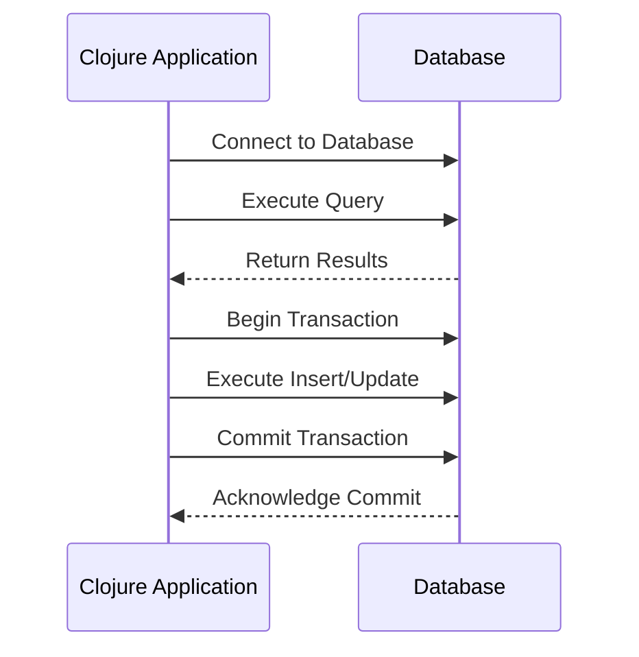

## 22.4 Database Interaction with `clojure.java.jdbc` and `next.jdbc`

As experienced Java developers, you are likely familiar with JDBC (Java Database Connectivity) for interacting with relational databases. In Clojure, we have two primary libraries for database interaction: `clojure.java.jdbc` and `next.jdbc`. This section will guide you through using these libraries to connect to databases, manage connections, and handle data efficiently in a functional programming context.

### Database Connectivity

Clojure's approach to database connectivity leverages the JVM's capabilities, allowing seamless integration with existing Java libraries and tools. This means you can use familiar concepts like JDBC while benefiting from Clojure's functional paradigms.

#### `clojure.java.jdbc`

`clojure.java.jdbc` is a mature library that provides a straightforward API for database operations. It abstracts the complexity of JDBC while allowing you to perform CRUD (Create, Read, Update, Delete) operations with ease.

**Key Features:**

- **Simplicity**: Offers a simple API for executing SQL queries.
- **Flexibility**: Supports various SQL databases through JDBC drivers.
- **Integration**: Easily integrates with existing Java applications.

**Basic Usage:**

To get started with `clojure.java.jdbc`, you need to include it in your project dependencies. Here's a basic setup using Leiningen:

```clojure
(defproject my-database-app "0.1.0-SNAPSHOT"
  :dependencies [[org.clojure/clojure "1.10.3"]
                 [org.clojure/java.jdbc "0.7.12"]
                 [mysql/mysql-connector-java "8.0.26"]])
```

**Connecting to a Database:**

```clojure
(require '[clojure.java.jdbc :as jdbc])

(def db-spec {:dbtype "mysql"
              :dbname "my_database"
              :host "localhost"
              :user "root"
              :password "password"})

;; Querying the database
(jdbc/query db-spec ["SELECT * FROM users"])
```

In this example, we define a `db-spec` map containing the database connection details. The `jdbc/query` function executes a SQL query and returns the results as a sequence of maps, where each map represents a row.

**Handling Transactions:**

Transactions in `clojure.java.jdbc` are managed using the `jdbc/with-db-transaction` macro, which ensures that all operations within the block are executed atomically.

```clojure
(jdbc/with-db-transaction [t-con db-spec]
  (jdbc/insert! t-con :users {:name "Alice" :email "alice@example.com"})
  (jdbc/update! t-con :users {:email "alice@newdomain.com"} ["name=?" "Alice"]))
```

This code snippet demonstrates how to insert and update records within a transaction, ensuring data consistency.

#### Introducing `next.jdbc`

`next.jdbc` is a modern alternative to `clojure.java.jdbc`, designed for better performance and a more intuitive API. It is built on top of the same JDBC foundation but offers enhancements that make it more suitable for contemporary applications.

**Key Features:**

- **Performance**: Optimized for speed and efficiency.
- **Simplicity**: Provides a cleaner, more consistent API.
- **Flexibility**: Supports advanced data handling and mapping.

**Basic Usage:**

To use `next.jdbc`, include it in your project dependencies:

```clojure
(defproject my-database-app "0.1.0-SNAPSHOT"
  :dependencies [[org.clojure/clojure "1.10.3"]
                 [com.github.seancorfield/next.jdbc "1.2.780"]
                 [mysql/mysql-connector-java "8.0.26"]])
```

**Connecting to a Database:**

```clojure
(require '[next.jdbc :as jdbc])

(def db-spec {:dbtype "mysql"
              :dbname "my_database"
              :host "localhost"
              :user "root"
              :password "password"})

;; Creating a datasource
(def ds (jdbc/get-datasource db-spec))

;; Querying the database
(jdbc/execute! ds ["SELECT * FROM users"])
```

In `next.jdbc`, we create a datasource using `jdbc/get-datasource`, which is then used for executing queries. The `jdbc/execute!` function returns the results as a vector of maps.

**Handling Transactions:**

Transactions in `next.jdbc` are handled using the `jdbc/with-transaction` macro, similar to `clojure.java.jdbc`.

```clojure
(jdbc/with-transaction [tx ds]
  (jdbc/execute! tx ["INSERT INTO users (name, email) VALUES (?, ?)" "Alice" "alice@example.com"])
  (jdbc/execute! tx ["UPDATE users SET email = ? WHERE name = ?" "alice@newdomain.com" "Alice"]))
```

This example shows how to perform multiple operations within a transaction, ensuring atomicity.

### Connection Management

Efficient connection management is crucial for database-driven applications. Both `clojure.java.jdbc` and `next.jdbc` support connection pooling, which can significantly improve performance by reusing existing connections.

**Using HikariCP for Connection Pooling:**

HikariCP is a popular JDBC connection pool library known for its high performance and reliability. You can integrate it with both `clojure.java.jdbc` and `next.jdbc`.

**Setting Up HikariCP:**

Add HikariCP to your project dependencies:

```clojure
(defproject my-database-app "0.1.0-SNAPSHOT"
  :dependencies [[org.clojure/clojure "1.10.3"]
                 [com.zaxxer/HikariCP "5.0.1"]
                 [org.clojure/java.jdbc "0.7.12"]
                 [com.github.seancorfield/next.jdbc "1.2.780"]
                 [mysql/mysql-connector-java "8.0.26"]])
```

**Configuring HikariCP:**

```clojure
(require '[com.zaxxer.hikari :refer [HikariDataSource]])

(def hikari-cp-config
  {:jdbc-url "jdbc:mysql://localhost:3306/my_database"
   :username "root"
   :password "password"
   :maximum-pool-size 10})

(def ds (HikariDataSource. hikari-cp-config))
```

In this setup, we define a configuration map for HikariCP and create a `HikariDataSource` instance. This datasource can be used with both `clojure.java.jdbc` and `next.jdbc`.

**Using HikariCP with `clojure.java.jdbc`:**

```clojure
(jdbc/query ds ["SELECT * FROM users"])
```

**Using HikariCP with `next.jdbc`:**

```clojure
(jdbc/execute! ds ["SELECT * FROM users"])
```

### Working with Data

Handling data efficiently is a core aspect of database interaction. Both `clojure.java.jdbc` and `next.jdbc` provide mechanisms for querying data, handling transactions, and mapping results to Clojure data structures.

**Querying Data:**

In both libraries, querying data involves executing SQL statements and processing the results as Clojure data structures.

**Example with `clojure.java.jdbc`:**

```clojure
(defn get-users []
  (jdbc/query db-spec ["SELECT * FROM users"]))
```

**Example with `next.jdbc`:**

```clojure
(defn get-users []
  (jdbc/execute! ds ["SELECT * FROM users"]))
```

**Handling Transactions:**

Transactions ensure data consistency and integrity. Both libraries provide macros for managing transactions, allowing you to execute multiple operations atomically.

**Mapping Results to Clojure Data Structures:**

Both libraries return query results as sequences or vectors of maps, where each map represents a row. This makes it easy to work with the data in a functional style.

**Example:**

```clojure
(defn print-user-names []
  (let [users (jdbc/query db-spec ["SELECT * FROM users"])]
    (doseq [user users]
      (println (:name user)))))
```

This example demonstrates how to iterate over query results and print user names.

### Visual Aids

To better understand the flow of data and operations, let's visualize the process of querying a database and handling transactions using `next.jdbc`.



**Diagram Explanation:**

- **Connect to Database**: The application establishes a connection to the database.
- **Execute Query**: A SQL query is executed, and results are returned.
- **Begin Transaction**: A transaction is started for multiple operations.
- **Execute Insert/Update**: Data is inserted or updated within the transaction.
- **Commit Transaction**: The transaction is committed, ensuring data consistency.

### References and Links

- [Official Clojure Documentation](https://clojure.org/)
- [clojure.java.jdbc GitHub Repository](https://github.com/clojure/java.jdbc)
- [next.jdbc GitHub Repository](https://github.com/seancorfield/next-jdbc)
- [HikariCP GitHub Repository](https://github.com/brettwooldridge/HikariCP)

### Knowledge Check

To reinforce your understanding, consider the following questions:

- What are the key differences between `clojure.java.jdbc` and `next.jdbc`?
- How does connection pooling improve database performance?
- Why is it important to handle transactions in database operations?

### Practice Problems

1. Modify the provided examples to connect to a PostgreSQL database instead of MySQL.
2. Implement a function that retrieves users based on a specific condition (e.g., age > 30).
3. Experiment with HikariCP settings to optimize connection pooling for your application.

### Encouraging Tone

Now that we've explored how to interact with databases using Clojure, you're well-equipped to manage data in your applications efficiently. Remember, practice makes perfect, so don't hesitate to experiment with the examples and apply these concepts to your projects.

### Best Practices for Tags

- Use Specific and Relevant Tags
- Include 4 to 8 relevant and specific tags that reflect the article's content.
- Tags should reflect key topics, technologies, or concepts discussed in the article.
- Keep tag names consistent.
- Wrap tags in double-quotes.
- Avoid tags containing special characters like `#`. For example, use "CSharp" instead of "C#".

## Quiz: Mastering Database Interaction with Clojure



### What is the primary advantage of using `next.jdbc` over `clojure.java.jdbc`?

- [x] Improved performance and a simpler API
- [ ] Better support for NoSQL databases
- [ ] Built-in connection pooling
- [ ] Automatic schema migration

> **Explanation:** `next.jdbc` offers improved performance and a simpler API compared to `clojure.java.jdbc`.

### Which library is recommended for connection pooling in Clojure database applications?

- [ ] Apache Commons DBCP
- [x] HikariCP
- [ ] C3P0
- [ ] BoneCP

> **Explanation:** HikariCP is known for its high performance and reliability, making it a popular choice for connection pooling.

### How do you execute a SQL query using `next.jdbc`?

- [ ] `jdbc/query`
- [x] `jdbc/execute!`
- [ ] `jdbc/run`
- [ ] `jdbc/sql`

> **Explanation:** In `next.jdbc`, the `jdbc/execute!` function is used to execute SQL queries.

### What is the purpose of using transactions in database operations?

- [x] To ensure data consistency and integrity
- [ ] To improve query performance
- [ ] To reduce database load
- [ ] To simplify SQL syntax

> **Explanation:** Transactions ensure that multiple operations are executed atomically, maintaining data consistency and integrity.

### Which of the following is a feature of `clojure.java.jdbc`?

- [x] Simple API for executing SQL queries
- [ ] Built-in support for NoSQL databases
- [ ] Automatic query optimization
- [ ] Native support for JSON data types

> **Explanation:** `clojure.java.jdbc` provides a simple API for executing SQL queries.

### What is the role of a datasource in `next.jdbc`?

- [x] To manage database connections
- [ ] To execute SQL queries
- [ ] To handle transactions
- [ ] To map results to Clojure data structures

> **Explanation:** In `next.jdbc`, a datasource is used to manage database connections.

### How can you map query results to Clojure data structures?

- [x] By using sequences or vectors of maps
- [ ] By converting results to JSON
- [ ] By using XML parsers
- [ ] By storing results in files

> **Explanation:** Query results are returned as sequences or vectors of maps, making it easy to work with the data in a functional style.

### What is the benefit of using HikariCP with `next.jdbc`?

- [x] Improved connection management and performance
- [ ] Built-in query caching
- [ ] Automatic schema migration
- [ ] Enhanced security features

> **Explanation:** HikariCP provides improved connection management and performance, making it a great choice for use with `next.jdbc`.

### True or False: `next.jdbc` supports both synchronous and asynchronous database operations.

- [x] True
- [ ] False

> **Explanation:** `next.jdbc` supports both synchronous and asynchronous database operations, providing flexibility in how you interact with databases.


