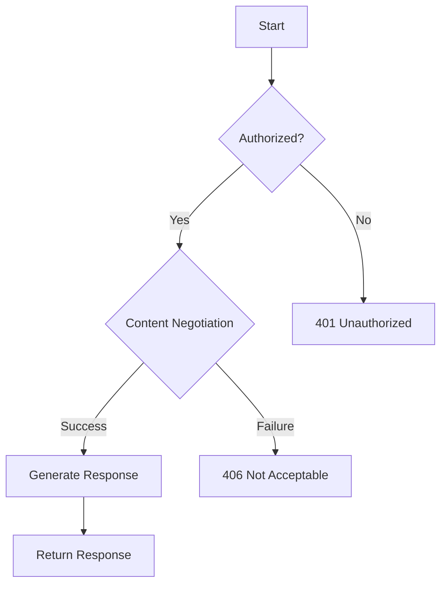

## 22.5 Building RESTful APIs with Liberator

In this section, we will delve into building RESTful APIs using the Liberator library in Clojure. Liberator is a powerful tool that allows developers to create APIs by focusing on resource semantics rather than the intricacies of HTTP. This approach aligns well with functional programming principles, making it an excellent choice for Clojure developers.

### REST Fundamentals

Before we dive into Liberator, let's review the core principles of REST (Representational State Transfer), which is an architectural style for designing networked applications. RESTful services are defined by the following constraints:

- **Statelessness**: Each request from a client must contain all the information needed to understand and process the request.
- **Client-Server Architecture**: The client and server are separated, allowing them to evolve independently.
- **Cacheability**: Responses must define themselves as cacheable or non-cacheable to improve performance.
- **Layered System**: The architecture can be composed of hierarchical layers, each with specific responsibilities.
- **Uniform Interface**: A consistent interface between components, typically using HTTP methods like GET, POST, PUT, DELETE.
- **Code on Demand (optional)**: Servers can extend client functionality by transferring executable code.

### Liberator Overview

[Liberator](https://clojure-liberator.github.io/liberator/) is a Clojure library designed to simplify the creation of RESTful APIs by focusing on the semantics of resources. It abstracts the complexity of HTTP by providing a declarative approach to handling requests and responses. Liberator's core concept is the decision graph, which models the flow of a request through a series of decisions to determine the appropriate response.

#### Key Features of Liberator

- **Declarative Resource Definitions**: Define resources and their behavior declaratively using a decision graph.
- **Content Negotiation**: Automatically handle different content types and formats.
- **Error Handling**: Manage error conditions and generate appropriate HTTP responses.
- **Compliance with HTTP Standards**: Ensure that your API adheres to HTTP standards and best practices.

### Declarative Resources

Liberator uses a decision graph to handle requests and responses declaratively. This graph consists of a series of decisions that determine the flow of a request. Each decision is a function that returns a boolean value, guiding the request through the graph until a response is generated.

#### Defining a Resource

To define a resource in Liberator, you use the `resource` function, which takes a map of decision points and handlers. Here's a simple example:

```clojure
(require '[liberator.core :refer [resource]])

(def my-resource
  (resource
    :available-media-types ["application/json"]
    :handle-ok (fn [ctx] {:message "Hello, World!"})))
```

In this example, `my-resource` is a Liberator resource that responds with a JSON message when accessed. The `:available-media-types` key specifies the media types that the resource can produce, and `:handle-ok` defines the response when the request is successful.

#### Decision Graph

The decision graph is a powerful concept that allows you to define the behavior of your resource declaratively. Each decision point in the graph corresponds to a specific aspect of the HTTP request/response cycle, such as authorization, content negotiation, and response generation.



**Diagram Description**: This diagram illustrates a simplified decision graph in Liberator, showing the flow from authorization to content negotiation and response generation.

### Content Negotiation

Content negotiation is a crucial aspect of RESTful APIs, allowing clients to specify the format in which they want to receive data. Liberator handles content negotiation automatically based on the `Accept` header in the request.

#### Handling Different Content Types

To support multiple content types, you can specify the `:available-media-types` key in your resource definition. Liberator will automatically select the appropriate media type based on the client's request.

```clojure
(def my-resource
  (resource
    :available-media-types ["application/json" "text/html"]
    :handle-ok (fn [ctx]
                 (if (= (get-in ctx [:representation :media-type]) "application/json")
                   {:message "Hello, JSON!"}
                   "<h1>Hello, HTML!</h1>"))))
```

In this example, the resource can respond with either JSON or HTML, depending on the client's `Accept` header.

### Error Handling and Responses

Error handling is an essential part of building robust APIs. Liberator provides a structured way to handle errors and generate appropriate HTTP responses.

#### Managing Error Conditions

You can define custom error handlers in your resource definition using keys like `:handle-unauthorized`, `:handle-not-found`, and `:handle-server-error`.

```clojure
(def my-resource
  (resource
    :available-media-types ["application/json"]
    :authorized? (fn [ctx] false)
    :handle-unauthorized (fn [ctx] {:error "Unauthorized access"})))
```

In this example, the resource always returns a 401 Unauthorized response with a custom error message.

### API Implementation Example

Let's build a sample RESTful API endpoint using Liberator to demonstrate its key features. We'll create a simple API for managing a collection of books.

#### Setting Up the Project

First, create a new Clojure project and add Liberator as a dependency in your `project.clj` file:

```clojure
(defproject my-api "0.1.0-SNAPSHOT"
  :dependencies [[org.clojure/clojure "1.10.3"]
                 [liberator "0.15.3"]
                 [ring/ring-core "1.9.0"]
                 [ring/ring-jetty-adapter "1.9.0"]])
```

#### Defining the Book Resource

We'll define a resource for managing books, supporting operations like listing all books and adding a new book.

```clojure
(ns my-api.core
  (:require [liberator.core :refer [resource]]
            [ring.adapter.jetty :refer [run-jetty]]))

(def books (atom []))

(def book-resource
  (resource
    :available-media-types ["application/json"]
    :allowed-methods [:get :post]
    :malformed? (fn [ctx]
                  (let [body (slurp (get-in ctx [:request :body]))]
                    (try
                      (assoc ctx :book (json/read-str body :key-fn keyword))
                      false
                      (catch Exception _ true))))
    :handle-ok (fn [ctx] @books)
    :post! (fn [ctx]
             (let [new-book (:book ctx)]
               (swap! books conj new-book)))
    :handle-created (fn [ctx] {:message "Book added successfully"})))
```

In this example, `book-resource` is a Liberator resource that supports GET and POST methods. It uses an atom to store the list of books and handles JSON requests.

#### Running the API

Finally, we need to set up a Ring server to run our API:

```clojure
(defn -main []
  (run-jetty (fn [request] (book-resource request))
             {:port 3000 :join? false}))

;; Start the server
(-main)
```

This code starts a Jetty server on port 3000, serving the `book-resource`.

### Try It Yourself

Now that we've built a simple RESTful API with Liberator, try modifying the code to add more features. For example, implement PUT and DELETE methods to update and delete books. Experiment with different content types and error handling strategies to deepen your understanding of Liberator.

### Key Takeaways

- Liberator simplifies the creation of RESTful APIs by focusing on resource semantics.
- The decision graph allows for declarative resource definitions, making it easier to manage complex request/response flows.
- Content negotiation and error handling are built-in, reducing boilerplate code and ensuring compliance with HTTP standards.

### References and Links

- [Liberator Documentation](https://clojure-liberator.github.io/liberator/)
- [Clojure Official Documentation](https://clojure.org/)
- [Ring Documentation](https://github.com/ring-clojure/ring)

## Quiz: Mastering RESTful APIs with Liberator



### What is the primary focus of Liberator when building RESTful APIs?

- [x] Resource semantics
- [ ] HTTP method implementation
- [ ] Database integration
- [ ] User authentication

> **Explanation:** Liberator focuses on resource semantics, allowing developers to define the behavior of resources declaratively.

### Which HTTP constraint ensures that each request contains all necessary information?

- [x] Statelessness
- [ ] Cacheability
- [ ] Layered System
- [ ] Uniform Interface

> **Explanation:** Statelessness ensures that each request contains all the information needed to understand and process it.

### How does Liberator handle content negotiation?

- [x] Automatically based on the `Accept` header
- [ ] Manually through custom functions
- [ ] By defaulting to JSON
- [ ] By ignoring the `Accept` header

> **Explanation:** Liberator automatically handles content negotiation based on the `Accept` header in the request.

### What is a decision graph in Liberator?

- [x] A series of decisions that determine the flow of a request
- [ ] A graph of database relationships
- [ ] A flowchart of user interactions
- [ ] A map of server endpoints

> **Explanation:** A decision graph is a series of decisions that guide the request through the resource, determining the appropriate response.

### Which key is used to specify the media types a resource can produce in Liberator?

- [x] `:available-media-types`
- [ ] `:content-types`
- [ ] `:media-formats`
- [ ] `:response-types`

> **Explanation:** The `:available-media-types` key specifies the media types that a resource can produce.

### How can you define custom error handlers in Liberator?

- [x] Using keys like `:handle-unauthorized` and `:handle-not-found`
- [ ] By overriding the default error handler
- [ ] By writing custom middleware
- [ ] By using exception handling in Clojure

> **Explanation:** Custom error handlers can be defined using keys like `:handle-unauthorized` and `:handle-not-found`.

### What is the purpose of the `malformed?` function in a Liberator resource?

- [x] To check if the request body is malformed
- [ ] To validate user authentication
- [ ] To handle server errors
- [ ] To negotiate content types

> **Explanation:** The `malformed?` function checks if the request body is malformed, allowing the resource to handle invalid requests appropriately.

### Which library is commonly used with Liberator to run a web server?

- [x] Ring
- [ ] Compojure
- [ ] Pedestal
- [ ] Luminus

> **Explanation:** Ring is commonly used with Liberator to run a web server and handle HTTP requests.

### What is the benefit of using atoms in the book resource example?

- [x] Atoms provide a simple way to manage mutable state in a functional way
- [ ] Atoms ensure thread safety for concurrent requests
- [ ] Atoms allow for complex data structures
- [ ] Atoms simplify error handling

> **Explanation:** Atoms provide a simple way to manage mutable state in a functional way, allowing the resource to update the list of books.

### True or False: Liberator requires manual implementation of HTTP methods like GET and POST.

- [ ] True
- [x] False

> **Explanation:** Liberator allows you to define the allowed methods declaratively, and it handles the implementation details based on the decision graph.


