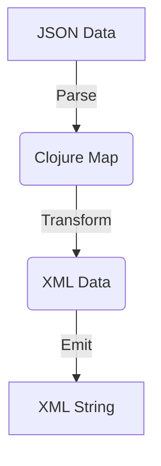

## 22.8 Leveraging JSON and XML Libraries

In the realm of modern software development, JSON and XML are ubiquitous data interchange formats. As an experienced Java developer transitioning to Clojure, understanding how to handle these formats functionally is crucial. In this section, we will explore how to leverage libraries like Cheshire, jsonista, and clojure.data.xml to parse, generate, and transform JSON and XML data in Clojure. We will also discuss how to integrate these formats when interacting with external APIs.

### Working with JSON in Clojure

JSON (JavaScript Object Notation) is a lightweight data interchange format that is easy for humans to read and write, and easy for machines to parse and generate. In Clojure, libraries like Cheshire and jsonista provide robust tools for working with JSON data.

#### Parsing JSON with Cheshire

Cheshire is a popular Clojure library for parsing and generating JSON. It is built on top of the Jackson library, which is known for its performance and flexibility.

```clojure
(require '[cheshire.core :as json])

;; Parsing JSON string to Clojure data structure
(def json-str "{\"name\":\"John Doe\", \"age\":30, \"isStudent\":false}")
(def parsed-data (json/parse-string json-str true))

;; Output: {:name "John Doe", :age 30, :isStudent false}
(println parsed-data)
```

In this example, we use `cheshire.core/parse-string` to convert a JSON string into a Clojure map. The `true` argument indicates that keys should be converted to keywords.

#### Generating JSON with Cheshire

Generating JSON from Clojure data structures is equally straightforward with Cheshire.

```clojure
(def data {:name "Jane Doe", :age 25, :isStudent true})

;; Convert Clojure map to JSON string
(def json-output (json/generate-string data))

;; Output: {"name":"Jane Doe","age":25,"isStudent":true}
(println json-output)
```

Here, `cheshire.core/generate-string` is used to convert a Clojure map into a JSON string.

#### Using jsonista for JSON Processing

Jsonista is another Clojure library for JSON processing, known for its speed and efficiency. It is also based on Jackson.

```clojure
(require '[jsonista.core :as j])

;; Parsing JSON string
(def json-str "{\"city\":\"New York\", \"population\":8419000}")
(def parsed-data (j/read-value json-str))

;; Output: {"city" "New York", "population" 8419000}
(println parsed-data)

;; Generating JSON string
(def data {:country "USA", :capital "Washington D.C."})
(def json-output (j/write-value-as-string data))

;; Output: {"country":"USA","capital":"Washington D.C."}
(println json-output)
```

Jsonista provides similar functionality to Cheshire but is optimized for performance, making it suitable for high-throughput applications.

### Handling XML in Clojure

XML (eXtensible Markup Language) is another widely used data format, especially in enterprise environments. Clojure provides the `clojure.data.xml` library for parsing and emitting XML data.

#### Parsing XML with clojure.data.xml

```clojure
(require '[clojure.data.xml :as xml])

(def xml-str "<person><name>John Doe</name><age>30</age></person>")
(def parsed-xml (xml/parse-str xml-str))

;; Output: #clojure.data.xml.Element{:tag :person, :attrs {}, :content (#clojure.data.xml.Element{:tag :name, :attrs {}, :content ("John Doe")} #clojure.data.xml.Element{:tag :age, :attrs {}, :content ("30")})}
(println parsed-xml)
```

The `clojure.data.xml/parse-str` function converts an XML string into a nested Clojure data structure, making it easy to work with XML data in a functional manner.

#### Emitting XML with clojure.data.xml

```clojure
(def data (xml/element :person {}
                       [(xml/element :name {} "Jane Doe")
                        (xml/element :age {} "25")]))

(def xml-output (xml/emit-str data))

;; Output: <person><name>Jane Doe</name><age>25</age></person>
(println xml-output)
```

The `clojure.data.xml/element` function constructs an XML element, and `clojure.data.xml/emit-str` converts it into an XML string.

### Data Transformation

Transforming data between JSON and XML formats, or manipulating nested data structures, is a common requirement in many applications. Clojure's functional programming paradigm makes these tasks intuitive and efficient.

#### Transforming JSON to XML

```clojure
(def json-data "{\"name\":\"Alice\", \"age\":28}")
(def parsed-json (json/parse-string json-data true))

(def xml-data (xml/element :person {}
                           [(xml/element :name {} (:name parsed-json))
                            (xml/element :age {} (str (:age parsed-json)))]))

(def xml-output (xml/emit-str xml-data))

;; Output: <person><name>Alice</name><age>28</age></person>
(println xml-output)
```

This example demonstrates how to parse JSON data and transform it into an XML format using Clojure's data manipulation capabilities.

#### Manipulating Nested Data Structures

Clojure's powerful data manipulation functions, such as `update-in` and `assoc-in`, allow for easy manipulation of nested data structures.

```clojure
(def data {:person {:name "Bob", :details {:age 32, :city "Seattle"}}})

;; Update nested value
(def updated-data (update-in data [:person :details :age] inc))

;; Output: {:person {:name "Bob", :details {:age 33, :city "Seattle"}}}
(println updated-data)
```

### API Integration

When integrating with external APIs, JSON and XML are often the formats of choice for data exchange. Clojure's libraries make it easy to consume and produce these formats.

#### Consuming JSON from an API

```clojure
(require '[clj-http.client :as client])

(def response (client/get "https://api.example.com/data" {:as :json}))
(def data (:body response))

;; Output: {:key "value", :another-key "another-value"}
(println data)
```

In this example, we use `clj-http.client` to make an HTTP GET request and parse the JSON response directly into a Clojure map.

#### Producing JSON for an API

```clojure
(def data {:username "user123", :password "pass123"})

(def response (client/post "https://api.example.com/login"
                           {:body (json/generate-string data)
                            :headers {"Content-Type" "application/json"}}))

;; Output: {:status 200, :body "Success"}
(println response)
```

This code snippet demonstrates how to convert Clojure data into JSON and send it as part of an HTTP POST request.

### Try It Yourself

To deepen your understanding, try modifying the code examples above. For instance, experiment with different JSON and XML structures, or try integrating with a public API of your choice. This hands-on approach will solidify your grasp of JSON and XML handling in Clojure.

### Visual Aids

To better understand the flow of data transformation between JSON and XML, consider the following diagram:



**Diagram Description:** This flowchart illustrates the process of parsing JSON data into a Clojure map, transforming it into XML data, and then emitting it as an XML string.

### References and Links

- [Cheshire GitHub Repository](https://github.com/dakrone/cheshire)
- [jsonista GitHub Repository](https://github.com/metosin/jsonista)
- [clojure.data.xml GitHub Repository](https://github.com/clojure/data.xml)
- [Official Clojure Documentation](https://clojure.org/reference/documentation)

### Knowledge Check

- What are the main differences between Cheshire and jsonista?
- How does Clojure's functional paradigm simplify data transformation tasks?
- What are some common pitfalls when handling JSON and XML in Clojure?

### Exercises

1. Parse a JSON string containing nested objects and transform it into an XML format.
2. Write a function that consumes a JSON API and returns a specific value from the response.
3. Create a Clojure program that reads an XML file, modifies a value, and writes it back to a new XML file.

### Summary

In this section, we've explored how to leverage JSON and XML libraries in Clojure to parse, generate, and transform data. By understanding these concepts, you can effectively integrate with external APIs and manipulate data structures in a functional programming context. Now, let's apply these skills to build scalable applications with Clojure.

## Quiz: Mastering JSON and XML Libraries in Clojure



### What library is commonly used in Clojure for JSON parsing and generation?

- [x] Cheshire
- [ ] Gson
- [ ] Jackson
- [ ] FastJSON

> **Explanation:** Cheshire is a popular Clojure library for JSON parsing and generation, built on top of Jackson.

### Which function in Cheshire is used to convert a JSON string to a Clojure map?

- [x] parse-string
- [ ] read-json
- [ ] json-to-map
- [ ] convert-json

> **Explanation:** The `parse-string` function in Cheshire is used to convert a JSON string into a Clojure map.

### What is the primary advantage of using jsonista over Cheshire?

- [x] Performance optimization
- [ ] Better documentation
- [ ] More features
- [ ] Easier syntax

> **Explanation:** Jsonista is optimized for performance, making it suitable for high-throughput applications.

### Which Clojure library is used for XML parsing and emitting?

- [x] clojure.data.xml
- [ ] xml-parser
- [ ] xml-clj
- [ ] clojure.xml

> **Explanation:** `clojure.data.xml` is the library used in Clojure for parsing and emitting XML data.

### How can you transform JSON data into XML in Clojure?

- [x] Parse JSON, manipulate data, emit XML
- [ ] Direct conversion function
- [ ] Use a third-party service
- [ ] Convert to CSV first

> **Explanation:** You parse the JSON data into a Clojure map, manipulate it, and then emit it as XML.

### What is a common use case for JSON and XML libraries in Clojure?

- [x] API integration
- [ ] File compression
- [ ] Image processing
- [ ] Game development

> **Explanation:** JSON and XML libraries are commonly used for API integration, allowing data exchange between systems.

### Which function in clojure.data.xml is used to create an XML element?

- [x] element
- [ ] create-element
- [ ] xml-node
- [ ] new-element

> **Explanation:** The `element` function in `clojure.data.xml` is used to create an XML element.

### What is the benefit of using Clojure's functional paradigm for data transformation?

- [x] Simplifies manipulation of nested data structures
- [ ] Increases code verbosity
- [ ] Requires more memory
- [ ] Slows down processing

> **Explanation:** Clojure's functional paradigm simplifies the manipulation of nested data structures, making transformations more intuitive.

### Which HTTP client library is used in the examples for API integration?

- [x] clj-http.client
- [ ] http-kit
- [ ] ring-client
- [ ] aleph

> **Explanation:** `clj-http.client` is used in the examples for making HTTP requests and handling API integration.

### True or False: Jsonista is based on the Gson library.

- [ ] True
- [x] False

> **Explanation:** Jsonista is based on the Jackson library, not Gson.


