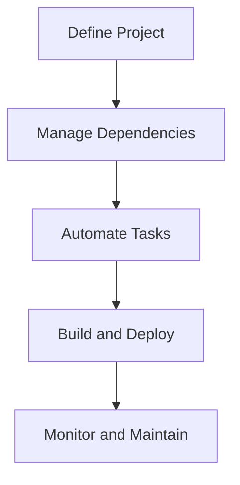

## 23.2 Automating Builds with `Leiningen` and `deps.edn`

In the world of software development, automating builds is crucial for maintaining efficiency, consistency, and reliability. For Clojure developers, two primary tools facilitate this process: [Leiningen](https://leiningen.org/) and the Clojure CLI tools with `deps.edn`. Both tools offer unique features and capabilities, allowing developers to manage dependencies, automate tasks, and streamline their build processes. In this section, we will delve into the specifics of each tool, compare their functionalities, and provide practical examples to help you automate your Clojure projects effectively.

### Build Tooling Choices

Before diving into the specifics of each tool, let's compare Leiningen and the Clojure CLI tools (`deps.edn`) to understand their roles in Clojure project automation.

#### Leiningen

Leiningen is a build automation tool specifically designed for Clojure projects. It simplifies the process of managing dependencies, building projects, and running tasks. Leiningen uses a `project.clj` file to define project configurations, dependencies, and tasks. It is known for its extensive plugin ecosystem, which allows developers to extend its functionality with ease.

#### Clojure CLI and `deps.edn`

The Clojure CLI tools, introduced more recently, provide a lightweight alternative to Leiningen. They use a `deps.edn` file to manage dependencies and execute build tasks. The Clojure CLI tools focus on simplicity and flexibility, allowing developers to define their own build processes using shell scripts or other tools.

### Using Leiningen

Leiningen is a powerful tool for automating Clojure builds. Let's explore how to define project configurations, manage dependencies, and automate tasks using a `project.clj` file.

#### Defining Project Configurations

A `project.clj` file is the heart of a Leiningen project. It contains all the necessary configurations for your project, including its name, version, dependencies, and build tasks. Here's a basic example of a `project.clj` file:

```clojure
(defproject my-clojure-app "0.1.0-SNAPSHOT"
  :description "A sample Clojure application"
  :url "http://example.com/my-clojure-app"
  :license {:name "Eclipse Public License"
            :url "http://www.eclipse.org/legal/epl-v10.html"}
  :dependencies [[org.clojure/clojure "1.10.3"]
                 [ring/ring-core "1.9.0"]]
  :main ^:skip-aot my-clojure-app.core
  :target-path "target/%s"
  :profiles {:uberjar {:aot :all}})
```

- **Project Metadata**: The `defproject` macro defines the project's name, version, description, and URL.
- **Dependencies**: The `:dependencies` vector lists the libraries your project depends on.
- **Main Namespace**: The `:main` key specifies the main namespace to run when executing the project.
- **Profiles**: The `:profiles` map allows you to define different build configurations, such as an `uberjar` profile for creating standalone JAR files.

#### Managing Dependencies

Leiningen makes dependency management straightforward. You can add dependencies to the `:dependencies` vector in your `project.clj` file. Leiningen will automatically download and manage these dependencies for you.

#### Automating Tasks

Leiningen provides several built-in tasks, such as `lein run`, `lein test`, and `lein uberjar`. You can also define custom tasks using plugins or by writing your own Leiningen tasks.

### Clojure CLI and `deps.edn`

The Clojure CLI tools offer a more flexible approach to build automation. Let's explore how to manage dependencies and execute build tasks using a `deps.edn` file.

#### Managing Dependencies

A `deps.edn` file defines your project's dependencies and paths. Here's an example of a `deps.edn` file:

```clojure
{:deps {org.clojure/clojure {:mvn/version "1.10.3"}
        ring/ring-core {:mvn/version "1.9.0"}}}
```

- **Dependencies**: The `:deps` map lists the libraries your project depends on, using Maven coordinates.

#### Executing Build Tasks

The Clojure CLI tools do not have built-in task automation like Leiningen. Instead, you can use shell scripts or other tools to define your build process. For example, you can create a `build.sh` script to automate tasks like running tests or packaging your application.

### Custom Tasks and Plugins

Both Leiningen and the Clojure CLI tools allow you to extend their functionality with custom tasks and plugins.

#### Leiningen Plugins

Leiningen has a rich ecosystem of plugins that can be used to extend its functionality. You can add plugins to your `project.clj` file and use them to automate tasks like code linting, testing, and deployment.

#### Clojure CLI Custom Tasks

With the Clojure CLI tools, you can define custom tasks using shell scripts or other tools. This approach provides flexibility, allowing you to tailor your build process to your specific needs.

### Automation Examples

Let's explore some practical examples of automating tasks with Leiningen and the Clojure CLI tools.

#### Code Linting

You can automate code linting using the `eastwood` plugin for Leiningen or by using a shell script with the Clojure CLI tools.

**Leiningen Example:**

```clojure
;; Add the eastwood plugin to your project.clj
:plugins [[jonase/eastwood "0.3.5"]]

;; Run the eastwood linter
lein eastwood
```

**Clojure CLI Example:**

Create a `lint.sh` script:

```bash
#!/bin/bash
clj -Sdeps '{:deps {jonase/eastwood {:mvn/version "0.3.5"}}}' -m eastwood.lint
```

#### Testing

Automate testing using the `lein test` task or a shell script with the Clojure CLI tools.

**Leiningen Example:**

```bash
lein test
```

**Clojure CLI Example:**

Create a `test.sh` script:

```bash
#!/bin/bash
clj -A:test
```

#### Packaging

Create standalone JAR files using the `lein uberjar` task or a shell script with the Clojure CLI tools.

**Leiningen Example:**

```bash
lein uberjar
```

**Clojure CLI Example:**

Create a `package.sh` script:

```bash
#!/bin/bash
clj -A:uberjar
```

#### Deployment

Automate deployment using plugins or custom scripts. For example, you can use the `lein deploy` task or a shell script with the Clojure CLI tools.

### Visual Aids

To better understand the flow of data and tasks in Clojure build automation, let's look at a diagram illustrating the process.



**Diagram Description**: This flowchart illustrates the process of automating builds in Clojure, from defining the project and managing dependencies to automating tasks, building, deploying, and maintaining the application.

### References and Links

- [Leiningen Official Website](https://leiningen.org/)
- [Clojure CLI Tools Documentation](https://clojure.org/guides/deps_and_cli)
- [Eastwood Linter GitHub Repository](https://github.com/jonase/eastwood)

### Knowledge Check

To reinforce your understanding of automating builds with Leiningen and `deps.edn`, consider the following questions and exercises:

1. What are the key differences between Leiningen and the Clojure CLI tools?
2. How can you define custom tasks in Leiningen?
3. Create a `deps.edn` file for a simple Clojure project with at least two dependencies.
4. Write a shell script to automate testing with the Clojure CLI tools.
5. Explore the use of plugins in Leiningen to extend its functionality.

### Encouraging Tone

Now that we've explored how to automate builds with Leiningen and `deps.edn`, you're well-equipped to streamline your Clojure projects. Remember, the key to successful build automation is understanding your project's needs and choosing the right tools to meet those needs. Keep experimenting, and don't hesitate to explore the rich ecosystem of plugins and tools available to Clojure developers.

### Best Practices for Tags

- Use Specific and Relevant Tags
- Include 4 to 8 relevant and specific tags that reflect the article's content.
- Tags should reflect key topics, technologies, or concepts discussed in the article.
- Keep tag names consistent.
- Wrap tags in double-quotes.
- Avoid tags containing special characters like `#`.

## Quiz: Mastering Build Automation with Leiningen and `deps.edn`



### What is the primary purpose of Leiningen in Clojure projects?

- [x] Build automation and dependency management
- [ ] Code compilation
- [ ] Version control
- [ ] User interface design

> **Explanation:** Leiningen is primarily used for build automation and managing dependencies in Clojure projects.

### Which file is used by Leiningen to define project configurations?

- [x] `project.clj`
- [ ] `deps.edn`
- [ ] `build.gradle`
- [ ] `pom.xml`

> **Explanation:** Leiningen uses the `project.clj` file to define project configurations, dependencies, and tasks.

### How do the Clojure CLI tools manage dependencies?

- [x] Using a `deps.edn` file
- [ ] Through a `pom.xml` file
- [ ] By manually downloading libraries
- [ ] Using a `build.gradle` file

> **Explanation:** The Clojure CLI tools manage dependencies using a `deps.edn` file, which specifies the libraries and their versions.

### What is a common use case for creating custom tasks in Leiningen?

- [x] Automating repetitive build tasks
- [ ] Designing user interfaces
- [ ] Writing documentation
- [ ] Managing database schemas

> **Explanation:** Custom tasks in Leiningen are often created to automate repetitive build tasks, such as testing or packaging.

### Which tool provides a more flexible approach to defining build processes?

- [x] Clojure CLI tools
- [ ] Leiningen
- [ ] Maven
- [ ] Gradle

> **Explanation:** The Clojure CLI tools offer a more flexible approach to defining build processes, allowing developers to use shell scripts or other tools.

### What is the main advantage of using plugins in Leiningen?

- [x] Extending functionality with minimal effort
- [ ] Improving code readability
- [ ] Enhancing user interface design
- [ ] Simplifying database management

> **Explanation:** Plugins in Leiningen allow developers to extend its functionality with minimal effort, adding new tasks and capabilities.

### How can you automate code linting with the Clojure CLI tools?

- [x] By using a shell script with the `eastwood` linter
- [ ] By writing a custom Java program
- [ ] By manually reviewing code
- [ ] By using a `build.gradle` file

> **Explanation:** Code linting can be automated with the Clojure CLI tools by using a shell script that incorporates the `eastwood` linter.

### What is the role of the `:main` key in a `project.clj` file?

- [x] Specifies the main namespace to run
- [ ] Defines the project's dependencies
- [ ] Lists the project's contributors
- [ ] Sets the project's version number

> **Explanation:** The `:main` key in a `project.clj` file specifies the main namespace to run when executing the project.

### True or False: The Clojure CLI tools have built-in task automation like Leiningen.

- [ ] True
- [x] False

> **Explanation:** The Clojure CLI tools do not have built-in task automation like Leiningen; instead, they rely on shell scripts or other tools for task automation.



By mastering the use of Leiningen and `deps.edn`, you can significantly enhance your Clojure development workflow, making your projects more efficient and manageable. Keep exploring and experimenting with these tools to find the best fit for your development needs.
