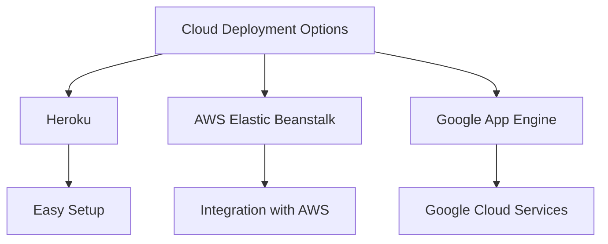

## 23.3 Deploying Clojure Applications to the Cloud

Deploying applications to the cloud is a crucial step in modern software development, offering scalability, flexibility, and reliability. In this section, we will explore how to deploy Clojure applications to various cloud platforms, leveraging your existing Java knowledge to ease the transition. We'll cover Infrastructure as a Service (IaaS) and Platform as a Service (PaaS) options, container deployments, and serverless architectures. Finally, we'll walk through a practical example of deploying a Clojure web application to a cloud service.

### Cloud Deployment Options

When considering cloud deployment for Clojure applications, several platforms stand out due to their robust support and ease of use. Let's explore some popular options:

#### Heroku

[Heroku](https://www.heroku.com/) is a PaaS that simplifies the deployment process by abstracting the underlying infrastructure. It is particularly well-suited for developers who want to focus on application development without worrying about server management.

- **Advantages**: Easy to set up, supports multiple languages, and offers a wide range of add-ons.
- **Use Case**: Ideal for small to medium-sized applications where rapid deployment and scaling are priorities.

#### AWS Elastic Beanstalk

[AWS Elastic Beanstalk](https://aws.amazon.com/elasticbeanstalk/) is a PaaS offering from Amazon Web Services that automates the deployment, scaling, and management of applications.

- **Advantages**: Deep integration with other AWS services, supports a variety of languages, and offers automatic scaling.
- **Use Case**: Suitable for applications that require integration with other AWS services or need to scale dynamically.

#### Google App Engine

[Google App Engine](https://cloud.google.com/appengine) is a PaaS that allows developers to build and deploy applications on Google's infrastructure.

- **Advantages**: Automatic scaling, built-in security features, and integration with Google Cloud services.
- **Use Case**: Best for applications that need to leverage Google's cloud ecosystem and require high availability.

### Infrastructure as a Service (IaaS) vs. Platform as a Service (PaaS)

Understanding the difference between IaaS and PaaS is essential when choosing a cloud deployment strategy.

- **Infrastructure as a Service (IaaS)**: Provides virtualized computing resources over the internet. Users have control over the operating system, storage, and deployed applications. Examples include AWS EC2 and Google Compute Engine.
  - **When to Choose**: Opt for IaaS when you need full control over the environment, such as custom configurations or specific software installations.

- **Platform as a Service (PaaS)**: Offers a platform allowing customers to develop, run, and manage applications without dealing with the underlying infrastructure. Examples include Heroku and AWS Elastic Beanstalk.
  - **When to Choose**: Use PaaS for rapid development and deployment, especially when infrastructure management is not a priority.

### Container Deployment

Containers provide a consistent environment for application deployment, ensuring that your application runs the same way regardless of where it is deployed. Docker is a popular tool for containerization.

#### Deploying Clojure Applications with Docker

Docker allows you to package your Clojure application along with its dependencies into a container. Here's a basic Dockerfile for a Clojure application:

```dockerfile
# Use the official Clojure image
FROM clojure:openjdk-11-lein

# Set the working directory
WORKDIR /app

# Copy the project files
COPY . .

# Build the application
RUN lein uberjar

# Run the application
CMD ["java", "-jar", "target/uberjar/myapp.jar"]
```

**Steps to Deploy:**

1. **Build the Docker Image**: Use the command `docker build -t myapp .` to create a Docker image.
2. **Run the Container Locally**: Test your application locally with `docker run -p 8080:8080 myapp`.
3. **Push to a Container Registry**: Push your image to a registry like Docker Hub or AWS ECR.
4. **Deploy to a Cloud Service**: Use services like [Amazon ECS](https://aws.amazon.com/ecs/) or [Azure Container Instances](https://azure.microsoft.com/services/container-instances/) to deploy your containerized application.

#### Container Deployment Example

Let's deploy a simple Clojure web application to Amazon ECS:

1. **Create a Docker Image**: Follow the steps above to build and test your Docker image.
2. **Push to AWS ECR**: Use AWS CLI to push your image to ECR.
3. **Create an ECS Cluster**: Set up an ECS cluster using the AWS Management Console.
4. **Define a Task**: Create a task definition that specifies your Docker image and resource requirements.
5. **Run the Task**: Launch your task in the ECS cluster and access your application via the assigned public IP.

### Serverless Deployment

Serverless computing allows you to run code without provisioning or managing servers. AWS Lambda is a popular serverless platform that supports Clojure through custom runtimes.

#### Deploying Clojure Functions with AWS Lambda

To deploy a Clojure function on AWS Lambda, you can use the [AWS API Gateway](https://aws.amazon.com/api-gateway/) to expose your function as a REST API.

**Steps to Deploy:**

1. **Write Your Clojure Function**: Create a simple function that you want to deploy.
2. **Package the Function**: Use a tool like `lein` to package your function and its dependencies.
3. **Create a Lambda Function**: Use the AWS Management Console to create a new Lambda function.
4. **Configure API Gateway**: Set up an API Gateway to trigger your Lambda function.
5. **Deploy and Test**: Deploy your API and test the endpoint to ensure it triggers your function correctly.

#### Serverless Deployment Example

Let's deploy a simple Clojure function to AWS Lambda:

1. **Create a Clojure Function**: Write a function that processes input and returns a response.
2. **Package with Leiningen**: Use `lein uberjar` to create a JAR file.
3. **Upload to AWS Lambda**: Create a new Lambda function and upload your JAR file.
4. **Set Up API Gateway**: Create a new API in API Gateway and link it to your Lambda function.
5. **Test the API**: Use a tool like Postman to send requests to your API and verify the responses.

### Deployment Walkthrough

Let's walk through deploying a Clojure web application to Heroku, a popular PaaS.

#### Step-by-Step Deployment to Heroku

1. **Create a Clojure Web Application**: Use a framework like Compojure to create a simple web app.
2. **Set Up Heroku CLI**: Install the Heroku CLI and log in to your account.
3. **Create a Heroku App**: Use the command `heroku create` to create a new app.
4. **Deploy Your Application**: Push your code to Heroku using Git with `git push heroku main`.
5. **Configure Environment Variables**: Use the Heroku dashboard or CLI to set any necessary environment variables.
6. **Scale Your Application**: Use `heroku ps:scale web=1` to scale your application.
7. **Monitor and Manage**: Use Heroku's monitoring tools to manage your application's performance.

### Visual Aids

#### Cloud Deployment Options Diagram



*Diagram 1: Overview of Cloud Deployment Options for Clojure Applications.*

### References and Links

- [Official Clojure Documentation](https://clojure.org/)
- [Heroku Clojure Support](https://devcenter.heroku.com/articles/clojure-support)
- [AWS Elastic Beanstalk Documentation](https://docs.aws.amazon.com/elasticbeanstalk/latest/dg/Welcome.html)
- [Google App Engine Documentation](https://cloud.google.com/appengine/docs)
- [Docker Documentation](https://docs.docker.com/)
- [AWS Lambda Documentation](https://docs.aws.amazon.com/lambda/latest/dg/welcome.html)

### Knowledge Check

- **What are the main differences between IaaS and PaaS?**
- **How can Docker containers benefit Clojure application deployment?**
- **What are the steps to deploy a Clojure function to AWS Lambda?**

### Exercises

1. **Deploy a Clojure Web App to Heroku**: Create a simple web application using Compojure and deploy it to Heroku. Experiment with scaling and monitoring features.
2. **Containerize a Clojure Application**: Use Docker to containerize a Clojure application and deploy it to Amazon ECS.
3. **Implement a Serverless Function**: Write a Clojure function and deploy it to AWS Lambda using API Gateway.

### Summary

Deploying Clojure applications to the cloud involves understanding various platforms and deployment models. By leveraging your Java knowledge, you can effectively deploy Clojure applications using PaaS, IaaS, containerization, and serverless architectures. Experiment with different deployment strategies to find the best fit for your application's needs.

## Cloud Deployment Quiz for Clojure Applications



### What is the primary advantage of using Heroku for deploying Clojure applications?

- [x] Simplified deployment process
- [ ] Full control over server configurations
- [ ] Lower cost compared to other platforms
- [ ] Built-in machine learning capabilities

> **Explanation:** Heroku offers a simplified deployment process by abstracting the underlying infrastructure, making it easy for developers to deploy applications quickly.

### Which cloud service is best suited for applications requiring deep integration with AWS services?

- [ ] Heroku
- [x] AWS Elastic Beanstalk
- [ ] Google App Engine
- [ ] Azure App Service

> **Explanation:** AWS Elastic Beanstalk is best suited for applications that require integration with other AWS services due to its seamless integration capabilities.

### What is a key benefit of using Docker for Clojure application deployment?

- [x] Consistent environment across different deployment platforms
- [ ] Automatic scaling of applications
- [ ] Built-in security features
- [ ] Integration with Google Cloud services

> **Explanation:** Docker provides a consistent environment for application deployment, ensuring that applications run the same way across different platforms.

### What is the role of AWS API Gateway in serverless deployment?

- [x] Exposing Lambda functions as REST APIs
- [ ] Managing server configurations
- [ ] Providing storage solutions
- [ ] Offering machine learning services

> **Explanation:** AWS API Gateway is used to expose AWS Lambda functions as REST APIs, allowing them to be accessed over the internet.

### Which of the following is a step in deploying a Clojure application to Heroku?

- [x] Use `git push heroku main` to deploy the application
- [ ] Configure AWS EC2 instances
- [ ] Set up a Kubernetes cluster
- [ ] Create a Docker image

> **Explanation:** Deploying a Clojure application to Heroku involves using Git to push the application code to Heroku's servers.

### What is the main difference between IaaS and PaaS?

- [x] IaaS provides virtualized computing resources, while PaaS offers a platform for application development
- [ ] IaaS is more expensive than PaaS
- [ ] PaaS requires more infrastructure management than IaaS
- [ ] IaaS is only available on AWS

> **Explanation:** IaaS provides virtualized computing resources, giving users control over the environment, while PaaS offers a platform for application development without managing the underlying infrastructure.

### How can you scale a Clojure application on Heroku?

- [x] Use `heroku ps:scale web=1` to scale the application
- [ ] Modify the Dockerfile to increase resources
- [ ] Use AWS Lambda to handle scaling
- [ ] Configure Google App Engine settings

> **Explanation:** Heroku allows you to scale applications using the `heroku ps:scale` command, which adjusts the number of dynos running the application.

### What is a common use case for deploying Clojure applications on Google App Engine?

- [x] Applications needing high availability and integration with Google Cloud services
- [ ] Applications requiring deep integration with AWS services
- [ ] Applications with minimal scaling requirements
- [ ] Applications that need to run on-premises

> **Explanation:** Google App Engine is ideal for applications that need high availability and integration with Google's cloud ecosystem.

### What tool can be used to package a Clojure function for AWS Lambda deployment?

- [x] Leiningen
- [ ] Docker
- [ ] Kubernetes
- [ ] Terraform

> **Explanation:** Leiningen is a build automation tool for Clojure that can be used to package Clojure functions for deployment to AWS Lambda.

### True or False: Serverless computing requires provisioning and managing servers.

- [ ] True
- [x] False

> **Explanation:** Serverless computing allows you to run code without provisioning or managing servers, as the cloud provider handles the infrastructure.


