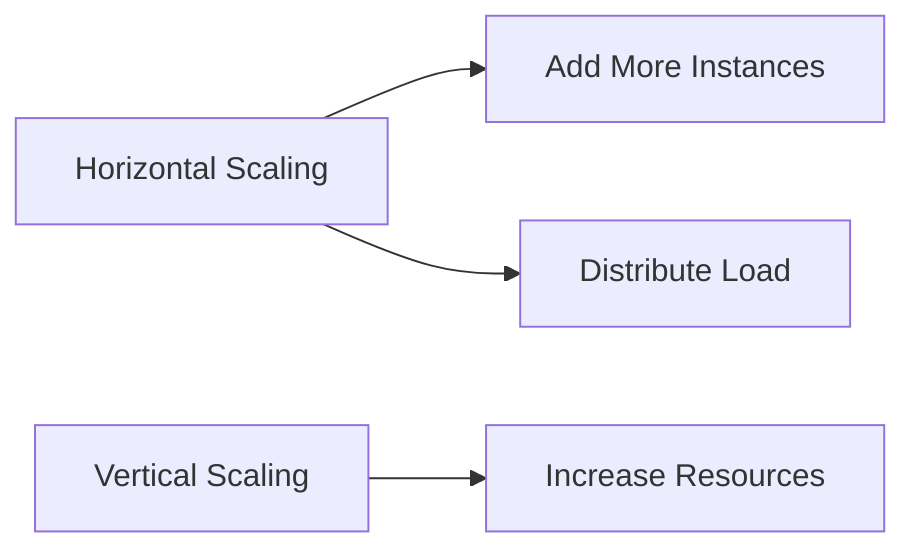
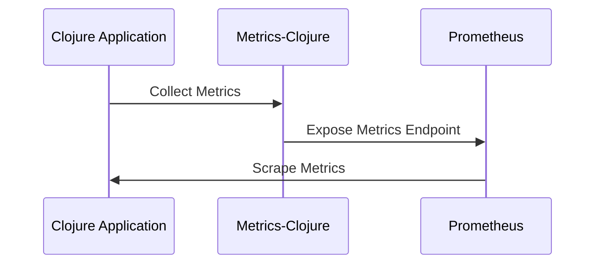

## 23.4 Monitoring and Scaling Clojure Services

In today's fast-paced digital landscape, ensuring the health and performance of your applications is crucial. Monitoring and scaling are integral to maintaining robust and responsive Clojure services. In this section, we will explore the importance of proactive monitoring, delve into effective logging practices, discuss metrics collection, and examine strategies for scaling your applications. We'll also provide guidance on capacity planning to ensure your services can handle growth and demand.

### Importance of Monitoring

Monitoring is the backbone of maintaining application health and performance. It allows you to detect issues before they impact users, optimize resource usage, and ensure that your services meet performance expectations. By implementing a comprehensive monitoring strategy, you can gain insights into application behavior, identify bottlenecks, and make informed decisions about scaling and resource allocation.

#### Key Benefits of Monitoring

- **Proactive Issue Detection**: Identify and address potential problems before they escalate.
- **Performance Optimization**: Analyze metrics to optimize resource usage and improve application performance.
- **User Experience Enhancement**: Ensure that your services deliver a seamless user experience by maintaining high availability and responsiveness.
- **Informed Decision-Making**: Use data-driven insights to make strategic decisions about scaling and resource management.

### Logging Practices

Logging is a fundamental aspect of monitoring. It provides a detailed record of application events, errors, and performance metrics. In Clojure, structured logging can be achieved using libraries like [tools.logging](https://github.com/clojure/tools.logging). Structured logging allows you to capture and organize log data in a consistent format, making it easier to analyze and search.

#### Implementing Structured Logging

To implement structured logging in Clojure, you can use the `tools.logging` library. Here's a basic example:

```clojure
(require '[clojure.tools.logging :as log])

(defn process-data [data]
  (log/info "Processing data" {:data data})
  ;; Process the data
  (try
    ;; Simulate processing
    (if (nil? data)
      (throw (Exception. "Data is nil"))
      (log/info "Data processed successfully" {:data data}))
    (catch Exception e
      (log/error e "Error processing data" {:data data}))))
```

In this example, we use `log/info` and `log/error` to log informational messages and errors, respectively. The use of maps allows us to include structured data in the logs.

#### Configuring Log Aggregation

To effectively manage and analyze logs, consider using log aggregation tools like ELK Stack (Elasticsearch, Logstash, Kibana) or Splunk. These tools allow you to centralize logs from multiple sources, search and analyze log data, and create visualizations and dashboards.

### Metrics Collection

Collecting application metrics is essential for understanding performance and resource usage. Metrics provide quantitative data that can be used to monitor application health, identify trends, and make informed decisions about scaling.

#### Using Metrics-Clojure

[Metrics-Clojure](https://github.com/metrics-clojure/metrics-clojure) is a library that integrates with the Clojure ecosystem to provide a comprehensive set of metrics. It allows you to collect metrics such as counters, gauges, histograms, and timers.

Here's an example of using Metrics-Clojure to collect metrics:

```clojure
(require '[metrics.core :as metrics])
(require '[metrics.timers :as timers])

(defn timed-process [data]
  (let [timer (timers/timer "process-time")]
    (timers/time! timer
      ;; Simulate processing
      (Thread/sleep (rand-int 1000))
      (println "Processed data:" data))))
```

In this example, we use a timer to measure the time taken to process data. The `timers/time!` function records the duration of the operation.

#### Integrating with Prometheus

[Prometheus](https://prometheus.io/) is a popular open-source monitoring and alerting toolkit. It can be integrated with Clojure applications to collect and visualize metrics. Prometheus uses a pull-based model, where it scrapes metrics from endpoints exposed by your application.

To expose metrics to Prometheus, you can use libraries like `io.prometheus.client` to create a metrics endpoint. Here's a basic example:

```clojure
(require '[io.prometheus.client :as prometheus])

(def counter (prometheus/counter "requests_total" "Total number of requests"))

(defn handle-request [request]
  (prometheus/inc counter)
  ;; Handle the request
  (println "Request handled:" request))
```

In this example, we define a counter metric to track the total number of requests. The `prometheus/inc` function increments the counter each time a request is handled.

### Alerting and Notifications

Setting up alerts for critical metrics is crucial for proactive monitoring. Alerts notify you of potential issues, allowing you to take corrective action before they impact users. Integrating with notification services ensures that alerts reach the right people at the right time.

#### Setting Up Alerts

To set up alerts, you can use tools like Prometheus Alertmanager or third-party services like PagerDuty or Opsgenie. These tools allow you to define alerting rules based on specific conditions, such as high error rates or resource usage.

#### Integrating with Notification Services

Integrating with notification services ensures that alerts are delivered to the appropriate channels, such as email, SMS, or chat applications. This ensures that your team is promptly informed of any issues that require attention.

### Scaling Techniques

Scaling is the process of adjusting resources to meet demand. It involves increasing or decreasing the capacity of your application to handle varying levels of traffic. There are two primary scaling strategies: horizontal scaling and vertical scaling.

#### Horizontal Scaling

Horizontal scaling involves adding more instances of your application to distribute the load. This approach is often preferred for its flexibility and ability to handle large-scale traffic.

- **Auto-Scaling**: Automatically adjust the number of instances based on predefined metrics, such as CPU usage or request count.
- **Load Balancing**: Distribute incoming traffic across multiple instances to ensure even load distribution and prevent bottlenecks.

#### Vertical Scaling

Vertical scaling involves increasing the resources (CPU, memory) of a single instance. While this approach can be effective for certain workloads, it has limitations in terms of scalability and cost.

- **Resource Allocation**: Increase the resources of your application instances to handle higher loads.
- **Performance Optimization**: Optimize application performance to make efficient use of available resources.

### Capacity Planning

Capacity planning is the process of forecasting future resource needs to ensure that your application can handle growth and demand. It involves analyzing historical data, identifying trends, and making informed decisions about resource allocation.

#### Steps for Effective Capacity Planning

1. **Analyze Historical Data**: Review past performance metrics to identify trends and patterns.
2. **Forecast Future Demand**: Use historical data to predict future resource needs based on expected growth.
3. **Plan for Scalability**: Ensure that your application architecture supports scaling to accommodate future demand.
4. **Conduct Performance Testing**: Perform load testing to validate that your application can handle anticipated traffic levels.

### Visual Aids

To enhance understanding, let's incorporate a few diagrams to illustrate key concepts.

#### Horizontal vs. Vertical Scaling



*Figure 1: Horizontal scaling involves adding more instances, while vertical scaling involves increasing resources of a single instance.*

#### Metrics Collection Flow



*Figure 2: Flow of metrics collection using Metrics-Clojure and Prometheus.*

### Knowledge Check

To reinforce your understanding, consider the following questions:

- What are the benefits of structured logging in Clojure?
- How can Prometheus be integrated with a Clojure application?
- What are the key differences between horizontal and vertical scaling?
- Why is capacity planning important for scaling applications?

### Exercises

1. **Implement Structured Logging**: Modify the provided logging example to include additional structured data, such as user ID or request ID.
2. **Set Up a Metrics Endpoint**: Create a simple Clojure application that exposes a metrics endpoint for Prometheus.
3. **Design an Alerting Strategy**: Define alerting rules for a hypothetical Clojure service, including thresholds and notification channels.

### Conclusion

Monitoring and scaling are critical components of maintaining robust and responsive Clojure services. By implementing structured logging, collecting metrics, setting up alerts, and planning for capacity, you can ensure that your applications remain healthy and performant. As you continue to build and deploy Clojure services, remember to leverage these strategies to optimize resource usage and deliver a seamless user experience.

## Quiz: Mastering Monitoring and Scaling in Clojure Services



### What is the primary benefit of structured logging in Clojure?

- [x] It provides a consistent format for log data, making it easier to analyze.
- [ ] It reduces the size of log files.
- [ ] It eliminates the need for log aggregation tools.
- [ ] It automatically fixes errors in the application.

> **Explanation:** Structured logging provides a consistent format for log data, which simplifies analysis and searching.

### Which library can be used for metrics collection in Clojure?

- [x] Metrics-Clojure
- [ ] Log4j
- [ ] Clojure-Metrics
- [ ] Prometheus-Clojure

> **Explanation:** Metrics-Clojure is a library specifically designed for collecting metrics in Clojure applications.

### What is the main advantage of horizontal scaling?

- [x] It allows for flexible scaling by adding more instances.
- [ ] It increases the resources of a single instance.
- [ ] It reduces the cost of cloud services.
- [ ] It simplifies application architecture.

> **Explanation:** Horizontal scaling allows for flexible scaling by adding more instances to distribute the load.

### How does Prometheus collect metrics from a Clojure application?

- [x] By scraping metrics from an exposed endpoint.
- [ ] By directly accessing the application's database.
- [ ] By analyzing log files.
- [ ] By using a push-based model.

> **Explanation:** Prometheus uses a pull-based model to scrape metrics from endpoints exposed by applications.

### What is a key consideration when planning for capacity?

- [x] Analyzing historical data to forecast future demand.
- [ ] Reducing the number of application instances.
- [ ] Minimizing resource allocation.
- [ ] Avoiding performance testing.

> **Explanation:** Analyzing historical data helps forecast future demand and plan for scalability.

### What is the role of alerting in monitoring?

- [x] To notify you of potential issues before they impact users.
- [ ] To automatically resolve application errors.
- [ ] To reduce the need for logging.
- [ ] To eliminate the need for metrics collection.

> **Explanation:** Alerting notifies you of potential issues, allowing for proactive intervention.

### Which tool is commonly used for log aggregation?

- [x] ELK Stack
- [ ] Prometheus
- [ ] Grafana
- [ ] Metrics-Clojure

> **Explanation:** ELK Stack (Elasticsearch, Logstash, Kibana) is commonly used for log aggregation and analysis.

### What is the purpose of load balancing in horizontal scaling?

- [x] To distribute incoming traffic across multiple instances.
- [ ] To increase the resources of a single instance.
- [ ] To reduce the number of application instances.
- [ ] To simplify application architecture.

> **Explanation:** Load balancing distributes incoming traffic across multiple instances to ensure even load distribution.

### Why is structured logging beneficial for analyzing log data?

- [x] It provides a consistent format that simplifies searching and analysis.
- [ ] It reduces the size of log files.
- [ ] It eliminates the need for log aggregation tools.
- [ ] It automatically fixes errors in the application.

> **Explanation:** Structured logging provides a consistent format for log data, making it easier to analyze and search.

### True or False: Vertical scaling involves adding more instances of an application.

- [ ] True
- [x] False

> **Explanation:** Vertical scaling involves increasing the resources of a single instance, not adding more instances.


