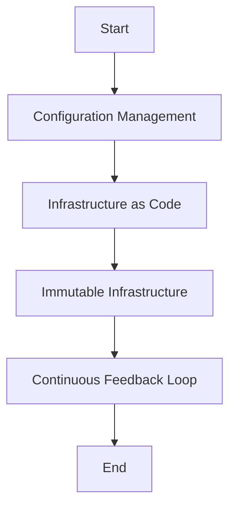

## 23.5 Best Practices for DevOps in Clojure

In the realm of software development, DevOps practices have become essential for ensuring efficient and reliable application deployment. For developers transitioning from Java to Clojure, understanding how to integrate DevOps principles with functional programming can significantly enhance the scalability and maintainability of applications. This section will guide you through the best practices for implementing DevOps in Clojure, focusing on key areas such as configuration management, infrastructure as code, immutable infrastructure, and continuous feedback loops.

### DevOps Culture

DevOps is not just about tools and processes; it's a cultural shift that emphasizes collaboration between development and operations teams. This collaboration aims to improve the efficiency and reliability of software delivery. In a Clojure environment, this means leveraging the language's strengths in immutability and functional programming to streamline DevOps practices.

#### Key Principles of DevOps Culture

1. **Collaboration and Communication**: Foster open communication channels between developers and operations teams to ensure alignment on goals and processes.
2. **Automation**: Automate repetitive tasks to reduce human error and increase efficiency.
3. **Continuous Improvement**: Encourage a mindset of continuous learning and improvement to adapt to changing requirements and technologies.

### Configuration Management

Managing configurations across different environments is crucial for maintaining consistency and reliability in deployments. Tools like [Ansible](https://www.ansible.com/) and [Chef](https://www.chef.io/chef/) can be used to automate configuration management, ensuring that environments are set up consistently.

#### Using Ansible for Configuration Management

Ansible is a powerful tool for automating configuration management. It uses a simple, human-readable language to describe configurations, making it accessible for both developers and operations teams.

```yaml
# Ansible playbook example for setting up a Clojure environment
- name: Setup Clojure Environment
  hosts: all
  tasks:
    - name: Install Java
      apt:
        name: openjdk-11-jdk
        state: present

    - name: Install Leiningen
      get_url:
        url: https://raw.githubusercontent.com/technomancy/leiningen/stable/bin/lein
        dest: /usr/local/bin/lein
        mode: '0755'
```

**Try It Yourself**: Modify the playbook to install a specific version of Clojure or add additional tasks for setting up a database.

### Infrastructure as Code

Infrastructure as Code (IaC) is a practice that involves defining infrastructure programmatically, allowing for version control and automated deployments. Tools like [Terraform](https://www.terraform.io/) enable you to manage infrastructure as code, providing a consistent and repeatable process for provisioning resources.

#### Implementing Infrastructure as Code with Terraform

Terraform allows you to define your infrastructure in configuration files, which can be versioned and shared among team members. This approach ensures that infrastructure changes are tracked and can be rolled back if necessary.

```hcl
# Terraform configuration for deploying a Clojure application
provider "aws" {
  region = "us-west-2"
}

resource "aws_instance" "clojure_app" {
  ami           = "ami-0c55b159cbfafe1f0"
  instance_type = "t2.micro"

  tags = {
    Name = "ClojureApp"
  }
}
```

**Try It Yourself**: Extend the configuration to include additional resources, such as a load balancer or a database instance.

### Immutable Infrastructure

Immutable infrastructure is a concept where servers are never modified after they are deployed. Instead, any changes result in a new server being created. This approach ensures consistency and reduces the risk of configuration drift.

#### Benefits of Immutable Infrastructure

- **Consistency**: Each deployment is identical, reducing the risk of unexpected behavior.
- **Rollback**: Easily revert to a previous version by redeploying the last known good configuration.
- **Security**: Reduces the attack surface by minimizing the number of changes made to live servers.

### Continuous Feedback Loop

A continuous feedback loop is essential for maintaining high-quality software. By integrating monitoring and logging into your DevOps practices, you can provide developers with real-time insights into application performance and user behavior.

#### Implementing Continuous Feedback with Monitoring and Logging

Tools like [Prometheus](https://prometheus.io/) and [Grafana](https://grafana.com/) can be used to monitor application performance, while logging frameworks like [Logback](http://logback.qos.ch/) can capture detailed logs for analysis.

```clojure
;; Example of setting up logging in a Clojure application
(ns my-app.logging
  (:require [clojure.tools.logging :as log]))

(defn log-example []
  (log/info "This is an informational message")
  (log/warn "This is a warning message")
  (log/error "This is an error message"))
```

**Try It Yourself**: Integrate logging into your application and set up alerts for specific log messages using a monitoring tool.

### Visual Aids

To better understand the flow of DevOps practices in Clojure, let's visualize the process using a flowchart.



**Diagram Description**: This flowchart illustrates the sequence of DevOps practices, starting with configuration management and ending with a continuous feedback loop.

### References and Links

- [Official Clojure Documentation](https://clojure.org/)
- [ClojureDocs](https://clojuredocs.org/)
- [Ansible Documentation](https://docs.ansible.com/)
- [Terraform Documentation](https://www.terraform.io/docs/index.html)
- [Prometheus Documentation](https://prometheus.io/docs/introduction/overview/)
- [Grafana Documentation](https://grafana.com/docs/)

### Knowledge Check

- What are the key principles of DevOps culture?
- How does Ansible help in configuration management?
- What are the benefits of using Infrastructure as Code?
- Explain the concept of immutable infrastructure.
- How can continuous feedback loops improve software quality?

### Encouraging Tone

By integrating these DevOps practices into your Clojure development workflow, you can enhance the reliability and scalability of your applications. Remember, the key to successful DevOps is collaboration and continuous improvement. Now that we've explored these best practices, let's apply them to your projects and see the difference they make.

### Quiz

## Test Your Knowledge on DevOps Best Practices in Clojure



### What is a key principle of DevOps culture?

- [x] Collaboration and Communication
- [ ] Manual Configuration
- [ ] Isolated Development
- [ ] Static Infrastructure

> **Explanation:** DevOps emphasizes collaboration and communication between development and operations teams to improve efficiency and reliability.

### Which tool is commonly used for configuration management?

- [x] Ansible
- [ ] Docker
- [ ] Kubernetes
- [ ] Terraform

> **Explanation:** Ansible is a popular tool for automating configuration management across environments.

### What is the main benefit of Infrastructure as Code?

- [x] Consistency and Repeatability
- [ ] Manual Configuration
- [ ] Increased Manual Effort
- [ ] Static Infrastructure

> **Explanation:** Infrastructure as Code allows for consistent and repeatable provisioning of resources, reducing errors and improving reliability.

### What does immutable infrastructure ensure?

- [x] Consistency and Reduced Configuration Drift
- [ ] Frequent Manual Changes
- [ ] Increased Configuration Drift
- [ ] Static Infrastructure

> **Explanation:** Immutable infrastructure ensures consistency by preventing changes to servers after deployment, reducing configuration drift.

### How does a continuous feedback loop benefit development?

- [x] Provides Real-Time Insights
- [ ] Delays Feedback
- [ ] Increases Manual Effort
- [ ] Reduces Monitoring

> **Explanation:** Continuous feedback loops provide real-time insights into application performance, allowing for timely improvements.

### Which tool is used for monitoring application performance?

- [x] Prometheus
- [ ] Ansible
- [ ] Terraform
- [ ] Chef

> **Explanation:** Prometheus is a tool used for monitoring application performance and providing metrics.

### What is a benefit of using immutable infrastructure?

- [x] Easier Rollback
- [ ] Increased Manual Changes
- [ ] Frequent Configuration Changes
- [ ] Static Infrastructure

> **Explanation:** Immutable infrastructure allows for easier rollback by redeploying the last known good configuration.

### What is a common tool for logging in Clojure applications?

- [x] Logback
- [ ] Docker
- [ ] Kubernetes
- [ ] Terraform

> **Explanation:** Logback is a common logging framework used in Clojure applications to capture detailed logs.

### What is the purpose of Infrastructure as Code?

- [x] Define Infrastructure Programmatically
- [ ] Increase Manual Configuration
- [ ] Reduce Automation
- [ ] Static Infrastructure

> **Explanation:** Infrastructure as Code involves defining infrastructure programmatically, allowing for automation and version control.

### True or False: DevOps practices can enhance the scalability of applications.

- [x] True
- [ ] False

> **Explanation:** DevOps practices, such as automation and continuous feedback, can enhance the scalability and reliability of applications.



By following these best practices, you can effectively integrate DevOps into your Clojure development process, leading to more efficient and reliable software delivery.
