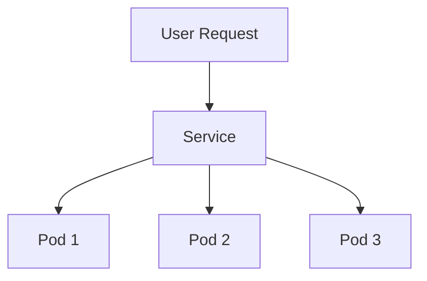

## 23.6 Using Docker and Kubernetes with Clojure Applications

As experienced Java developers transitioning to Clojure, you are likely familiar with the challenges of deploying applications in a scalable and efficient manner. Docker and Kubernetes have become essential tools in the modern developer's toolkit, enabling seamless deployment and management of applications in cloud environments. In this section, we will explore how to leverage these technologies to deploy Clojure applications effectively.

### Dockerizing Applications

Docker is a platform that allows you to package applications and their dependencies into a standardized unit called a container. This ensures consistency across different environments, from development to production.

#### Step 1: Setting Up a Dockerfile

A Dockerfile is a script that contains a series of instructions on how to build a Docker image. Let's create a simple Dockerfile for a Clojure application:

```dockerfile
# Use the official Clojure image as a base
FROM clojure:openjdk-11-lein

# Set the working directory
WORKDIR /app

# Copy the project files
COPY . .

# Resolve dependencies and build the application
RUN lein deps && lein uberjar

# Specify the command to run the application
CMD ["java", "-jar", "target/uberjar/my-clojure-app.jar"]
```

**Explanation:**

- **Base Image**: We use `clojure:openjdk-11-lein`, which includes the JDK and Leiningen, a popular build tool for Clojure.
- **Working Directory**: Sets the working directory inside the container.
- **Copy Files**: Copies the project files into the container.
- **Build Application**: Resolves dependencies and builds the application using Leiningen.
- **Run Command**: Specifies the command to run the application.

#### Step 2: Building and Running the Docker Image

To build and run the Docker image, execute the following commands in your terminal:

```bash
# Build the Docker image
docker build -t my-clojure-app .

# Run the Docker container
docker run -p 8080:8080 my-clojure-app
```

**Try It Yourself**: Modify the Dockerfile to use a different base image or change the application entry point to see how it affects the container behavior.

### Kubernetes Fundamentals

Kubernetes is an open-source platform for automating deployment, scaling, and management of containerized applications. It abstracts the underlying infrastructure, allowing you to focus on application logic.

#### Key Concepts

- **Pods**: The smallest deployable units in Kubernetes, which can contain one or more containers.
- **Deployments**: Define the desired state of your application, managing the creation and scaling of pods.
- **Services**: Provide stable endpoints for accessing pods, enabling service discovery and load balancing.
- **ConfigMaps**: Store configuration data that can be consumed by your applications.



*Diagram: Kubernetes Service routing traffic to multiple pods.*

### Deploying to Kubernetes

Deploying a Dockerized Clojure application to Kubernetes involves creating Kubernetes manifest files that describe the desired state of your application.

#### Step 1: Creating a Deployment

A Deployment manages the lifecycle of your application pods. Here's an example manifest file:

```yaml
apiVersion: apps/v1
kind: Deployment
metadata:
  name: my-clojure-app
spec:
  replicas: 3
  selector:
    matchLabels:
      app: my-clojure-app
  template:
    metadata:
      labels:
        app: my-clojure-app
    spec:
      containers:
      - name: my-clojure-app
        image: my-clojure-app:latest
        ports:
        - containerPort: 8080
```

**Explanation:**

- **Replicas**: Specifies the number of pod instances to run.
- **Selector**: Matches pods with the specified labels.
- **Template**: Defines the pod configuration, including the container image and ports.

#### Step 2: Creating a Service

A Service exposes your application to external traffic and balances the load across pods.

```yaml
apiVersion: v1
kind: Service
metadata:
  name: my-clojure-app-service
spec:
  type: LoadBalancer
  selector:
    app: my-clojure-app
  ports:
  - protocol: TCP
    port: 80
    targetPort: 8080
```

**Explanation:**

- **Type**: `LoadBalancer` exposes the service externally.
- **Selector**: Matches pods with the specified labels.
- **Ports**: Maps the external port to the container port.

#### Deploying to the Cluster

Use `kubectl` to apply the manifest files and deploy your application:

```bash
# Apply the deployment
kubectl apply -f deployment.yaml

# Apply the service
kubectl apply -f service.yaml
```

### Service Discovery and Load Balancing

Kubernetes provides built-in service discovery and load balancing, ensuring that traffic is evenly distributed across available pods. This is achieved through the use of Services, which act as stable endpoints for accessing your application.

### Scaling and Self-Healing

Kubernetes automatically manages application scaling and recovery from failures. You can scale your application by adjusting the number of replicas in the Deployment manifest.

```yaml
spec:
  replicas: 5
```

Kubernetes will ensure that the desired number of pods are running, restarting any failed pods as needed.

### Real-World Example

Let's walk through a practical example of deploying a Clojure application to Kubernetes. We'll use a simple web application that responds with "Hello, World!".

#### Step 1: Create the Clojure Application

Create a new Clojure project using Leiningen:

```bash
lein new app hello-world
```

Edit the `src/hello_world/core.clj` file to include a simple HTTP server:

```clojure
(ns hello-world.core
  (:require [ring.adapter.jetty :refer [run-jetty]]
            [ring.util.response :refer [response]]))

(defn handler [request]
  (response "Hello, World!"))

(defn -main []
  (run-jetty handler {:port 8080}))
```

#### Step 2: Dockerize the Application

Create a Dockerfile for the application:

```dockerfile
FROM clojure:openjdk-11-lein
WORKDIR /app
COPY . .
RUN lein deps && lein uberjar
CMD ["java", "-jar", "target/uberjar/hello-world.jar"]
```

Build and run the Docker image:

```bash
docker build -t hello-world .
docker run -p 8080:8080 hello-world
```

#### Step 3: Deploy to Kubernetes

Create a Deployment manifest:

```yaml
apiVersion: apps/v1
kind: Deployment
metadata:
  name: hello-world
spec:
  replicas: 3
  selector:
    matchLabels:
      app: hello-world
  template:
    metadata:
      labels:
        app: hello-world
    spec:
      containers:
      - name: hello-world
        image: hello-world:latest
        ports:
        - containerPort: 8080
```

Create a Service manifest:

```yaml
apiVersion: v1
kind: Service
metadata:
  name: hello-world-service
spec:
  type: LoadBalancer
  selector:
    app: hello-world
  ports:
  - protocol: TCP
    port: 80
    targetPort: 8080
```

Deploy the application:

```bash
kubectl apply -f deployment.yaml
kubectl apply -f service.yaml
```

### Knowledge Check

- **What is the purpose of a Dockerfile?**
- **How does Kubernetes manage application scaling?**
- **What is the role of a Service in Kubernetes?**

### Summary

In this section, we've explored how to containerize Clojure applications using Docker and deploy them to Kubernetes. By leveraging these technologies, you can build scalable, efficient, and resilient cloud-native applications. Now that you've mastered the basics, consider experimenting with advanced Kubernetes features like ConfigMaps and Secrets to further enhance your deployments.

### Further Reading

- [Docker Documentation](https://docs.docker.com/)
- [Kubernetes Documentation](https://kubernetes.io/docs/home/)
- [Clojure Official Documentation](https://clojure.org/documentation)

## Quiz: Mastering Docker and Kubernetes with Clojure



### What is the primary purpose of Docker in application deployment?

- [x] To package applications and their dependencies into containers
- [ ] To provide a cloud hosting service
- [ ] To replace Kubernetes
- [ ] To compile Clojure code

> **Explanation:** Docker is used to package applications and their dependencies into containers, ensuring consistency across environments.

### Which Kubernetes component is responsible for managing the lifecycle of application pods?

- [x] Deployment
- [ ] Service
- [ ] ConfigMap
- [ ] Pod

> **Explanation:** A Deployment manages the lifecycle of application pods, including scaling and updates.

### How does Kubernetes provide service discovery?

- [x] Through Services that act as stable endpoints
- [ ] By using ConfigMaps
- [ ] By directly accessing pods
- [ ] Through Dockerfiles

> **Explanation:** Kubernetes uses Services to provide stable endpoints for accessing pods, enabling service discovery.

### What command is used to apply Kubernetes manifest files?

- [x] kubectl apply
- [ ] docker run
- [ ] lein deploy
- [ ] java -jar

> **Explanation:** The `kubectl apply` command is used to apply Kubernetes manifest files to a cluster.

### What is the benefit of using a LoadBalancer type Service in Kubernetes?

- [x] It exposes the service externally and balances traffic
- [ ] It stores configuration data
- [ ] It manages pod lifecycles
- [ ] It compiles Clojure code

> **Explanation:** A LoadBalancer type Service exposes the service externally and balances traffic across pods.

### How can you scale a Clojure application in Kubernetes?

- [x] By adjusting the number of replicas in the Deployment manifest
- [ ] By changing the Dockerfile
- [ ] By modifying the Service type
- [ ] By updating the ConfigMap

> **Explanation:** Scaling is achieved by adjusting the number of replicas specified in the Deployment manifest.

### What is the role of a ConfigMap in Kubernetes?

- [x] To store configuration data for applications
- [ ] To manage pod lifecycles
- [ ] To provide service discovery
- [ ] To compile Clojure code

> **Explanation:** ConfigMaps store configuration data that can be consumed by applications running in Kubernetes.

### What is the command to build a Docker image?

- [x] docker build
- [ ] kubectl apply
- [ ] lein build
- [ ] java -jar

> **Explanation:** The `docker build` command is used to build a Docker image from a Dockerfile.

### What is the smallest deployable unit in Kubernetes?

- [x] Pod
- [ ] Service
- [ ] Deployment
- [ ] ConfigMap

> **Explanation:** A Pod is the smallest deployable unit in Kubernetes, which can contain one or more containers.

### True or False: Kubernetes automatically restarts failed pods.

- [x] True
- [ ] False

> **Explanation:** Kubernetes automatically restarts failed pods to ensure the desired state of the application is maintained.



By mastering Docker and Kubernetes, you can significantly enhance the deployment and management of your Clojure applications, ensuring they are scalable, resilient, and ready for production environments.
