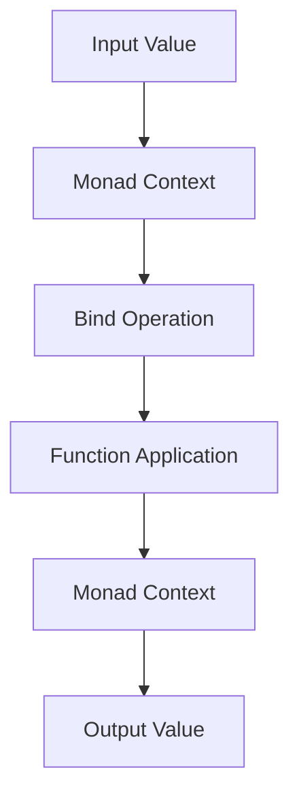

## 24.1 Exploring Monads and Applicative Functors

As experienced Java developers transitioning to Clojure, you may have encountered the concept of monads in functional programming. Monads are a powerful abstraction that allows us to handle computations with context, such as side effects or asynchronous operations, while maintaining functional purity. In this section, we will explore monads and applicative functors, their role in functional programming, and how to implement them in Clojure using libraries like [cats](https://funcool.github.io/cats/latest/).

### Understanding Monads

Monads can be thought of as design patterns that allow us to chain operations together while managing side effects and maintaining functional purity. They provide a way to sequence computations and handle values that may be wrapped in a context, such as optional values, errors, or asynchronous results.

#### Monads in Functional Programming

In functional programming, monads are used to encapsulate computations that involve side effects, such as I/O operations, state changes, or error handling. They allow us to write code that is both modular and composable, by abstracting away the details of how these effects are managed.

**Key Concepts of Monads:**

- **Unit (or Return):** A function that takes a value and wraps it in a monadic context.
- **Bind (or FlatMap):** A function that takes a monadic value and a function, applies the function to the unwrapped value, and returns a new monadic value.

Here's a simple analogy: think of a monad as a conveyor belt in a factory. Each item on the belt is wrapped in a box (the monadic context). The `bind` operation allows us to apply a function to the item inside the box, without having to manually open and close the box each time.

#### Implementing Monads in Clojure

Clojure does not have built-in support for monads, but we can use libraries like [cats](https://funcool.github.io/cats/latest/) to model them. The `cats` library provides a rich set of abstractions for working with monads, applicative functors, and other functional programming constructs.

**Example: Maybe Monad**

The `Maybe` monad is used to represent computations that may fail or return no value. It encapsulates an optional value, allowing us to chain operations without having to check for `nil` values explicitly.

```clojure
(require '[cats.core :as m])
(require '[cats.monad.maybe :as maybe])

;; Using the Maybe monad to handle optional values
(defn safe-divide [numerator denominator]
  (if (zero? denominator)
    (maybe/nothing)
    (maybe/just (/ numerator denominator))))

(defn process-division [x y]
  (m/mlet [result (safe-divide x y)]
    (m/return (* result 2))))

;; Example usage
(println (process-division 10 2))  ;; => #<Just 10>
(println (process-division 10 0))  ;; => #<Nothing>
```

In this example, `safe-divide` returns a `Just` value if the division is successful, or `Nothing` if the denominator is zero. The `mlet` macro is used to chain operations, automatically handling the `Nothing` case.

### Applicative Functors

Applicative functors are a generalization of monads that allow for function application lifted over a context. They provide a way to apply functions to values that are wrapped in a context, such as optional values or error results.

#### Key Concepts of Applicative Functors

- **Pure (or Return):** A function that takes a value and wraps it in an applicative context.
- **Apply:** A function that takes an applicative value and an applicative function, and applies the function to the value.

Applicative functors are useful when we want to apply a function to multiple arguments, each of which may be wrapped in a context.

**Example: Using Applicative Functors**

```clojure
(require '[cats.core :as m])
(require '[cats.applicative :as a])
(require '[cats.monad.maybe :as maybe])

(defn add-maybe [x y]
  (a/fapply (a/pure +) (maybe/just x) (maybe/just y)))

;; Example usage
(println (add-maybe 3 4))  ;; => #<Just 7>
(println (add-maybe 3 nil))  ;; => #<Nothing>
```

In this example, `add-maybe` uses the `fapply` function to apply the `+` function to two `Maybe` values. If either value is `Nothing`, the result is `Nothing`.

### Practical Examples

Let's explore some practical examples of how monads and applicative functors can simplify complex operations in Clojure.

#### Handling Computations with Optional Values (Maybe Monad)

The `Maybe` monad is particularly useful for handling computations that may return optional values. It allows us to chain operations without having to check for `nil` values explicitly.

```clojure
(defn parse-int [s]
  (try
    (maybe/just (Integer/parseInt s))
    (catch NumberFormatException e
      (maybe/nothing))))

(defn add-strings [s1 s2]
  (m/mlet [x (parse-int s1)
           y (parse-int s2)]
    (m/return (+ x y))))

;; Example usage
(println (add-strings "10" "20"))  ;; => #<Just 30>
(println (add-strings "10" "abc"))  ;; => #<Nothing>
```

In this example, `parse-int` returns a `Just` value if the string can be parsed as an integer, or `Nothing` if it cannot. The `add-strings` function uses `mlet` to chain the parsing operations and add the results.

#### Error Handling with the Either Monad

The `Either` monad is used to represent computations that may fail with an error. It encapsulates a value that can be either a success (`Right`) or an error (`Left`).

```clojure
(require '[cats.monad.either :as either])

(defn divide [numerator denominator]
  (if (zero? denominator)
    (either/left "Division by zero")
    (either/right (/ numerator denominator))))

(defn process-division [x y]
  (m/mlet [result (divide x y)]
    (m/return (* result 2))))

;; Example usage
(println (process-division 10 2))  ;; => #<Right 10>
(println (process-division 10 0))  ;; => #<Left "Division by zero">
```

In this example, `divide` returns a `Right` value if the division is successful, or a `Left` value with an error message if the denominator is zero. The `mlet` macro is used to chain operations, automatically handling the `Left` case.

### Try It Yourself

To deepen your understanding of monads and applicative functors, try modifying the examples above. For instance, experiment with different operations in the `Maybe` and `Either` monads, or try using the `cats` library to implement other monads, such as the `State` or `Reader` monads.

### Visual Aids

To better understand the flow of data through monads and applicative functors, let's visualize the process using a diagram.



**Diagram Description:** This diagram illustrates the flow of data through a monad. The input value is wrapped in a monad context, passed through a bind operation, and a function is applied to produce an output value, which is also wrapped in a monad context.

### References and Links

For further reading on monads and applicative functors in Clojure, consider exploring the following resources:

- [Cats Library Documentation](https://funcool.github.io/cats/latest/)
- [Official Clojure Documentation](https://clojure.org/reference/documentation)
- [ClojureDocs](https://clojuredocs.org/)
- [Functional Programming in Scala](https://www.manning.com/books/functional-programming-in-scala) - A great resource for understanding functional programming concepts, including monads and applicative functors.

### Knowledge Check

To reinforce your understanding of monads and applicative functors, consider the following questions:

1. What is the primary purpose of a monad in functional programming?
2. How does the `Maybe` monad help in handling optional values?
3. What is the difference between a monad and an applicative functor?
4. How can the `Either` monad be used for error handling?
5. What are the key functions associated with monads and applicative functors?

### Exercises

1. Implement a `Reader` monad in Clojure using the `cats` library.
2. Use the `State` monad to model a simple stateful computation.
3. Create a custom monad for handling asynchronous computations.

### Summary

In this section, we've explored the concepts of monads and applicative functors in Clojure. We've seen how they can be used to handle computations with context, such as optional values and errors, while maintaining functional purity. By leveraging libraries like `cats`, we can model these abstractions in Clojure and simplify complex operations.

Now that we've covered monads and applicative functors, let's continue our journey into advanced functional concepts in Clojure. In the next section, we'll explore transducers and how they can be used for composable data processing.

## Quiz: Test Your Knowledge on Monads and Applicative Functors



### What is the primary purpose of a monad in functional programming?

- [x] To encapsulate computations with context and maintain functional purity
- [ ] To provide a way to perform side effects directly
- [ ] To replace all imperative constructs in a program
- [ ] To optimize performance by avoiding context switching

> **Explanation:** Monads encapsulate computations with context, such as side effects or optional values, allowing us to maintain functional purity while chaining operations.

### How does the `Maybe` monad help in handling optional values?

- [x] It allows chaining operations without explicit `nil` checks
- [ ] It forces all values to be non-optional
- [ ] It converts all values to strings
- [ ] It eliminates the need for error handling

> **Explanation:** The `Maybe` monad encapsulates optional values, allowing us to chain operations without having to check for `nil` values explicitly.

### What is the difference between a monad and an applicative functor?

- [x] Monads allow chaining operations, while applicative functors allow function application over a context
- [ ] Monads are more powerful than applicative functors in every aspect
- [ ] Applicative functors are a subset of monads
- [ ] Monads and applicative functors are identical

> **Explanation:** Monads allow chaining operations with context, while applicative functors allow applying functions to values within a context.

### How can the `Either` monad be used for error handling?

- [x] It encapsulates a value that can be either a success (`Right`) or an error (`Left`)
- [ ] It eliminates all errors from a program
- [ ] It converts errors into warnings
- [ ] It logs errors to a file

> **Explanation:** The `Either` monad encapsulates a value that can be either a success (`Right`) or an error (`Left`), allowing us to handle errors in a functional way.

### What are the key functions associated with monads and applicative functors?

- [x] Unit (or Return) and Bind (or FlatMap) for monads; Pure (or Return) and Apply for applicative functors
- [ ] Map and Filter for both monads and applicative functors
- [ ] Reduce and Fold for monads; Map and Filter for applicative functors
- [ ] None of the above

> **Explanation:** Monads use Unit (or Return) and Bind (or FlatMap) to encapsulate and chain computations, while applicative functors use Pure (or Return) and Apply to lift function application over a context.

### Which library can be used in Clojure to implement monads?

- [x] Cats
- [ ] Ring
- [ ] Compojure
- [ ] Reagent

> **Explanation:** The `cats` library provides abstractions for working with monads, applicative functors, and other functional programming constructs in Clojure.

### What is the role of the `bind` function in a monad?

- [x] To chain operations by applying a function to the unwrapped value and returning a new monadic value
- [ ] To convert a monadic value into a regular value
- [ ] To handle errors in a monadic computation
- [ ] To optimize performance by avoiding context switching

> **Explanation:** The `bind` function chains operations by applying a function to the unwrapped value and returning a new monadic value, allowing us to sequence computations.

### What is the purpose of the `pure` function in an applicative functor?

- [x] To wrap a value in an applicative context
- [ ] To unwrap a value from an applicative context
- [ ] To convert a monadic value into an applicative value
- [ ] To handle errors in an applicative computation

> **Explanation:** The `pure` function wraps a value in an applicative context, allowing us to lift function application over that context.

### How can monads help in maintaining functional purity?

- [x] By encapsulating side effects and providing a way to chain operations without directly performing side effects
- [ ] By eliminating all side effects from a program
- [ ] By converting all values to immutable data structures
- [ ] By optimizing performance through lazy evaluation

> **Explanation:** Monads encapsulate side effects and provide a way to chain operations without directly performing side effects, helping to maintain functional purity.

### True or False: Monads and applicative functors are unique to Clojure and cannot be found in other programming languages.

- [ ] True
- [x] False

> **Explanation:** Monads and applicative functors are not unique to Clojure; they are common abstractions in functional programming and can be found in many programming languages, including Haskell and Scala.


