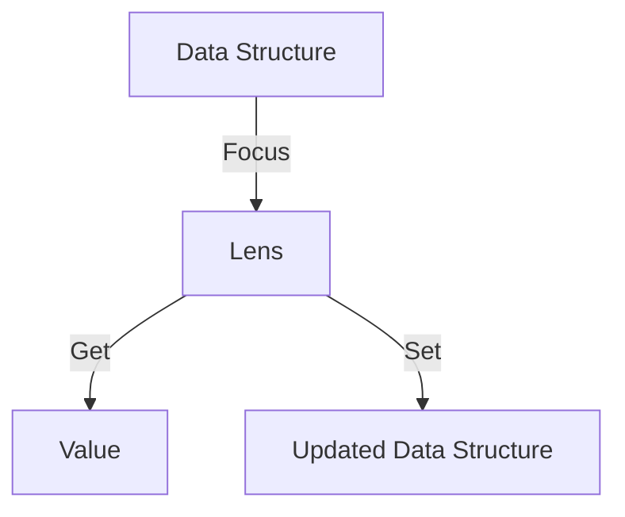

## 24.2 Functional Lenses and Data Access

In the realm of functional programming, dealing with immutable data structures is a fundamental concept. However, accessing and updating deeply nested data within these structures can become cumbersome. This is where **functional lenses** come into play. Lenses provide a powerful abstraction for focusing on and updating parts of immutable data structures in a composable and elegant manner.

### What Are Lenses?

Lenses are composable tools that allow you to focus on specific parts of a data structure, making it easier to access and update nested data without mutating the original structure. They are particularly useful in functional programming languages like Clojure, where immutability is a core principle.

#### Key Concepts of Lenses

- **Focus**: Lenses allow you to focus on a specific part of a data structure, enabling you to access or modify it without affecting the rest of the structure.
- **Composability**: Lenses can be composed to create more complex lenses that can focus on deeper or more specific parts of a data structure.
- **Immutability**: Lenses provide a way to update data structures without mutating them, preserving the benefits of immutability.

To understand lenses better, let's draw a parallel with Java. In Java, accessing and modifying nested data often involves a series of getter and setter methods, which can become verbose and error-prone. Lenses, on the other hand, offer a more concise and expressive way to achieve the same goal.

### Benefits of Using Lenses

Lenses offer several benefits that make them an attractive choice for working with immutable data structures:

- **Conciseness**: Lenses provide a concise syntax for accessing and updating nested data, reducing boilerplate code.
- **Safety**: By working with immutable data, lenses help prevent unintended side effects and bugs related to data mutation.
- **Reusability**: Lenses can be composed and reused across different parts of an application, promoting code reuse and modularity.
- **Expressiveness**: Lenses allow you to express complex data transformations in a clear and declarative manner.

### Clojure Libraries for Lenses

Clojure offers several libraries that implement the concept of lenses, making it easier to work with immutable data structures. Two popular libraries are [Specter](https://github.com/nathanmarz/specter) and [Lens](https://github.com/StudioLe/RadMapper.ClojureLens).

#### Specter

Specter is a powerful library for querying and transforming nested data structures. It provides a rich set of navigators and transformers that can be composed to perform complex data manipulations.

```clojure
(require '[com.rpl.specter :as s])

(def data {:a {:b {:c 1}}})

;; Accessing nested data
(s/select [:a :b :c] data)
;; => [1]

;; Updating nested data
(s/setval [:a :b :c] 2 data)
;; => {:a {:b {:c 2}}}
```

#### Lens

The Lens library provides a more traditional implementation of lenses, allowing you to define and compose lenses for specific data access patterns.

```clojure
(require '[clojure-lens.core :as lens])

(def data {:a {:b {:c 1}}})

;; Define a lens for accessing :c
(def c-lens (lens/lens :c))

;; Accessing nested data
(lens/view c-lens (get-in data [:a :b]))
;; => 1

;; Updating nested data
(lens/set c-lens 2 (get-in data [:a :b]))
;; => {:c 2}
```

### Creating Custom Lenses

Creating custom lenses allows you to tailor data access patterns to the specific needs of your application. Let's explore how to define and compose custom lenses in Clojure.

#### Defining a Custom Lens

A lens is typically defined by specifying how to get and set a value within a data structure. Here's a simple example:

```clojure
(defn make-lens [getter setter]
  {:get getter
   :set setter})

(defn get-value [lens data]
  ((:get lens) data))

(defn set-value [lens value data]
  ((:set lens) value data))

;; Define a lens for accessing :c
(def c-lens (make-lens :c assoc))

;; Using the custom lens
(get-value c-lens {:c 1})
;; => 1

(set-value c-lens 2 {:c 1})
;; => {:c 2}
```

#### Composing Lenses

Lenses can be composed to create more complex lenses that can focus on deeper parts of a data structure.

```clojure
(defn compose-lenses [outer inner]
  (make-lens
    (fn [data] (get-value inner (get-value outer data)))
    (fn [value data] (set-value outer (set-value inner value (get-value outer data)) data))))

;; Define lenses for :a and :b
(def a-lens (make-lens :a assoc))
(def b-lens (make-lens :b assoc))

;; Compose lenses to access :c
(def ab-c-lens (compose-lenses a-lens (compose-lenses b-lens c-lens)))

;; Using the composed lens
(get-value ab-c-lens {:a {:b {:c 1}}})
;; => 1

(set-value ab-c-lens 2 {:a {:b {:c 1}}})
;; => {:a {:b {:c 2}}}
```

### Practical Use Cases

Lenses are particularly useful in scenarios where you need to manipulate complex data structures, such as state management or data transformation pipelines.

#### State Management

In applications with complex state, lenses can simplify the process of accessing and updating nested state data.

```clojure
(def app-state {:user {:profile {:name "Alice"}}})

;; Define a lens for accessing the user's name
(def name-lens (compose-lenses (make-lens :user assoc) (compose-lenses (make-lens :profile assoc) (make-lens :name assoc))))

;; Access the user's name
(get-value name-lens app-state)
;; => "Alice"

;; Update the user's name
(set-value name-lens "Bob" app-state)
;; => {:user {:profile {:name "Bob"}}}
```

#### Data Transformation Pipelines

Lenses can be used to build data transformation pipelines that process and transform data in a declarative manner.

```clojure
(def data [{:id 1 :value 10} {:id 2 :value 20}])

;; Define a lens for accessing :value
(def value-lens (make-lens :value assoc))

;; Increment all values in the data
(map #(set-value value-lens (+ 1 (get-value value-lens %)) %) data)
;; => [{:id 1 :value 11} {:id 2 :value 21}]
```

### Visualizing Lenses

To better understand how lenses work, let's visualize the process of accessing and updating data using lenses.



**Figure 1**: The flow of data through a lens, focusing on a specific part of a data structure to get or set a value.

### References and Links

- [Specter GitHub Repository](https://github.com/nathanmarz/specter)
- [Lens GitHub Repository](https://github.com/StudioLe/RadMapper.ClojureLens)
- [Official Clojure Documentation](https://clojure.org/reference/documentation)

### Knowledge Check

To reinforce your understanding of functional lenses and data access in Clojure, try answering the following questions and challenges:

1. Explain the concept of a lens in your own words.
2. What are the benefits of using lenses in functional programming?
3. How do lenses help in managing state in a Clojure application?
4. Try modifying the provided code examples to access and update different parts of the data structures.
5. Explore the Specter library and try using it to perform complex data transformations.

### Encouraging Tone

Now that we've explored the power of functional lenses in Clojure, you're well-equipped to handle complex data access and manipulation tasks in your applications. Remember, lenses are a powerful tool that can simplify your code and make it more expressive. Keep experimenting and applying these concepts to your projects!

### Quiz: Mastering Functional Lenses in Clojure



### What is a primary benefit of using lenses in functional programming?

- [x] They provide a concise way to access and update nested data.
- [ ] They allow for mutable data structures.
- [ ] They eliminate the need for functions.
- [ ] They are only useful in object-oriented programming.

> **Explanation:** Lenses provide a concise and expressive way to access and update nested data without mutating the original structure.

### Which Clojure library is known for implementing lenses?

- [x] Specter
- [ ] Ring
- [ ] Reagent
- [ ] Compojure

> **Explanation:** Specter is a popular Clojure library that provides powerful tools for querying and transforming nested data structures.

### How do lenses contribute to immutability in Clojure?

- [x] They allow data to be updated without mutation.
- [ ] They convert data to mutable forms.
- [ ] They require data to be mutable.
- [ ] They eliminate the need for data structures.

> **Explanation:** Lenses enable updates to data structures without mutating them, preserving immutability.

### What is a key feature of lenses that makes them powerful?

- [x] Composability
- [ ] Mutability
- [ ] Complexity
- [ ] Inflexibility

> **Explanation:** Lenses are composable, allowing them to be combined to focus on deeper or more specific parts of a data structure.

### Which of the following is a practical use case for lenses?

- [x] State management
- [ ] Network communication
- [ ] File I/O
- [ ] Graphics rendering

> **Explanation:** Lenses are particularly useful for managing complex state in applications.

### What is the purpose of the `compose-lenses` function in the provided example?

- [x] To combine multiple lenses into a single lens.
- [ ] To create a mutable data structure.
- [ ] To eliminate the need for lenses.
- [ ] To convert data to a different type.

> **Explanation:** The `compose-lenses` function combines multiple lenses to create a single lens that can focus on deeper parts of a data structure.

### How can lenses improve code readability?

- [x] By providing a declarative way to express data transformations.
- [ ] By increasing the amount of boilerplate code.
- [ ] By making code more complex.
- [ ] By eliminating the need for functions.

> **Explanation:** Lenses provide a declarative and expressive way to express data transformations, improving code readability.

### What is a key advantage of using the Specter library?

- [x] It provides powerful tools for querying and transforming nested data.
- [ ] It eliminates the need for data structures.
- [ ] It requires mutable data.
- [ ] It is only useful for web development.

> **Explanation:** Specter provides powerful tools for querying and transforming nested data structures, making it a valuable library for data manipulation.

### How do lenses help in building data transformation pipelines?

- [x] By allowing data transformations to be expressed declaratively.
- [ ] By requiring mutable data.
- [ ] By eliminating the need for data transformations.
- [ ] By making data transformations more complex.

> **Explanation:** Lenses allow data transformations to be expressed declaratively, making it easier to build data transformation pipelines.

### True or False: Lenses can only be used with immutable data structures.

- [x] True
- [ ] False

> **Explanation:** Lenses are designed to work with immutable data structures, allowing for updates without mutation.



By mastering functional lenses, you can unlock new levels of expressiveness and efficiency in your Clojure applications. Keep exploring and experimenting with these powerful tools to enhance your functional programming skills!
