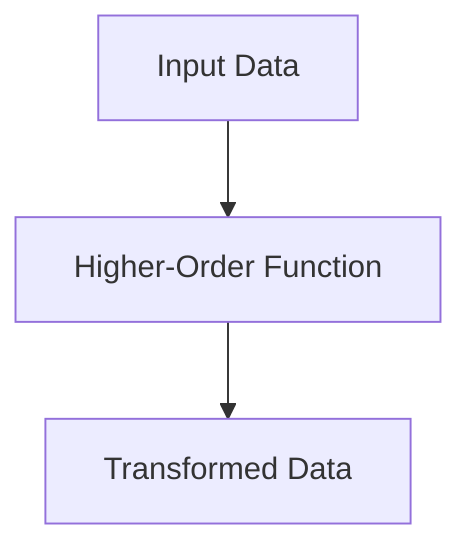
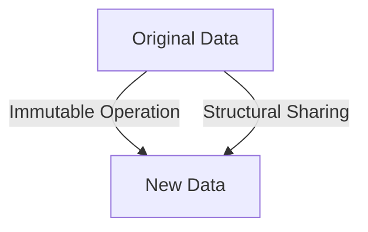

## 24.5 Functional Programming at Scale

As we delve into the realm of functional programming at scale, it's crucial to understand the unique challenges and opportunities that arise when applying functional paradigms to large codebases. In this section, we will explore the considerations necessary for scaling functional programming with Clojure, focusing on modular design, code reusability, team practices, and tooling.

### Challenges of Scaling Functional Code

Scaling functional code involves more than just writing efficient functions. It requires a strategic approach to code organization, team collaboration, and tooling. Let's explore these challenges in detail.

#### Code Organization

In large codebases, maintaining a clear and logical structure is paramount. Functional programming encourages a modular approach, where applications are broken down into smaller, reusable components. This modularity not only enhances code readability but also facilitates easier maintenance and testing.

#### Team Collaboration

Functional programming introduces a paradigm shift that can be challenging for teams accustomed to imperative programming. Ensuring that all team members are on the same page regarding functional principles is crucial for maintaining consistency and quality across the codebase.

#### Tooling and Build Systems

Managing dependencies and builds in large projects can be complex. Clojure offers tools like Leiningen and deps.edn to streamline these processes, but understanding how to leverage them effectively is key to scaling functional applications.

### Modular Design

Modular design is at the heart of scalable functional programming. By breaking applications into smaller, independent modules, we can achieve greater flexibility and reusability.

#### Emphasizing Pure Functions

Pure functions, which have no side effects and return the same output for the same input, are the building blocks of modular design. They can be easily tested and reused across different parts of an application.

```clojure
;; Example of a pure function in Clojure
(defn add [x y]
  (+ x y))

;; Usage
(add 2 3) ; => 5
```

#### Creating Reusable Modules

In Clojure, namespaces are used to organize code into modules. Each namespace can contain a collection of related functions and data structures, promoting separation of concerns and reusability.

```clojure
(ns myapp.math)

(defn square [x]
  (* x x))

(defn cube [x]
  (* x x x))
```

#### Benefits of Modular Design

- **Improved Maintainability**: Smaller modules are easier to understand and modify.
- **Enhanced Testability**: Pure functions and isolated modules can be tested independently.
- **Increased Flexibility**: Modules can be reused and composed in different ways to create new functionality.

### Code Reusability and DRY Principles

The DRY (Don't Repeat Yourself) principle is a cornerstone of efficient codebases. In functional programming, we achieve code reusability through higher-order functions and abstractions.

#### Higher-Order Functions

Higher-order functions are functions that take other functions as arguments or return them as results. They enable powerful abstractions and code reuse.

```clojure
;; Example of a higher-order function
(defn apply-twice [f x]
  (f (f x)))

;; Usage
(apply-twice inc 5) ; => 7
```

#### Abstractions and Composition

Functional programming encourages the creation of abstractions that encapsulate common patterns. Function composition allows us to build complex functionality by combining simpler functions.

```clojure
;; Function composition using comp
(defn add-and-square [x]
  ((comp square add) x x))

(add-and-square 2) ; => 16
```

#### Avoiding Duplication

By identifying common patterns and abstracting them into reusable functions, we can avoid code duplication and ensure consistency across the codebase.

### Team Practices

Scaling functional programming requires a collaborative team effort. Here are some practices to foster a functional mindset and maintain consistency.

#### Pair Programming

Pair programming involves two developers working together on the same code. This practice encourages knowledge sharing and helps team members learn functional concepts from each other.

#### Code Reviews

Regular code reviews ensure that functional principles are consistently applied across the codebase. They provide an opportunity for feedback and learning, helping to maintain high-quality code.

#### Shared Functional Paradigms

Establishing shared functional paradigms and guidelines helps align the team on best practices. This includes agreeing on naming conventions, code organization, and functional patterns.

### Tooling and Build Systems

Effective tooling is essential for managing large Clojure projects. Let's explore some of the tools that can help streamline development and scaling.

#### Leiningen

[Leiningen](https://leiningen.org/) is a popular build automation tool for Clojure. It simplifies project setup, dependency management, and builds.

- **Project Templates**: Use Leiningen templates to quickly scaffold new projects with predefined structures.
- **Dependency Management**: Manage dependencies declaratively in the `project.clj` file.
- **Task Automation**: Automate common tasks like testing, building, and deploying with custom Leiningen tasks.

#### deps.edn

[deps.edn](https://clojure.org/guides/deps_and_cli) is a newer tool for dependency management in Clojure. It provides a more flexible and lightweight alternative to Leiningen.

- **Dependency Aliases**: Use aliases to manage different sets of dependencies for various environments.
- **CLI Integration**: Integrate with the Clojure CLI for streamlined command-line workflows.
- **Simplified Configuration**: Define dependencies and paths in a simple EDN format.

### Visual Aids

To better understand the flow of data and modular design in Clojure, let's look at a few diagrams.

#### Data Flow in Higher-Order Functions



*Diagram 1: The flow of data through a higher-order function.*

#### Immutability and Persistent Data Structures



*Diagram 2: Immutability and structural sharing in persistent data structures.*

### References and Links

- [Official Clojure Documentation](https://clojure.org/)
- [ClojureDocs](https://clojuredocs.org/)
- [Leiningen](https://leiningen.org/)
- [deps.edn Guide](https://clojure.org/guides/deps_and_cli)

### Knowledge Check

To reinforce your understanding of scaling functional programming with Clojure, consider the following questions and exercises.

1. **What are the benefits of modular design in functional programming?**
2. **How can higher-order functions promote code reusability?**
3. **Why is pair programming beneficial in a functional programming team?**
4. **Experiment with creating a reusable module in Clojure. What challenges did you encounter?**

### Encouraging Tone

Now that we've explored the challenges and strategies for scaling functional programming with Clojure, let's apply these concepts to your projects. Embrace modular design, leverage higher-order functions, and collaborate effectively with your team to build scalable and maintainable applications.

### Quiz: Mastering Functional Programming at Scale



### What is a key benefit of modular design in functional programming?

- [x] Improved maintainability
- [ ] Increased complexity
- [ ] Reduced testability
- [ ] Decreased flexibility

> **Explanation:** Modular design improves maintainability by breaking applications into smaller, manageable components.

### How do higher-order functions contribute to code reusability?

- [x] By allowing functions to be passed as arguments
- [ ] By increasing code duplication
- [ ] By making code less readable
- [ ] By reducing function abstraction

> **Explanation:** Higher-order functions enable code reusability by allowing functions to be passed as arguments and composed.

### What is the purpose of pair programming in a functional programming team?

- [x] To encourage knowledge sharing
- [ ] To increase individual productivity
- [ ] To reduce code quality
- [ ] To eliminate code reviews

> **Explanation:** Pair programming encourages knowledge sharing and helps team members learn functional concepts from each other.

### Which tool is commonly used for build automation in Clojure?

- [x] Leiningen
- [ ] Maven
- [ ] Gradle
- [ ] Ant

> **Explanation:** Leiningen is a popular build automation tool for Clojure, simplifying project setup and dependency management.

### What is the role of deps.edn in Clojure projects?

- [x] Managing dependencies
- [ ] Compiling code
- [ ] Running tests
- [ ] Deploying applications

> **Explanation:** deps.edn is used for managing dependencies in Clojure projects, providing a flexible alternative to Leiningen.

### What is a benefit of using pure functions in modular design?

- [x] They have no side effects
- [ ] They increase code complexity
- [ ] They require more dependencies
- [ ] They reduce code readability

> **Explanation:** Pure functions have no side effects, making them easier to test and reuse in modular design.

### How can code reviews help maintain consistency in a functional codebase?

- [x] By providing feedback and learning opportunities
- [ ] By reducing team collaboration
- [ ] By eliminating functional paradigms
- [ ] By increasing code duplication

> **Explanation:** Code reviews provide feedback and learning opportunities, helping to maintain consistency in a functional codebase.

### What is a key feature of structural sharing in persistent data structures?

- [x] It allows efficient data manipulation
- [ ] It increases memory usage
- [ ] It reduces data immutability
- [ ] It complicates data access

> **Explanation:** Structural sharing allows efficient data manipulation by reusing existing data structures.

### How does function composition enhance code flexibility?

- [x] By combining simpler functions into complex functionality
- [ ] By reducing code readability
- [ ] By increasing code duplication
- [ ] By eliminating function abstraction

> **Explanation:** Function composition enhances code flexibility by combining simpler functions into complex functionality.

### True or False: Modular design decreases testability in functional programming.

- [ ] True
- [x] False

> **Explanation:** Modular design increases testability by isolating components, making them easier to test independently.



By embracing these strategies and practices, you can effectively scale functional programming with Clojure, creating robust and maintainable applications that stand the test of time.
