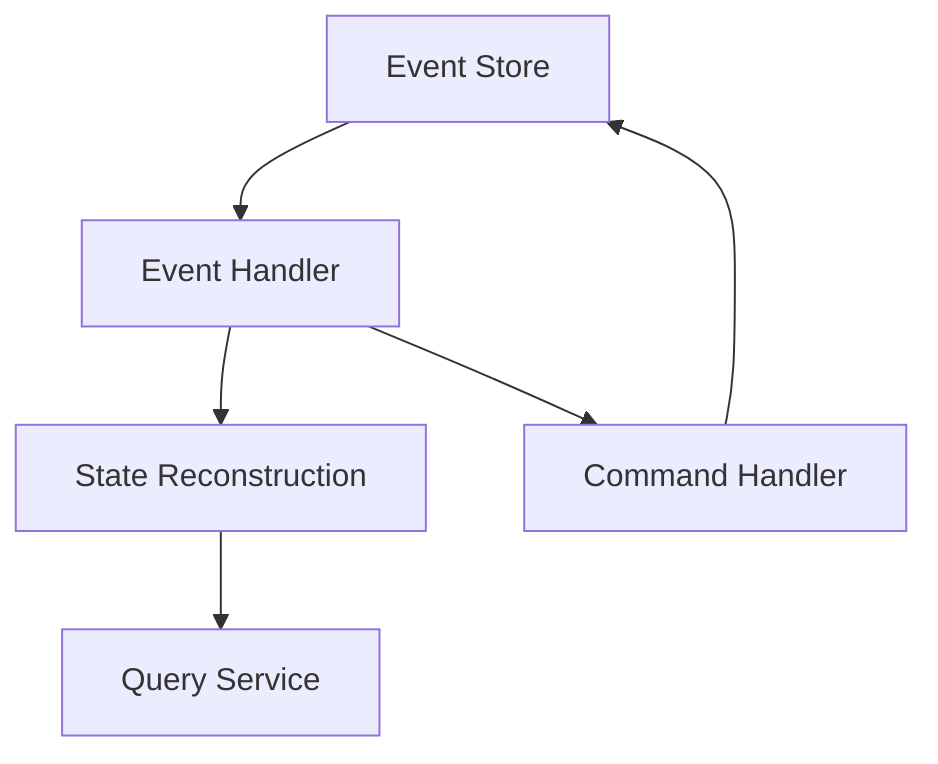

## 24.6 Functional Design in Distributed Systems

Designing distributed systems can be a complex task, but functional programming principles offer a powerful toolkit to simplify this process. In this section, we will explore how Clojure, with its emphasis on immutability and statelessness, can be leveraged to build scalable and resilient distributed systems. We will delve into key concepts such as data serialization, event sourcing, Command Query Responsibility Segregation (CQRS), consistency models, and strategies for resilience and fault tolerance.

### Functional Principles in Distribution

Functional programming principles, particularly immutability and statelessness, are well-suited for distributed systems. These principles help address common challenges such as state management, data consistency, and fault tolerance.

#### Immutability and Statelessness

**Immutability** ensures that data structures cannot be modified after they are created. This characteristic is crucial in distributed systems, where concurrent operations on shared data can lead to inconsistencies. By using immutable data structures, we eliminate the risk of data races and simplify reasoning about system behavior.

**Statelessness** refers to the design of components that do not retain state between requests. Stateless components are easier to scale horizontally because they do not require coordination to maintain consistency. In Clojure, functions are typically pure and stateless, making them ideal for distributed environments.

##### Java vs. Clojure: Immutability

In Java, achieving immutability often requires careful design and the use of final fields. In contrast, Clojure provides immutable data structures by default, such as lists, vectors, maps, and sets.

**Java Example:**

```java
import java.util.Collections;
import java.util.List;

public class ImmutableExample {
    private final List<String> items;

    public ImmutableExample(List<String> items) {
        this.items = Collections.unmodifiableList(items);
    }

    public List<String> getItems() {
        return items;
    }
}
```

**Clojure Example:**

```clojure
(def items ["apple" "banana" "cherry"])

(defn get-items []
  items)
```

In Clojure, the `items` vector is immutable by default, simplifying the design and reducing the risk of unintended side effects.

### Data Serialization

Efficient data serialization is critical in distributed systems to ensure that data can be transmitted across network boundaries. Clojure's immutable data structures can be serialized using various formats, such as JSON, Avro, or Protocol Buffers.

#### JSON Serialization

JSON is a widely used format for data interchange due to its simplicity and human readability. Clojure provides libraries like `cheshire` for JSON serialization.

**Clojure Example:**

```clojure
(require '[cheshire.core :as json])

(def data {:name "Alice" :age 30})

(def json-data (json/generate-string data))
;; => "{\"name\":\"Alice\",\"age\":30}"

(def parsed-data (json/parse-string json-data true))
;; => {:name "Alice", :age 30}
```

#### Avro and Protocol Buffers

For more efficient serialization, especially in high-performance systems, Avro and Protocol Buffers are preferred. These formats offer compact binary serialization, which reduces the size of transmitted data and improves speed.

**Clojure Example with Avro:**

```clojure
(require '[clj-avro.core :as avro])

(def schema {:type "record"
             :name "User"
             :fields [{:name "name" :type "string"}
                      {:name "age" :type "int"}]})

(def user {:name "Alice" :age 30})

(def encoded (avro/encode schema user))
(def decoded (avro/decode schema encoded))
;; => {:name "Alice", :age 30}
```

### Event Sourcing and CQRS

Event Sourcing and Command Query Responsibility Segregation (CQRS) are architectural patterns that align well with functional programming principles.

#### Event Sourcing

**Event Sourcing** involves storing the state of a system as a sequence of events. Instead of persisting the current state, each change is recorded as an event. This approach provides a complete audit trail and allows the system to be reconstructed by replaying events.

**Clojure Example:**

```clojure
(defn apply-event [state event]
  (case (:type event)
    :user-created (assoc state :user (:user event))
    :user-updated (update state :user merge (:user event))
    state))

(defn replay-events [initial-state events]
  (reduce apply-event initial-state events))

(def events [{:type :user-created :user {:name "Alice" :age 30}}
             {:type :user-updated :user {:age 31}}])

(def current-state (replay-events {} events))
;; => {:user {:name "Alice", :age 31}}
```

#### CQRS

**CQRS** separates the read and write operations of a system. Commands change the state, while queries retrieve data. This separation allows for optimized data models and scalability.

**Clojure Example:**

```clojure
(defn handle-command [state command]
  (case (:type command)
    :create-user (assoc state :user (:user command))
    :update-user (update state :user merge (:user command))
    state))

(defn query-state [state query]
  (case (:type query)
    :get-user (:user state)
    nil))

(def state (atom {}))

(swap! state handle-command {:type :create-user :user {:name "Alice" :age 30}})
(query-state @state {:type :get-user})
;; => {:name "Alice", :age 30}
```

### Consistency Models

In distributed systems, achieving strong consistency can be challenging due to network partitions and latency. Functional programming models can accommodate eventual consistency, where updates propagate asynchronously.

#### Eventual Consistency

**Eventual Consistency** allows systems to continue operating despite temporary inconsistencies. Over time, all nodes will converge to the same state.

**Clojure Example:**

```clojure
(defn update-node [node data]
  (assoc node :data data))

(defn propagate-update [nodes data]
  (map #(update-node % data) nodes))

(def nodes [{:id 1} {:id 2} {:id 3}])

(def updated-nodes (propagate-update nodes {:key "value"}))
;; => ({:id 1, :data {:key "value"}} {:id 2, :data {:key "value"}} {:id 3, :data {:key "value"}})
```

### Resilience and Fault Tolerance

Building robust distributed systems requires strategies for resilience and fault tolerance. Functional programming offers concepts like supervision trees and retry mechanisms to handle failures gracefully.

#### Supervision Trees

Supervision trees are a hierarchical structure for managing processes. Supervisors monitor child processes and restart them in case of failure.

**Clojure Example:**

```clojure
(defn supervisor [child-fn]
  (try
    (child-fn)
    (catch Exception e
      (println "Child process failed, restarting...")
      (recur child-fn))))

(defn child-process []
  (println "Running child process")
  (throw (Exception. "Failure")))

(supervisor child-process)
```

#### Retry Mechanisms

Retry mechanisms attempt to recover from transient failures by retrying operations after a delay.

**Clojure Example:**

```clojure
(defn retry [n f]
  (loop [attempts n]
    (try
      (f)
      (catch Exception e
        (when (pos? attempts)
          (Thread/sleep 1000)
          (recur (dec attempts)))))))

(defn unreliable-operation []
  (if (< (rand) 0.5)
    (throw (Exception. "Random failure"))
    (println "Operation succeeded")))

(retry 3 unreliable-operation)
```

### Visual Aids

To better understand these concepts, let's visualize the flow of data in a distributed system using functional programming principles.

#### Data Flow in Event Sourcing



**Caption:** This diagram illustrates the flow of data in an event-sourced system. Events are stored and processed by handlers to reconstruct state and handle commands.

### References and Links

- [Official Clojure Documentation](https://clojure.org/reference/documentation)
- [Cheshire JSON Library](https://github.com/dakrone/cheshire)
- [Martin Fowler on Event Sourcing](https://martinfowler.com/eaaDev/EventSourcing.html)
- [Martin Fowler on CQRS](https://martinfowler.com/bliki/CQRS.html)

### Knowledge Check

To reinforce your understanding, consider the following questions:

1. How does immutability benefit distributed systems?
2. What are the advantages of using JSON for data serialization?
3. How does event sourcing differ from traditional state persistence?
4. What is the role of CQRS in distributed systems?
5. How can eventual consistency be achieved in a distributed system?

### Exercises

1. Implement a simple event-sourced system in Clojure that tracks user account changes.
2. Create a CQRS-based application that separates read and write operations for a product catalog.
3. Design a retry mechanism for a network request that handles transient failures.

### Summary

In this section, we've explored how functional programming principles can simplify the design of distributed systems. By leveraging immutability, statelessness, and patterns like event sourcing and CQRS, we can build scalable and resilient systems. Remember to consider consistency models and resilience strategies to handle the challenges of distributed environments effectively.

Now that we've covered functional design in distributed systems, let's continue to explore more advanced functional concepts in the next section.

## Quiz: Test Your Knowledge on Functional Design in Distributed Systems



### How does immutability benefit distributed systems?

- [x] It eliminates data races and simplifies reasoning about system behavior.
- [ ] It increases the complexity of data serialization.
- [ ] It requires more memory for data storage.
- [ ] It makes systems slower due to lack of state changes.

> **Explanation:** Immutability ensures that data cannot be modified, eliminating data races and simplifying reasoning about system behavior.

### What is the primary advantage of using JSON for data serialization?

- [x] Human readability and simplicity.
- [ ] High performance and compactness.
- [ ] Strong typing and schema enforcement.
- [ ] Built-in support for binary data.

> **Explanation:** JSON is widely used for its human readability and simplicity, making it easy to understand and debug.

### How does event sourcing differ from traditional state persistence?

- [x] It stores changes as events rather than the current state.
- [ ] It requires more storage space.
- [ ] It is less reliable than traditional persistence.
- [ ] It does not support auditing.

> **Explanation:** Event sourcing stores changes as events, providing a complete audit trail and enabling state reconstruction.

### What is the role of CQRS in distributed systems?

- [x] Separating read and write operations for scalability.
- [ ] Combining read and write operations for simplicity.
- [ ] Ensuring strong consistency across nodes.
- [ ] Reducing the need for data serialization.

> **Explanation:** CQRS separates read and write operations, allowing for optimized data models and improved scalability.

### How can eventual consistency be achieved in a distributed system?

- [x] By allowing updates to propagate asynchronously.
- [ ] By enforcing strict transaction boundaries.
- [ ] By using only synchronous communication.
- [ ] By avoiding data replication.

> **Explanation:** Eventual consistency allows updates to propagate asynchronously, enabling systems to continue operating despite temporary inconsistencies.

### What is a supervision tree?

- [x] A hierarchical structure for managing processes.
- [ ] A data structure for storing events.
- [ ] A mechanism for retrying failed operations.
- [ ] A model for achieving eventual consistency.

> **Explanation:** Supervision trees are used to manage processes, monitoring child processes and restarting them in case of failure.

### What is the purpose of retry mechanisms in distributed systems?

- [x] To recover from transient failures by retrying operations.
- [ ] To ensure strong consistency across nodes.
- [ ] To reduce the need for data serialization.
- [ ] To simplify data flow in event-sourced systems.

> **Explanation:** Retry mechanisms attempt to recover from transient failures by retrying operations after a delay.

### Which serialization format is preferred for high-performance systems?

- [x] Avro and Protocol Buffers.
- [ ] JSON.
- [ ] XML.
- [ ] YAML.

> **Explanation:** Avro and Protocol Buffers offer compact binary serialization, which reduces the size of transmitted data and improves speed.

### What is the benefit of using stateless components in distributed systems?

- [x] Easier horizontal scaling.
- [ ] Increased memory usage.
- [ ] More complex state management.
- [ ] Reduced system performance.

> **Explanation:** Stateless components are easier to scale horizontally because they do not retain state between requests.

### True or False: Functional programming principles can simplify the design of distributed systems.

- [x] True
- [ ] False

> **Explanation:** Functional programming principles like immutability and statelessness simplify the design of distributed systems by reducing complexity and improving scalability.


