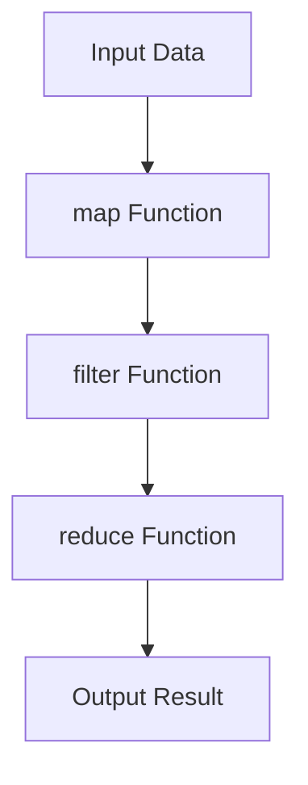
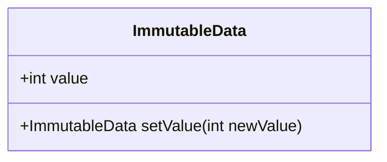
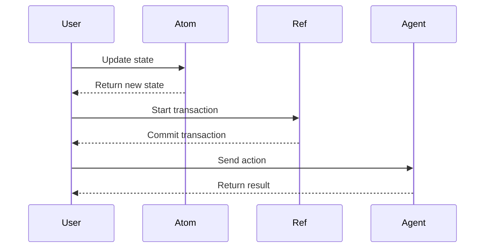

## 25.1 Recap of Key Functional Concepts

As we reach the conclusion of our journey through mastering functional programming with Clojure, it's essential to reflect on the core concepts that have been covered throughout this guide. This recap will not only reinforce your understanding but also highlight the practical benefits of applying functional programming principles in real-world software development. Let's delve into the key concepts that form the foundation of functional programming and explore how they contribute to building scalable and efficient applications.

### Importance of Functional Principles

Functional programming is a paradigm that emphasizes the use of functions as the primary building blocks of software. It contrasts with imperative programming, where the focus is on changing state and executing commands. The core principles of functional programming—immutability, pure functions, and composability—lead to simpler, more reliable, and maintainable code. Let's explore these principles in detail.

#### Immutability

Immutability is the concept of creating data structures that cannot be modified after they are created. In Clojure, immutability is a fundamental aspect of the language, and it provides several benefits:

- **Predictability**: Since data cannot change, functions that operate on immutable data are more predictable and easier to reason about.
- **Concurrency**: Immutability eliminates the need for locks and synchronization when accessing shared data, making it easier to write concurrent programs.
- **Debugging**: Immutable data structures simplify debugging, as the state of the data remains consistent throughout the program's execution.

In Java, immutability is often achieved through the use of final variables and immutable classes. However, Clojure takes immutability a step further by making it the default behavior for all data structures.

```clojure
;; Clojure example of an immutable vector
(def my-vector [1 2 3 4])

;; Attempting to change an element results in a new vector
(def new-vector (assoc my-vector 2 99))

;; my-vector remains unchanged
(println my-vector)  ; Output: [1 2 3 4]
(println new-vector) ; Output: [1 2 99 4]
```

In Java, achieving similar immutability would require creating a new instance of the data structure each time a change is needed.

```java
// Java example of an immutable list
List<Integer> myList = List.of(1, 2, 3, 4);

// Creating a new list with a changed element
List<Integer> newList = new ArrayList<>(myList);
newList.set(2, 99);

// myList remains unchanged
System.out.println(myList);  // Output: [1, 2, 3, 4]
System.out.println(newList); // Output: [1, 2, 99, 4]
```

#### Pure Functions

Pure functions are functions that have no side effects and always produce the same output for the same input. They are a cornerstone of functional programming because they make code easier to understand, test, and maintain.

- **Determinism**: Pure functions are deterministic, meaning their behavior is predictable and consistent.
- **Testability**: Since pure functions do not depend on external state, they are easy to test in isolation.
- **Composability**: Pure functions can be composed together to build more complex functionality.

In Clojure, writing pure functions is straightforward, as the language encourages a functional style.

```clojure
;; Clojure example of a pure function
(defn add [a b]
  (+ a b))

(println (add 2 3)) ; Output: 5
```

In Java, achieving pure functions requires careful attention to avoid side effects, such as modifying global variables or performing I/O operations.

```java
// Java example of a pure function
public int add(int a, int b) {
    return a + b;
}

System.out.println(add(2, 3)); // Output: 5
```

#### Composability

Composability is the ability to combine simple functions to build more complex operations. It is a powerful concept that allows developers to create modular and reusable code.

- **Modularity**: Composable functions can be reused in different parts of a program, reducing code duplication.
- **Abstraction**: Composability enables higher levels of abstraction, allowing developers to focus on the "what" rather than the "how."
- **Maintainability**: Composable code is easier to maintain and extend, as changes to one part of the codebase do not affect other parts.

Clojure provides several features that facilitate composability, such as higher-order functions and function composition.

```clojure
;; Clojure example of function composition
(defn square [x] (* x x))
(defn increment [x] (+ x 1))

(defn square-and-increment [x]
  ((comp increment square) x))

(println (square-and-increment 3)) ; Output: 10
```

In Java, function composition can be achieved using functional interfaces and lambda expressions, introduced in Java 8.

```java
// Java example of function composition
Function<Integer, Integer> square = x -> x * x;
Function<Integer, Integer> increment = x -> x + 1;

Function<Integer, Integer> squareAndIncrement = square.andThen(increment);

System.out.println(squareAndIncrement.apply(3)); // Output: 10
```

### Real-World Impact

The principles of functional programming have a significant impact on real-world software development. By applying these principles, developers can create applications that are more robust, scalable, and maintainable. Let's explore some practical benefits seen in case studies and examples throughout this guide.

#### Improved Code Quality

Functional programming encourages writing clean and concise code. By focusing on pure functions and immutability, developers can reduce the complexity of their codebases, leading to fewer bugs and easier maintenance.

- **Case Study**: A team transitioning from an imperative to a functional style reported a 30% reduction in bug reports and a 20% decrease in codebase size.

#### Enhanced Scalability

Functional programming naturally supports parallelism and concurrency, making it easier to build scalable applications. By leveraging immutable data structures and pure functions, developers can write concurrent code without worrying about race conditions or deadlocks.

- **Example**: A web application built with Clojure was able to handle a 10x increase in traffic without any changes to the codebase, thanks to its functional design.

#### Faster Development Cycles

Functional programming promotes modularity and reusability, allowing developers to build applications faster. By composing functions and reusing existing code, teams can reduce development time and focus on delivering value to users.

- **Case Study**: A startup using Clojure reported a 50% reduction in development time compared to their previous Java-based projects.

### Visual Aids

To further illustrate these concepts, let's explore some visual aids that highlight the flow of data through higher-order functions, the structure of immutable data, and concurrency models in Clojure.

#### Data Flow Through Higher-Order Functions



*Figure 1: Data flow through higher-order functions in Clojure.*

#### Structure of Immutable Data



*Figure 2: Structure of an immutable data object.*

#### Concurrency Models in Clojure



*Figure 3: Concurrency models in Clojure using atoms, refs, and agents.*

### References and Links

For further reading and deeper dives into the topics covered in this guide, consider exploring the following resources:

- [Official Clojure Documentation](https://clojure.org/)
- [ClojureDocs](https://clojuredocs.org/)
- [GitHub Repositories](https://github.com/clojure)

### Knowledge Check

To reinforce your understanding of the key functional concepts covered in this guide, consider the following questions and challenges:

1. **What are the benefits of using immutable data structures in Clojure?**
2. **How do pure functions contribute to code maintainability and testability?**
3. **Explain the concept of function composition and its advantages.**
4. **Describe a real-world scenario where functional programming improved scalability.**
5. **How can higher-order functions be used to simplify complex operations?**

### Encouraging Tone

Now that we've explored the core functional programming concepts in Clojure, you're well-equipped to apply these principles in your own projects. Remember, the journey to mastering functional programming is ongoing, and continuous learning is key. Embrace the functional programming mindset, and you'll find yourself building more robust and scalable applications.

### Best Practices for Tags

- "Clojure"
- "Functional Programming"
- "Immutability"
- "Concurrency"
- "Higher-Order Functions"
- "Java Interoperability"
- "Pure Functions"
- "Data Structures"

## Quiz: Test Your Knowledge of Functional Programming Concepts



### What is a key benefit of immutability in functional programming?

- [x] Predictability and easier reasoning about code
- [ ] Faster execution of programs
- [ ] Increased memory usage
- [ ] More complex code

> **Explanation:** Immutability ensures that data cannot change, making code more predictable and easier to reason about.

### How do pure functions contribute to code quality?

- [x] They are deterministic and have no side effects
- [ ] They require more lines of code
- [ ] They depend on global state
- [ ] They are harder to test

> **Explanation:** Pure functions are deterministic and have no side effects, making them easier to test and maintain.

### What is function composition?

- [x] Combining simple functions to build complex operations
- [ ] Writing functions with side effects
- [ ] Using loops to iterate over data
- [ ] Modifying global variables

> **Explanation:** Function composition involves combining simple functions to create more complex operations.

### How does functional programming enhance scalability?

- [x] By supporting parallelism and concurrency
- [ ] By increasing code complexity
- [ ] By using mutable state
- [ ] By relying on global variables

> **Explanation:** Functional programming supports parallelism and concurrency, enhancing scalability.

### What is a higher-order function?

- [x] A function that takes other functions as arguments or returns a function
- [ ] A function that modifies global state
- [ ] A function that uses loops
- [ ] A function that performs I/O operations

> **Explanation:** Higher-order functions take other functions as arguments or return a function, enabling powerful abstractions.

### Why is immutability important in concurrent programming?

- [x] It eliminates the need for locks and synchronization
- [ ] It increases memory usage
- [ ] It makes code harder to understand
- [ ] It slows down execution

> **Explanation:** Immutability eliminates the need for locks and synchronization, simplifying concurrent programming.

### What is a practical benefit of using pure functions?

- [x] Easier testing and debugging
- [ ] Increased code complexity
- [ ] Dependence on global state
- [ ] More side effects

> **Explanation:** Pure functions are easier to test and debug because they do not depend on external state.

### How does Clojure's immutability differ from Java's approach?

- [x] Clojure makes immutability the default for all data structures
- [ ] Java has no support for immutability
- [ ] Clojure uses mutable state by default
- [ ] Java uses functional programming by default

> **Explanation:** Clojure makes immutability the default for all data structures, unlike Java, which requires explicit effort to achieve immutability.

### What is the role of higher-order functions in functional programming?

- [x] They enable modular and reusable code
- [ ] They increase code complexity
- [ ] They rely on global state
- [ ] They perform I/O operations

> **Explanation:** Higher-order functions enable modular and reusable code, reducing complexity.

### True or False: Functional programming principles lead to more reliable and maintainable code.

- [x] True
- [ ] False

> **Explanation:** Functional programming principles, such as immutability and pure functions, lead to more reliable and maintainable code.



By reflecting on these key concepts and their practical applications, you're now better prepared to leverage the power of functional programming in your software development endeavors. Keep exploring, experimenting, and embracing the functional programming mindset to continue growing as a developer.
