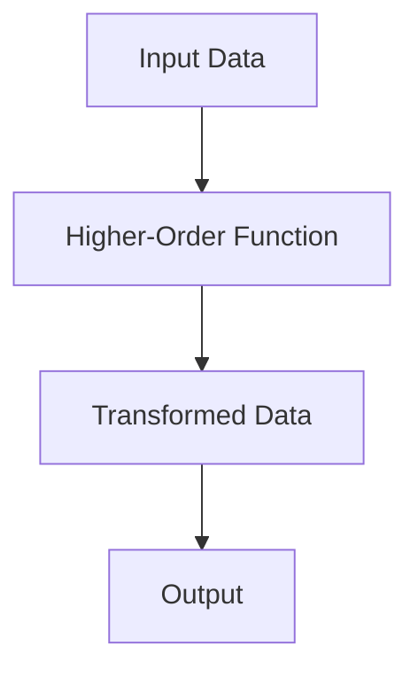
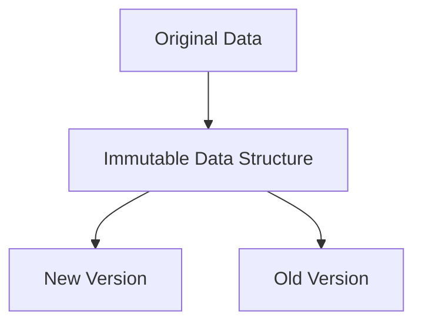

## 25.2 Recommended Resources for Further Learning

As we conclude our journey through mastering functional programming with Clojure, it's essential to continue expanding your knowledge and skills. The world of Clojure and functional programming is vast and ever-evolving, offering numerous resources to deepen your understanding and keep you updated with the latest advancements. In this section, we will explore a variety of recommended resources, including books, online courses, communities, podcasts, and videos. These resources are carefully selected to cater to both beginners and experienced developers, providing a comprehensive learning experience.

### Books

Books are a timeless resource for gaining in-depth knowledge and understanding of complex topics. Here are some highly recommended books for further learning in Clojure and functional programming:

#### "Clojure for the Brave and True" by Daniel Higginbotham

This book is an excellent starting point for anyone new to Clojure. It takes a humorous and engaging approach to teaching Clojure, making it accessible and enjoyable. The book covers the fundamentals of Clojure, including its syntax, functional programming concepts, and practical applications. It also includes exercises and projects to reinforce learning.

#### "Functional Programming in Clojure" by Rafal Dittwald

For those looking to delve deeper into functional programming concepts, this book provides a comprehensive exploration of functional programming in Clojure. It covers advanced topics such as higher-order functions, immutability, and concurrency, with practical examples and exercises. The book also emphasizes the benefits of functional programming in building scalable and maintainable applications.

### Online Courses

Online courses offer a structured and interactive way to learn Clojure and functional programming. Here are some recommended courses:

#### [Clojure Programming on Coursera](https://www.coursera.org/course/progfun)

This course, offered by Coursera, provides a comprehensive introduction to Clojure programming. It covers the basics of Clojure syntax, functional programming concepts, and practical applications. The course includes video lectures, quizzes, and hands-on projects to reinforce learning.

#### [Clojure Track on Exercism](https://exercism.org/tracks/clojure)

Exercism offers a unique approach to learning Clojure through practice and mentorship. The Clojure track includes a series of exercises that cover various aspects of the language, from basic syntax to advanced functional programming concepts. Each exercise is accompanied by feedback from experienced mentors, providing valuable insights and guidance.

### Communities

Engaging with the Clojure community is an excellent way to learn from others, share knowledge, and stay updated with the latest developments. Here are some active communities to join:

#### [ClojureVerse](https://clojureverse.org/)

ClojureVerse is a vibrant online community where Clojure enthusiasts gather to discuss various topics related to Clojure and functional programming. It offers a platform for asking questions, sharing projects, and participating in discussions. The community is welcoming and supportive, making it an excellent place for both beginners and experienced developers.

#### [r/Clojure on Reddit](https://www.reddit.com/r/Clojure/)

The Clojure subreddit is a popular online community where Clojure developers share news, resources, and discussions related to Clojure and functional programming. It's a great place to stay updated with the latest trends, ask questions, and connect with other Clojure enthusiasts.

### Podcasts and Videos

Podcasts and videos provide an engaging way to learn about Clojure and functional programming. Here are some recommended resources:

#### [The REPL Podcast](https://therepl.net/)

The REPL Podcast is a popular podcast that covers various topics related to Clojure and functional programming. It features interviews with experts, discussions on best practices, and insights into the latest developments in the Clojure community. The podcast is an excellent way to stay informed and inspired.

#### [Clojure TV on YouTube](https://www.youtube.com/channel/UCaCxkaK0bNDiuzG5a9K2WQg)

Clojure TV is a YouTube channel dedicated to Clojure programming. It offers a wide range of video tutorials, talks, and presentations on various topics related to Clojure and functional programming. The channel is an excellent resource for visual learners who prefer watching videos to reading books or articles.

### Code Examples and Exercises

To reinforce your learning, it's essential to practice writing Clojure code and solving problems. Here are some exercises and challenges to try:

#### Exercise 1: Implement a Simple Function

Write a Clojure function that takes a list of numbers and returns a new list with each number doubled. Compare this with a similar implementation in Java.

```clojure
;; Clojure implementation
(defn double-numbers [numbers]
  (map #(* 2 %) numbers))

;; Usage
(double-numbers [1 2 3 4 5]) ;; => (2 4 6 8 10)
```

```java
// Java implementation
import java.util.List;
import java.util.stream.Collectors;

public class DoubleNumbers {
    public static List<Integer> doubleNumbers(List<Integer> numbers) {
        return numbers.stream()
                      .map(n -> n * 2)
                      .collect(Collectors.toList());
    }
}
```

#### Exercise 2: Create a Higher-Order Function

Write a higher-order function in Clojure that takes a function and a list, and applies the function to each element of the list.

```clojure
;; Clojure implementation
(defn apply-function [f lst]
  (map f lst))

;; Usage
(apply-function inc [1 2 3 4 5]) ;; => (2 3 4 5 6)
```

#### Exercise 3: Implement a Recursive Function

Write a recursive function in Clojure that calculates the factorial of a given number.

```clojure
;; Clojure implementation
(defn factorial [n]
  (if (<= n 1)
    1
    (* n (factorial (dec n)))))

;; Usage
(factorial 5) ;; => 120
```

### Visual Aids

To enhance your understanding of Clojure concepts, here are some visual aids:

#### Diagram 1: Data Flow in Higher-Order Functions



*Caption: This diagram illustrates the flow of data through a higher-order function, transforming input data into output.*

#### Diagram 2: Immutability and Persistent Data Structures



*Caption: This diagram shows how immutable data structures create new versions of data without modifying the original.*

### Knowledge Check

To test your understanding of the concepts covered in this section, try answering the following questions:

1. What are the benefits of using higher-order functions in Clojure?
2. How does immutability contribute to the scalability of applications?
3. What is the role of communities in learning Clojure and functional programming?
4. How can podcasts and videos enhance your learning experience?
5. What are some recommended books for learning Clojure and functional programming?

### Encouraging Tone

As you continue your journey in mastering Clojure and functional programming, remember that learning is a continuous process. Embrace the challenges and enjoy the rewards of building efficient, scalable applications. Engage with the community, explore new resources, and keep experimenting with code. The more you practice, the more proficient you will become. Happy coding!

### Best Practices for Tags

When tagging your projects or articles related to Clojure and functional programming, consider using the following tags:

- "Clojure"
- "Functional Programming"
- "Learning Resources"
- "Books"
- "Online Courses"
- "Communities"
- "Podcasts"
- "Videos"

These tags will help categorize your content and make it easier for others to find and engage with your work.

## Quiz: Test Your Knowledge on Clojure Learning Resources



### Which book is recommended for beginners learning Clojure?

- [x] "Clojure for the Brave and True" by Daniel Higginbotham
- [ ] "Functional Programming in Clojure" by Rafal Dittwald
- [ ] "The Joy of Clojure" by Michael Fogus
- [ ] "Programming Clojure" by Stuart Halloway

> **Explanation:** "Clojure for the Brave and True" is recommended for beginners due to its engaging and accessible approach.

### What is the primary focus of the Clojure Track on Exercism?

- [x] Practice and mentorship
- [ ] Video lectures
- [ ] Interactive quizzes
- [ ] Group projects

> **Explanation:** The Clojure Track on Exercism focuses on practice through exercises and mentorship from experienced developers.

### Which community is known for discussions and sharing projects related to Clojure?

- [x] ClojureVerse
- [ ] Stack Overflow
- [ ] GitHub
- [ ] LinkedIn

> **Explanation:** ClojureVerse is a vibrant community for discussions and sharing projects related to Clojure.

### What type of content does The REPL Podcast primarily feature?

- [x] Interviews with experts and discussions on best practices
- [ ] Coding tutorials
- [ ] Live coding sessions
- [ ] Product reviews

> **Explanation:** The REPL Podcast features interviews with experts and discussions on best practices in Clojure.

### Which YouTube channel is dedicated to Clojure programming?

- [x] Clojure TV
- [ ] Java Brains
- [ ] CodeAcademy
- [ ] TechWorld with Nana

> **Explanation:** Clojure TV is a YouTube channel dedicated to Clojure programming.

### What is the main advantage of using higher-order functions in Clojure?

- [x] They allow functions to be passed as arguments and returned as values
- [ ] They improve performance
- [ ] They simplify syntax
- [ ] They enhance security

> **Explanation:** Higher-order functions allow functions to be passed as arguments and returned as values, enabling more flexible and reusable code.

### How does immutability contribute to application scalability?

- [x] By preventing data modification, leading to safer concurrent operations
- [ ] By reducing memory usage
- [ ] By simplifying code
- [ ] By enhancing security

> **Explanation:** Immutability prevents data modification, leading to safer concurrent operations and contributing to application scalability.

### What is the benefit of engaging with the Clojure community?

- [x] Learning from others and staying updated with the latest developments
- [ ] Access to exclusive content
- [ ] Free software licenses
- [ ] Discounts on courses

> **Explanation:** Engaging with the Clojure community allows you to learn from others and stay updated with the latest developments.

### How can podcasts and videos enhance your learning experience?

- [x] By providing engaging and diverse content
- [ ] By offering certifications
- [ ] By reducing learning time
- [ ] By providing hands-on practice

> **Explanation:** Podcasts and videos provide engaging and diverse content, enhancing the learning experience.

### True or False: "Functional Programming in Clojure" is suitable for beginners.

- [ ] True
- [x] False

> **Explanation:** "Functional Programming in Clojure" is more suitable for those with some experience in Clojure, as it covers advanced topics.



By exploring these resources and engaging with the Clojure community, you'll continue to grow as a developer and deepen your understanding of functional programming. Happy learning!
