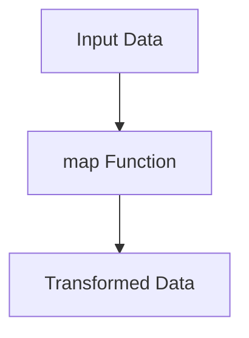

## 25.6 Embracing the Functional Programming Mindset

As we conclude our journey through mastering functional programming with Clojure, it's time to focus on embracing the functional programming mindset. This mindset is not just about learning a new language or syntax; it's about transforming how we approach problem-solving, design, and development. Let's explore how you can integrate functional programming into your daily practice, tackle problems with a functional mindset, and commit to lifelong learning.

### Continuous Practice

#### Integrating Functional Programming into Daily Practice

To truly embrace the functional programming mindset, continuous practice is essential. Here are some strategies to help you integrate functional programming into your daily routine:

1. **Start Small**: Begin by incorporating functional programming concepts into small projects or specific components of larger projects. This approach allows you to experiment and learn without overwhelming yourself.

2. **Refactor Existing Code**: Take existing Java code and refactor it into Clojure. This exercise helps you understand the differences between imperative and functional paradigms and reinforces your learning.

3. **Pair Programming**: Collaborate with other developers who are experienced in functional programming. Pair programming can provide new insights and help you learn best practices.

4. **Code Katas**: Engage in regular coding exercises or "katas" that focus on functional programming concepts. Websites like [Exercism](https://exercism.io/tracks/clojure) offer Clojure exercises to practice.

5. **Contribute to Open Source**: Find open-source projects written in Clojure and contribute to them. This real-world experience is invaluable for honing your skills.

#### Problem-Solving Approaches

Embracing a functional programming mindset requires a shift in how we approach problem-solving. Here are some key aspects to consider:

- **Focus on Declarations Over Instructions**: In functional programming, we describe what we want to achieve rather than how to achieve it. This declarative approach leads to more concise and readable code.

- **Leverage Immutability**: Use immutable data structures to avoid side effects and ensure thread safety. Immutability simplifies reasoning about code and enhances reliability.

- **Utilize Higher-Order Functions**: Functions that take other functions as arguments or return them as results are powerful tools for abstraction and code reuse.

- **Embrace Recursion**: Instead of loops, use recursion to process data. Clojure's `recur` form optimizes tail recursion, making it efficient.

- **Think in Terms of Data Transformations**: View your application as a series of data transformations. This perspective aligns with functional programming's emphasis on pure functions and data flow.

#### Lifelong Learning

The field of software development is constantly evolving, and staying updated is crucial. Here are some tips for lifelong learning:

- **Stay Curious**: Always be open to learning new concepts, languages, and paradigms. Curiosity drives innovation and growth.

- **Engage with the Community**: Join Clojure and functional programming communities online. Platforms like [ClojureVerse](https://clojureverse.org/) and [Reddit](https://www.reddit.com/r/Clojure/) offer forums for discussion and learning.

- **Attend Conferences and Meetups**: Participate in events like [Clojure/conj](https://clojure.org/community/events) to network with other developers and learn from experts.

- **Read Books and Articles**: Keep up with the latest literature on functional programming and Clojure. Books like "Clojure for the Brave and True" and "Functional Programming in Scala" offer valuable insights.

- **Experiment with Other Functional Languages**: Exploring languages like Haskell, Scala, or Elm can broaden your understanding of functional programming concepts.

### Final Encouragement

As we wrap up this guide, remember that embracing the functional programming mindset is a journey, not a destination. The skills and concepts you've learned will empower you to build efficient, scalable applications and contribute to the evolution of software development. Keep experimenting, learning, and pushing the boundaries of what's possible with functional programming.

Now that we've explored how to embrace the functional programming mindset, let's apply these concepts to innovate and create impactful software solutions. The future of software development is bright, and with your newfound skills, you're well-equipped to be a part of it.

### Code Examples

Let's solidify these concepts with some practical code examples. We'll compare Java and Clojure approaches to illustrate the functional programming mindset.

#### Java Example: Imperative Approach

```java
import java.util.ArrayList;
import java.util.List;

public class ImperativeExample {
    public static void main(String[] args) {
        List<Integer> numbers = List.of(1, 2, 3, 4, 5);
        List<Integer> doubled = new ArrayList<>();

        for (Integer number : numbers) {
            doubled.add(number * 2);
        }

        System.out.println(doubled);
    }
}
```

#### Clojure Example: Functional Approach

```clojure
;; Define a list of numbers
(def numbers [1 2 3 4 5])

;; Use map to double each number
(def doubled (map #(* 2 %) numbers))

;; Print the result
(println doubled)
```

**Explanation**: In the Java example, we use a loop to iterate over the list and mutate a new list. In the Clojure example, we use the `map` function to apply a transformation to each element, demonstrating a declarative approach.

### Visual Aids

To further illustrate the flow of data through higher-order functions, let's use a diagram:



**Diagram Description**: This diagram shows how input data flows through the `map` function, resulting in transformed data. This visualizes the concept of data transformations in functional programming.

### References and Links

- [Official Clojure Documentation](https://clojure.org/)
- [ClojureDocs](https://clojuredocs.org/)
- [Exercism Clojure Track](https://exercism.io/tracks/clojure)
- [ClojureVerse Community](https://clojureverse.org/)
- [Clojure/conj Events](https://clojure.org/community/events)

### Knowledge Check

To reinforce your understanding, consider these questions:

- How can you integrate functional programming into your daily practice?
- What are the benefits of using immutable data structures?
- How does the functional approach differ from the imperative approach in problem-solving?

### Exercises

1. **Refactor a Java Loop**: Take a Java loop that processes a list and refactor it into a Clojure function using `map` or `reduce`.

2. **Implement a Recursive Function**: Write a recursive function in Clojure to calculate the factorial of a number.

3. **Explore a New Library**: Choose a Clojure library you've never used before and write a small program to explore its functionality.

### Summary

In this section, we've explored how to embrace the functional programming mindset by integrating continuous practice, adopting functional problem-solving approaches, and committing to lifelong learning. By applying these principles, you'll be well-equipped to build scalable, efficient applications with Clojure.

---

## Quiz: Embracing the Functional Programming Mindset



### How can you integrate functional programming into your daily practice?

- [x] Start with small projects or components
- [ ] Avoid using functional concepts in existing projects
- [ ] Only use functional programming for large-scale projects
- [ ] Ignore functional programming until you master it completely

> **Explanation:** Starting with small projects or components allows you to experiment and learn functional programming without overwhelming yourself.

### What is a key benefit of using immutable data structures?

- [x] Ensures thread safety
- [ ] Increases code complexity
- [ ] Requires more memory
- [ ] Slows down execution

> **Explanation:** Immutable data structures ensure thread safety by preventing data from being modified, which simplifies reasoning about code.

### How does the functional approach differ from the imperative approach?

- [x] Focuses on declarations over instructions
- [ ] Relies heavily on loops and conditionals
- [ ] Encourages mutable state
- [ ] Uses classes and objects extensively

> **Explanation:** The functional approach focuses on declarations over instructions, leading to more concise and readable code.

### What is a higher-order function?

- [x] A function that takes other functions as arguments or returns them as results
- [ ] A function that only operates on numbers
- [ ] A function that modifies global variables
- [ ] A function that is always recursive

> **Explanation:** Higher-order functions take other functions as arguments or return them as results, enabling powerful abstractions and code reuse.

### Why is lifelong learning important in software development?

- [x] The field is constantly evolving
- [ ] It guarantees job security
- [x] It helps stay updated with advancements
- [ ] It is only necessary for beginners

> **Explanation:** Lifelong learning is important because the field of software development is constantly evolving, and staying updated with advancements is crucial.

### What is the benefit of using recursion over loops in functional programming?

- [x] Recursion aligns with functional programming's emphasis on pure functions
- [ ] Recursion is always faster than loops
- [ ] Recursion is easier to write than loops
- [ ] Recursion uses less memory than loops

> **Explanation:** Recursion aligns with functional programming's emphasis on pure functions and data flow, making it a natural fit for functional languages.

### How can you stay engaged with the Clojure community?

- [x] Join online forums and discussion groups
- [ ] Avoid interacting with other developers
- [x] Attend conferences and meetups
- [ ] Only read official documentation

> **Explanation:** Joining online forums and attending conferences and meetups are great ways to stay engaged with the Clojure community and learn from others.

### What is the purpose of code katas?

- [x] To practice coding skills through exercises
- [ ] To avoid writing tests
- [ ] To replace documentation
- [ ] To automate code generation

> **Explanation:** Code katas are exercises designed to practice coding skills and reinforce learning through repetition and experimentation.

### How can you contribute to open-source projects?

- [x] By finding projects written in Clojure and contributing to them
- [ ] By rewriting projects in Java
- [ ] By avoiding collaboration
- [ ] By only working on personal projects

> **Explanation:** Contributing to open-source projects written in Clojure provides real-world experience and helps hone your skills.

### True or False: Embracing the functional programming mindset is a journey, not a destination.

- [x] True
- [ ] False

> **Explanation:** Embracing the functional programming mindset is a continuous journey of learning and growth, not a one-time achievement.


