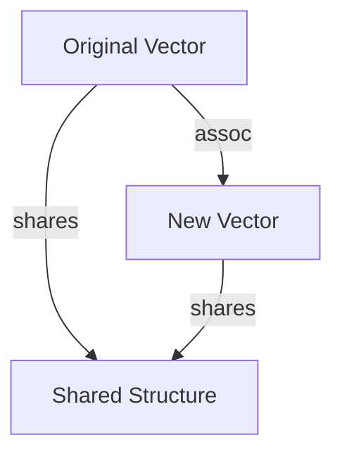

## 3.1 Understanding Immutability in Functional Programming

Immutability is a cornerstone of functional programming, offering a paradigm shift from the mutable state management that many developers are accustomed to in imperative languages like Java. In this section, we will delve into the concept of immutability, its significance in functional programming, and how it is implemented in Clojure to enhance application scalability and reliability.

### Concept of Immutability

**Immutability** refers to the inability to change an object after it has been created. In functional programming, data structures are immutable, meaning that any modification results in the creation of a new data structure rather than altering the existing one. This concept contrasts with mutable data structures, where changes are made in place.

#### Why Immutability?

Immutability is essential in functional programming for several reasons:

- **Predictability**: Immutable data structures ensure that functions do not have side effects, making them easier to reason about and test.
- **Thread Safety**: Since immutable objects cannot be changed, they are inherently thread-safe, eliminating the need for complex synchronization mechanisms.
- **Consistency**: Immutability ensures that data remains consistent throughout its lifecycle, reducing bugs related to unexpected state changes.

### Benefits of Immutability

#### Thread-Safe Code

One of the most significant advantages of immutability is thread safety. In a multithreaded environment, mutable state can lead to race conditions and data corruption. Immutable data structures eliminate these issues, as concurrent threads can safely access shared data without the risk of modification.

#### Easier Reasoning

Immutable data structures simplify reasoning about code. When a function receives an immutable object, developers can be confident that the object will not change, allowing them to focus on the function's logic rather than potential side effects.

#### Simplified Debugging

Debugging is more straightforward with immutable data, as the state of the program is predictable and consistent. Developers can trace the flow of data through the program without worrying about unexpected modifications.

### Value vs. Reference Types

In Java, developers often deal with mutable objects, where changes to an object are reflected across all references to that object. This behavior can lead to unintended side effects and bugs. Clojure, on the other hand, emphasizes immutable data structures, which are more akin to value types.

#### Java Example: Mutable List

```java
import java.util.ArrayList;
import java.util.List;

public class MutableExample {
    public static void main(String[] args) {
        List<String> list = new ArrayList<>();
        list.add("Hello");
        list.add("World");
        
        // Modifying the list
        list.set(1, "Clojure");
        
        System.out.println(list); // Output: [Hello, Clojure]
    }
}
```

In the above Java example, the `ArrayList` is mutable, allowing modifications in place. This mutability can lead to side effects if the list is shared across different parts of the application.

#### Clojure Example: Immutable Vector

```clojure
(def my-vector ["Hello" "World"])

;; Creating a new vector with a modification
(def new-vector (assoc my-vector 1 "Clojure"))

(println my-vector)  ; Output: ["Hello" "World"]
(println new-vector) ; Output: ["Hello" "Clojure"]
```

In Clojure, the `assoc` function creates a new vector with the desired modification, leaving the original vector unchanged. This immutability ensures that data remains consistent and predictable.

### Immutable Patterns

Functional programming in Clojure leverages several patterns and practices to work effectively with immutable data.

#### Persistent Data Structures

Clojure's persistent data structures are designed to be efficient and performant, even when dealing with immutability. These structures use a technique called **structural sharing** to minimize the overhead of creating new data structures.



*Diagram: Structural sharing in Clojure's persistent data structures.*

#### Functional Updates

Functional updates involve creating new versions of data structures with the desired changes. This approach is facilitated by Clojure's rich set of functions for manipulating data structures.

```clojure
(def person {:name "Alice" :age 30})

;; Updating the age
(def updated-person (assoc person :age 31))

(println person)         ; Output: {:name "Alice", :age 30}
(println updated-person) ; Output: {:name "Alice", :age 31}
```

#### Immutability in Collections

Clojure provides a variety of immutable collections, including lists, vectors, maps, and sets. Each collection type offers specific functions for creating and manipulating data without mutating the original structure.

- **Lists**: Ideal for sequential access and recursion.
- **Vectors**: Provide efficient random access and updates.
- **Maps**: Key-value pairs for associative data.
- **Sets**: Unique elements for membership testing.

### Try It Yourself

Experiment with the following Clojure code to deepen your understanding of immutability:

```clojure
(def original-map {:a 1 :b 2 :c 3})

;; Add a new key-value pair
(def updated-map (assoc original-map :d 4))

;; Remove a key-value pair
(def reduced-map (dissoc updated-map :b))

(println original-map)  ; Output: {:a 1, :b 2, :c 3}
(println updated-map)   ; Output: {:a 1, :b 2, :c 3, :d 4}
(println reduced-map)   ; Output: {:a 1, :c 3, :d 4}
```

### Knowledge Check

- What are the benefits of using immutable data structures in a multithreaded environment?
- How does Clojure's approach to immutability differ from Java's mutable data handling?
- What is structural sharing, and how does it enhance the performance of immutable data structures?

### Exercises

1. **Immutable Data Manipulation**: Create a Clojure function that takes a map and returns a new map with all values incremented by one.
2. **Thread Safety**: Write a Clojure program that demonstrates the thread safety of immutable data structures by concurrently accessing and modifying a shared vector.
3. **Functional Updates**: Implement a Clojure function that updates a nested map structure without mutating the original map.

### Summary

Immutability is a fundamental concept in functional programming, offering numerous benefits such as thread safety, easier reasoning, and simplified debugging. By leveraging Clojure's immutable data structures and functional patterns, developers can build scalable and reliable applications. Now that we've explored how immutable data structures work in Clojure, let's apply these concepts to manage state effectively in your applications.

## Quiz: Mastering Immutability in Functional Programming



### What is a key benefit of immutability in functional programming?

- [x] Thread safety
- [ ] Increased memory usage
- [ ] Slower execution
- [ ] Complex synchronization

> **Explanation:** Immutability ensures that data cannot be changed, making it inherently thread-safe and eliminating the need for synchronization.

### How does Clojure handle data modifications?

- [x] By creating new data structures
- [ ] By modifying existing data structures
- [ ] By using locks
- [ ] By using mutable variables

> **Explanation:** Clojure creates new data structures for modifications, ensuring immutability and consistency.

### What is structural sharing?

- [x] A technique to share unchanged parts of data structures
- [ ] A method to copy data structures
- [ ] A way to lock data structures
- [ ] A process to delete data structures

> **Explanation:** Structural sharing allows Clojure to efficiently manage immutable data by sharing unchanged parts between old and new versions.

### Which Clojure collection is best for random access?

- [ ] List
- [x] Vector
- [ ] Map
- [ ] Set

> **Explanation:** Vectors provide efficient random access and updates, making them suitable for such operations.

### What does the `assoc` function do in Clojure?

- [x] Adds or updates a key-value pair in a map
- [ ] Removes a key-value pair from a map
- [ ] Sorts a map
- [ ] Converts a map to a list

> **Explanation:** The `assoc` function is used to add or update key-value pairs in a map, creating a new map with the changes.

### How does immutability simplify debugging?

- [x] By ensuring consistent state
- [ ] By increasing complexity
- [ ] By requiring more code
- [ ] By using mutable variables

> **Explanation:** Immutability ensures that the state remains consistent, making it easier to trace and debug the flow of data.

### What is a common pattern for updating immutable data?

- [x] Functional updates
- [ ] In-place updates
- [ ] Locking updates
- [ ] Synchronized updates

> **Explanation:** Functional updates involve creating new versions of data structures with the desired changes, maintaining immutability.

### Why is immutability important in functional programming?

- [x] It prevents side effects
- [ ] It increases execution speed
- [ ] It reduces memory usage
- [ ] It simplifies syntax

> **Explanation:** Immutability prevents side effects, allowing functions to be pure and predictable.

### What is the primary difference between Java and Clojure regarding data handling?

- [x] Java uses mutable data structures, while Clojure uses immutable ones
- [ ] Java is faster than Clojure
- [ ] Clojure uses more memory than Java
- [ ] Java has more libraries than Clojure

> **Explanation:** Java typically uses mutable data structures, whereas Clojure emphasizes immutability for consistency and thread safety.

### True or False: Immutability in Clojure requires complex synchronization mechanisms.

- [ ] True
- [x] False

> **Explanation:** False. Immutability in Clojure eliminates the need for complex synchronization mechanisms, as data cannot be changed.


