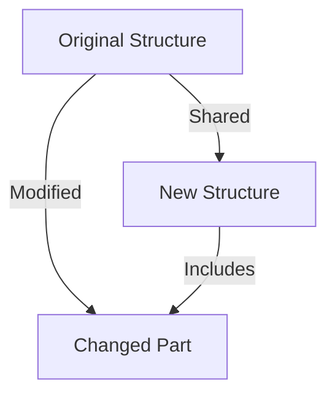

## 3.2 Working with Immutable Data Structures

As experienced Java developers, you're likely familiar with mutable data structures and the challenges they present in concurrent programming. Clojure, a functional programming language, offers a different approach with immutable data structures that are both efficient and scalable. In this section, we'll explore how Clojure's persistent data structures work, the concept of structural sharing, and how to effectively use built-in data structures like lists, vectors, maps, and sets. We'll also address performance considerations to help you understand the benefits and trade-offs of immutability.

### Persistent Data Structures

**Persistent data structures** are a cornerstone of Clojure's approach to immutability. Unlike traditional data structures, which are mutable and require copying for each modification, persistent data structures allow for efficient updates without altering the original structure. This is achieved through a technique known as **structural sharing**.

#### Structural Sharing

Structural sharing is a method of reusing parts of existing data structures to create new ones. This reduces the need for copying and minimizes memory usage. When a persistent data structure is modified, only the parts of the structure that change are updated, while the rest is shared with the original structure.

**Diagram: Structural Sharing in Persistent Data Structures**



*Caption: This diagram illustrates how structural sharing allows new structures to share unchanged parts with the original, optimizing memory usage.*

In Clojure, structural sharing is implemented in all core data structures, including lists, vectors, maps, and sets. This allows for efficient operations even in a functional programming paradigm where immutability is key.

### Using Built-in Data Structures

Clojure provides a rich set of built-in data structures that are designed to be immutable and persistent. Let's explore how to create and manipulate these data structures.

#### Lists

Lists in Clojure are linked lists, optimized for sequential access. They are ideal for scenarios where you need to frequently add or remove elements from the front.

```clojure
;; Creating a list
(def my-list '(1 2 3 4 5))

;; Adding an element to the front
(def new-list (cons 0 my-list))

;; Removing the first element
(def rest-list (rest my-list))

;; Accessing elements
(first my-list) ; => 1
(nth my-list 2) ; => 3
```

#### Vectors

Vectors are indexed collections, similar to arrays in Java, but immutable. They provide efficient random access and are suitable for scenarios where you need to access elements by index.

```clojure
;; Creating a vector
(def my-vector [1 2 3 4 5])

;; Adding an element
(def new-vector (conj my-vector 6))

;; Accessing elements
(nth my-vector 2) ; => 3
(get my-vector 4) ; => 5

;; Updating an element
(def updated-vector (assoc my-vector 2 10))
```

#### Maps

Maps are key-value pairs, similar to Java's `HashMap`, but immutable. They are ideal for associative data storage.

```clojure
;; Creating a map
(def my-map {:a 1 :b 2 :c 3})

;; Adding a key-value pair
(def new-map (assoc my-map :d 4))

;; Removing a key-value pair
(def reduced-map (dissoc my-map :b))

;; Accessing values
(get my-map :a) ; => 1
(my-map :c) ; => 3
```

#### Sets

Sets are collections of unique elements, similar to Java's `HashSet`. They are useful for membership tests and ensuring uniqueness.

```clojure
;; Creating a set
(def my-set #{1 2 3 4 5})

;; Adding an element
(def new-set (conj my-set 6))

;; Removing an element
(def reduced-set (disj my-set 3))

;; Checking membership
(contains? my-set 2) ; => true
```

### Performance Considerations

A common concern with immutable data structures is performance overhead. However, Clojure's persistent data structures are designed to minimize this overhead through structural sharing and efficient algorithms.

#### Memory Efficiency

By sharing unchanged parts of data structures, Clojure reduces memory usage. This is particularly beneficial in applications with large data sets or frequent updates.

#### Time Complexity

Operations on Clojure's persistent data structures are optimized for performance. For example, adding an element to a vector or map is typically O(log32 N) due to the underlying tree structure, which is efficient for most practical purposes.

#### Concurrency Benefits

Immutable data structures eliminate the need for locks in concurrent programming, as they cannot be modified once created. This leads to simpler and more reliable code, as developers don't need to worry about race conditions or synchronization issues.

### Try It Yourself

Experiment with the following code snippets to deepen your understanding of Clojure's immutable data structures. Try adding, removing, and updating elements, and observe how the original structures remain unchanged.

```clojure
;; Experiment with lists
(def my-list '(1 2 3))
(def new-list (cons 0 my-list))
(println "Original List:" my-list)
(println "New List:" new-list)

;; Experiment with vectors
(def my-vector [1 2 3])
(def updated-vector (assoc my-vector 1 10))
(println "Original Vector:" my-vector)
(println "Updated Vector:" updated-vector)

;; Experiment with maps
(def my-map {:a 1 :b 2})
(def new-map (assoc my-map :c 3))
(println "Original Map:" my-map)
(println "New Map:" new-map)

;; Experiment with sets
(def my-set #{1 2 3})
(def new-set (conj my-set 4))
(println "Original Set:" my-set)
(println "New Set:" new-set)
```

### Knowledge Check

To reinforce your understanding, consider the following questions:

- How does structural sharing optimize memory usage in Clojure's persistent data structures?
- What are the time complexities of common operations on Clojure's vectors and maps?
- How do immutable data structures benefit concurrent programming?

### Conclusion

Now that we've explored how immutable data structures work in Clojure, let's apply these concepts to manage state effectively in your applications. By leveraging Clojure's persistent data structures, you can build scalable and efficient applications that are easier to reason about and maintain.

For further reading, consider exploring the [Official Clojure Documentation](https://clojure.org/reference/data_structures) and [ClojureDocs](https://clojuredocs.org/).

## Quiz: Mastering Immutable Data Structures in Clojure



### What is the primary benefit of structural sharing in Clojure's persistent data structures?

- [x] It optimizes memory usage by sharing unchanged parts.
- [ ] It allows for mutable updates to data structures.
- [ ] It increases the speed of data retrieval.
- [ ] It simplifies the syntax of data manipulation.

> **Explanation:** Structural sharing optimizes memory usage by allowing new data structures to share unchanged parts with the original, reducing the need for copying.

### Which Clojure data structure is most similar to Java's `HashMap`?

- [ ] List
- [ ] Vector
- [x] Map
- [ ] Set

> **Explanation:** Clojure's map is similar to Java's `HashMap` as it stores key-value pairs and allows for efficient associative data storage.

### How does immutability benefit concurrent programming?

- [x] It eliminates the need for locks and reduces race conditions.
- [ ] It allows for faster data updates.
- [ ] It increases the complexity of code.
- [ ] It requires more memory usage.

> **Explanation:** Immutability eliminates the need for locks because data structures cannot be modified once created, reducing race conditions and simplifying concurrent programming.

### What is the time complexity of adding an element to a Clojure vector?

- [ ] O(1)
- [x] O(log32 N)
- [ ] O(N)
- [ ] O(N^2)

> **Explanation:** Adding an element to a Clojure vector is typically O(log32 N) due to the underlying tree structure, which is efficient for most practical purposes.

### Which operation is NOT supported by Clojure's immutable data structures?

- [ ] Adding elements
- [ ] Removing elements
- [ ] Updating elements
- [x] In-place modification

> **Explanation:** Clojure's immutable data structures do not support in-place modification, as they are designed to be immutable.

### What is a key advantage of using Clojure's persistent data structures?

- [x] They provide efficient updates without altering the original structure.
- [ ] They allow for mutable state management.
- [ ] They require less memory than mutable structures.
- [ ] They simplify the syntax of data manipulation.

> **Explanation:** Clojure's persistent data structures allow for efficient updates by creating new structures that share parts with the original, without altering it.

### Which Clojure data structure is best for sequential access?

- [x] List
- [ ] Vector
- [ ] Map
- [ ] Set

> **Explanation:** Clojure's list is optimized for sequential access, making it ideal for scenarios where elements are frequently added or removed from the front.

### How does Clojure handle updates to immutable data structures?

- [ ] By copying the entire structure
- [x] By creating a new structure with shared parts
- [ ] By modifying the original structure
- [ ] By using mutable state

> **Explanation:** Clojure handles updates by creating a new structure that shares parts with the original, thanks to structural sharing.

### What is the primary purpose of Clojure's `assoc` function?

- [x] To add or update key-value pairs in a map
- [ ] To remove elements from a list
- [ ] To check membership in a set
- [ ] To concatenate vectors

> **Explanation:** The `assoc` function is used to add or update key-value pairs in a map, creating a new map with the changes.

### True or False: Clojure's immutable data structures can be modified in place.

- [ ] True
- [x] False

> **Explanation:** False. Clojure's immutable data structures cannot be modified in place; instead, new structures are created with shared parts.


